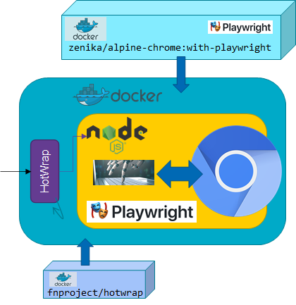
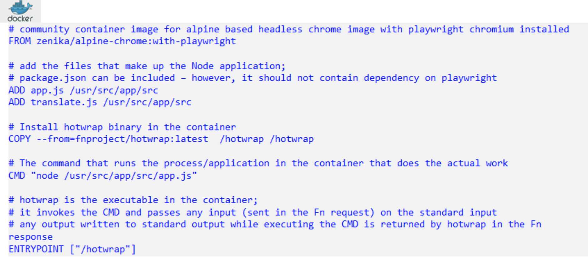
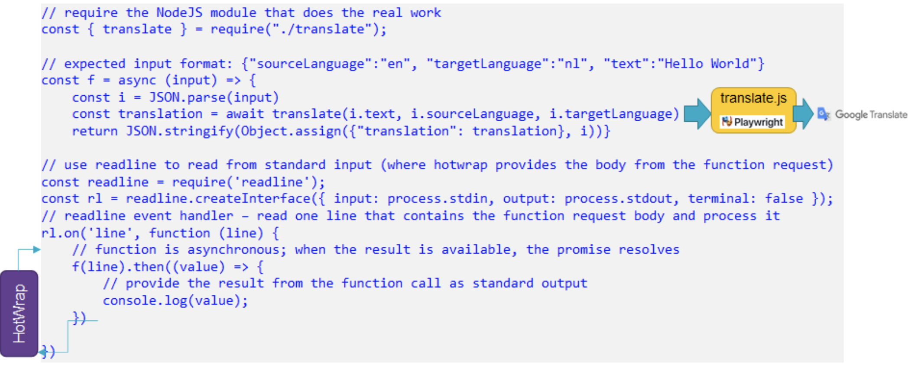
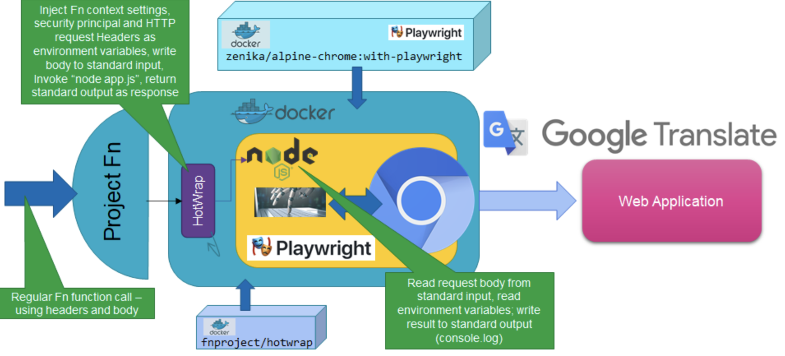

The article shows a custom Docker container image based on a community container image for headless chrome and Playwright with a custom Node application that interacts with the Google Translate web ui; the Project Fn hotwrap utility is added to this image to provide the bridge from the OCI FaaS serverless function framework based on Project Fn to the custom Node application. This approach can be used for any Playwright scenario and also for other custom Docker container images not related to Playwright.


At the heart of the function is a Node application that uses Playwright to interact with the Google Translate Web UI, enter source language, target language and text to translate and reads the translation produced by Google Translate. The Function needs to be implemented with a Docker Container image. An Fn image can be created in three ways:

* The regular approach: create a new Fn function with runtime node in the Fn CLI; add playwright in package.json and hope it works; because of binary libraries, I fear it will not – and indeed it does not
* Customize the Docker Image used for building the Fn container for the Node runtime – based on [this article](https://fnproject.io/tutorials/ContainerAsFunction/   ); this approach too did not seem to work: adding Playwright to this container image did not go smoothly, although it probably can be done
* Create a custom Docker build file that extends from an existing image with Playwright; add the Node application and add HotWrap to provide the bridge between the Fn FaaS framework and the Node application, following [this article](https://fnproject.io/tutorials/docker/CustomLinuxContainer/). This approach worked out well and is not all that complicated at all.

The starting point for the container that implements the Fn function is the image produced by community project Alpine Chrome project on GitHub for *Chrome running in headless mode in a tiny Alpine image*: https://github.com/Zenika/alpine-chrome/tree/master/with-playwright. This project produces image zenika/alpine-chrome:with-playwright. This image contains Node, Playwright Chromium and supporting binaries, an excellent starting point.



In my own image, I need to add of course the Node application that uses Playwright to interact with the Chromium browser that accesses the Google Translate Web UI. Additionally I have to add the HotWrap binary that provides the bridge at runtime between the OCI Functions Fn server framework and the custom code in the container image for the function. Hotwrap takes the input from the function request and makes it available to our custom code via the standard input. Anything the custom application writes to the standard output is takes by hotwrap and returned as the function’s response. Additionally, hotwrap makes HTTP headers sent in the function request available as environment variables inside the container.

The container image declares a CMD to define the startup instruction for the Node application that does the actual work and a final ENTRYPOINT that ensure that hotwrap is main process started when the container is started. The Dockerfile looks like this:



In Node application app.js I have to cater for the interaction with Hotwrap. The input to the Fn function is intercepted by Hotwrap and made available to the Node code via the standard input. The result from the Node application needs to be written to the standard output in order for Hotwrap to consume it and turn it into the Response body from the Fn function. The app.js code is created like this:



### Translate.js

The real work is done in translate.js. The code in translate.js is not aware of Hotwrap or Fn or the Docker container context. You will find its code in the GitHub repo.

Steps for creating the function are now straightforward, for example through OCI Cloudshell or in any Fn CLI environment:

1. Create a new directory that will contain the function’s resources. Copy these files to this new directory:

    * Dockerfile
    * func.yaml
    * app.js
    * translate.js


Execute the following commands from within the new directory

2. Build and deploy the function to the application (and the container as well to the registry); Here I have assumed an existing Fn application called lab1

```
$ fn deploy –app lab1

```


To verify, list the functions in application lab1:

```
$ fn list functions lab1

```

3. Invoke the function

```
$ echo -n ‘{“sourceLanguage”:”en”, “targetLanguage”:”fr”, “text”:”Hello World”}’ | fn invoke lab1 playwright –content-type application/json

```

Next, the full implementation is visualized.



Of course, this approach with hotwrap can be used for functions implemented on top of any base container image:


## Resources

Sources for this article on [GitHub](https://github.com/lucasjellema/playwright-scenarios/tree/main/fn)

* [Project Home for Fn hotwrap](https://github.com/fnproject/hotwrap)

* [Article on using hotwrap on top of a very simple custom Docker container](https://fnproject.io/tutorials/docker/CustomLinuxContainer/)

* [Alpine Chrome project on GitHub for Chrome running in headless mode in a tiny Alpine image](https://github.com/Zenika/alpine-chrome/tree/master/with-playwright)

* [Alpine Chrome on Docker Hub – with images for running Playwright applications](https://hub.docker.com/r/zenika/alpine-chrome)

* [Crafting the perfect container to play with a Headless Chrome](https://medium.zenika.com/crafting-the-perfect-container-to-play-with-a-headless-chrome-d920ec2f3c9b)

#### Notes


