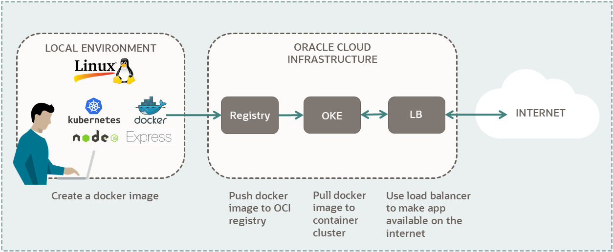


In this tutorial, you use an Oracle Cloud Infrastructure account to set up a Kubernetes cluster. Then, you deploy a Node Express application to your cluster.

Key tasks include how to:

* Set up a Kubernetes cluster on OCI.
* Set up OCI CLI to access your cluster.
* Build a Node Express application and Docker Image.
* Push your image to OCIR.
* Deploy your Node.js Docker application to your cluster.
* Connect to your application from the internet.



For additional information, see:

* [Kubernetes Documentation](https://kubernetes.io/docs/home/)
* [OCI Container Engine for Kubernetes](https://docs.oracle.com/iaas/Content/ContEng/Concepts/contengoverview.htm)
* [OCI Container Registry](https://docs.oracle.com/iaas/Content/Registry/Concepts/registryoverview.htm)

## Before You Begin

To successfully perform this tutorial, you must have the following:

### Requirements

* For Container Registry, Kubernetes and Load Balancers:
    * A **paid** Oracle Cloud Infrastructure account. 
    * See [Signing Up for Oracle Cloud Infrastructure](https://docs.oracle.com/iaas/Content/GSG/Tasks/signingup.htm).
* For building applications and Docker images:
    * One of the following local environments:
        * A MacOS or Linux machine.
        * A Windows machine with Linux support. For example:
            * [Windows Subsystem for Linux](https://docs.microsoft.com/en-us/windows/wsl/install-win10)
            * [Oracle Virtual Box](https://www.virtualbox.org/)
    * The following applications on your local environment:
        * JDK 11 and set JAVA_HOME in .bashrc.
        * Python 3.6.8+ and pip installer for Python 3
        * Kubernetes Client 1.11.9+
        * Apache Maven 3.0+
        * Docker 19.0.3+
        * Git 1.8+
        * Node.js 10+

> Note: If you don't want to set up the required applications on your local environment, you can use Oracle Cloud Infrastructure **Cloud Shell** instead. The advantage of using Cloud Shell is all the required tools to manage your application are already installed and ready to use. Follow the steps in:
>
>[Kubernetes Using Cloud Shell: Deploy a Spring Boot Application](https://docs.oracle.com/iaas/developer-tutorials/tutorials/spring-on-k8s-cs/01oci-spring-cs-k8s-summary.htm)
{:.notice}


### Get the Applications for Linux on OCI Free Tier

If you want to use an OCI Free Tier Linux compute instance to manage your deployment, the following sections provide information to get the required software installed.

#### Install a Linux Instance

Install a Linux VM with an **Always Free** compute shape, on Oracle Cloud Infrastructure. You will need a machine with `ssh` support to connect to your Linux instance.

* To [install an Oracle Linux VM](https://docs.oracle.com/iaas/developer-tutorials/tutorials/apache-on-oracle-linux/01oci-ol-apache-summary.htm#create-oracle-linux-vm)
    * Follow sections 2 and 3.
    * If you have a paid account, for section 2, choose your compute options based on your offerings.
    * To connect to your instance, in section 4, follow steps 1-5.
    * Skip the Apache instructions.
* To [install an Ubuntu VM](https://docs.oracle.com/iaas/developer-tutorials/tutorials/helidon-on-ubuntu/01oci-ubuntu-helidon-summary.htm#create-ubuntu-vm)
    * Follow sections 2 and 3.
    * If you have a paid account, for section 2, choose compute options based on your offerings.
    * To connect to your instance, in section 4, follow steps 1-5.
    * Skip the Apache instructions.
    * To update the firewall settings, in section 4, perform step 8.


## Install Node.js on your system.

First, you will run install commands. To install Node.js and NPM, run the following commands, using the appropriate system:

### Oracle Linux:

```console 
sudo yum update
```

Set up the Yum repo for Node.js. Then install the `nodejs` package.

```console
sudo yum install -y oracle-nodejs-release-el7
sudo yum install -y nodejs
```

### Ubuntu:

```console 
sudo apt update
```

Install the `nodejs` and the `npm` packages.

```console
sudo apt install -y nodejs
sudo apt install -y npm
```
Verify the installation.

```console
node -v
npm -v
```

## Configure Firewall (Optional)

> Note: If you want to do browser-based testing of your Node application, make port 3000 available on your Linux instance.
{:.notice}

### Oracle Linux:

```console
sudo firewall-cmd --add-service=http --permanent
sudo firewall-cmd --add-service=https --permanent
sudo firewall-cmd --reload
```

### Ubuntu Linux:

```console
sudo iptables -I INPUT 6 -m state --state NEW -p tcp --dport 3000 -j ACCEPT
sudo netfilter-persistent save
```

## Create an Ingress Rule for your VCN (Optional)

Follow these steps to select your VCN's public subnet and add the ingress rule.

1. Open the navigation menu and click **Networking**, and then click **Virtual Cloud Networks**.
2. Select the VCN you created with your compute instance.
3. With your new VCN displayed, click **`<`your-subnet-name`>`** subnet link. The public subnet information is displayed with the Security Lists at the bottom of the page. A link to the **Default Security List** for your VCN is displayed.
4. Click the **Default Security List** link. 
  * The default **Ingress Rules** for your VCN are displayed.
5. Click **Add Ingress Rules**.
  * An **Add Ingress Rules** dialog is displayed.
6. Fill in the ingress rule with the following information:

    ```console
    Stateless: Checked
    Source Type: CIDR
    Source CIDR: 0.0.0.0/0
    IP Protocol: TCP
    Source port range: (leave-blank)
    Destination Port Range: 3000
    Description: Allow HTTP connections
    ```
7. Click Add Ingress Rule. 

Now HTTP connections are allowed. Your VCN is configured for Node Express.

You have successfully created an ingress rule that makes your instance available from the internet.

## Install Python 3 and Pip 3

1. Verify your current installation.

    ```console
    python3 --version
    ```
2. For Python 3, run the following commands:

    - Oracle Linux: 

        ```console
        sudo yum update

        sudo yum install -y python3
        ```

    - Ubuntu:

        ```console    
        sudo apt update

        sudo apt install -y python3
        ```


3. Verify the pip installation for Python3.

    ```console
    pip3 -V
    ```

    Example output if pip for Python3 is installed:

    ```console
    pip <version> from xxx/lib/python3.x/site-packages/pip   (python 3.x)
    ```

4. To install Pip for Python 3, run the following commands:

    * Oracle Linux: 

        ```console
        sudo yum update

        sudo yum install -y python3-pip
        ```

    * Ubuntu:

        ```console
        sudo apt update

        sudo apt install -y python3-pip
        ```

5. Verify the pip for Python 3 installation.

    ```console
    pip3 -V
    ```

## Install Kubernetes Client

1. Verify your current installation:


    ```console
    kubectl version --client
    ```

    If you have Kubernetes, then the version is `<major-version>.<minor-version>`. For example, for version 1.20, you get the following:

    ```console 
    version.Info{Major:"1", Minor:"20"...
    ```

2. To install he `kubectl` client, refer to the following links: 
    - [Install Kubernetes client on Linux](https://kubernetes.io/docs/tasks/tools/install-kubectl-linux/#install-kubectl-binary-with-curl-on-linux)
    - [Install Kubernetes client on MacOS](https://kubernetes.io/docs/tasks/tools/install-kubectl-macos/)
3. Verify the installation. 

    ```console
    kubectl version --client
    ```

## Install Docker

1. Verify your current installation: 

    ```console
    docker -v
    ```

    * Oracle Linux

        ```console    
        sudo yum install docker-engine
            
        sudo systemctl start docker

        sudo systemctl enable docker
        ```

        > Note: The last command enables Docker to start on reboots.
        {:.notice}


    * Ubuntu Linux

        To install Docker on Ubuntu Linux, refer to the following link: [Get Docker](https://docs.docker.com/get-docker/)

2. Verify the installation.

    ```console
    docker -v
    ```

## Prepare

Prepare your environment to create and deploy your application.

### Check your Service Limits

1. Log in to the Oracle Cloud Infrastructure **Console**.
2. Open the navigation menu, and click Governance and Administration. Under Governance, click Limits, Quotas and Usage.
3. Find your service limit for **Regions**:

    **Filter** for the following options:

    * **Service:** Regions
    * **Scope:** Tenancy
    * **Resource:** Subscribed region count
    * **Compartment:** `<tenancy-name>` (root)

    Find service limit:
    
    *  **Limit Name:** `subscribed-region-count`
    *  **Service Limit:** minimum 2
4. Find your available **Compute** **core count** for the **VM.Standard.E3.Flex** shape:
    
    **Filter** for the following options:
    
    * **Service:** Compute
    * **Scope:** `<first-availability-domain>`. Example: `EMlr:US-ASHBURN-AD-1`
    * **Resource:** **Cores** for **Standard.E3.Flex** and BM.Standard.E3.128 Instances
    * **Compartment:** `<tenancy-name>` (root)
    
    Find available core count:
    
    * **Limit Name:** `standard-e3-core-ad-count`
    * **Available:** minimum 1

    Repeat for **Scope:** `<second-availability-domain>` and `<third-availability-domain>`. Each region must have at least one core available for this shape.
5. Find out if you have **50 GB** of **Block Volume** available:
    
    **Filter** for the following options:

    * **Service:** Block Volume
    * **Scope:** `<first-availability-domain>`. Example: `EMlr:US-ASHBURN-AD-1`
    * **Resource** Volume Size (GB)
    * **Compartment:** `<tenancy-name>` (root)
    
    Find available block volume storage:
    
    * **Limit Name:** `total-storage-gb`
    * **Available:** minimum 50
    
    Repeat for **Scope:** `<second-availability-domain>` and `<third-availability-domain>`. Each region must have at least 50 GB of block volume available.
6. Find out how many **Flexible Load Balancers** you have available:
    
    **Filter** for the following options:
    
      * **Service:** LBaaS
      * **Scope:** `<your-region>`. Example: `us-ashburn-1`
      * **Resource:** `<blank>` 
      * **Compartment:** `<tenancy-name>` (root)
    
    Find the number of available flexible load balancers:

      * **Limit Name:** `lb-flexible-count`
      * **Available:** minimum 1

> Note: This tutorial creates three compute instances with a **VM.Standard.E3.Flex** shape for the cluster nodes. To use another shape, filter for its **core count**. For example, for **VM.Standard2.4**, filter for **Cores for Standard2 based VM and BM Instances** and get the **count**. 
{:.notice}

For a list of all shapes, see [VM Standard Shapes](https://docs.oracle.com/iaas/Content/Compute/References/computeshapes.htm#vmshapes__vm-standard).

> Note: This tutorial creates a load balancer with a **flexible** shape. To use another bandwidth, filter for its **count**, for example **100-Mbps bandwidth** or **400-Mbps bandwidth**. 
{:.notice}

### Create an Authorization Token

1. In the Console's top navigation bar, click the **Profile** menu (your avatar). 
2. Click your username. 
3. Click Auth Tokens. 
4. Click Generate Token. 
5. Give it a description. 
6. Click Generate Token. 
7. Copy the token and **save** it. 
8. Click Close. 

> Note: Ensure that you save your token right after you create it. You have no access to it later.
{:.notice}

### Gather Required Information

1. Collect the following credential information from the Oracle Cloud Infrastructure **Console**. 
    * **Tenancy name:** `<tenancy-name>`
        * Click your **Profile** menu (your avatar) and find your **Tenancy:`<tenancy-name>`**.
    * **Tenancy namespace:** `<tenancy-namespace>`
        * Click your **Profile** menu (your avatar).
        * Click **Tenancy:`<tenancy-name>`**.
        * Copy the value for **Object Storage Namespace**.

        > Note For some accounts, tenancy name and namespace differ. Ensure that you use namespace in this tutorial.
        {:.notice}

    * **Tenancy OCID:** `<tenancy-ocid>`
        - Click your **Profile** menu (your avatar), then click **Tenancy:`<tenancy-name>`**, and copy OCID.
    * **Username:** `<user-name>`
        - Click your **Profile** menu (your avatar).
    * **User OCID:** `<user-ocid>`
        - Click your **Profile** menu (your avatar), then click **User Settings**, and copy OCID.

2. Find your region information. 

    * **Region:** `<region-identifier>`
        - In the Console's top navigation bar, find your region. Example: **US East (Ashburn)**.
        - Find your **Region Identifier** from the table in [Regions and Availability Domains](https://docs.oracle.com/iaas/Content/General/Concepts/regions.htm). 
        - Example: `us-ashburn-1`.
    * **Region Key:** `<region-key>`
        - Find your **Region Key** from the table in [Regions and Availability Domains](https://docs.oracle.com/iaas/Content/General/Concepts/regions.htm). 
        - Example: `iad`

3. Copy your authentication token from **Create an Authentication Token** section. 

    **Auth Token:** `<auth-token>`

## Set up OCI Command Line Interface

### Install a Python Virtual Environment and Wrapper

The Python `virtualenv` creates a folder that contains all the executables and libraries for your project.

The `virtualenvwrapper` is an extension to `virtualenv`. It provides a set of commands, which makes working with virtual environments much more pleasant. It also places all your virtual environments in one place. The `virtualenvwrapper` provides tab-completion on environment names.

1. Install `virtualenv`.


    ```console
    pip3 install --user virtualenv
    ```

2. Install `virtualenvwrapper`.

    ```console
    pip3 install --user virtualenvwrapper
    ```

3. Find the location of the `virtualenvwrapper.sh` script.


    ```console
    grep -R virtualenvwrapper.sh
    ```

    Example paths: 

        Linux example: 
            /home/ubuntu/.local/bin/virtualenvwrapper.sh
        MacOS example: 
            /usr/local/bin/virtualenvwrapper.sh


4. Configure the virtual environment wrapper in `.bashrc`.


    ```console    
    sudo vi .bashrc
    ```

    Append the following text.

    ```console 
    # set up Python env
    export WORKON_HOME=~/envs
    export VIRTUALENVWRAPPER_PYTHON=/usr/bin/python3
    export VIRTUALENVWRAPPER_VIRTUALENV_ARGS=' -p /usr/bin/python3 '
    source <path-to-virtualenvwrapper.sh>
    ```

    Replace `<path-to-virtualenvwrapper.sh>` with its value.

    Based on the location of Python3 binaries in your environment, update `/usr/bin/python3` to its correct location.

    Save the file.

5. Activate the commands in the current window.


    ```console
    source ~/.bashrc
    ```

    Example output:

    ```console  
    virtualenvwrapper.user_scripts creating /home/ubuntu/envs/premkproject
    virtualenvwrapper.user_scripts creating /home/ubuntu/envs/postmkproject
    virtualenvwrapper.user_scripts creating /home/ubuntu/envs/initialize
    virtualenvwrapper.user_scripts creating /home/ubuntu/envs/premkvirtualenv
    virtualenvwrapper.user_scripts creating /home/ubuntu/envs/postmkvirtualenv
    virtualenvwrapper.user_scripts creating /home/ubuntu/envs/prermvirtualenv
    virtualenvwrapper.user_scripts creating /home/ubuntu/envs/postrmvirtualenv
    virtualenvwrapper.user_scripts creating /home/ubuntu/envs/predeactivate
    virtualenvwrapper.user_scripts creating /home/ubuntu/envs/postdeactivate
    virtualenvwrapper.user_scripts creating /home/ubuntu/envs/preactivate
    virtualenvwrapper.user_scripts creating /home/ubuntu/envs/postactivate
    ```
    

### Install OCI CLI

1. Start a virtual environment.


    ```console
    workon cli-app
    ```

2. Confirm that the name of your virtual environment, `cli-app` appears in the left of your command prompt.

    Example: `(cli-app) ubuntu@<ubuntu-instance-name>:~$`

3. Install OCI CLI.

    ```console
    pip3 install oci-cli
    ```

4. Test the installation:
    
    ```console
    oci --version
    ```

    If everything is set up correctly, you get the version.

    ```console
    oci --help
    ```

#### Configure the OCI CLI

1. Enter the following command in your **virtual environment**:

    ```console
    oci setup config
    ```

2. Enter your answers from the **Gather Required Information** section:
  * **Location for your config [$HOME/.oci/config]:** `<take-default>`
  * **User OCID:** `<user-ocid>`
  * **Tenancy OCID:** `<tenancy-ocid>`
  * **Region (e.g. us-ashburn-1):** `<region-identifier>`
3. Enter the following information to set up your OpenSSL API encryption keys:
  * **Generate a new API Signing RSA key pair? [Y/n]:** Y
  * **Directory for your keys [$HOME/.oci]:** `<take-default>`
  * **Name for your key [oci_api_key]** `<take-default>`
4. Deactivate the virtual environment: 

    ```console
    deactivate
    ```

The `(cli-app)` prefix in your environment is not displayed any more.

>Note: Your private key is `oci_api_key.pem` and your public key is `oci_api_key_public.pem`.
{:.notice}

### Add the Public Key to Your User Account.

1. Activate the `cli-app` environment:


    ```console
    workon cli-app
    ```

2. Display the public key.

    ```console
    cat $HOME/.oci/oci_api_key_public.pem
    ```

3. Copy the public key.

4. Add the public key to your user account:

    * Go to the Console.
    * Click your Profile menu (your avatar), and then click **User Settings**.
    * Click **API Keys**.
    * Click **Add API Key**.
    * Click **Paste Public Key**.
    * Paste value from previous step, including the lines with `BEGIN PUBLIC KEY` and `END PUBLIC KEY`.
    * Click **Add**.

> Note:
> * Whenever you want to use the OCI CLI, activate it with: `workon cli-app`
> * When you change project names, `workon` deactivates your current working environment. This way, you can quickly switch between environments.
{:.notice}

## Set Up a Cluster

Install and configure management options for your Kubernetes cluster. Later, deploy your application to this cluster.

### Add Compartment Policy

If your username is in the **Administrators** group, then skip this section. Otherwise, have your administrator add the following policy to your tenancy:

```console    
allow group <the-group-your-username-belongs> to manage compartments in tenancy
```

With this privilege, you can create a compartment for all the resources in your tutorial.

### Steps to Add the Policy

1. In the top navigation bar, open the **Profile** menu.
2. Click your username.
3. In the left pane, click Groups.
4. In a notepad, copy the **Group Name** that your username belongs.
5. Open the navigation menu and click **Identity & Security**. Under **Identity**, click **Policies**.
6. Select your compartment from the **Compartment** drop-down.
7. Click Create Policy.
8. Fill in the following information:
    * **Name:** `manage-compartments`
    * **Description:** `Allow the group <the-group-your-username-belongs> to list, create, update, delete and recover compartments in the tenancy.`
    * **Compartment:** `<your-tenancy>(root)`
9. For **Policy Builder**, click Customize (Advanced).
10. Paste in the following policy:
11. allow group `<the-group-your-username-belongs>` to manage compartments in tenancy
12. Click Create.

**Reference:** The `compartments` resource-type in [Verbs + Resource-Type Combinations for IAM](https://docs.oracle.com/iaas/Content/Identity/Reference/iampolicyreference.htm#Identity)

## Create a Compartment

Create a compartment for the resources that you create in this tutorial.

1. Log in to the Oracle Cloud Infrastructure **Console**.
2. Open the navigation menu and click **Identity & Security**. Under **Identity**, click **Compartments**.
3. Click **Create Compartment**.
4. Fill in the following information: 
* **Name:** `<your-compartment-name>`
* **Description:** `Compartment for <your-description>.`
* **Parent Compartment:** `<your-tenancy>(root)`
5. Click **Create Compartment**.

**Reference:** [Create a compartment](https://docs.oracle.com/iaas/Content/Identity/Tasks/managingcompartments.htm#To)

## Add Resource Policy

If your username is in the **Administrators** group, then skip this section. Otherwise, have your administrator add the following policy to your tenancy:
    
```console
allow group <the-group-your-username-belongs> to manage all-resources in compartment <your-compartment-name>
```

With this privilege, you can **manage all resources** in your **compartment**, essentially giving you administrative rights in that compartment.

### Steps to Add the Policy

1. Open the navigation menu and click **Identity & Security**. Under **Identity**, click **Policies**.
2. Select your compartment from the **Compartment** drop-down.
3. Click Create Policy.
4. Fill in the following information:
    * **Name:** `manage-<your-compartment-name>-resources`
    * **Description:** `Allow users to list, create, update, and delete resources in <your-compartment-name>.`
    * **Compartment:** `<your-tenancy>(root)`
5. For **Policy Builder**, select the following choices:
    * **Policy use cases:** `Compartment Management`
    * **Common policy templates:** `Let compartment admins manage the compartment`
    * **Groups:** `<the-group-your-username-belongs>`
    * **Location:** `<your-tenancy>(root)`
6. Click Create.

**Reference:** [Common Policies](https://docs.oracle.com/iaas/Content/Identity/Concepts/commonpolicies.htm)

### Create a Cluster with 'Quick Create'

Create a cluster with default settings and new network resources through the 'Quick Create' workflow.

1. Sign in to the Oracle Cloud Infrastructure **Console**. 
2. Open the navigation menu and click **Developer Services**. Under **Containers & Artifacts**, click **Kubernetes Clusters (OKE)**. 
3. Click Create Cluster. 
4. Select Quick Create. 
5. Click Launch Workflow. 
The **Create Cluster** dialog is displayed.
6. Fill in the following information. 
    * **Name:** `<your-cluster-name>`
    * **Compartment:** `<your-compartment-name>`
    * **Kubernetes Version:** `<take-default>`
    * **Kubernetes API Endpoint:** Public Endpoint 
    The Kubernetes cluster is hosted in a public subnet with an auto-assigned public IP address.
    * **Kubernetes Worker Nodes:** Private Workers 
    The Kubernetes worker nodes are hosted in a private subnet.
    * **Shape:** `VM.Standard.E3.Flex`
    * **Number of Nodes:** 3
    * **Specify a custom boot volume size:** Clear the check box.
7. Click **Next**. 
All your choices are displayed. Review them to ensure that everything is configured correctly.
8. Click **Create Cluster**. 
The services set up for your cluster are displayed.
9. Click **Close**. 
10. Get a cup of coffee. It takes a few minutes for the cluster to be created. 
You have successfully created a Kubernetes cluster.


## Set Up Local Access to Your Cluster

After you create a Kubernetes cluster, set up your local system to access the cluster.

1. Sign in to the Oracle Cloud Infrastructure **Console**.
2. Open the navigation menu and click **Developer Services**. Under **Containers & Artifacts**, click **Kubernetes Clusters (OKE)**. 
3. Click the link to `<your-cluster>`. The information about your cluster is displayed.
4. Click **Access Cluster**. 
5. Click **Local Access**. 
6. Follow the steps provided in the dialog. They are reprinted here for your reference. 

    > Note: If you are not in your virtual environment, enter: `workon cli-app` before you run `kubectl` commands.
    {:.notice}

    Check your `oci` CLI version.

    ```console
    oci -v
    ```

    Make your `.kube` directory if it doesn't exist.

    ```console
    mkdir -p $HOME/.kube
    ```

    Create a kubeconfig file for your setup. Use the information from **Access Your Cluster** dialog.

    ```console    
    oci ce cluster create-kubeconfig <use data from dialog>
    ```

    Export the `KUBECONFIG` environment variable.

    ```console    
    export KUBECONFIG=$HOME/.kube/config
    ```

    > Note: If you want to have the environment variable start in a new shell, then add `export KUBECONFIG=$HOME/.kube/config` to your `~/.bashrc` file.
    {:.notice}

7. Test your cluster configuration with the following commands. 
List clusters:
    
    ```console    
    kubectl get service
    ```

    Get deployment details:

    ```console
    kubectl describe deployment
    ```

    Get pods:

    ```console
    kubectl get pods
    ```

    > Note: Since no application is deployed, the last two commands produce: "No resources found in default namespace."
    {:.notice}

    > Note: To look at a different cluster, specify a different config file on the command line. Example:
    >
    > ```console
    > kubectl --kubeconfig=</path/to/config/file>
    > ```
    {:.notice}

With your cluster access set up, you are now ready to prepare your application for deployment.

## Build a Local Application

Build a local application and a Docker image for the application.

### Create a Local Application

Create your Node.js application.

1. Start an OCI CLI session. 
2. Create a directory for your application. 

    ```console
    mkdir node-hello-app
    cd node-hello-app
    ```
3. Create a `package.json` file. 

    Create the file:

    ```console   
    vi package.json
    ```

    In the file, input the following text, update the optional author and repository fields and then save the file:

    ```json
    {
            "name": "node-hello-app",
            "version": "1.0.0",
            "description": "Node Express Hello application",
            "author": "Example User <username@example.com>",
            "main": "app.js",
            "scripts": {
                "start": "node app.js"
            },
            "repository": {
                "type": "git",
                "url": "git://github.com/username/repository.git"
            },
            "dependencies": {
                "express": "^4.0.0"
            },
            "license": "UPL-1.0"
    }          
    ```  
4. Install the NPM packages. 

    ```console
    npm install
    ```
5. Create a "Hello, World!" application. 

    Create the file:

    ```console   
    vi app.js
    ```

    In the file, input the following text and save the file:

    ```javascript
    const express = require('express')
    const app = express()
    port = 3000
    
    app.get('/', function (req, res) {
        res.send('<h1>Hello World from Node.js!</h1>')
    })
    
    app.listen(port, function() {
        console.log('Hello World app listening on port ' + port);
    })
    ```                      

You have successfully set up your Node.js app.

## Run the Local Application

1. Run your Node.js application. 

    ```console
    node app.js
    ```

    The Node Express server starts and displays: 

    ```console
        Hello World app listening on port 3000
    ```

2. Test the application using `curl` or your browser.
    * To test with `curl`, enter: 
    
        ```console
        curl -X GET http://localhost:3000
        ```

    * To test with your browser, connect a browser window to: `http://<your-ip-address>:3000` (Optional).

        The app returns 

        ```html
        <h1>Hello World from Node.js!</h1>
        ```

3. Stop the running application. 

Press **Ctrl+C** to stop your application in the terminal window you started with.

You have successfully created a Hello World application using Node.js and Express.

**References:**

  * For detailed information on this example, see [Getting Started with Express](https://expressjs.com/en/starter/hello-world.html).

## Build a Docker Image

Next, create a Docker image for your Node.js Express application.

1. Ensure you are in the `node-hello-app` directory.

2. Build a Docker image. 

    ```console
    docker build -t node-hello-app .
    ```

    You get a success message.

    ```console  
    [INFO] BUILD SUCCESS
    Successfully tagged node-hello-app:latest
    ```

3. Run the Docker image: 

    ```console
    docker run --rm -p 3000:3000 node-hello-app:latest
    ```

4. Test the application. 

    ```console
    curl -X GET http://localhost:3000
    ```

    The app returns:

    ```html
    <h1>Hello World from Node.js!</h1>
    ```

5. Stop the running application. 

Congratulations! You have successfully created a Node.js Express image.

## Deploy Your Docker Image

Push your Node.js Express image to OCI Container Registry. Then use the image to deploy your application.

### Create a Docker Repository

1. Open the navigation menu and click **Developer Services**. Under **Containers & Artifacts**, click **Container Registry**. 
2. In the left navigation, select `<your-compartment-name>`. 
3. Click Create Repository. 
4. Create a **private repository** with your choice of repo name: 

    ```console   
    <repo-name> = <image-path-name>/<image-name>
    ```

    Example: `node-apps/node-hello-app`

You are now ready to push your local image to Container Registry.

> Note: Before you can push a Docker image into a registry repository, **the repository must exist in your compartment**. If the repository does not exist, the Docker push command does not work correctly.
{:.notice}

> Note: The slash in a repository name **does not represent a hierarchical directory structure**. The optional `<image-path-name>` helps to organize your repositories.
{:.notice}

## Push Your Local Image

With your local Docker image created, push the image to the Container Registry.

Follow these steps.

1. Open your OCI CLI session. 
2. Log in to OCI Container Registry: 

    ```console
    docker login <region-key>.ocir.io
    ```

    You are prompted for your login name and password.

    * **Username:** `<tenancy-namespace>/<user-name>`
    * **Password:** `<auth-token>`

3. List your local Docker images: 

    ```console
    docker images
    ```
The Docker images on your system are displayed. Identify the image you created in the last section: `node-hello-app`

4. **Tag** your local image with the **URL for the registry** plus the **repo name**, so you can push it to that repo. 

    ```console 
        docker tag <your-local-image> <repo-url>/<repo-name>
    ```

    * Replace **`<repo-url>`** with: 
    `<region-key>.ocir.io/<tenancy-namespace>/`

    * Replace **`<repo-name>`** with: 
    `<image-folder-name>/<image-name>` from the **Create a Docker Repository** section.

    * Here is an example after combining both:

    ```console
    docker tag node-hello-app iad.ocir.io/my-namespace/node-apps/node-hello-app
    ```

    In this example, the components are:

    * **Repo URL:** `iad.ocir.io/my-namespace/`
    * **Repo name:** `node-apps/node-hello-app`

    > Note: OCI Container Registry now supports creating a registry repo in any compartment rather than only in the root compartment (tenancy). To push the image to the repo you created, combine the registry URL with the exact repo name. OCI Container Registry matches based on the unique repo name and pushes your image.
    {:.notice}


5. Check your Docker images to see if the image is **copied**. 

    ```console
    docker images
    ```

    * The tagged image has **the same image ID** as your local image.
    * The tagged image name is: `<region-key>.ocir.io/<tenancy-namespace>/<image-path-name>/<image-name>`


6. Push the image to Container Registry. 

    ```console
    docker push <copied-image-name>:latest
    ```

    Example:

    ```console
    docker push iad.ocir.io/my-namespace/node-apps/node-hello-app:latest
    ```

7. Open the navigation menu and click **Developer Services**. Under **Containers & Artifacts**, click **Container Registry**. 

Find your image in Container Registry after the push command is complete.

## Deploy the Image

With your image in Container Registry, you can now deploy your image and app.

1. Create a registry secret for your application. This secret authenticates your image when you deploy it to your cluster. 

    To create your secret, fill in the information in this template .

    ```console
    kubectl create secret docker-registry ocirsecret --docker-server=<region-key>.ocir.io  --docker-username='<tenancy-namespace>/<user-name>' --docker-password='<auth-token>'  --docker-email='<email-address>'
    ```

    After the command runs, you get a message similar to: `secret/ocirsecret created`.

2. Verify that the secret is created. Issue the following command: 

    ```console
    kubectl get secret ocirsecret --output=yaml
    ```

    The output includes information about your secret in the yaml format.

3. Determine the host URL to your registry image using the following template: 

    ```console
    <region-code>.ocir.io/<tenancy-namespace>/<repo-name>/<image-name>:<tag>
    ```

    Example:

    ```console
    iad.ocir.io/my-namespace/node-apps/node-hello-app:latest
    ```

4. On your system, create a file called `node-app.yaml` with the following text: 

    Replace the following place holders:

    * `<your-image-url>`
    * `<your-secret-name>`

    ```yaml
    apiVersion: apps/v1
        kind: Deployment
        metadata:
          name: node-app
        spec:
          selector:
            matchLabels:
              app: app
          replicas: 3
          template:
            metadata:
              labels:
                app: app
            spec:
              containers:
              - name: app
                image: <your-image-url>
                imagePullPolicy: Always
                ports:
                - name: app
                  containerPort: 3000
                  protocol: TCP
              imagePullSecrets:
                - name: <your-secret-name>
        ---
        apiVersion: v1
        kind: Service
        metadata:
          name: node-app-lb
          labels:
            app: app
          annotations:
            service.beta.kubernetes.io/oci-load-balancer-shape: "flexible"
            service.beta.kubernetes.io/oci-load-balancer-shape-flex-min: "10"
            service.beta.kubernetes.io/oci-load-balancer-shape-flex-max: "100"
        spec:
          type: LoadBalancer
          ports:
          - port: 3000
          selector:
            app: app
    ```

5. Deploy your application with the following command. 

    ```console    
    kubectl create -f node-app.yaml
    ```

    Output: 

    ```console
    deployment.apps/node-app created
    service/node-app-lb created
    ```

> Note: In the `node-app.yaml` file, the code after the dashes adds a flexible load balancer.
{:.notice}

## Test Your App

After you deploy your app, it might take the load balancer a few seconds to load.

1. Check if the load balancer is live: 

    ```console
    kubectl get service
    ```

    Repeat the command until load balancer is assigned an IP address.

    > **Note:** While waiting for the load balancer to deploy, you can check the status of your cluster with these commands: 
    >
    > * Get each pods status: `kubectl get pods`
    > * Get app status: `kubectl get deployment`
    {:.notice}

2. Use the load balancer IP address to connect to your app in a browser:

    ```console
    http://<load-balancer-IP-address>:3000
    ```

    The browser displays: `<h1>Hello World from Node.js!</h1>`

3. Undeploy your application from the cluster. **(Optional)** To remove your application run this command: 

    ```console
    kubectl delete -f node-app.yaml
    ```

    Output:

    ```console
    deployment.apps/node-app deleted
    service "node-app-lb" deleted
    ```

    Your application is now removed from your cluster.

## What's Next

You have successfully created a Hello World application, deployed it to a Kubernetes cluster and made it accessible on the internet, using the Node Express framework.

Check out these sites to explore more information about development with Oracle products:

  * [Oracle Developers Portal](https://developer.oracle.com/)
  * [Oracle Cloud Infrastructure](https://www.oracle.com/cloud/)

