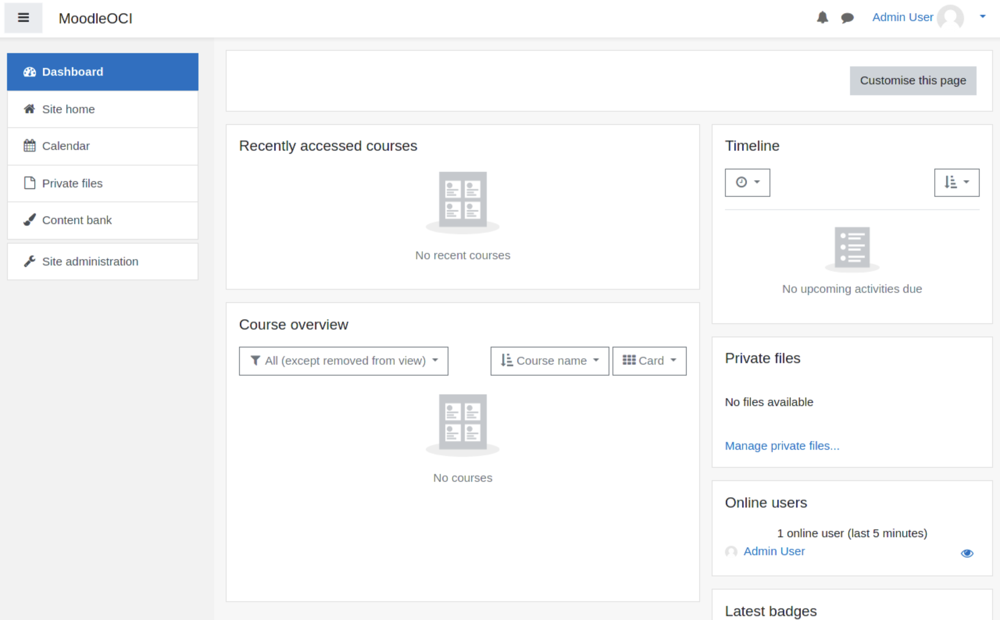

[Moodle](https://moodle.org/) is the world’s most popular learning management system. Moodle is Open Source and of course it’s compatible with the most popular Open Source Database : MySQL!

I've already posted [an article addressing how to install Moodle](https://lefred.be/content/using-oci-to-install-moodle-with-mysql-8-0/) before we released MySQL Database Service. In this article we will see how to deploy Moodle very easily in OCI and using MDS.

Once again we will use the easiest way to deploy an complete architecture on OCI: Resource Manager.

We will then use a stack I’ve created that is available on [GitHub](https://github.com/lefred/oci-moodle-mds) This stack includes Terraform code allowing to deploy different architectures that we can use for Moodle. I’ve tried to cover the main possible architecture directly in the stack. It’s also possible to just download the Terraform code and modify it if you need. You also have the possibility to generate again a stack from your modified code.

I’ve already multiple stacks you can deploy directly on OCI that allows you to deploy the same architectures as I cover in this article but for other solutions directly from this page: [Deploy to OCI](https://lefred.be/deploy-to-oci/).

Let’s have a look at some of the possible architectures we can deploy directly by clicking on the “deploy to OCI” button.

## Simplest Deployment

This deployment, is the most simple to deploy. One single MySQL Database Service Instance and one compute instance as the Moodle Web Server.

The architecture is composed by the following components:

* **Availability domains:** Availability domains are standalone, independent data centers within a region. The physical resources in each availability domain are isolated from the resources in the other availability domains, which provides fault tolerance. Availability domains don’t share infrastructure such as power or cooling, or the internal availability domain network. So, a failure at one availability domain is unlikely to affect the other availability domains in the region.
* **Virtual cloud network (VCN) and subnets:** a VCN is a customizable, software-defined network that you set up in an Oracle Cloud Infrastructure region. Like traditional data center networks, VCNs give you complete control over your network environment. A VCN can have multiple non-overlapping CIDR blocks that you can change after you create the VCN. You can segment a VCN into subnets, which can be scoped to a region or to an availability domain. Each subnet consists of a contiguous range of addresses that don’t overlap with the other subnets in the VCN. You can change the size of a subnet after creation. A subnet can be public or private.
* **Internet gateway:** the [internet gateway](https://docs.oracle.com/en-us/iaas/Content/Network/Tasks/managingIGs.htm) allows traffic between the public subnets in a VCN and the public internet.
* **Network security group (NSG):** NSGs act as virtual firewalls for your cloud resources. With the zero-trust security model of Oracle Cloud Infrastructure, all traffic is denied, and you can control the network traffic inside a VCN. An NSG consists of a set of ingress and egress security rules that apply to only a specified set of VNICs in a single VCN.
* **MySQL Database Service (MDS):** [MySQL Database Service](https://docs.oracle.com/en-us/iaas/mysql-database/index.html) is a fully managed Oracle Cloud Infrastructure (OCI) database service that lets developers quickly develop and deploy secure, cloud native applications. Optimized for and exclusively available in OCI, MySQL Database Service is 100% built, managed, and supported by the OCI and MySQL engineering teams.
* **Compute Instance:** [OCI Compute service](https://docs.oracle.com/en-us/iaas/Content/Compute/Concepts/computeoverview.htm) enables you provision and manage compute hosts in the cloud. You can launch compute instances with shapes that meet your resource requirements (CPU, memory, network bandwidth, and storage). After creating a compute instance, you can access it securely, restart it, attach and detach volumes, and terminate it when you don’t need it. Apache, PHP and Moodle are installed on the compute instance.

Let’s see the different steps to deploy this architecture directly from [here](https://lefred.be/deploy-to-oci/):

You will redirected the OCI’s dashboard create [stack](https://docs.oracle.com/en/cloud/paas/cloud-stack-manager/csmug/oracle-cloud-stack-manager.htm) page:

As soon as you accept the Oracle Terms of Use, the form will be pre-filled by some default values.

You can of course decide in which [compartment](https://docs.oracle.com/en-us/iaas/Content/Identity/Tasks/managingcompartments.htm) you want to deploy the architecture:

The second screen of the wizard the most important form where we need to fill all the required variables and also change the architecture as we will see later:

The second part of the form looks like this. Note that we can enable [High Availability for MDS](https://blogs.oracle.com/mysql/mysql-database-service-with-high-availability), use multiple Web Server Instances or use existing infrastructure. This means that we have the possibility to use an existing VCN, subnets, etc… 

And of course we can also specify the Shapes for the compute instances (from a dropdown list of the available shapes in your tenancy and compartment) and for the MDS instance (this one needs to be entered manually).

When we click next, we reach the last screen which summarize the choices and we can click on “Create.” By default the Architecture will be automatically applied (meaning all necessary resources will be deployed):

Now we need to be a little bit of patience while everything is deployed.

## Other Possible Architectures

As we could see earlier on the second screen of the stack’s creation wizard, we could also specify the use of multiple Web Servers. Then we have the possibility to deploy them on different Fault Domains (default) or use different Availability Domains:

It’s possible to also specify if all Moodle servers will use their own database and user or share the same schema in case we want to use a load balancer in front of all the web servers and spread the load for the same site/application.

The default architecture with three web servers looks like this:

And if you want to enable High Availability for the MDS instance, you just need to check the box:

And you will have an architecture like this:

 ## Finishing Moodle’s Installation

When the deployment using the stack is finished, you will the a nice large green square with “SUCCEEDED” and in the log you will also see some important information.

This information is also available in the Output section on the left:

Now, we just need to open a web browser and enter that public ip to finish the installation of Moodle:

And we follow the wizard until the database configuration section:

On the screen above, we use the information that we can find in the Stack’s output section.

Then we continue the installation process until it’s completed and finally we can enjoy our new Moodle deployment:

