The easiest way to deploy [Joomla!](https://www.joomla.org/) on Oracle Cloud Infrastructure and MySQL Database Service, is to use OCI Resource Manager’s stack.

Let’s see how easy it is to deploy such solution.

If you don’t already have an OCI account, you can [get started for free]({{ site.urls.always_free }}).

The easiest way to deploy all the required resources (vcn, subnets, gateways, compute and MySQL instances, security lists, …) is to use a stack for Resource Manager. It consists in Terraform modules and information to easily deploy the architecture on OCI.

To deploy Joomla! and a MDS instance, visit this GitHub repo and click on the button to deploy on OCI:

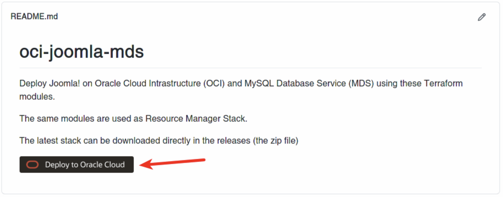

The Oracle Cloud Dashboard will be open and the stack creation form will be loaded like this:

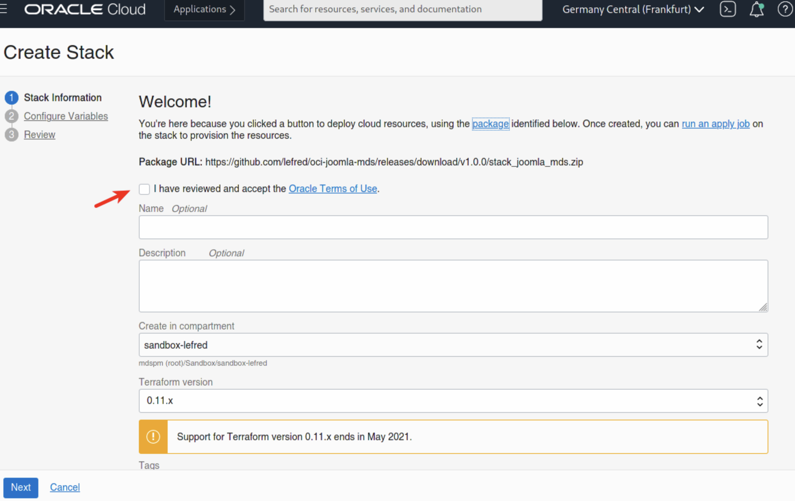

As soon as we accept the Oracle Terms of Use, the form will be automatically filled with the stack’s information:

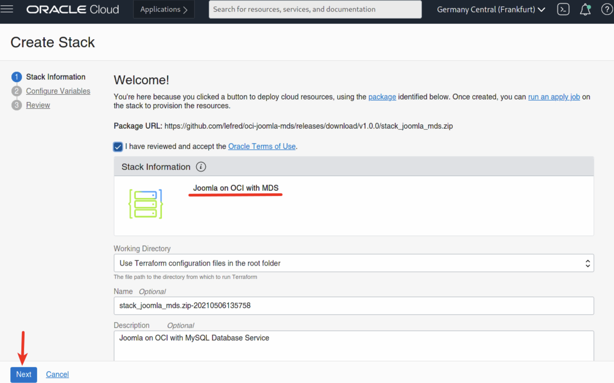

We can click on Next to reach the second form dedicated to the variables:

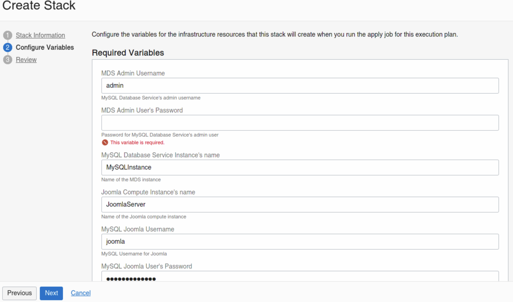

As you can see some variables are already pre-filled. We need to enter some mandatory ones like the password the MDS admin password.

We also have the possibility to enable HA for the MySQL Database Service instance, to have multiple webservers in case we want to have multiple Joomla! in front on the same database or multiple Joomla! with multiple dedicated databases… there are different possibilities.

We also have the possibility to use existing resources in case you already created an architecture in OCI and you want to use it for Joomla! too.

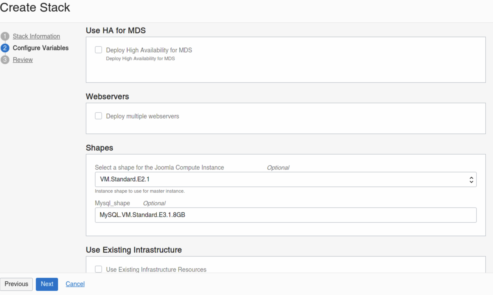

When we are ready, we click Next and the review summary screen appears:

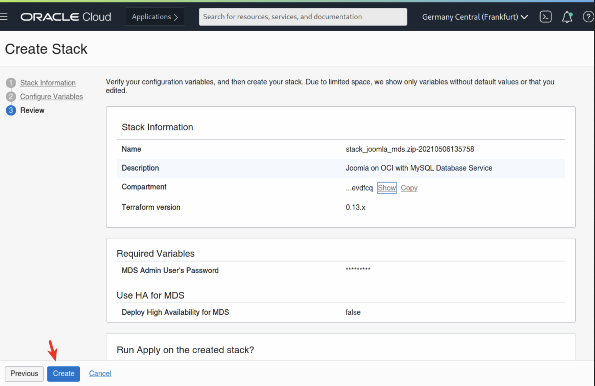

When we apply the stack, OCI will create a job to create all the resources and deploy everything that we need. This will take some minutes (+/- 10min):

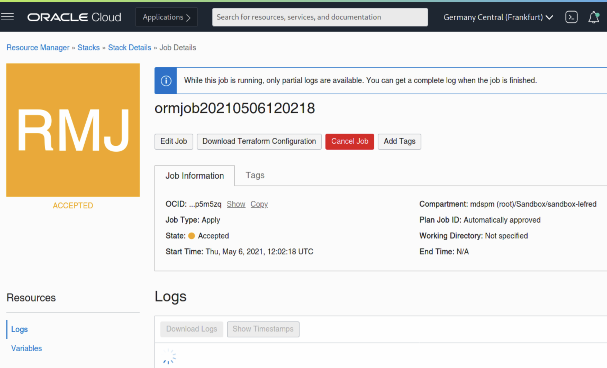

When everything is created and deployed, the job will return a status:

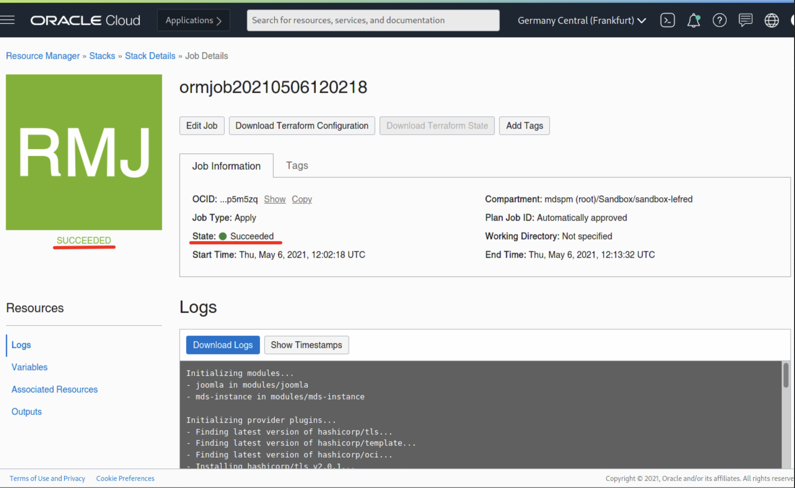

All the required information to finish the installation is reported in the Outputs section:

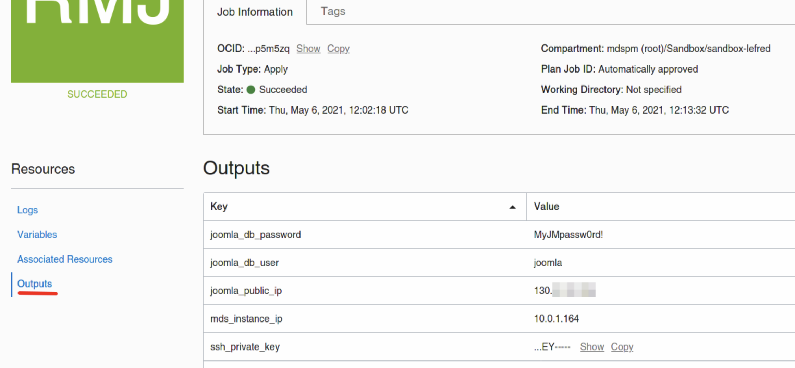

Now we can paste the public IP (`joomla_public_ip`) in our Internet browser:

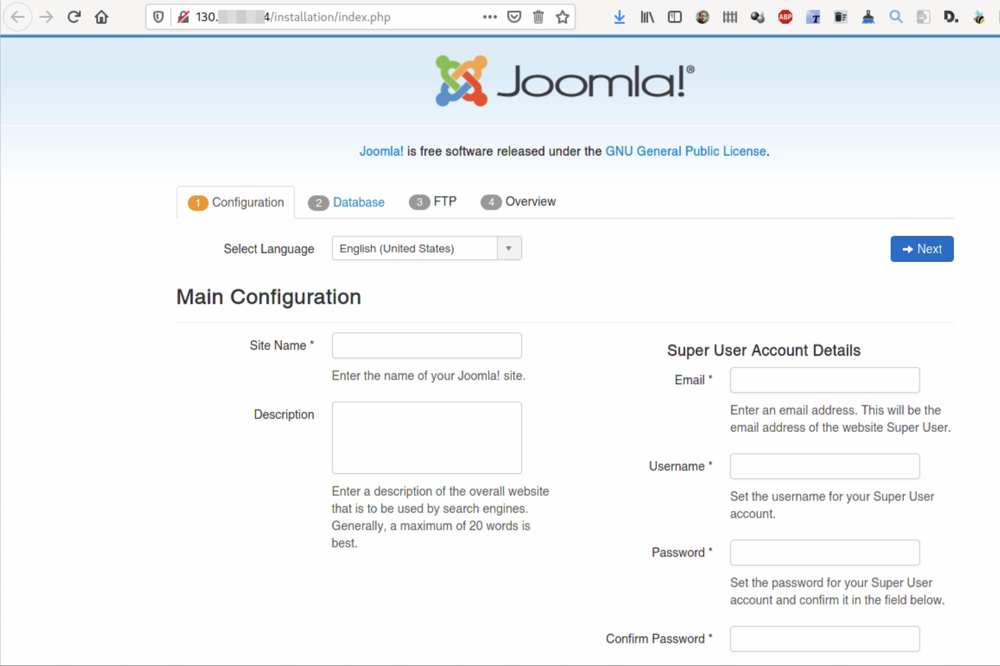

After we enter the required information, we click Next to reach the database configuration form:

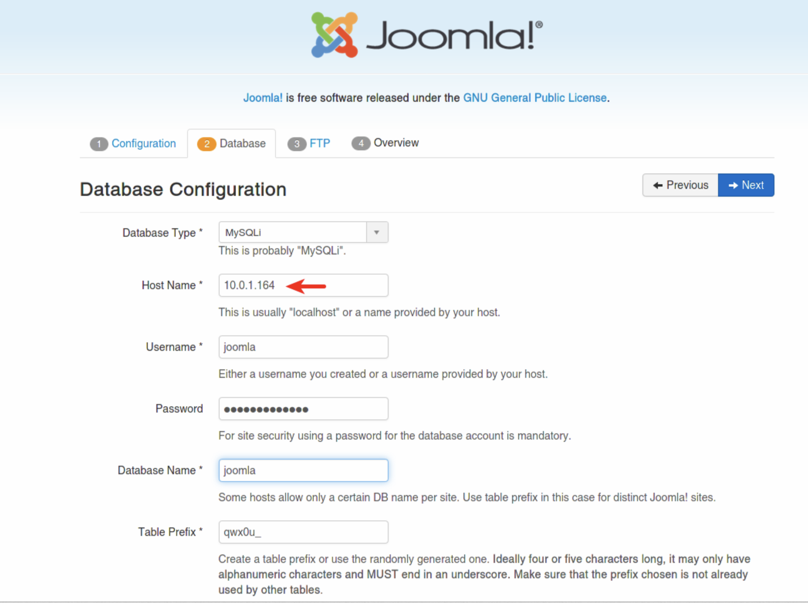

We enter all the information from the stack’s outputs section. As the database is not local to Joomla!, we also need to delete a file for security reasons.

To connect to the Joomla! server, we need to use the generate ssh key (you can get it from the Outputs section) and connect to the public IP with the opc user. Then we need to remove the file generated by Joomla!’s installation wizard:

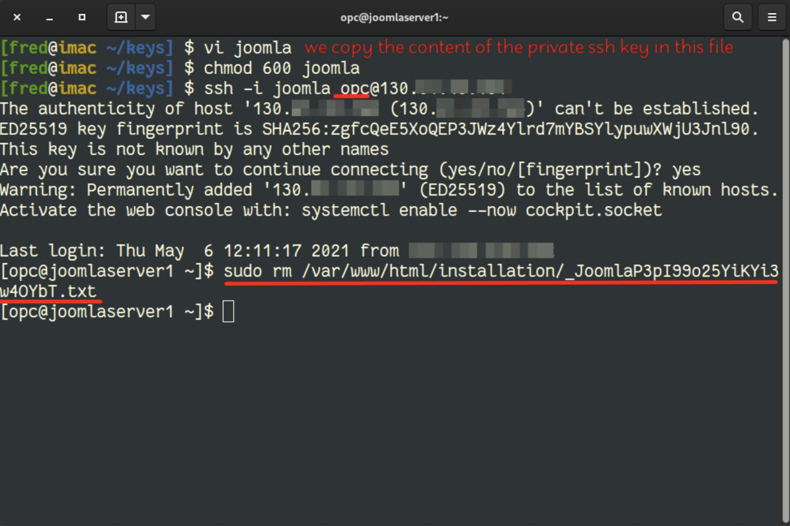

When this is done, we can continue with Joomla!’s installation:

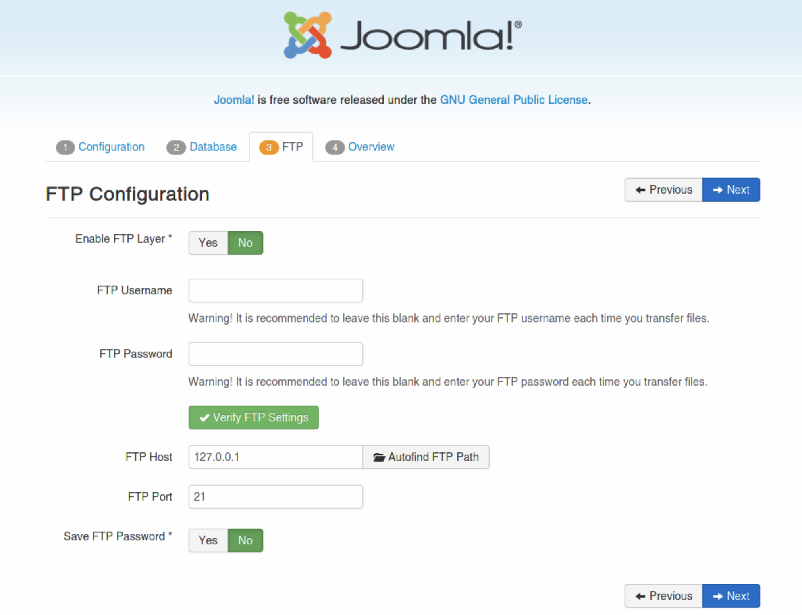
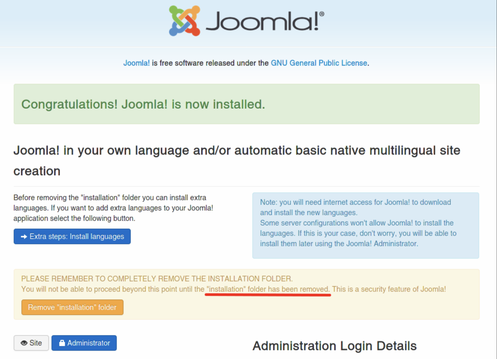

To finish the installation, we need to delete the installation folder:

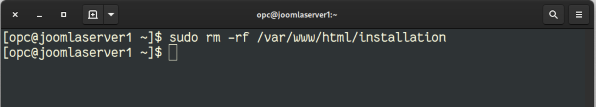

And here we go, Joomla! is installed:

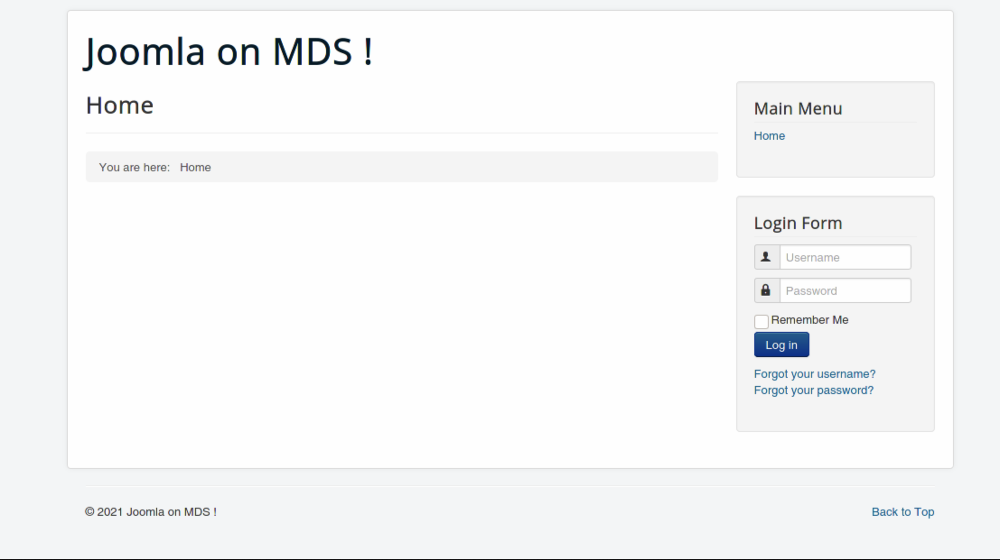

The administration dashboard is also available on `/administrator/`:

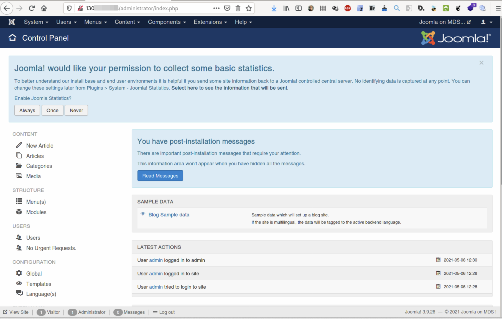

As you can see, deploying Joomla! on OCI to use MySQL Database Service is very easy. The most complicate operation if to remove the files and folders during the installation.

Enjoy MySQL!
