I've written [several articles](https://lefred.be/deploy-to-oci/) about how to deploy popular Open Source applications on Oracle Cloud Infrastructure and MySQL Database Service.

Now we will see how you can deploy your own LAMP stack application using the same technique where **L** will stand for a compute instance (and why not the [Ampere always free trier](https://lefred.be/content/deploy-on-oci-using-ampere-compute-instances/)?), **A** stays Apache and will run in that compute instance. **M** stands for MySQL Database Service and **P** is for PHP.

As usual we start by deploying a Stack by just clicking on the deploy button [from GitHub](assets/get-started-with-lamp-on-oci-Screenshot-from-2021-05-28-13-11-43.png)

Then we are redirected to OCI’s dashboard and we need to accept the Terms of Use:

As soon as we accept the Terms of Use, we see the information being updated, and we can directly click on Next:

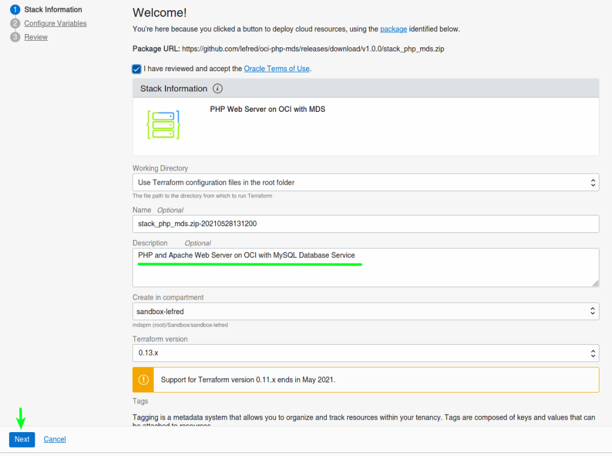

On the next screen, we can set all the variables. Some are mandatory and the others are already pre-filled:

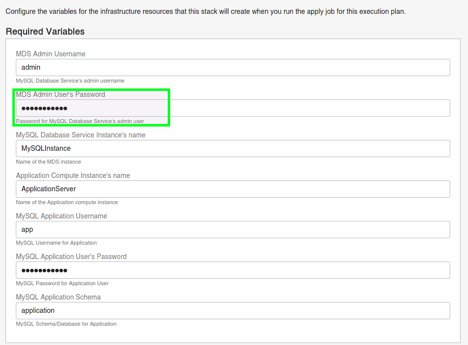

This is also where you can choose which version of PHP you want to use:

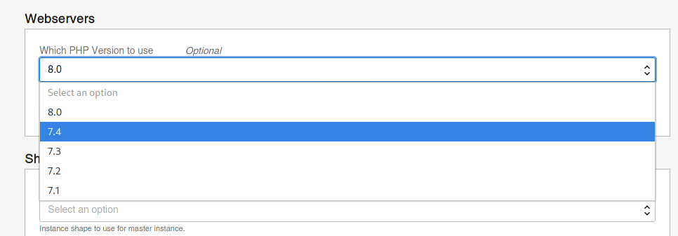

You validate everything, and then Create the stack and deploy the architecture on OCI:

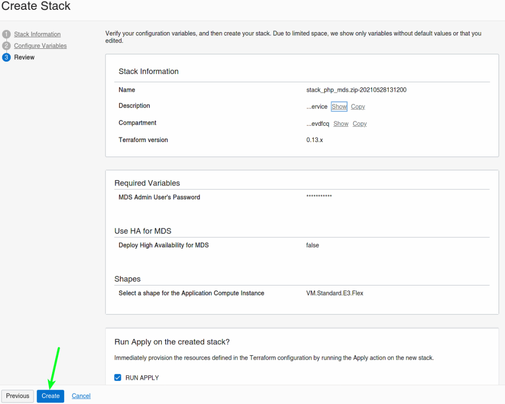 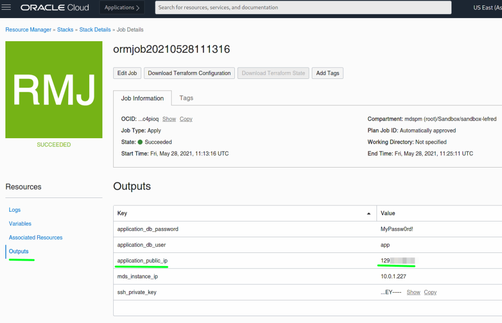

As you can see, we have all the generated and required information in the **Outputs** section.

We can already use the public IP in a browser and we should see the following page:

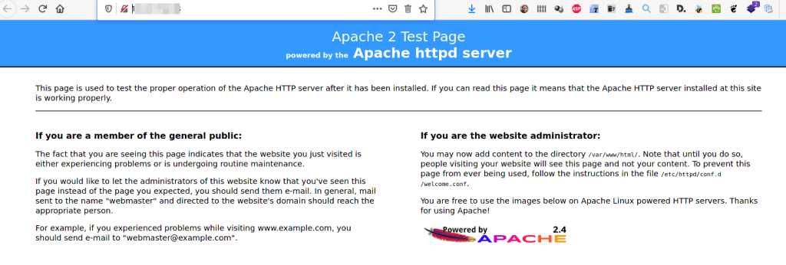

Now the Web server is ready to get our code. From the stack’s outputs, we already know the IP, the username, and password to use to connect to MySQL Database Service.

We also need the ssh key that we can copy locally to ssh to the Web Server to deploy our code, or we can use the Cloud Shell from OCI’s dashboard. Let’s use it:

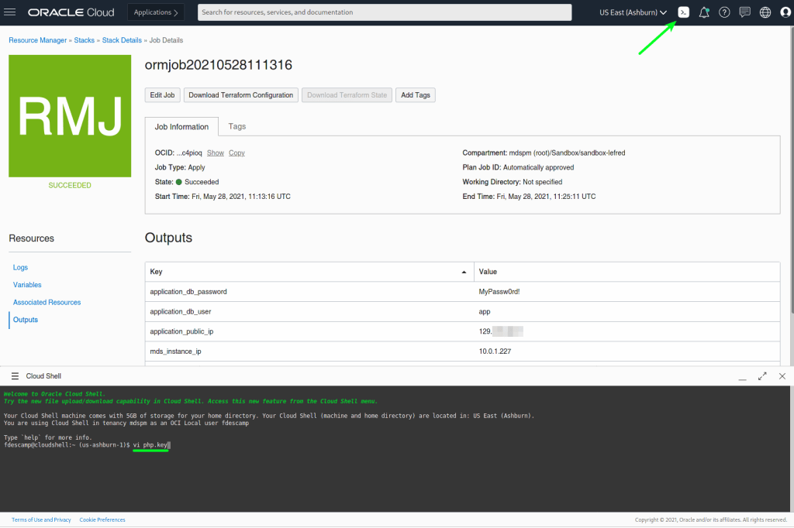

We create a file for the ssh key (`php.key`) and we paste its content in it:

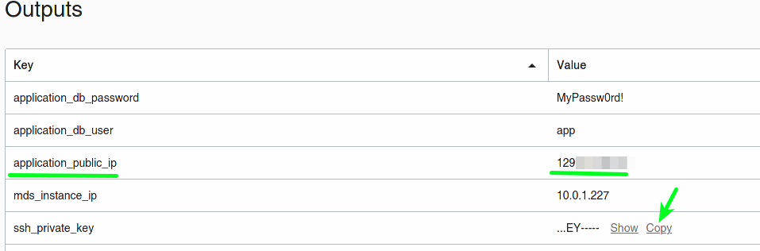 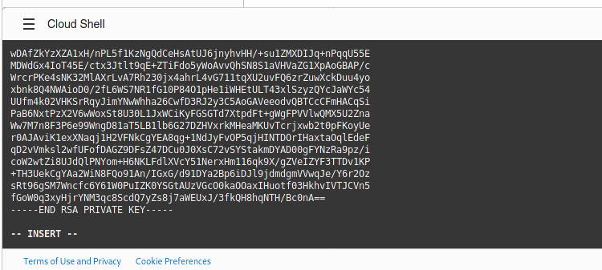

We change the permission of the key’s file and we use it to connect to our web server using its public IP:

As an application, we will use [this gist file which is a PHP script](https://gist.github.com/lefred/b97fe90f31115607e0d28ddc8a72ca16) that connects to MDS and we will place it in `**/var/www/html**`:

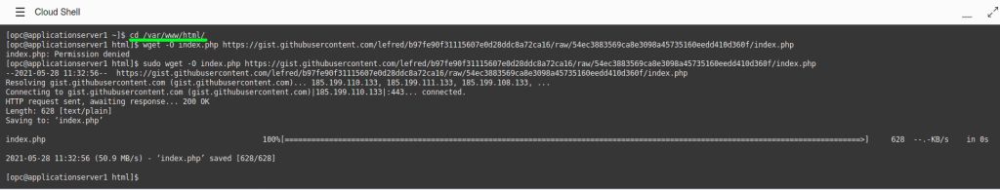

We edit it, and there are 3 variables to modify using the values from the Stack’s outputs:

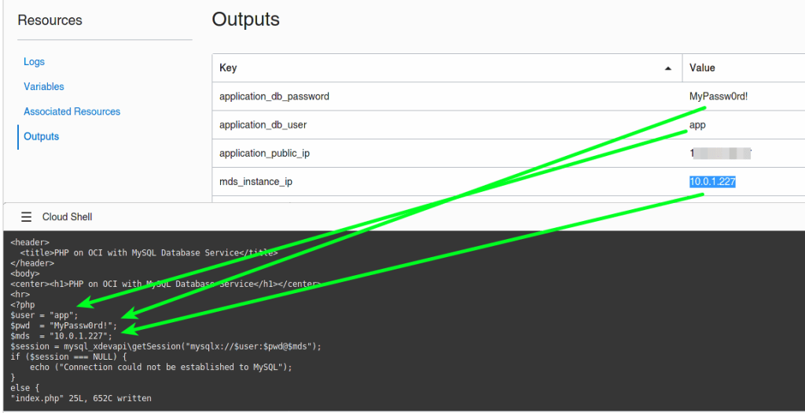

When done, we can refresh the page on the browser and we will see our code being processed:

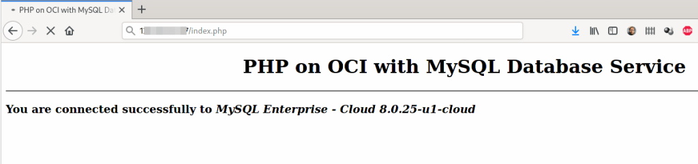

The Web server box already contains `git` and `certbot`.

Now you are able to deploy your own LAMP stack easily to OCI, enjoy!
