# Creating a Mask Model on OCI with YOLOv5: Data Labeling with RoboFlow

## Introduction

I've always been curious about using Vision ML in some projects of mine. I  dreamt of knowing how a Tesla autopilot worked on the inside, and whether I could make my own AI system at some point in my life. I was tired of dreaming, so I decided to learn by example (hands-on).

I set my focus on re-learning everything I knew about Vision ML (which is what I call image/video processing concerning Machine Learning in one way or another).

I think articles like this one will allow people like you to get into these topics -- topics sometimes considered "too hard". Through these articles, I'll show you that it's not that hard to do this yourself (and not expensive either!).

Computer Vision has been a growing industry since its conception, and vision ML is one of the many components of Computer Vision. If you're interested in content like this, make sure to follow me, and stay tuned for part 2 (more info at the end).

Today, we're going to learn how to detect different mask-wearing states in multimedia, including:

- A person with a mask, which we will label as `mask`.
- A person with a mask, but *incorrectly* worn (see examples below), which we will label as `incorrect`.
- A person with no mask at all, which we will label as `no mask`.

I've attached a couple of examples of some images of my model and the corresponding results. 

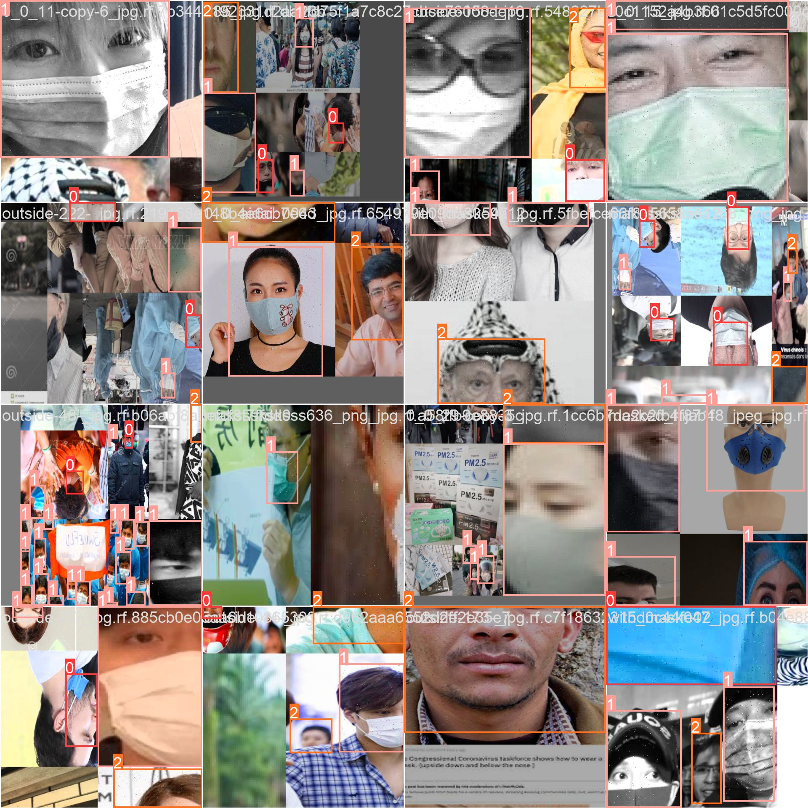

Note that we're labeling this data for each case:

- '0' represents `incorrect`.
- '1' represents `mask`.
- '2' represents `no mask`.

We'll go more into detail further in the article.

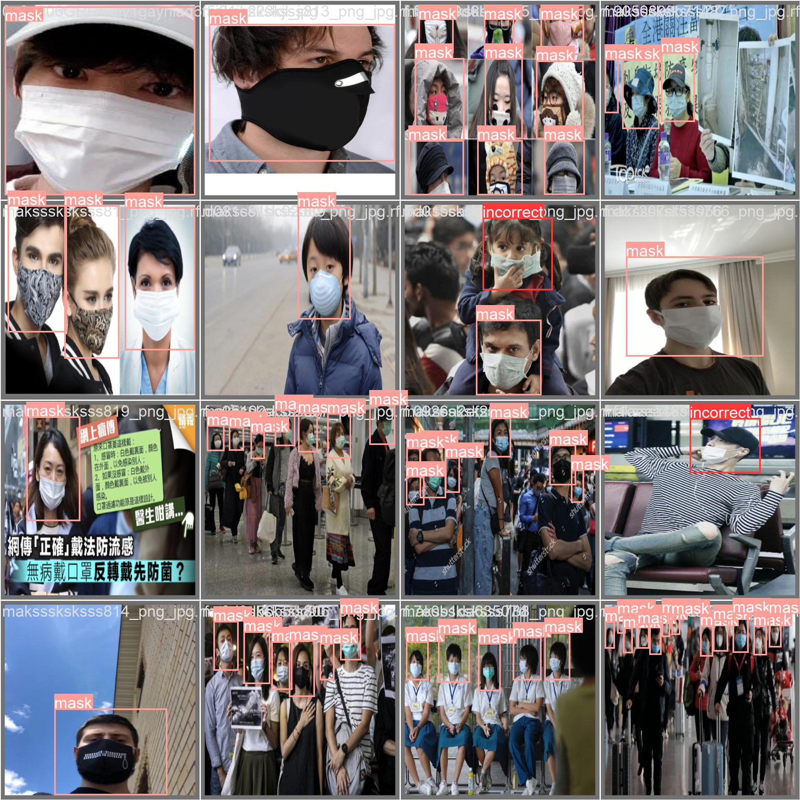

> **Note**: as you can see, the little girl on the second row, third column is wearing the mask with their nose showing, which is *incorrect*. We want our custom model to detect cases like these, which are also the hardest to represent, as there are a lot of pictures of people with and without masks, but there aren't as many of people wearing masks incorrectly on the Internet; which causes our dataset to be imbalanced. We'll talk about how to fix an imbalanced dataset in the next article.

We'll follow this process for a lot of images, with the hope of our computer becoming our "third eye", using either CPU or GPU resources to make these predictions in the end.

For today's tutorial, we're going to focus specifically on labeling this data. For a Machine Learning (ML) model to work properly, we need to *teach* what a person looks like when they are wearing a mask, when they aren't, and when they're wearing the mask incorrectly. We will need multiple examples for each class, and we will tell the computer where each object is in an image, using **bounding boxes** (a.k.a. rectangles on top of the objects we're trying to detect).

I'll be using [RoboFlow](https://roboflow.com) for labeling and gathering data. I found this platform *significantly* better than CVAT, Label Studio, or any other "competitor" labeling tool out there.

I also have the option to use general-purpose models or custom-detection models. I decided to use custom models to solve this challenge.

Finally, I will use OCI (Oracle Cloud Infrastructure) to manually train my model (more on this in the next article), and as a place to store the best-performing versions of the model.

So, let's get started!

## Why Custom Models?

Custom-detection machine learning (ML) models can provide numerous benefits in various applications.

- One major benefit is increased accuracy and performance when we compare these models to *general* models. Custom detection models are tailored specifically to the task and data at hand, allowing them to learn and adapt to the specific characteristics and patterns in the data. This can lead to higher accuracy and better performance than the previously-mentioned general models, which are not as tailored to the task.
- Also, a custom detection model will require a smaller number of resources to _train_ it, as well as when making predictions with the model once it's been trained.
- Finally, there isn't a general-purpose model that's able to detect mask placement, so we have to go with the custom model.

## What is YOLOv5?

YOLO (You Only Look Once) is a popular real-time object detection system developed by Joseph Redmon and Ali Farhadi. It's one of the latest versions of the YOLO system and was released in 2021.

Like other versions of YOLO, [YOLOv5](https://github.com/ultralytics/yolov5) is designed for fast, accurate, **real-time** object detection. It uses a _single_ convolutional neural network (CNN) to predict bounding boxes and class probabilities for objects in an image or video. The model is trained to predict the locations of objects in an input image and assign them to predefined categories, such as "car," "person," or "building."

In my personal experience -- and even though YOLOv5 isn't the newest detection system -- it's the one with the *lowest open issue to closed issue ratio*, which means that, for each open issue, more than 25 issues have already been closed.

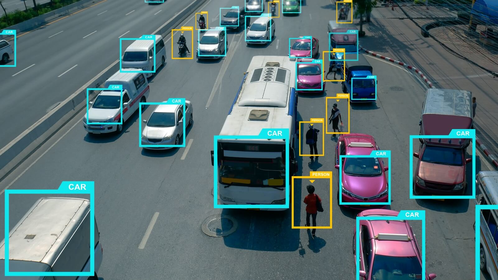

YOLOv5 improves upon previous versions by using more efficient network architectures and optimization techniques, resulting in faster and more accurate object detection. It also includes the ability to run on lower-power devices.

> **Note**: this is a figure detailing the performance and accuracy of YOLOv5 compared to EfficientDet, and the [different variations of YOLOv5](https://github.com/ultralytics/yolov5#why-yolov5) (these are different checkpoints).

YOLOv5 has been widely adopted and is used in a variety of applications, including self-driving cars, robotics, and security systems, which is why I decided to start with this detection system rather than any others.

And you may ask yourself: "why YOLOv5 and not others?" Well, I compared YOLOv5 to YOLOv7, which was developed during this year (2022) and is more recent than YOLOv5. However, it currently has an open/closed issue ratio of [3.59](https://github.com/WongKinYiu/yolov7/issues), *87 times higher than YOLOv5*!. Therefore, I recommend YOLOv5 for getting started, as it's complete and the open-source community is more on top of this project. 

## Creating Dataset

The first thing I looked for when starting to work on this project was *data*. I needed hundreds, if not thousands, of images of people wearing masks in different ways and to label them. But creating this dataset from scratch -- with no help -- would take me tens of hours of labeling data by myself.

So, I decided to look for some projects that had the same idea, and to try to "harmonize" all these images into a one-trick model (mine, hopefully).

I went into [RoboFlow Universe](https://universe.roboflow.com/) (their collection for open-source vision ML datasets and APIs) to look for some already-labeled data.

I found these two projects which looked very interesting:

- [Incorrect Mask Outside Mosaic Clean Computer Vision Project](https://universe.roboflow.com/features-dataset/incorrect-mask-outside-mosiac-clean), with 346 images ready for training,
- [Face Mask Computer Vision Project](https://universe.roboflow.com/ditworkspace/face-mask-jk4nr), with 3660 images (2800 for training, 800 for validation, 75 for testing)

However, the first problem arose: the classes for each one of these datasets had *different labels*, which we don't want: we want our model to only predict three classes. Let me demonstrate:

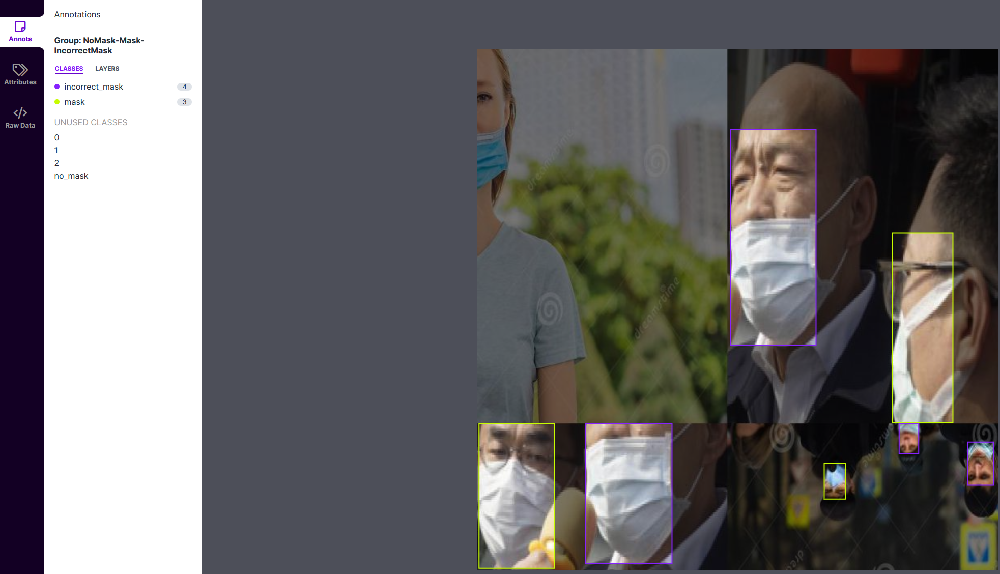

> **Note**: example of an image from the first dataset. The corresponding labels were: `NoMask`, `Mask`, `IncorrectMask`.

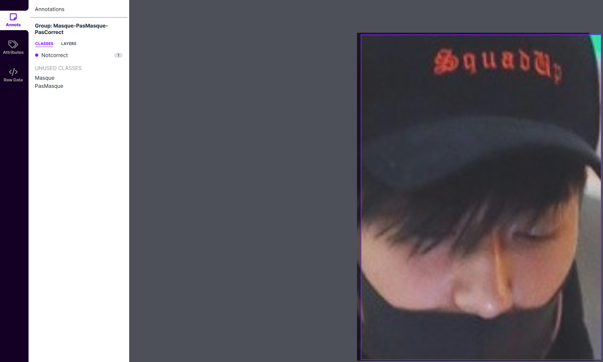

> **Note**: example of an image from the second dataset. The corresponding labels were: `Masque`, `PasMasque`, `NotCorrect`.

To fix this label mismatching, I cloned both repositories to my computer and extracted them:

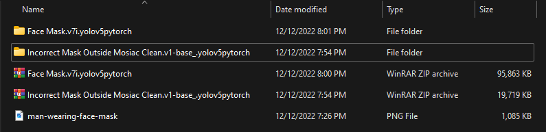

In theory, we should've downloaded all images from the datasets, which are split into `train`, `test`, and `validation` groups.

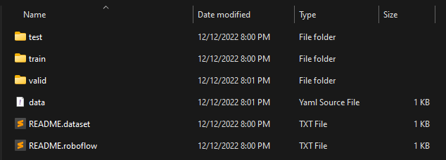

Additionally, we have a file called `data.yaml`, with a structure like this:

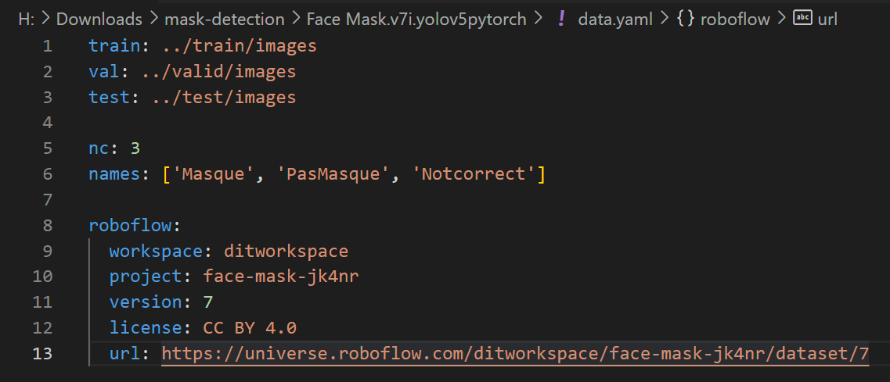

So I modified the YAML file to include the names of the classes that I wanted, making sure that the order of the labels was also preserved. I looked at some pictures and made sure that _PasMasque_ actually represented a lack of mask, and that other classes were also correctly represented.

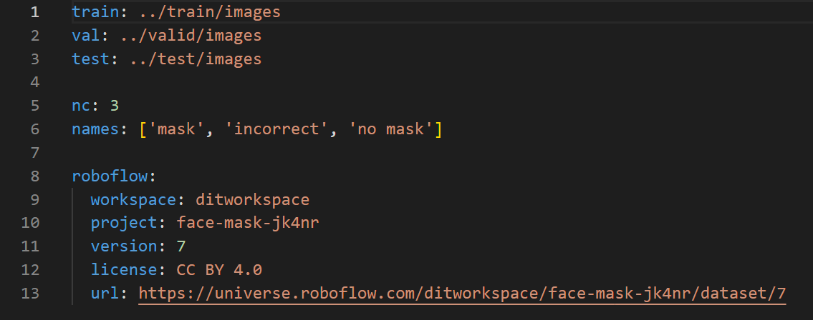

> **Note**: modified YAML file. Also note that if the number of classes varies, we also have to modify the variable `nc` accordingly, which represents the total number of classes that the dataset is trained to recognize.

I made the same modifications to the second dataset, and once I had my classes with the names harmonized, I went into RoboFlow and imported both datasets. Now that we had the same labels for the datasets, they worked flawlessly, and my dataset had increased to about 2800 images.

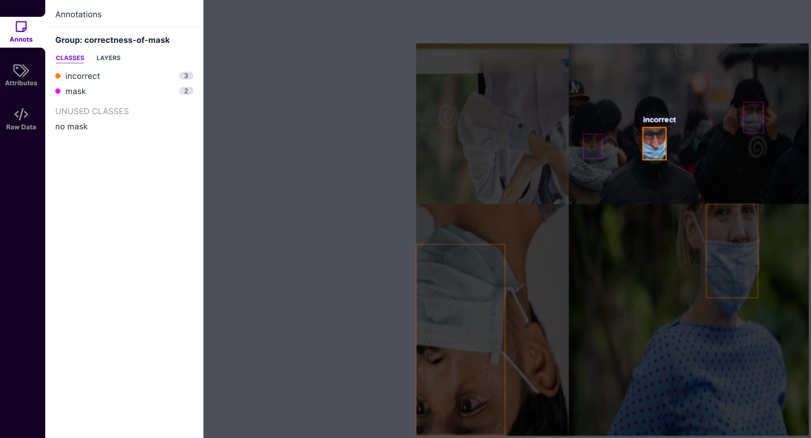

> **Note**: after importing, I see all my images have been labeled correctly and are ready for training.

## Augmenting Dataset

Now that all data labeling has been completed, I want to mention another great feature offered by RoboFlow, which is automatic **dataset augmentation**.

I accessed [my RoboFlow public project](https://universe.roboflow.com/jasperan/public-mask-placement) and generated a new dataset version under the **Generate** tab:

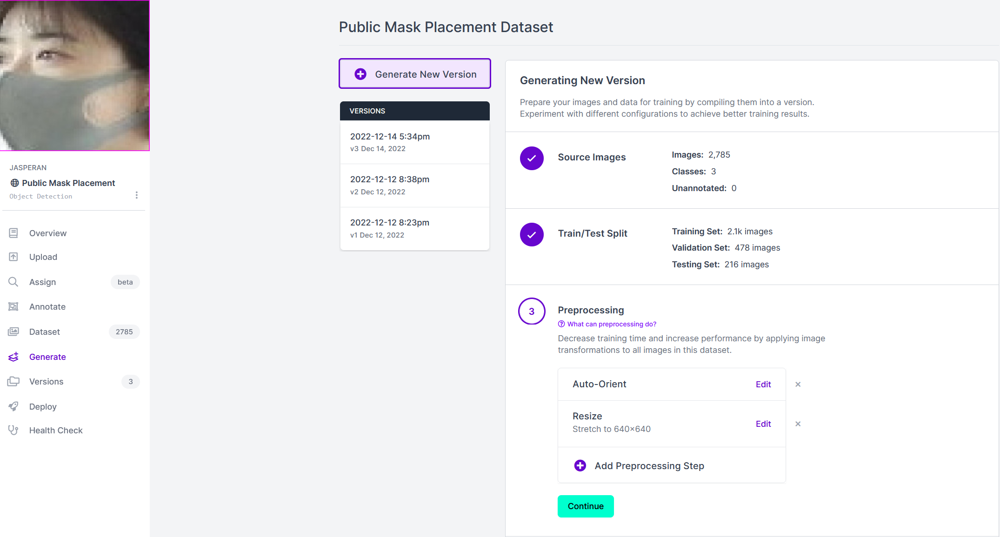

Augmentations create new training examples for your model to learn from. In the fourth step -- to generate a new dataset -- I chose the following augmentations:

- **Grayscale** (applied to 10% of my training data): with this, I'm aiming to also replicate possible future inputs from CCTV cameras or video feeds with old camera/hardware equipment. Hopefully, after training 10% of my data in grayscale instead of color, I'll also allow B&W cameras to test out my model.
- **Blurring** (up to 1.25px): to train the model to work well against out-of-focus people wearing masks. 1.25px is not an extreme transformation but it smooths out edges.
- Bounding Box **Noise**: this adds noise _inside_ the bounding boxes in my training dataset and generates variations to help my model be more resilient to camera artifacts. I also wanted to "simulate" a low bit rate when analyzing videos directly from a Twitch stream or similar live-stream feeds.

Here are the differences between using no augmentations and using them:

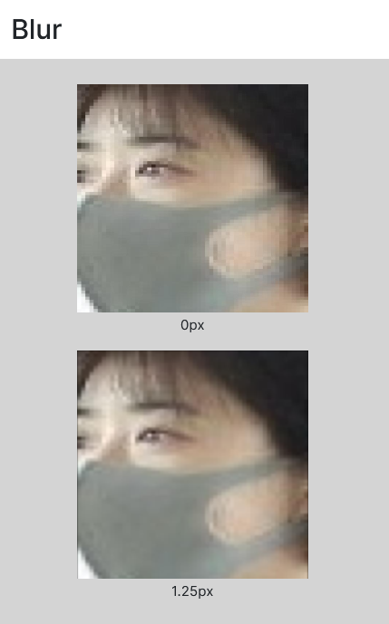

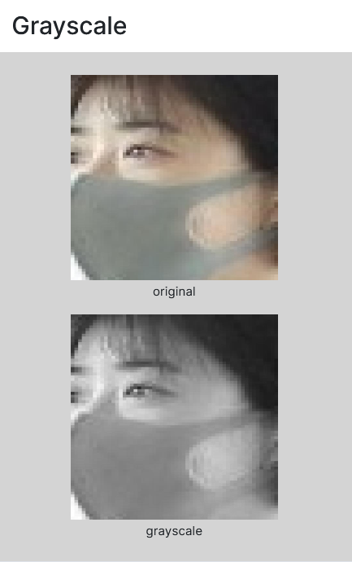

Another augmentation that I find very helpful -- especially if you're struggling to detect *small objects* -- is the **mosaic** augmentation, which will put several images together simulating a mosaic so that the model learns to detect the objects we want when these objects occupy a smaller portion of the screen.

Finally, after applying all these dataset augmentations, it's time to give RoboFlow the ability to generate these augmented images. Thanks to their *amazing* support (thank you, RoboFlow team!), they gave me some training credits for free and allowed me to generate my augmentations up to *5x* (5 augmentations per image in the training dataset):

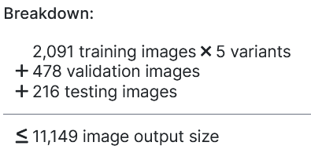

After some time generating this new version, we can train the model automatically with RoboFlow and check the [mean average precision (mAP)](https://learnopencv.com/mean-average-precision-map-object-detection-model-evaluation-metric/) for each class, including some other interesting stats that will be helpful to iterate over our model afterward:

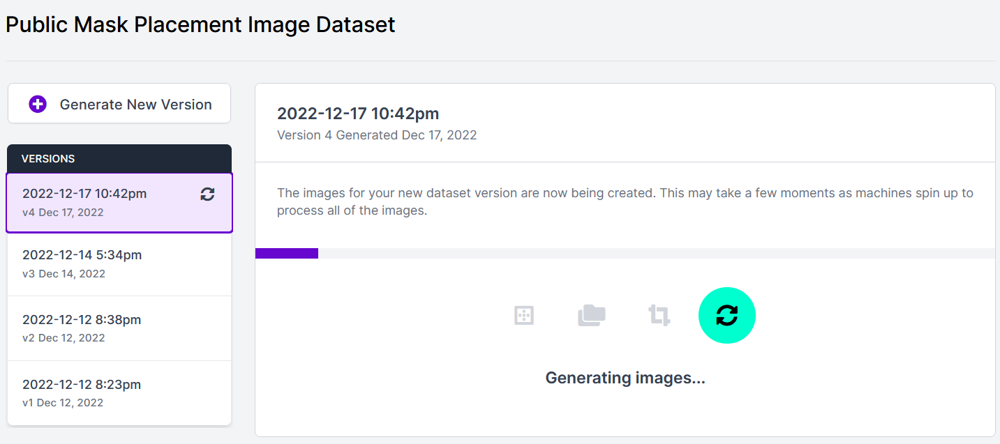

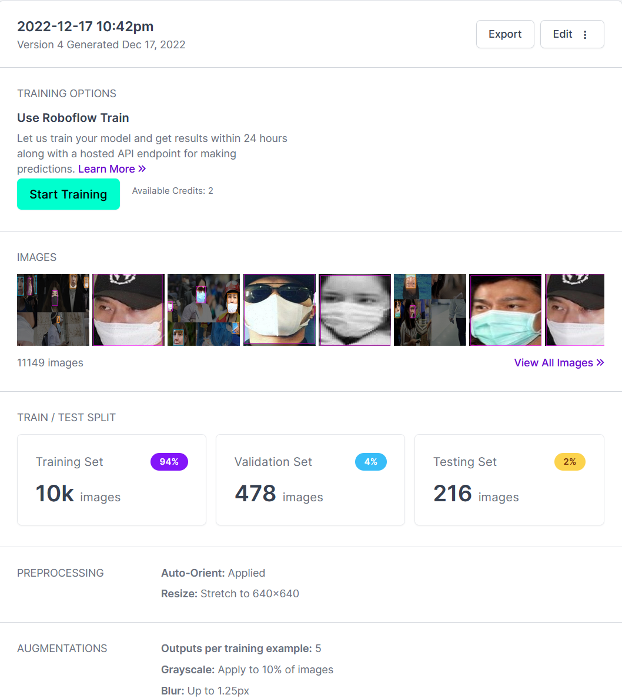

## Training with RoboFlow

Since I had some free training credits, I decided to spend one of them to see how my model would perform initially:

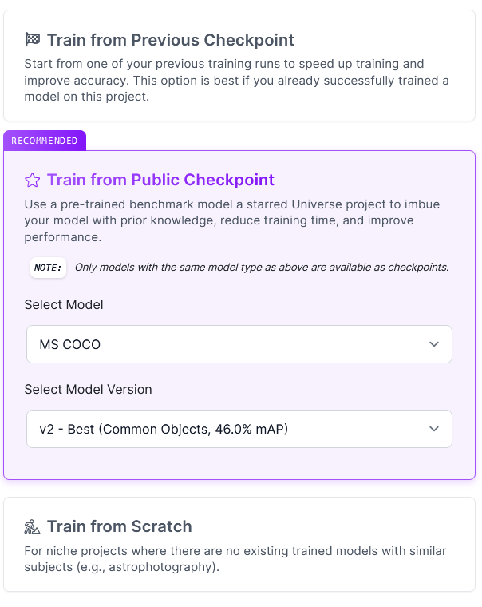

I decided to start training from a checkpoint since the COCO dataset (with a 46.7% mAP) is a very well-known dataset which has been trained with real-world data, which means that the convolutional Neural Network involved in detecting elements will "know" (at least in a rudimentary way) to detect edges and elements corresponding to people.

The last epochs of the Neural Network will be taught to detect elements by my custom model.

After training, I saw the following:

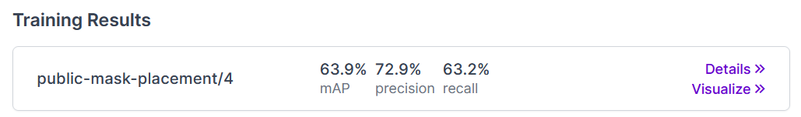

In more detail, we get average precision broken down by validation and testing sets:

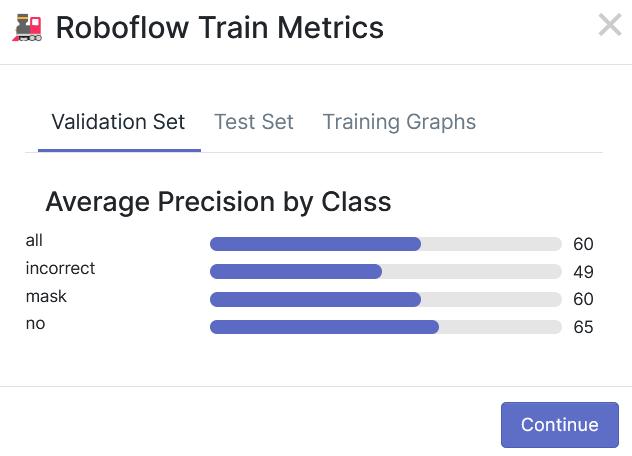

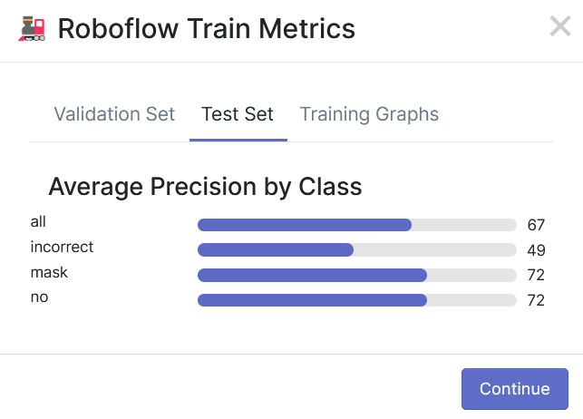

> **Note**: since the validation set had fewer pictures than the test set, and the validation set has a lower precision, this leads me to believe that the lower precision on the validation set is caused by having too few pictures, and not by the model being inaccurate on detections. We will fix this in the next article, where we will make a more balanced split for our dataset.

> **Note**: also note that -- across validation and test set -- the "incorrect" label has a constant precision of 49%. This makes sense, as it's the hardest class to predict of the three -- it's very easy to see the difference between someone with our without a mask, but incorrectly-placed masks are harder to detect even for us. Thus, some pictures we may fail to be recognized as humans. We take note of this and we'll find a way to try and improve the precision for this specific class in the future.

## Conclusions

After training, we have a final initial version of our dataset. Here's a full detail of all metrics during training -- this is provided automatically by RoboFlow, but I'll teach you how to generate these figures yourself in the next article:

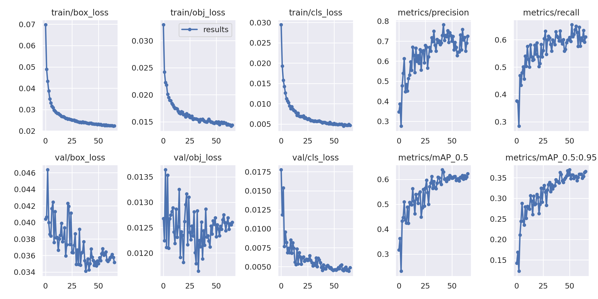

> **Note**: the lower the loss, the better. Loss is a metric that represents the inverse of accuracy. So the lower the accuracy, the higher the loss, and vice versa. We can also observe that the training loss decreases correctly; never increases, which is good, and both training and validation losses follow the same curve, which also means that overfitting or underfitting isn't happening in our case.

Finally, I usually like to check some things to see if my model has been properly trained, which are:

- [ ] Is my training loss higher than the testing loss? This would indicate __underfitting__.
- [ ] Is my training loss lower than the testing loss? This would indicate __overfitting__.

As both losses are very similar, we can conclude that our model is well fit, and we will make efforts to improve the mAP for each class.

In the next article, we're going to learn how to:

- Train an improved version of this Mask Detection model on OCI, from scratch, with a GPU.
- How to expand/improve the dataset and generate an improved v2.
- Using the model in real-time (with a camera feed, video feed like YouTube, standard video, or one-by-one images).

Now it's your turn to get ready with something that you'd like to detect from scratch (and I'd appreciate contributors to my dataset), and follow my steps in this tutorial to prepare for what's coming in 2023. 

If you’re curious about the goings-on of Oracle Developers in their natural habitat like me, come join us [on our public Slack channel!](https://bit.ly/odevrel_slack) We don’t mind being your fish bowl :tropical_fish:

Stay tuned...

## Acknowledgments

* **Author** - Nacho Martinez, Data Science Advocate @ Oracle DevRel
* **Last Updated By/Date** - December 22nd, 2022
