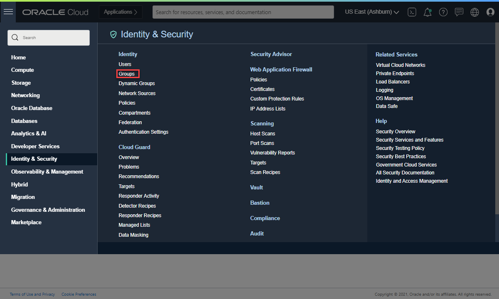
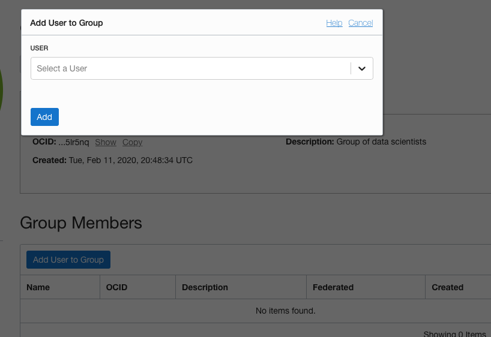
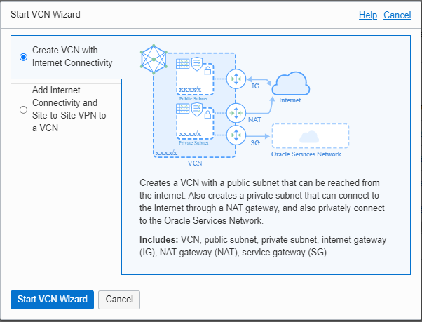
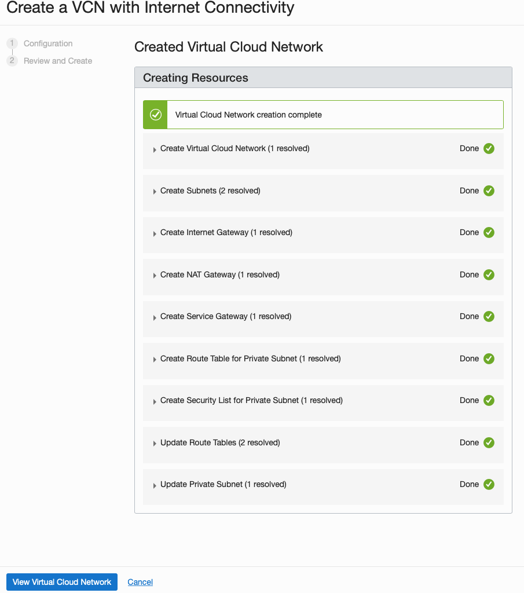
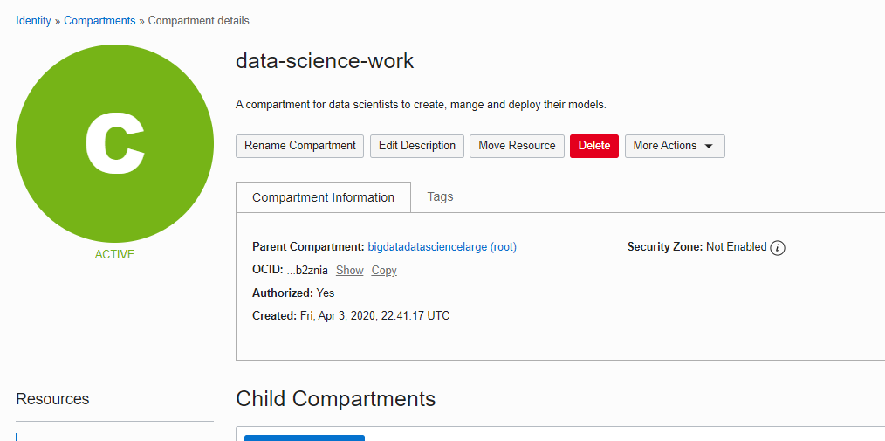
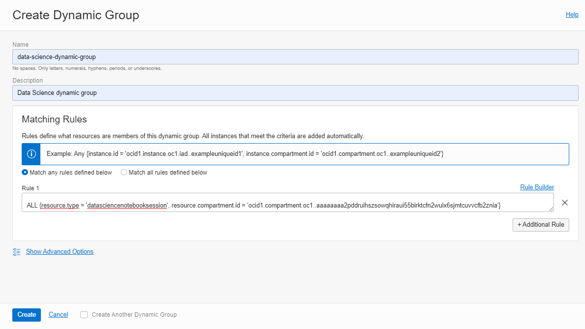
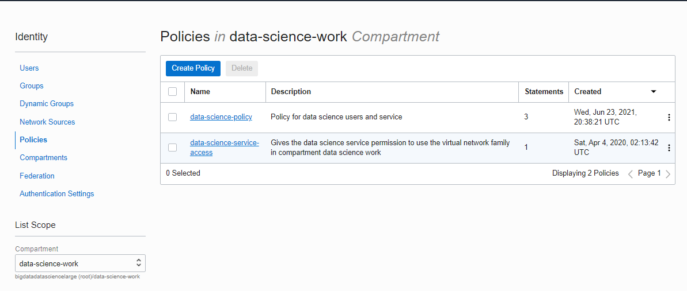
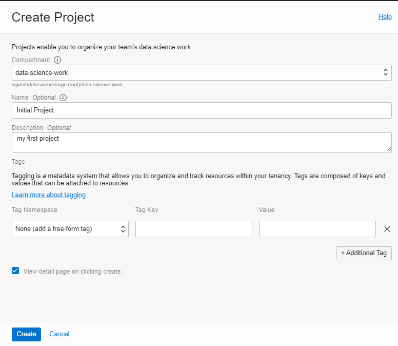


Learn how to get started configuring your tenancy for Data Science and test creating a notebook session.

This tutorial is directed at administrator users because they are granted the required access permissions.

In this tutorial, you will:

1. Create a Data Scientists User Group
2. Create a Compartment for Your Work
3. Create a VCN and subnet
4. Create policies
5. Create a Dynamic Group and write policies for it
6. Create a notebook session

## Before You Begin

To perform this tutorial successfully, you must have the following:

* An OCI account with administrator privileges, see [signing up for Oracle Cloud Infrastructure](https://docs.oracle.com/iaas/Content/GSG/Tasks/signingup.htm).
* At least one user in your tenancy who wants to access the Data Science service. This user must be created in [IAM](https://docs.oracle.com/iaas/Content/Identity/Tasks/managingusers.htm).

## Creating a Data Scientists User Group

You must create a user group for the data scientists to work in.

1. Open a supported browser and enter the Console URL, `https://console.<_tenancy-region_>.oraclecloud.com`.

	The `<_tenancy-region_>` can be `us-ashburn-1`, `us-phoenix-1`, and so on. Use one of the Data Sciencesupported [Regions and Availability Domains](https://docs.oracle.com/iaas/data-science/using/overview.htm#regions-domains).

2. Enter your cloud tenant and click Continue.
3. Sign in with your credentials.
4. Open the navigation menu and click Identity & Security. Under Identity, click Groups. 

	

	A list of the groups in your tenancy displays.

5. Click Create Group.
6. Create a **data-scientists** group and enter a description: 

	

7. Click **Create**.

	You are advanced to the data-scientists group detail page that you created.

8. Click Add User to Group.  

	  

9. Select a user to add, and then click Add.

	The selected user is added and appears in the group member list.

10. Repeat adding data scientist users until all of your users are added to the data-scientists group you just created: 

	A list of the users in your tenancy displays.

## Creating a Compartment for Your Work

Next, you create a compartment for your data science resources.

1. Open the navigation menu and click Identity & Security. Under Identity, click Compartments.   

	  

2. Click Create Compartment to create your compartment.
3. Name the new compartment **data-science-work**, and enter a description.  

	  

4. Click Create Compartment.

	The data-science-work compartment is created, and added to the compartments list when it successfully creates.

## Creating a VCN and Subnet.

You need to create a virtual cloud network (VCN) for use by the Data Science service.

> **Note:** For a private subnet to have egress access to the internet, it must have a route to a NAT Gateway. For egress access to the public internet, we recommend that you use a private subnet with a route to a NAT Gateway. A NAT gateway gives instances in a private subnet access to the internet.
{:.alert}

1. Open the navigation menu and click Networking. Under Core Infrastructure, click . Click Virtual Cloud Networks.   

	  

2. Select the compartment that you want to create the VCN in.
3. Click Start VCN Wizard.
4. Make sure that **VCN with Internet Connectivity** is selected, and then click Start VCN Wizard.   

	  

5. Enter **datascience-vcn** for the **VCN Name**.
6. Select the **data-science-work** compartment. This compartment contains the VCN you are creating. It takes time for this new compartment to be populated in the drop-down list, so refresh the page until it appears.
7. Click **Next**.
8. Use the Configure VCN and Subnets defaults as follows:   

	  

9. Make sure that Use DNS Hostnames in this VCN is selected.
10. Click Next.

	A review of the VCN configuration is displayed.

11. Click Create to create the VCN and the related resources (three public subnets and an internet gateway).   

	  


	Use this VCN and its _private_ subnet when you create your notebook session.

12. Click **View Virtual Cloud Network** to review your VCN and subnets. 

## Creating Policies

Before you can launch a notebook session, you have to configure the Data Science policies.

1. Open the navigation menu and click Identity & Security. Under Identity, click Policies. 
2. Click Create Policy.
3. Enter **data-science-policy** for the **Name**. 
4. Enter **Policy for data science users and service** as the Description.
5. Select the **data-science-work** compartment.
6. Click Show manual editor.  

	  

7. Enter these three simple policy statements into the Policy Builder field:

	To allow users in the data scientists group to perform all operations on projects, notebook sessions, models, and work requests that are found in the data-science-work compartment:

	```console
    allow group data-scientists to manage data-science-family in compartment data-science-work
	```


	To allow those data scientists to use the VCN you just created and attach it to their notebook session:

	```console
    allow group data-scientists to use virtual-network-family in compartment data-science-work 
	```

	To allow the Data Science service to attach that VCN to your notebook session and route egress traffic from the notebook environment:

	```console
    allow service datascience to use virtual-network-family in compartment data-science-work
	```

8. Click **Create** to create your policy.

## Creating a Dynamic Group and Writing Policies for It

To enable notebook sessions to access other OCI resources, such as Object Storage or model catalog, you have to create a dynamic group and write policies for the notebook sessions' resource principals.

1. Open the navigation menu and click Identity & Security. Under Identity, click Compartments. 
2. Click the **data-science-work** compartment.

	The compartment details page is displayed.

	

3. Click Copy to save the entire OCID to your clipboard.
4. Click Compartments to return to the list of compartments.
5. Click **Dynamic Groups**.
6. Click **Create Dynamic Group**.
7. Enter the following:
    * **Name:** data-science-dynamic-group
    * **Description:** Data Science dynamic group
8. Enter this matching rule. Replace `_<compartment-ocid>_` with the compartment OCID you copied.

	```console
	ALL {resource.type = 'datasciencenotebooksession', resource.compartment.id = '_<compartment-ocid>_'}
	```

	

	This matching rule means that all notebook sessions created in your compartment are added to data-science-dynamic-group.

9. Click Create.

	Next, write a policy to enable access for this dynamic group.

10. Click Policies.

	

11. Click Create Policy.
12. Enter the following:

    * **Name:** data-science-dynamic-group-policy
    * **Description:** Policy for the Data Science dynamic group

13. Select the data-science-work compartment.
14. Click Show manual editor,
15. Enter these policy statements into the Policy Builder field:

	To allow the notebook sessions to perform CRUD operations on entries in the model catalog, projects, and notebook session resources:

	```console
	allow dynamic-group data-science-dynamic-group to manage data-science-family in compartment data-science-work
	```

	To allow notebook sessions to perform CRUD operations on Data Flow applications and runs:

	```console
	allow dynamic-group data-science-dynamic-group to manage dataflow-family in compartment data-science-work
	```


	To allow notebook sessions to list and read compartments and user names that are in the tenancy:

	```console
	allow dynamic-group data-science-dynamic-group to read compartments in tenancy
	allow dynamic-group data-science-dynamic-group to read users in tenancy
	```

	To allow notebook sessions to read and write files to object storage buckets that are located in the data-science-work compartment:

	```console
	allow dynamic-group data-science-dynamic-group to manage object-family in compartment data-science-work
	```

	

16. Click Create to create the policy.

	You can use this dynamic group with [resource principals in notebook sessions](https://docs.oracle.com/en-us/iaas/data-science/data-science-tutorial/get-started.htm#dynamic-group).

## Creating a Notebook Session

Lastly, you need to create a notebook session then test its access to the public internet.

1. Open the navigation menu and click Analytics & AI. Under Machine Learning, click Data Science.  
	  

2. Click **Create Project**.
3. Select the **data-science-work** compartment. 
4. (Optional) Enter **Initial Project** for the Name.
5. (Optional) Enter **my first project** for the Description.  
	  

6. Click **Create**. The project details page appears.
7. Click **Create Notebook Session**.
8. Ensure that the **data-science-work** compartment is selected. 
9. (Optional) Enter **my-first-notebook-session** for the Name.
10. Enter **VM.Standard2.8** for the Instance Shape.
11. Enter **100** for the Block Storage Size to attach to your virtual machine. 
12. Select the **datascience-vcn** VCN and **Private Subnet-data-science-vcn** subnet to route egress traffic from your notebook session.  

	  

13. Click Create to launch your first notebook session. 

	You are advanced to the notebook sessions page. Creating the notebook session takes a few minutes. When it's complete, the status turns to Active, and you can open the notebook session.

14. Click Open.
15. Enter your Oracle Cloud Infrastructure credentials to access the JupyterLab UI.

	
16. Click Terminal to perform a simple test to check that you can access the public internet from your notebook session.
17. Run this command:
	
	```console
	wget --spider [https://www.oracle.com](https://www.oracle.com/)
	```

	You should see a response similar to:


	  


	The `HTTP request sent, awaiting response... 200 OK` indicates a successful test and you have public internet access in your notebook session.

## What's Next

You are done with this simple tenancy setup. 

Now, you can follow the remaining instructions in the `getting-started.ipynb` notebook session to setup the following from your notebook environment:

* OCI configuration file on the notebook environment.

* Access the model catalog.

* Access Object Storage.

* Access Data Flow.

[Using Notebook Sessions to Build and Train Models](https://docs.oracle.com/iaas/data-science/using/use-notebook-sessions.htm) shows you how to continue with Data Science.

