After checking out how we can import data from [PostgreSQL](https://blogs.oracle.com/mysql/post/how-to-import-data-from-postgresql-to-mysql-database-service) and [Amazon Redshift](https://blogs.oracle.com/mysql/how-to-import-data-from-amazon-redshift-to-mysql-database-service), let's see how we can export data from Microsoft SQL Server and import it into MySQL Database Service (MDS) in OCI.

This time we will use something extra (sure, for fun, but also because it’s practical): OCI Object Storage!

The process will be to export the data directly to OCI Object Storage from the MS SQL Server. Afterwards, we'll import it to MySQL Database Service using the MySQL Shell importTable() utility reading directly from the Object Storage Bucket.


For this exercise, we will use the BikeStores sample database.

## Tables Definition
Our first task is to get the table definitions of what we want to export to MDS:

```mysql
1> :setvar SQLCMDMAXVARTYPEWIDTH 30
2> :setvar SQLCMDMAXFIXEDTYPEWIDTH 30
3> go
1> select TABLE_SCHEMA, table_name from information_schema.tables
2> go
TABLE_SCHEMA                   table_name                    
------------------------------ ------------------------------
production                     categories                    
production                     brands                        
production                     products                      
sales                          customers                     
sales                          stores                        
sales                          staffs                        
sales                          orders                        
sales                          order_items                   
production                     stocks                        

(9 rows affected)
```

One big difference between SQL Server and MySQL is that in SQL Server there is a notion of database and table_schemas. In MySQL "databases" and "table_schemas" are synonyms.

As all table names are unique, we will just ignore the table_schema names in MySQL and only use the database’s name: **BikeStores**.

It’s easy to get the table definition using SSMS (SQL Server Management Studio), but it’s only available on Windows.

We have then two remaining options for Linux users like me:

* use Azure Data Studio
* use the `sqlcmd` command

### Azure Data Studio

From Azure Data Studio, you can get the table definition using **Script as Create**:


And then we get the selected table’s creation statement:

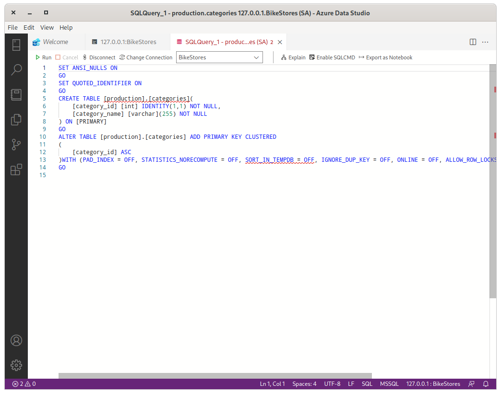

As in the previous post (mentioned at the beginning of this article), some minor changes will be required for MySQL.

### Using `sqlcmd`

For those not willing to use a GUI, it’s also possible to get the table’s definition using the command line.

Unfortunately, in SQL Server, `SHOW CREATE TABLE` does not exist. We will use a store procedure to get the info we are looking for: `sp_GetDDL`.

So let's download it:

```console
$ wget https://www.stormrage.com/SQLStuff/sp_GetDDL_Latest.txt
```
I added the following two lines at the top of the downloaded file before loading it to SQL Server:

```mysql
SET QUOTED_IDENTIFIER ON
GO
```
To load it, this is the command:

```console
$ sqlcmd -S localhost -U SA -P 'Passw0rd!' -i sp_GetDDL_Latest.txt
```
We can now connect interactively to SQL Server like this:

```console
$ sqlcmd -S localhost -U SA -P 'Passw0rd!' -d BikeStores
```
We call the new procedure using the `schema_name` and `table_name` of the tables we want to have in MySQL Database Service:

```mysql
1> :setvar SQLCMDMAXVARTYPEWIDTH 1024
2> exec sp_GetDDL 'production.categories'
3> go
```

The command will return something similar to this:

```mysql
IF OBJECT_ID('[production].[categories]') IS NOT NULL 
 DROP TABLE [production].[categories] 
 GO
 CREATE TABLE [production].[categories] ( 
 [category_id]    INT              IDENTITY(1,1)          NOT NULL,
 [category_name]  VARCHAR(255)                            NOT NULL,
 CONSTRAINT   [PK__categori__D54EE9B454313162]  PRIMARY KEY CLUSTERED    ([category_id] asc) )
```

For MySQL we rewrite the `CREATE` statement like this:

```mysql
CREATE TABLE categories (
  category_id INT UNSIGNED AUTO_INCREMENT NOT NULL PRIMARY KEY,
  category_name VARCHAR(255) NOT NULL )
```

And we do the same for all tables we want to import to MDS. You can use the Microsoft SQL Server Type Mapping to find the more suitable MySQL data type.

### Mounting Object Storage

We will use [s3fs-fuse](https://github.com/s3fs-fuse/s3fs-fuse) to mount OCI Object Storage Bucket, as explained in [this article](https://blogs.oracle.com/cloud-infrastructure/post/mounting-an-object-storage-bucket-as-file-system-on-oracle-linux), on our SQL Server and dump the tables in it.

We use [EPEL](https://docs.fedoraproject.org/en-US/epel/) to install the required package:

```console
$ sudo yum install -y s3fs-fuse
```

We create a bucket on OCI’s Dashboard:

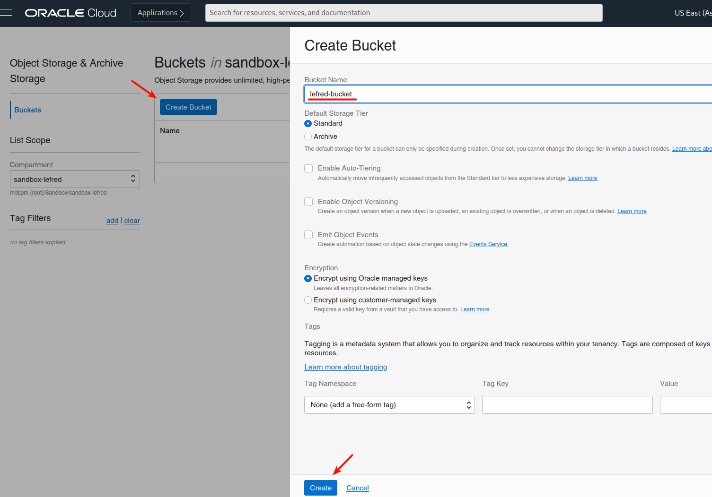

We need to create an `ACCESS_KEY_ID` and a `SECRET_ACCESS_KEY`:

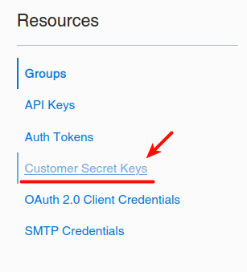
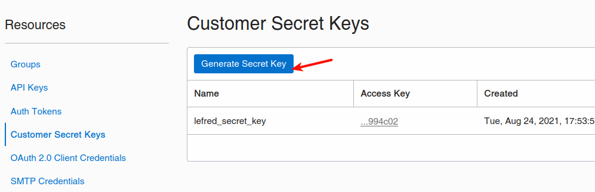

We copy these keys on one single line separated with a colon in a file, for example ~/.passwd-ocifs.

And we mount it like this:

```console
$ chmod 600 ~/.passwd-ocifs
$ mkdir /mnt/ocifs
$ s3fs lefred-bucket /mnt/ocifs -o endpoint=us-ashburn-1 \
> -o passwd_file=~/.passwd-ocifs \
> -o url=https://ixxxxxxxxxx.compat.objectstorage.us-ashburn-1.oraclecloud.com/ \
> -onomultipart -o use_path_request_style
```

Now we can write data directly to our Object Storage Bucket using /mnt/ocifs.

### Exporting Data

Everything is ready to export the content of the tables into CSV files:

```console
$ sqlcmd -S localhost -U SA -P 'Passw0rd!' -d BikeStores \
> -Q "set nocount on; select * from production.categories" \
> -o /mnt/ocifs/categories.csv -h-1 -s"," -w 700 -W
$ ls -lh /mnt/ocifs/
total 512
-rw-r--r--. 1 root root 147 Aug 24 21:28 categories.csv
```

We can directly see it in OCI’s Dashboard too:

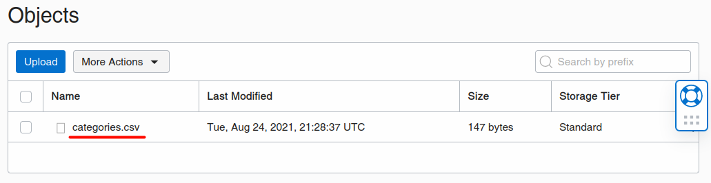

We do the exact same process for all the tables we want to import to MySQL Database Service.

You can of course also use the GUI to export to CSV and import those CVS files using MySQL Shell directly without using Object Storage:

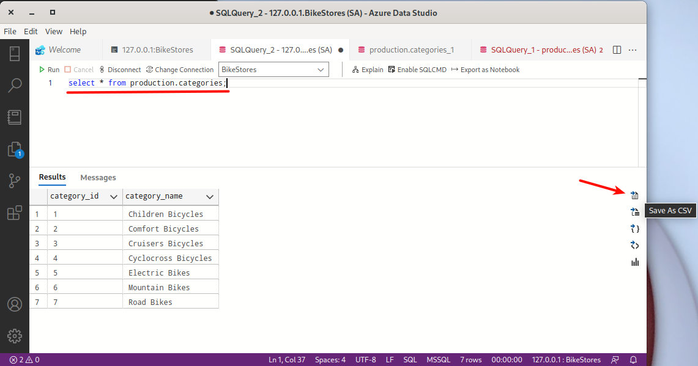

## Importing Data

As usual, we will use MySQL Shell to import in MDS the data that has been generated from MS SQL Server.

We start by creating the database and the tables if this is not yet done:

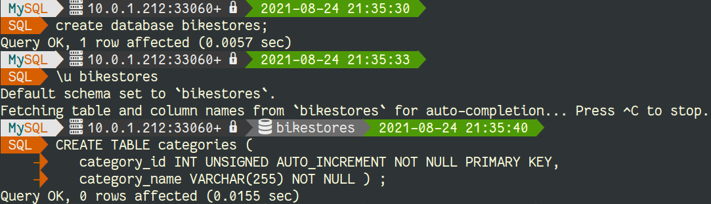

Don’t forget that if you need an OCI config file on the compute instance, you can create it from the OCI Dashboard for your user (Identity -> User -> User Details):

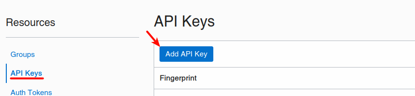

You'll need to download the keys if you generate them and then copy the content of the config in `~/.oci/config` and set the private key's location and filename:

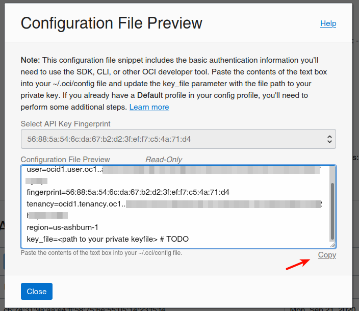

After that, you are ready to import each table using MySQL Shell:

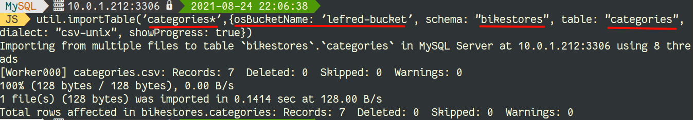

We can see that the data is now present in MySQL:

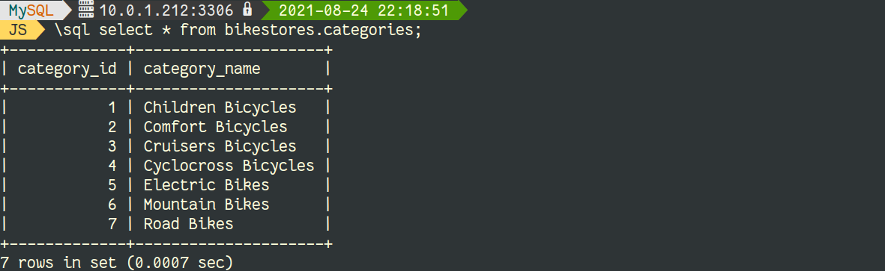

Repeat the same operation for each table you want to load into MySQL Database Service.

In case you have not used sqlcmd and Object Storage, but you preferred the use of the GUI to generate the CSV files, you can import them like this:

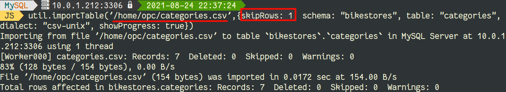

## Conclusion

Once again, the best solution to load data to MySQL Database Service is MySQL Shell.

Enjoy MySQL and MySQL Database Service!