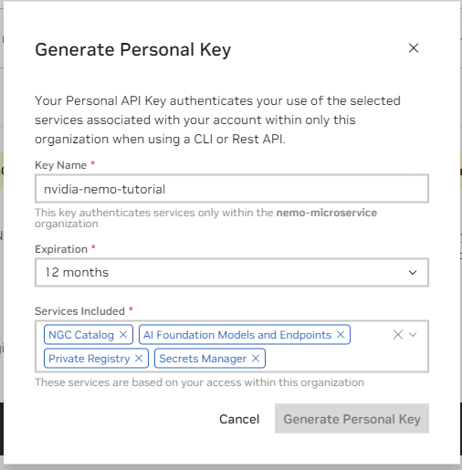
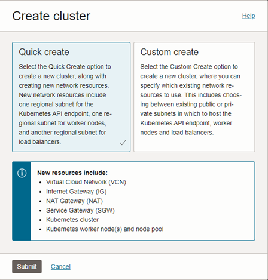
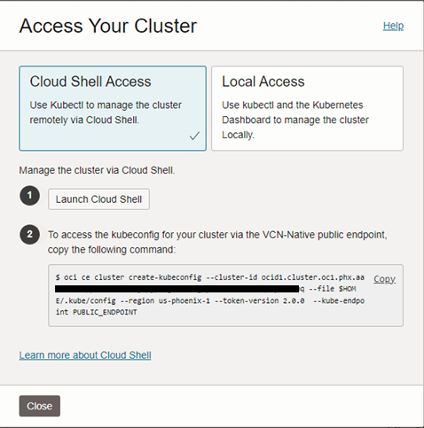

# Deploy NVIDIA NeMo microservices on Oracle Kubernetes Engine (OKE)

**Summary:** The following tutorial will take you through the requisite steps for deploying and configuring [NVIDIA NeMo Microservices](https://www.nvidia.com/en-us/ai-data-science/products/nemo/) on OCI. The deployment will use OKE (managed Kubernetes) and will utilize Oracle Database 23ai for both structured data and vector data store.

<u>Requirements</u>

* An [NVIDIA NGC account](https://org.ngc.nvidia.com/setup/personal-keys) where you can provision an API key.
* An Oracle Cloud Infrastructure (OCI) paid account with access to GPU shapes. NVIDIA A10 will be sufficient.
* General understanding of Python and Jupyter Notebooks

## Task 1: Collect and configure prerequisites

1. Generate an NGC API Key via the NVIDIA portal.

    

2. Log into your [Oracle Cloud](https://cloud.oracle.com) account.

3. Using the menu in the top left corner, navigate to **`Developer Services`** -> **`Kubernetes Clusters (OKE)`**

4. Click **`[Create cluster]`** and choose the **Quick create** option. Click **`[Submit]`**

    

5. Provide the following confniguration details for your cluster:

    * Name
    * Kubernetes Endpoint: Public endpoint
    * Node type: Managed
    * Kubernetes worker nodes: Private workers
    * Shape: VM. Standard.E3.Flex (or E4 | E5, depending on your available capacity)
    * Select the number of OCPUs: 2 or more
    * Node count: 1

    >Note: After the cluster is online, we'll provision a second node pool with GPU shapes. The *E#* flex shapes will be used for cluster operations and the Oracle Database 23ai deployment.

6. Click **`[Next]`**, validate the settings, then click **`[Create cluster]`**.

    >Note: The cluster creation process will take around 15 minutes.

7. Once the cluster is **Active** click the cluster name to view details. Use the navigation menu in the left pane to locate, then click **Node pools**

8. You should see **pool1** that was automatically provisioned with the cluster. Click **`[Add node pool]`**.

9. Provide the following configuration parameters:

    * Name
    * Node Placement Configuration:
        * Availability domain: select at least 1
        * Worker node subnet: select the *node* subnet
    * Node shape: An NVIDIA GPU shape. VM.GPU.A10.1 will work.
    * Node count: 3
    * Click **Specify a custom boot volume size and change the value to 250.
    * Click the very last **Show advanced options**, found just above the **`[Add]`** button. Under **Initialization script** choose **Paste Cloud-Init Script and enter the following:

    ```bash
    <copy>
    #!/bin/bash
    curl --fail -H "Authorization: Bearer Oracle" -L0 http://169.254.169.254/opc/v2/instance/metadata/oke_init_script | base64 --decode >/var/run/oke-init.sh
    bash /var/run/oke-init.sh
    bash /usr/libexec/oci-growfs -y
    systemctl restart kubelet.service
    </copy>
    ```

    >Note: This deployment requires 3 GPUs to function properly. You can either deploy 3 separate single-GPU nodes, or a single node with 4+ GPUs.

10. Click **`[Add]`** to create the new node pool.

11. While that is creating, return to the **Cluster details** page and click the **`[Access Cluster]`** at the top of the page.

12. In the dialog that opens, click the button to **`[Launch Cloud Shell]`**, then copy the command found in step 2. When Cloud Shell becomes available, paste and run the command.

    

13. The command you just executed will create your Kube config file. To test it, run the following: 

    ```bash
    <copy>
    kubectl cluster-info
    kubectl get nodes -o wide
    </copy>
    ```

    >Note: The GPU nodes may still be provisioning and might not show up just yet. The node name is its private IP address. 

14. Finally, on the Cluster details page, locate the **Add-ons** link and click it. Click **`[Manage add-ons]`** and enable the following:

    * Certificate Manager
    * Databaes Operator
    * Metrics Server

    >Note: Enable them on at a time by clicking the box, checking the **Enable** option, and saving the changes.


## Task 2: Install JupyterHub

1. Return to Cloud Shell. Create a new file called **jh-values.yaml** and paste the following:

    ```
    <copy>
    # default configuration
    singleuser:
    cloudMetadata:
        blockWithIptables: false
    # optional – if you want to spawn GPU-based user notebooks, remove the comment character from the following lines.
    #profileList:
    #  - display_name: "GPU Server"
    #    description: "Spawns a notebook server with access to a GPU"
    #    kubespawner_override:
    #      extra_resource_limits:
    #        nvidia.com/gpu: "1"
    </copy>
    ```

    >Note: In this tutorial we use Jupyter notebooks to interact with the GPU-driven NVIDIA microservices. You will not need to enable GPU-based user notebooks to complete the tasks herein.

2. Add the Helm repo.

    ```bash
    <copy>
    helm repo add jupyterhub https://hub.jupyter.org/helm-chart/ && helm repo update
    </copy>
    ```

3. Perform the install using Helm, and reference the values file created in step 1.

    ```bash
    <copy>
    helm upgrade --cleanup-on-fail –install jupyter-hub jupyterhub/jupyterhub --namespace k8s-jupyter --create-namespace --values jh-values.yaml
    </copy>
    ```

4. Once the deployment is complete, the Kubernetes service that gets created will provision an OCI Load Balancer for public access. Locate the public IP address of the load balancer and store it for later.

    ```bash
    <copy>
    kubectl get svc -n k8s-jupyter
    </copy>
    ```

    Output:
    ```bash
    NAMESPACE		NAME		    TYPE		    CLUSTER-IP	EXTERNAL-IP	    PORT(S)
    k8s-jupyter		proxy-public	LoadBalancer	10.96.177.9	129.213.1.77    80:30141/TCP
    ```

5. When you access the JupyterHub UI for the first time, you will be prompted for a username and password. Specify values of your choosing but make sure you safe them for future use. After logging in, you'll need to click the button to start the server. The startup process will take 5-7 minutes.

## Task 3: Deploy the Oracle Database 23ai pod

1. 


