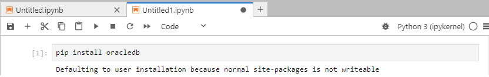

# Deploy NVIDIA NeMo microservices on Oracle Kubernetes Engine (OKE)

**Summary:** The following tutorial will take you through the requisite steps for deploying and configuring [NVIDIA NeMo Microservices](https://www.nvidia.com/en-us/ai-data-science/products/nemo/) on OCI. The deployment will use OKE (managed Kubernetes) and will utilize Oracle Database 23ai for both structured data and vector data store.

<u>Requirements</u>

* An [NVIDIA NGC account](https://org.ngc.nvidia.com/setup/personal-keys) where you can provision an API key.
* An Oracle Cloud Infrastructure (OCI) paid account with access to GPU shapes. NVIDIA A10 will be sufficient.
* General understanding of Python and Jupyter Notebooks

## Task 1: Collect and configure prerequisites

1. Generate an NGC API Key via the NVIDIA portal.

    

2. Log into your [Oracle Cloud](https://cloud.oracle.com) account.

3. Using the menu in the top left corner, navigate to **`Developer Services`** -> **`Kubernetes Clusters (OKE)`**

4. Click **`[Create cluster]`** and choose the **Quick create** option. Click **`[Submit]`**

    

5. Provide the following confniguration details for your cluster:

    * Name
    * Kubernetes Endpoint: Public endpoint
    * Node type: Managed
    * Kubernetes worker nodes: Private workers
    * Shape: VM. Standard.E3.Flex (or E4 | E5, depending on your available capacity)
    * Select the number of OCPUs: 2 or more
    * Node count: 1

    >Note: After the cluster is online, we'll provision a second node pool with GPU shapes. The *E#* flex shapes will be used for cluster operations and the Oracle Database 23ai deployment.

6. Click **`[Next]`**, validate the settings, then click **`[Create cluster]`**.

    >Note: The cluster creation process will take around 15 minutes.

7. Once the cluster is **Active** click the cluster name to view details. Use the navigation menu in the left pane to locate, then click **Node pools**

8. You should see **pool1** that was automatically provisioned with the cluster. Click **`[Add node pool]`**.

9. Provide the following configuration parameters:

    * Name
    * Node Placement Configuration:
        * Availability domain: select at least 1
        * Worker node subnet: select the *node* subnet
    * Node shape: An NVIDIA GPU shape. VM.GPU.A10.1 will work.
    * Node count: 3
    * Click **Specify a custom boot volume size and change the value to 250.
    * Click the very last **Show advanced options**, found just above the **`[Add]`** button. Under **Initialization script** choose **Paste Cloud-Init Script and enter the following:

    ```bash
    #!/bin/bash
    curl --fail -H "Authorization: Bearer Oracle" -L0 http://169.254.169.254/opc/v2/instance/metadata/oke_init_script | base64 --decode >/var/run/oke-init.sh
    bash /var/run/oke-init.sh
    bash /usr/libexec/oci-growfs -y
    systemctl restart kubelet.service
    ```

    >Note: This deployment requires 3 GPUs to function properly. You can either deploy 3 separate single-GPU nodes, or a single node with 4+ GPUs.

10. Click **`[Add]`** to create the new node pool.

11. While that is creating, return to the **Cluster details** page and click the **`[Access Cluster]`** at the top of the page.

12. In the dialog that opens, click the button to **`[Launch Cloud Shell]`**, then copy the command found in step 2. When Cloud Shell becomes available, paste and run the command.

    

13. The command you just executed will create your Kube config file. To test it, run the following: 

    ```bash
    kubectl cluster-info
    kubectl get nodes -o wide
    ```

    >Note: The GPU nodes may still be provisioning and might not show up just yet. The node name is its private IP address. 

14. Finally, on the Cluster details page, locate the **Add-ons** link and click it. Click **`[Manage add-ons]`** and enable the following:

    * Certificate Manager
    * Databaes Operator
    * Metrics Server

    >Note: Enable them on at a time by clicking the box, checking the **Enable** option, and saving the changes.


## Task 2: Install JupyterHub

1. Return to Cloud Shell. Create a new file called **jh-values.yaml** and paste the following:

    ```
    # default configuration
    singleuser:
    cloudMetadata:
        blockWithIptables: false
    # optional – if you want to spawn GPU-based user notebooks, remove the comment character from the following lines.
    #profileList:
    #  - display_name: "GPU Server"
    #    description: "Spawns a notebook server with access to a GPU"
    #    kubespawner_override:
    #      extra_resource_limits:
    #        nvidia.com/gpu: "1"
    ```

    >Note: In this tutorial we use Jupyter notebooks to interact with the GPU-driven NVIDIA microservices. You will not need to enable GPU-based user notebooks to complete the tasks herein.

2. Add the Helm repo.

    ```bash
    helm repo add jupyterhub https://hub.jupyter.org/helm-chart/ && helm repo update
    ```

3. Perform the install using Helm, and reference the values file created in step 1.

    ```bash
    helm upgrade --cleanup-on-fail –install jupyter-hub jupyterhub/jupyterhub --namespace k8s-jupyter --create-namespace --values jh-values.yaml
    ```

4. Once the deployment is complete, the Kubernetes service that gets created will provision an OCI Load Balancer for public access. Locate the public IP address of the load balancer and store it for later.

    ```bash
    kubectl get svc -n k8s-jupyter
    ```

    Output:
    ```bash
    NAMESPACE		NAME		    TYPE		    CLUSTER-IP	EXTERNAL-IP	    PORT(S)
    k8s-jupyter		proxy-public	LoadBalancer	10.96.177.9	129.213.1.77    80:30141/TCP
    ```

5. When you access the JupyterHub UI for the first time, you will be prompted for a username and password. Specify values of your choosing but make sure you safe them for future use. After logging in, you'll need to click the button to start the server. The startup process will take 5-7 minutes.

## Task 3: Deploy the Oracle Database 23ai pod

1. Before creating the database, you'll need to create role-based access control (RBAC) for the node. Create a file called **node-rbac.yaml** and paste the following:

    ```
    ---
    apiVersion: rbac.authorization.k8s.io/v1
    kind: ClusterRole
    metadata:
    name: oracle-database-operator-manager-role-node
    rules:
    - apiGroups:
    - ""
    resources:
    - nodes
    verbs:
    - list
    - watch
    ---
    apiVersion: rbac.authorization.k8s.io/v1
    kind: ClusterRoleBinding
    metadata:
    name: oracle-database-operator-manager-role-node-cluster-role-binding
    roleRef:
    apiGroup: rbac.authorization.k8s.io
    kind: ClusterRole
    name: oracle-database-operator-manager-role-node
    subjects:
    - kind: ServiceAccount
    name: default
    namespace: oracle-database-operator-system
    ---
    ```

2. Create a file called **db-admin-secret.yaml** that will be used to set the DB password upon deployment. Paste the follwing:

    ```
    apiVersion: v1
    kind: Secret
    metadata:
    name: freedb-admin-secret
    namespace: oracle23ai
    type: Opaque
    stringData:
    oracle_pwd:  YOURPASSWORDHERE
    ```

    >Note: Be sure to replace the **YOURPASSWORDHERE** above with a value of your own choosing. At least 15 characters, 2 upper case, 2 lower case, 2 numbers, and 2 special characters.

3. Create a file called **db23ai-instance.yaml** and paste the following:

    ```
    apiVersion: database.oracle.com/v1alpha1
    kind: SingleInstanceDatabase
    metadata:
    name: nemo-23ai
    namespace: oracle23ai
    spec:
    sid: FREE
    edition: free
    adminPassword:
        secretName: freedb-admin-secret

    image:
        pullFrom: container-registry.oracle.com/database/free:latest
        prebuiltDB: true

    persistence:
        size: 50Gi
        storageClass: "oci-bv"
        accessMode: "ReadWriteOnce"

    replicas: 1
    ---
    ```

4. Apply the manifests using the following command; this creates the RBAC, the password, and the DB pod.

    ```bash
    kubectl apply -n oracle23ai -f node-rbac.yaml,db-admin-secret.yaml,db23ai-instance.yaml
    ```

5. After the command completes, it may take 3-5 minutes for the DB instance to come online. You can check the status with the following command. Do not proceed until the status is **Healthy**

    ```bash
    kubectl get singleinstancedatabase -n oracle23ai
    ```

    Output:
    ```bash
    kubectl get singleinstancedatabase -n oracle23ai
    NAME        EDITION   STATUS    ROLE      VERSION        CONNECT STR              TCPS CONNECT STR   OEM EXPRESS URL
    nemo-23ai   Free      Healthy   PRIMARY   23.4.0.24.05   10.0.10.246:31452/FREE   Unavailable        Unavailable
    ```

    >Note: Be sure to write down the connection string for later. You'll need the IP address and port number.

6. Run the following command to gather details about the DB instance and set them to environment variables.

    ```bash
    export ORA_PASS=$(kubectl get secret/freedb-admin-secret -n oracle23ai -o jsonpath='{.data.oracle_pwd}' | base64 -d)
    export ORACLE_SID=$(kubectl get singleinstancedatabase -n oracle23ai -o 'jsonpath={.items[0].metadata.name}')
    export ORA_POD=$(kubectl get pods -n oracle23ai -o jsonpath='{.items[0].metadata.name}')
    export ORA_CONN=$(kubectl get singleinstancedatabase ${ORACLE_SID} -n oracle23ai -o "jsonpath={.status.connectString}")
    ```

    >Note: If you leave Cloud Shell and return later, you'll need to run the above commands again if you wish to connect to the DB instance directly. That said, after this section, all DB access should be done via Jupyter Notebooks.

7. Connect to the DB instance.

    ```bash
    kubectl exec -it pods/${ORA_POD} -n oracle23ai -- sqlplus sys/${ORA_PASS}@${ORACLE_SID} as sysdba
    ```

8. Create a vector DB user that will enable your Python code to access the vector data store.

    ```bash
    create user c##vector identified by <enter a password here>;
    grant create session, db_developer_role, unlimited tablespace to c##vector container=ALL;
    ```

    >Note: You will need to run these commands one at at a time. **Don't forget** to specify your own password in the first command. *<enter password here>* making sure to remove the <> brackets.

9. Type *exit* to leave the container. 

## Task 4: Prepare the NeMo deployment

1. Now to prep for the NeMo deployment. Create a new Kubernetes namespace.

    ```bash
    kubectl create ns embedding-nim
    ```

2.	Add your NGC API Key to an environment variable.

    ```
    export NGC_API_KEY=<your api key here>
    ```

    >Note: Paste your own API key in place of `<your api key here>`; remove the <> brackets and encapsulate within double quotes "".

3.	Confirm that your key gets you access to the NVCR container registry:

    ```
    echo "$NGC_API_KEY" | docker login nvcr.io --username '$oauthtoken' --password-stdin
    ```

    You should get Login Succeeded:

    ```bash
    echo "$NGC_API_KEY" | docker login nvcr.io --username '$oauthtoken' --password-stdin
    WARNING! Your password will be stored unencrypted in /home/username/.docker/config.json.
    Configure a credential helper to remove this warning. See
    https://docs.docker.com/engine/reference/commandline/login/#credentials-store

    Login Succeeded
    ```

    >Note: If you do not see the Login Succeeded message, you'll need to troubleshoot your API key on the NVIDIA website.

4.	Create a docker-registry secret in Kubernetes. The kubelet will use this secret to download the container images needed to run pods.

    ```
    kubectl -n embedding-nim create secret docker-registry registry-secret --docker-server=nvcr.io --docker-username='$oauthtoken' --docker-password=$NGC_API_KEY
    ```

5.	Create a secret for your NGC API KEY that will be passed to your pod via environment variable later.

    ```
    kubectl -n embedding-nim create secret generic ngc-api-key --from-literal=ngc-api-key=”$NGC_API_KEY”
    ```

6.	You can check the value with the following command.

    ```
    kubectl -n embedding-nim get secret/ngc-api-key -o jsonpath='{.data.ngc-api-key}' | base64 -d
    ```

7.	Next, you’ll create three separate files to deploy the NeMo retriever microservices.

    a.	**llama3-8b-instruct.yaml**

        ```
        <copy>
        apiVersion: v1
        kind: Pod
        metadata:
        name: nim-llama3-8b-instruct
        labels:
            name: nim-llama3-8b-instruct
            
        spec:
        containers:
        - name: nim-llama3-8b-instruct
            image: nvcr.io/nim/meta/llama3-8b-instruct:latest
            securityContext:
            privileged: true
            env:
            - name: NGC_API_KEY
                valueFrom:
                secretKeyRef:
                    name: ngc-api-key
                    key: ngc-api-key
            resources:
            limits:
                nvidia.com/gpu: 1
            imagePullPolicy: Always
        
        hostNetwork: true

        imagePullSecrets:
        - name: registry-secret
        </copy>
        ```

    b.	**nv-embedqa-e5-v5.yaml**

        ```
        <copy>
        apiVersion: v1
        kind: Pod
        metadata:
        name: nim-nv-embedqa-e5-v5
        labels:
            name: nim-nv-embedqa-e5-v5
            
        spec:
        containers:
        - name: nim-nv-embedqa-e5-v5
            image: nvcr.io/nim/nvidia/nv-embedqa-e5-v5:1.0.1
            securityContext:
            privileged: true
            env:
            - name: NGC_API_KEY
                valueFrom:
                secretKeyRef:
                    name: ngc-api-key
                    key: ngc-api-key
            resources:
            limits:
                nvidia.com/gpu: 1
            imagePullPolicy: Always
        
        hostNetwork: true

        imagePullSecrets:
        - name: registry-secret
        </copy>
        ```

    c.	**nv-rerankqa-mistral-4b-v3.yaml**

        ```
        <copy>
        apiVersion: v1
        kind: Pod
        metadata:
        name: nim-nv-ererankqa-mistral-4b-v3
        labels:
            name: nim-nv-ererankqa-mistral-4b-v3
            
        spec:
        containers:
        - name: nim-nv-ererankqa-mistral-4b-v3
            image: nvcr.io/nim/nvidia/nv-rerankqa-mistral-4b-v3:1.0.1
            securityContext:
            privileged: true
            env:
            - name: NGC_API_KEY
                valueFrom:
                secretKeyRef:
                    name: ngc-api-key
                    key: ngc-api-key
            resources:
            limits:
                nvidia.com/gpu: 1
            imagePullPolicy: Always
        
        hostNetwork: true

        imagePullSecrets:
        - name: registry-secret
        </copy>
        ```

8.	Apply the 3 manifest files to your Kubernetes cluster.

    ```bash
    kubectl -n embedding-nim apply -f llama3-8b-instruct.yaml,nv-embedqa-e5-v5.yaml,nv-rerankqa-mistral-4b-v3.yaml
    ```

9.	View the pods to ensure they are all running.

    ```bash
    kubectl -n embedding-nim get pods -o wide
    ```

    Output:

    ```bash
    NAME				            READY	STATUS	   RESTARTS	AGE	IP		    NODE
    nim-llama3-8b-instruct		    1/1	    Running	   0		3m	10.0.10.7	10.0.10.7
    nim-nv-embedqa-e5-v5		    1/1	    Running	   0		3m	10.0.10.11	10.0.10.11
    nim-nv-rerankqa-mistral-4b-v3	1/1	    Running	   0		3m	10.0.10.18	10.0.10.18
    ```


10.	Now that everything is up and running, you can return to your JupyterHub web page and launch a new notebook. If you need to double-check the IP address of your JupyterHub instance, run the following command:

    ```
    kubectl get svc -n k8s-jupyter
    ```

    >Note: make sure to access via HTTP and not HTTPS as we did not configure TLS in this exercise.

11.	Within the notebook, install the oracledb libraries:

    ```
    pip install oracledb
    ```

    

12. Test connectivity to the Oracle Database. Add a second entry into the notebook and paste the following:

    ```
    import oracledb
    #from dotenv import load_dotenv
    import os
    # Load environment variables
    #load_dotenv()
    username = "c##vector"
    password = "<your password here>"
    host="<your db pod IP here>"
    port="<your db port here>"
    service_name="FREE"
    dsn=host+":"+port+"/"+service_name
    #dsn = "10.0.0.124:1521/DB0601_nvz_fra.subnet04021055.vcn04021055.oraclevcn.com"
    #COMPARTMENT_OCID = "ocid1.compartment.oc1..aaaaaaaamveskuaejui5qx3ohucymgnbnfidzh5kqw4ued5uv5rhi3mif4ta"
    print("The database user name is:", username)
    print("Database connection information is:", dsn)
    # Connect to the database
    try:
        conn23c = oracledb.connect(user=username, password=password, dsn=dsn)
        print("Connection successful!")
    except oracledb.DatabaseError as e:
        error, = e.args
        print(f"Connection failed. Error code: {error.code}")
        print(f"Error message: {error.message}")
    ```

    >Note: Be sure to enter the password you created, along with the pod IP and port number from task 3 step 5.

13. Run the notebook task:

    ```
    The database user name is: c##vector
    Database connection information is: 10.0.10.246:31452/FREE
    Connection successful!

## Task 5: Working with sample reranking and embedding notebooks

1. 


