## Use Data Streaming on OCI to provide actionable public health information - Part One: Setting Up

In the arena of public health, there's a lot of "free data" available for us to consume, but getting to it and putting it all in one place so that it's meaningful can be a challenge. Sure, we have weather apps with air quality (if you can find it!), we have government data tracking things like COVID and flu rates, but can we triangulate these numbers in a way that will help someone who may be immune-compromised? Absolutely! It's just data, and we can take it and use it and then display it, just as with any data. This project will be a journey into such an idea -- using public health data and air quality measurements to provide possibly actionable information for people who might not be tech-savvy, and who might have pre-existing conditions that would be hazardous should case rates go up or air quality go down.

Of course, to do all this we'll be using Oracle Cloud Infrastructure (OCI) as our platform of choice. We'll look at where we can tap into data streams, how to pull what we need when we need it, how to put it into a database for transformation, and then how we might extend this with data from smartwatches, personal medical devices, or self-reporting mechanisms. We can then take the backend and plug it into a different front-end (we'll start with a simple web page) to further simplify the process for those who may lack the tech skills or possibly not even have access to a computer or smartphone.

Here's a brief overview of what we'll do in part one:

- Use a compartment with users and groups, and policies needed to connect to and display our data
- Create a compute instance with a way to connect to the web (and internal services like Oracle Functions)
- Create a stream pool with private access
- Use OCI Function and OCI Vault (one to transform our data, the other to negotiate access)
- Create an autonomous JSON database and import our data
- Connect to data streams and implement a handler to manage the data influx 
- Check that the data can be seen in table format

Believe it or not, this isn't difficult to set up. The building blocks will enable you to create all sorts of useful things using data streams and OCI, should you be so inspired. In this first part, we'll focus on weather data, and later add public health information like local flu and COVID numbers.

Later, we'll also build a simple web front-end to display these numbers in context.

## Prerequisites

- OCI Account (most of this should work on Free Tier, which you can [try out]({{ site.urls.always_free }})
- Tenancy admin access (because we'll be creating users and groups for our database needs later)
- A compartment in which you can create network resources and OCI Functions resources
- While we'll look at API's for data, you can BYOD of course if you have an existing preference (some allow a certain number of calls per day, thus you may already be paying for data and can use it -- whatever works best!)
- Some Python experience is helpful

## Part One: OCI Streaming and Cloud Services

### Step One: Setting up our dev environment

Let's go over the network connection, compute, and policies needed to accomplish our goals. We'll need an OCI compartment (to keep this project separate from others we may be working on). In that compartment we'll set up a VCN with a subnet, security list, route tables, and so on. We'll create policies and Dynamic Groups for this compartment. We'll also create a compute instance running OCI Linux so we can invoke the API, set up OCI Function and use the python SDK. Then we'll create a stream pool with private access (just for our app), establish a service connector, use OCI Function to transform the data, and use OCI Vault to negotiate secrets for the REST API. The data will be stored in an Autonomous JSON database (AJD). 

#### OCI Compartment, Networking resources, and policies

I've already created a "dbtests" compartment for my test project, but as an OCI tenancy admin you'll go to to Identity & Security on the OCI Console and Compartments. Click Create Compartment and fill out what you need. Note that tags are beyond this series, but are really useful! To learn more, [check out this article](https://medium.com/oracledevs/working-with-oci-tag-defaults-in-terraform-d07608564eaf) (it also discusses Terraform, another handy tool when you want to automate setup). We'll put all our "stuff" in this compartment, so when any "Create ..." tool comes up, make sure you're creating resources in the correct space. For more on compartments (especially in anticipation of using Oracle Functions later), [check out this doc on managing compartments](https://docs.oracle.com/en-us/iaas/Content/Identity/Tasks/managingcompartments.htm#To).

Once we have our compartment set up, we'll stand up a Compute instance.

#### Setting up the Linux VM

1. From the OCI Console: **Compute > Instances**

2. Click Create Instance:

    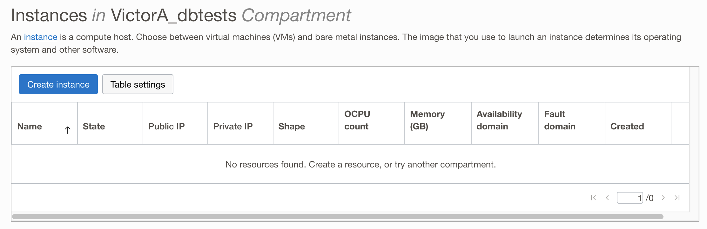

3. Let's get some computing power and an OS to steer it. Oracle provides an excellent flavor of Linux, which is the default image. Here I'm selecting an [availability domain](https://docs.oracle.com/en-us/iaas/Content/General/Concepts/regions.htm), and as you can see, I've chosen the dbtests compartment I created earlier.

    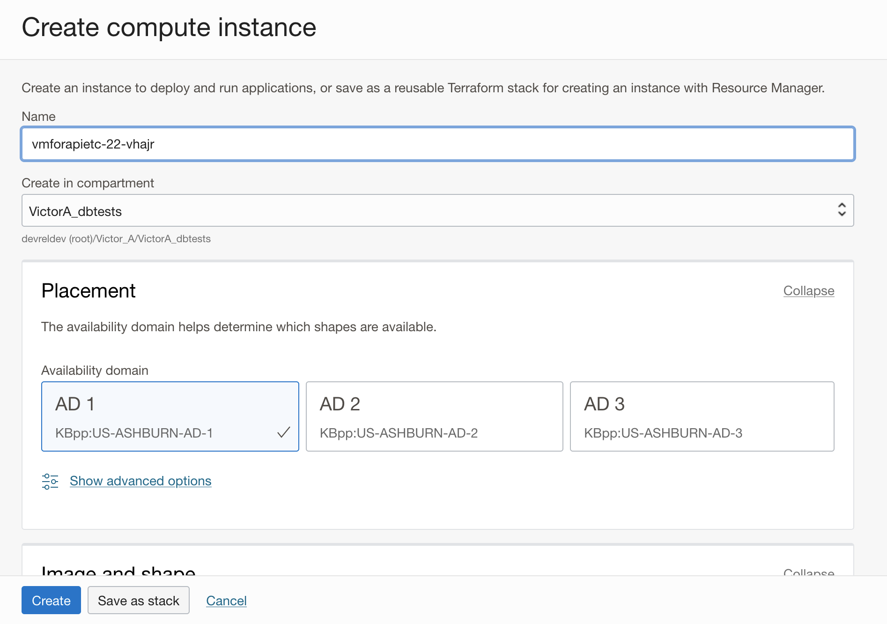

4. While there is a developer version of Oracle Linux, I'm choosing the "stock" version, but I'm changing our CPU (shape) to a Free Tier-compatible Ampere processor. 

    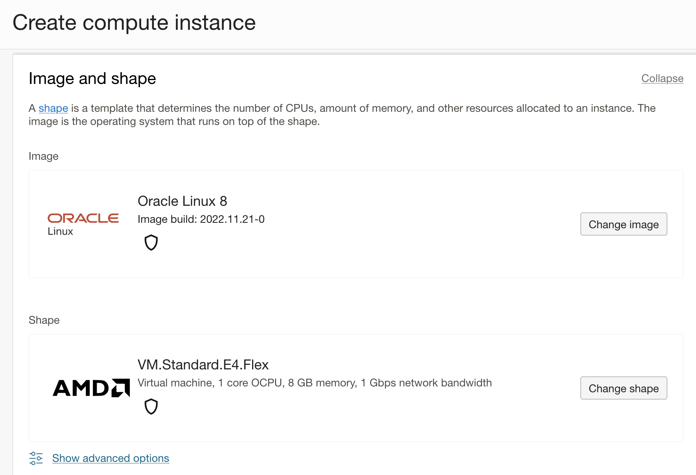

    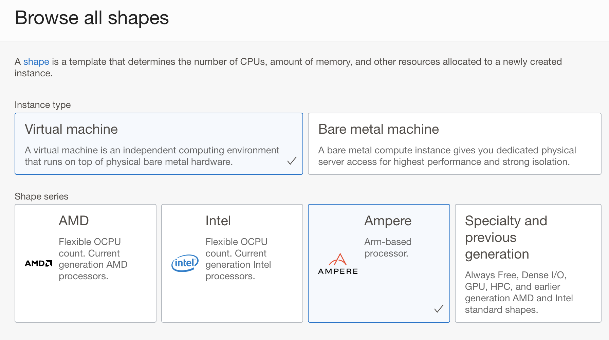

5. Some detail on my shape, which should be adequate for our testing needs:

    

6. Click select shape.

    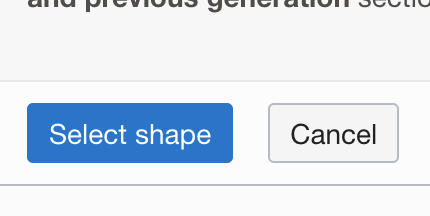

7. We'll use the VNC I set up using a wizard before. By default, we get one private IP and one public one, which is what we need to access Functions, import data, and display our results later. 

    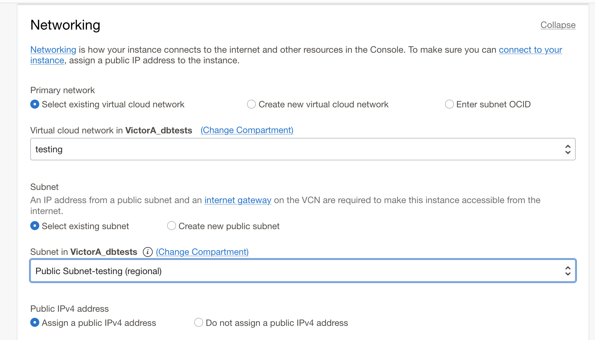

8. I'll also go ahead and generate SSH keys at this point and store them somewhere handy, as we'll use that to get into our compute instance and thrash around.

    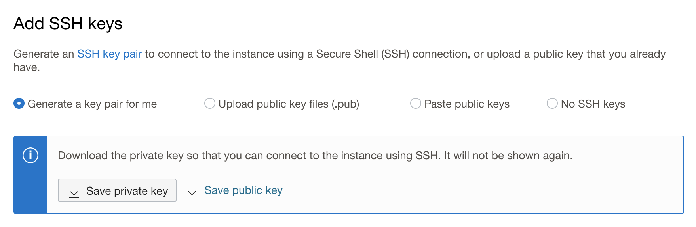

We're basically done for now, click to begin creation (it takes a minute or two), and note that you can save these configurations as stacks so you can easily deploy them later!

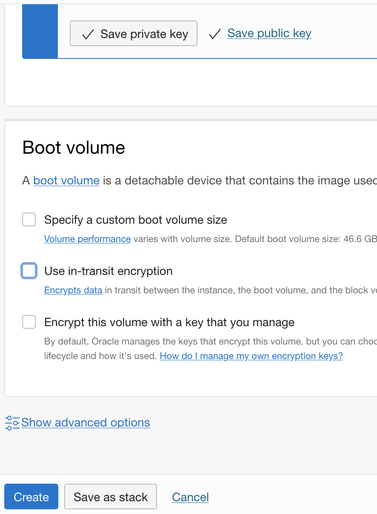


#### Stream Pool Policies

We're going to create a stream pool for when we pull in our weather data later, and have OCI manage that stream of data for us. To make sure everything can talk to everything else, we'll set some new policies. Again, compartments make this a lot easier as they logically delineate our policies (and other things), so we can have many applications or services with many different users given just the access they need.

I'm going to try and use the Console as much as possible to do these things, even though there are a number of ways to automate the process or drop into the command line. We'll do that later.

First we'll go back to Identity & Security, and go to Policies. We have a nifty Create Policy button, so click that.

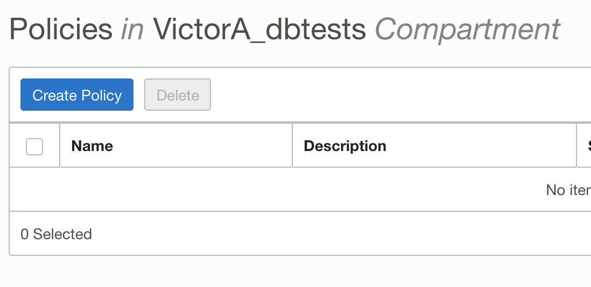

Here we can either use a sort of WYSIWYG tool, or input our policy statement directly. These are suprisingly easy to build, and ours is quite simple for this project.

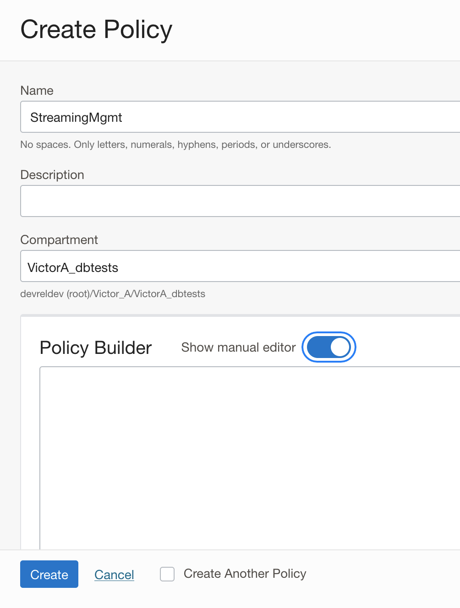

Policy:

```
Allow group StreamAdmins to manage stream-family in compartment [name]
```

As you can see, I've added my own compartment in there for specificity. 

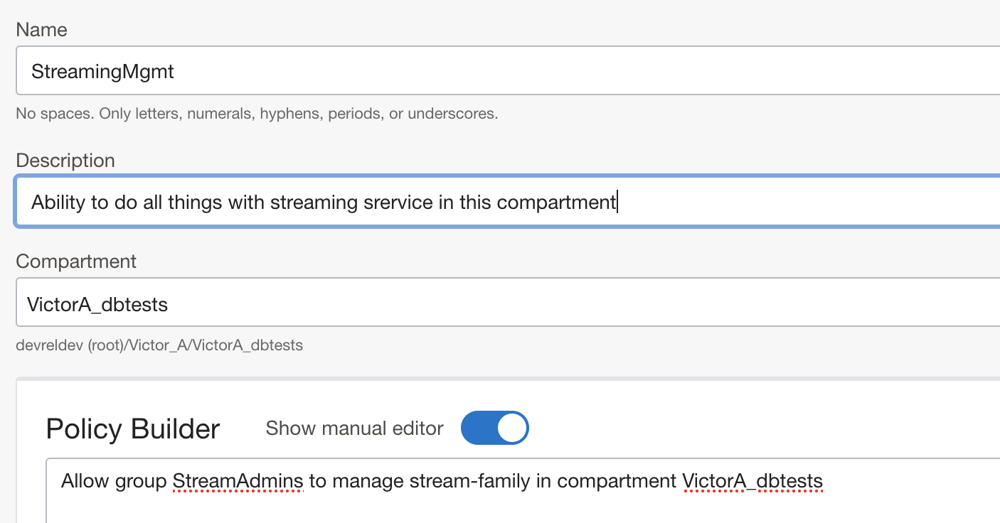

Finish the policy and you'll see a page with details! Now we're going to create a stream pool with the Console. 

### Step Two: Create a stream pool

1. In The OCI Console, go to Analytics & AI > Messaging > Streaming.

    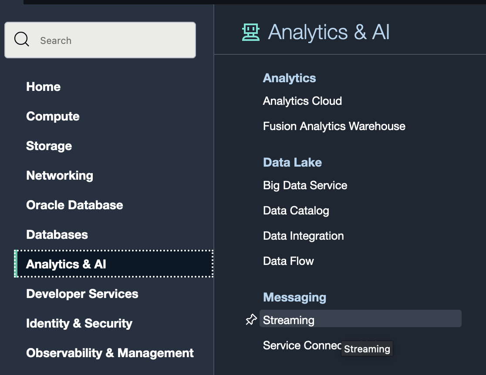
2. Now click on Stream Pools, as we'll create a pool with a public endpoint (as we'll need to grab external weather data, etc. later).

    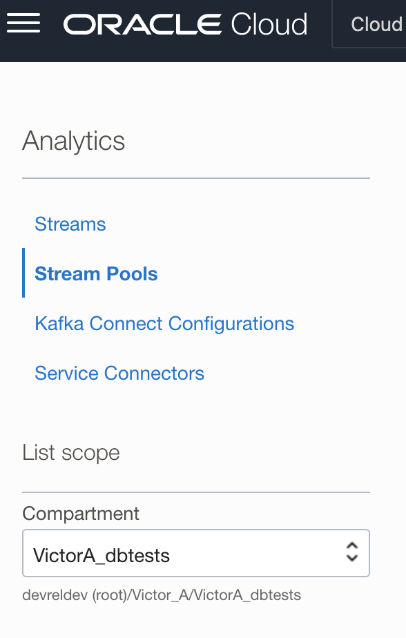
3. Click Create Stream Pool, and create a name, select the proper compartment.
    
    
4. In the Configure Stream Pool panel, you'll create a public endpoint and use Oracle-managed keys. Later, we'll use a Vault to manage access so our streams work reliably.

    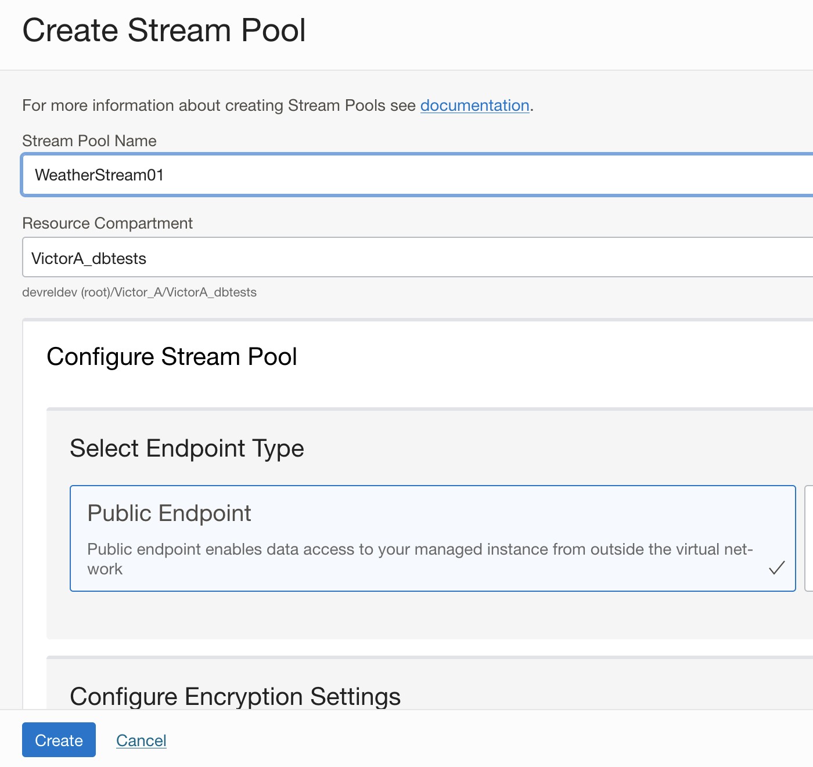

    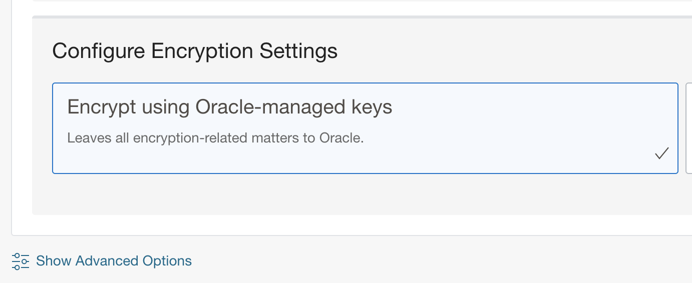 

    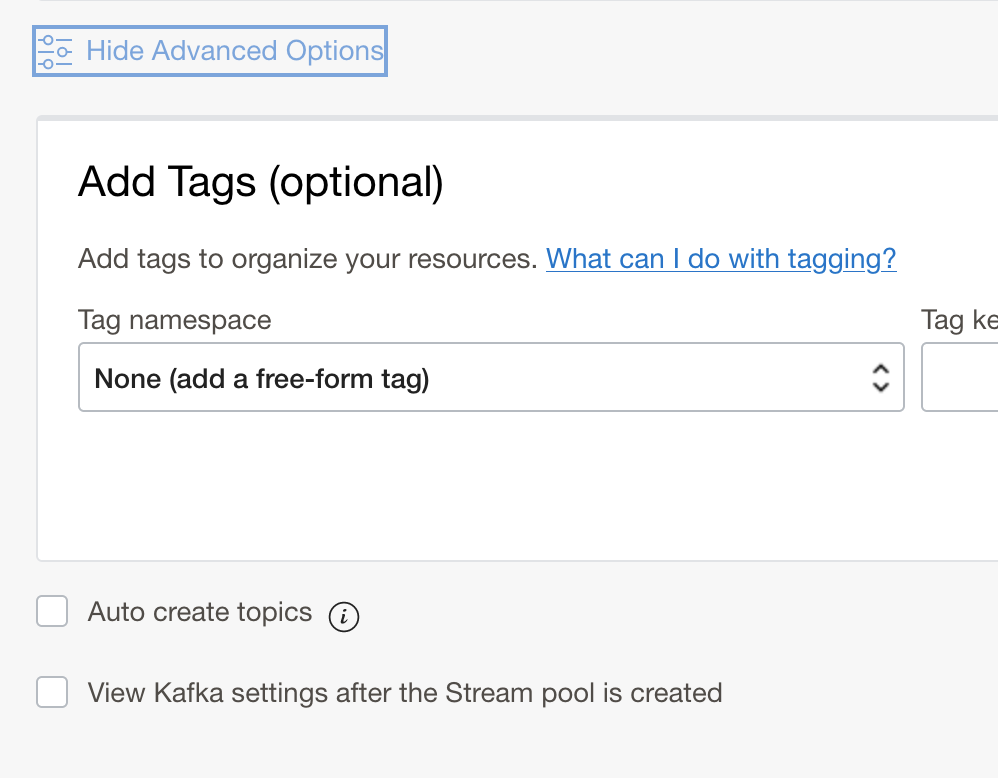

5. I'm also clicking Advanced Settings to access the checkbox for Kafka settings, which we'll configure later (note that Kafka is optional, OCI's own streaming tools would likely suffice for this project).
    
    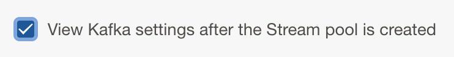

6. For now, we'll create a stream pool named weatherdata01, with a public endpoint.

    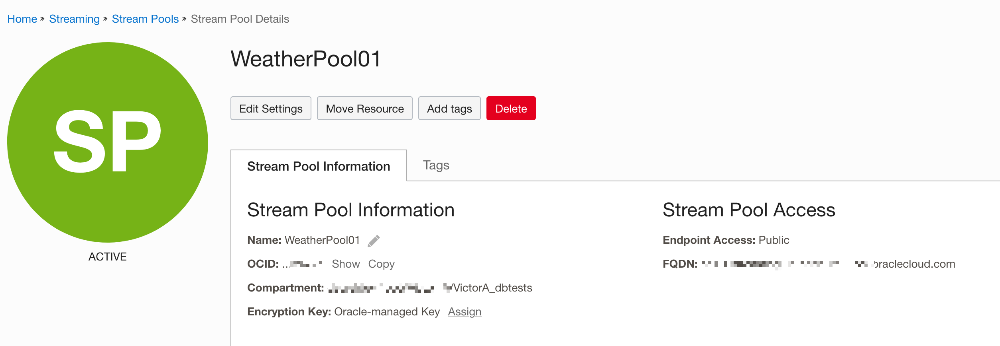

### Step Three: Finishing setup

Now we'll:

- Make sure our Linux VM's version python is up-to-date
- Look at weather API's we can use

#### Compute prep work

To interact with our VM, we'll use the Cloud Shell baked into the OCI Console. This will require our SSH keys from before. Once we've logged in, we'll perform a few checks and later we'll drop in some scripts to invoke the weather API.

For full documentation on using SSH to connect to a running instance, you can [follow along here](https://docs.oracle.com/en-us/iaas/Content/Compute/Tasks/accessinginstance.htm). 

I'll use that same info (like setting permissions for my private key to read-only), but use the Console's Cloud Shell to connect. We access cloud shell in the upper right corner:

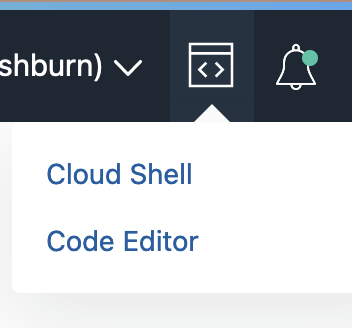

Once it starts up, you'll copy the IP address from your Linux instance (found in **Compute > Instances > Instance Details**) to log in. 
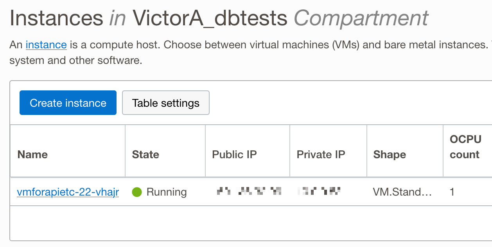

You can drop the read-only private key directly into the CLI from the Cloud Shell, then log in with:

```console
ssh opc@[yourinstanceIPhere] [public key]
```

For more on Cloud Shell, see the [Cloud Shell Docs](https://docs.oracle.com/en-us/iaas/Content/API/Concepts/cloudshellintro.htm).

Once you're logged into your instance, we'll just check python.

```console
python --version 
```

This should result in Python 3.x.x (those x's will be version iterations, of course).

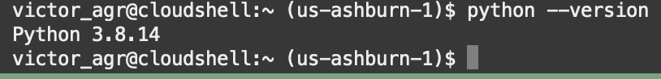

That's all for now, you can close the Cloud Shell and it'll save the private key for you to log in later (you'll only need the public key, of course).

#### The Weather API

There's a lot of data out there! And yes, there are lots of ways to get weather data. We won't dive too deeply into this, as there are so many considerations when choosing a data source. We chose [Weather API](https://www.weatherapi.com) because it's easy to use, cheap (as in free for our needs), and robust enough (supporting JSON, which we'll use for our database later).

To use it, you will need to sign up and get an API key. Once you do, you can easily play around with basic queries on [the API explorer page](https://www.weatherapi.com/api-explorer.aspx). It's actually quite fun, especially if you're a weather nerd like me.

Anyway, as you can see from [this code on GitHub](https://gist.github.com/somaece2006/d21df96ca2caaebc09dd3330d3d17a80#file-produce_weather_data-py), we're going to easily pull weather data using this API -- later we'll connect that feed to our stream pool and populate our database. 

```python
import requests
import sys
def produce_weather_data(city):
        url = "https://weatherapi-com.p.rapidapi.com/current.json"
        querystring = {"q":city}
        headers = {
        "X-RapidAPI-Key": "***********",
        "X-RapidAPI-Host": "weatherapi-com.p.rapidapi.com"
        }
        response = requests.request("GET", url, headers=headers, params=querystring)
        return(response.text)
```

If you're wanting to play around with this API before our next installment, do so! As you can see, Soma's code pulls based on city, and you can try it yourself to see what it returns as a response. 

## Conclusion

Our next steps will be to dive into Functions, creating a service connector and connecting it to a database that will allow us to store and retrieve weather data in a JSON database. We'll also connect to the stream on our VM, and pull our data into an autonomous JSON database. Then, we'll present that data on a simple web page. 

Later, we'll add COVID and flu data (in the USA that's provided by local health agencies and the CDC) to give a sort of "dashboard" for air *safety*. 

Once we have all our data sources pulled in, we'll be able to focus on how best to display this data so it makes sense to end users.

Many thanks to Soma Dey, whose [article on data stream processing](https://medium.com/oracledevs/data-stream-processing-in-oracle-cloud-an-introduction-59408bcb442) was the foundation of this first part of our journey. 

If you’re curious about the goings-on of Oracle Developers in their natural habitat, come [join us on our public Slack channel](https://bit.ly/odevrel_slack)!
