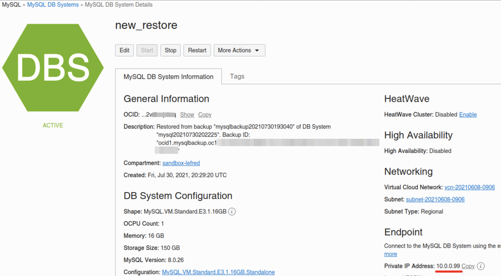
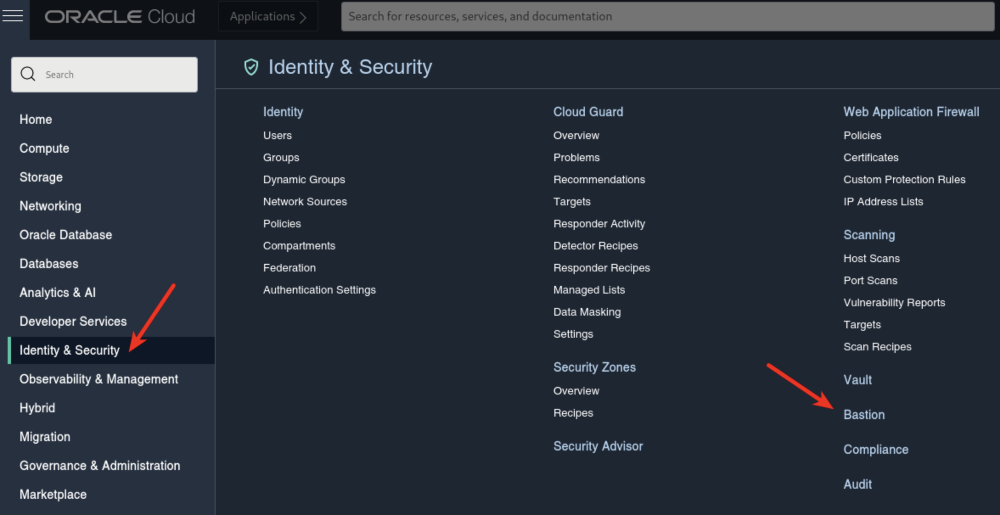
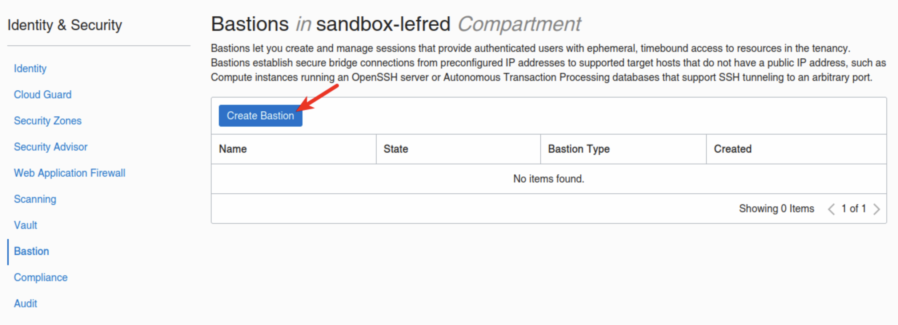
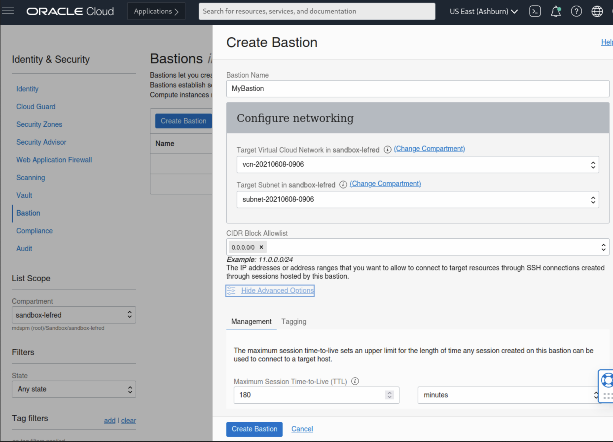
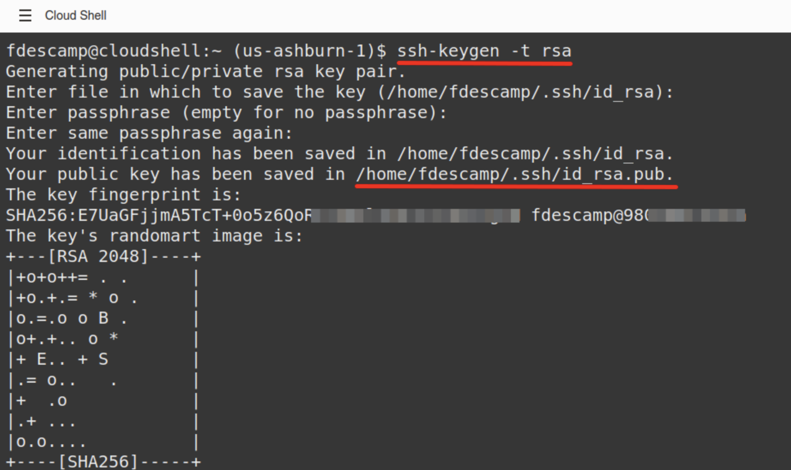
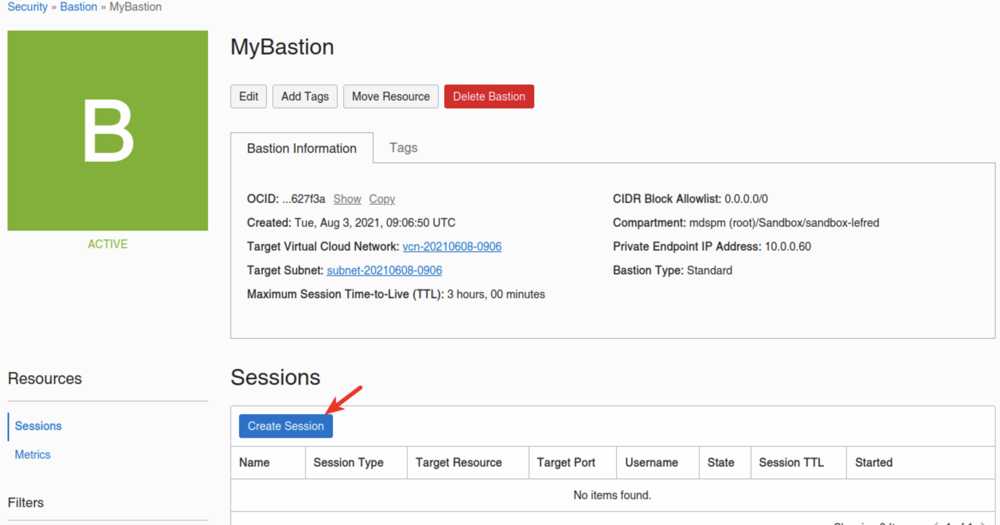
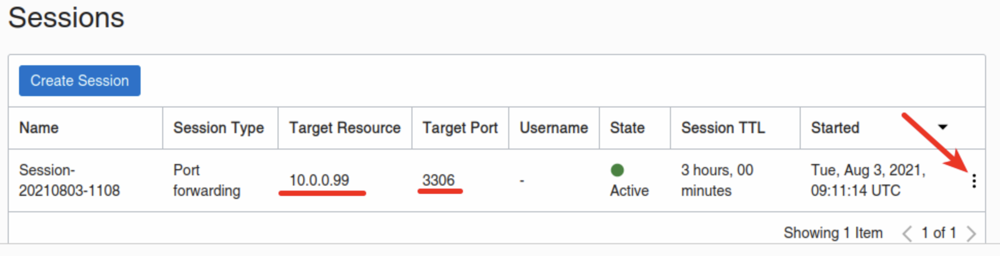
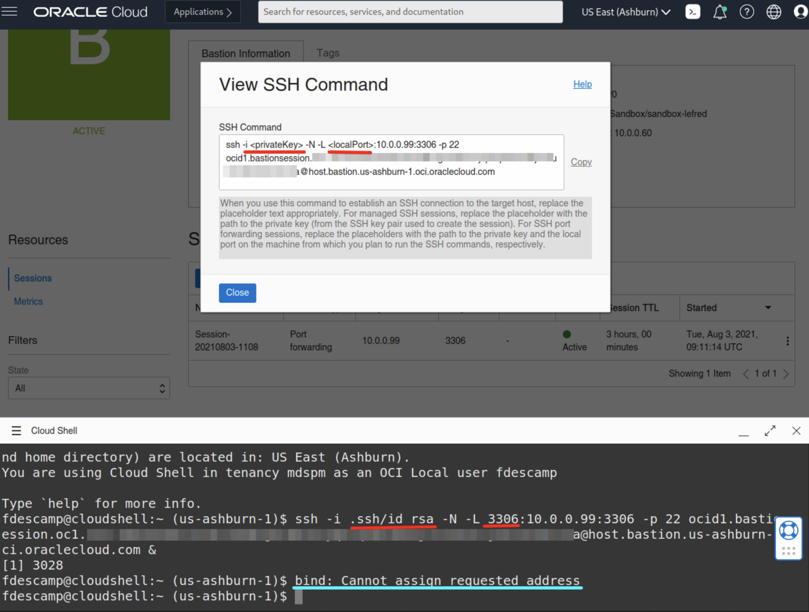

Recently, Oracle added a Bastion Service to OCI. And you may also have noticed that the OCI Dashboard offers you the possibility to use a browser based terminal: Cloud Shell.

Today, we will see how we can use these two components to connect from the browser to a MDS DB System.

We need the MySQL DB System’s IP:



So in this example, the MDS Instance we want to connect to has 10.0.0.99 as IP.

## Bastion Service

Now we will create a new Bastion Service that will allow us to create a SSH Tunnel to our MySQL DB System.

The Bastion Service’s dashboard is located in **Identity & Security**:



If this is the first time you create a Bastion, the list will be empty and you just need to create one:



We need to select the VCN, the subnet and a block of allow IPs. As I don’t know the IP of the Cloud Shell, I will use 0.0.0.0/0:



If you don't like to use 0.0.0.0/0, you need to add the public IP used by Cloud Shell with \32:

````
fdescamp@cloudshell:~ (us-ashburn-1)$ curl ifconfig.me
1XX.XXX.XXX.XXX
````

Now that the Bastion is created, I need to create ta session that will be used to create the SSH Tunnel to MDS.

But before creating the session, we will start the Cloud Shell and generate a SSH Key we will use for the tunnel’s session.

## Cloud Shell

To Start Cloud Shell, we just click on this icon on the top right corner of the OCI’s Dashboard:


This will open the Cloud Shell in the browser, the first time it takes some time to generate it.

In the Cloud Shell, we can now create the SSH Key we need using the following command:

````console
$ ssh-keygen -t rsa
````

This is how it looks like and as you can see the public key we need will be stored in `~/.ssh/id_rsa.pub`:



# Bastion Session

As we have now all we need to create the Bastion Session for the SSH Tunnel, we can go back to the Bastion we created earlier and create a new session:



We need to choose the **SSH port forwarding session** as Type, add the MySQL Database System’s IP and paste the SSH Public Key.

After the session is created (which took me a little over two hours), you will have something like this:



If you click on the 3 vertical dots, you can view or copy the ssh command we need to run in Cloud Shell:



`-i <privateKey>` is not really required as we only have one single key for the moment. Also, the error message “bind: Cannot assign requested address” is not a problem. This message only displays because because the Cloud Shell tries to bind on ipv6 too. If you want to avoid it, just add -4 between ssh and -i like this: 

```console
ssh -4 -i
```

Note the "&" at the end of the ssh command.

## Connecting to MDS

And finally, we can connect to MySQL Database Service’s instance from Cloud Shell simply using MySQL Shell:


As you can see it’s easy to connect from Cloud Shel once the Tunnel is ready.

Enjoy MySQL, MySQL Database Service and OCI!

For Dump & Load data to/from MDS , I recommend using a dedicated compute instance with multiple cores instead of Cloud Shell.
