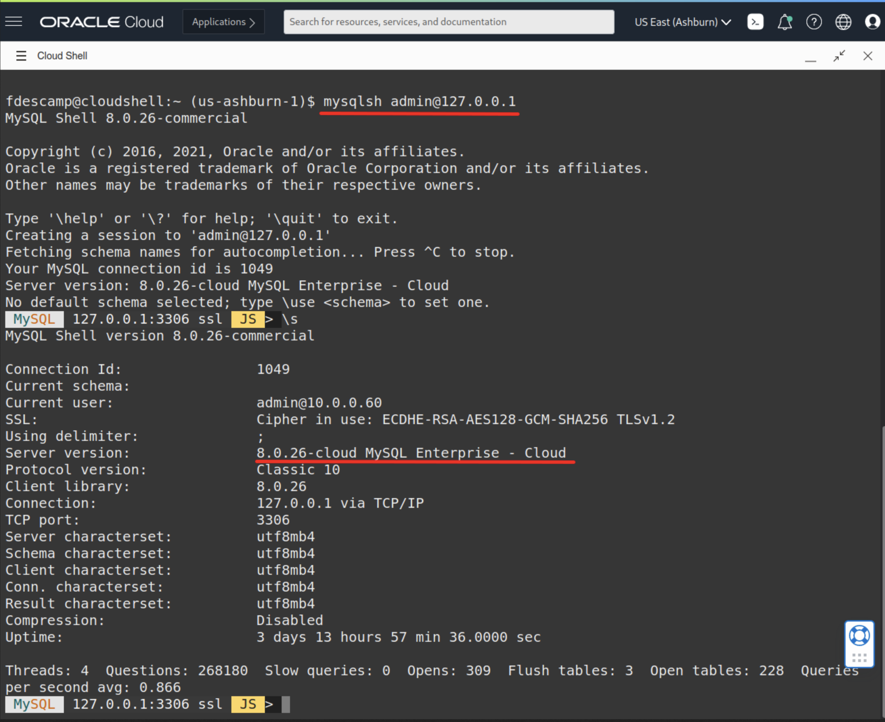

In 2021, Oracle added a Bastion Service to Oracle Cloud Infrastructure (OCI). Along with it, the OCI Dashboard now features the ability to use a browser-based terminal: Cloud Shell.  

Today, we'll show you how to use these two components to connect from a browser to a MDS DB System.  

Key topics covered in this tutorial:  

- Setting up a Bastion Service
- Starting a Cloud Shell
- Initiating a Bastion Session
- Connecting to MDS

Let's get started!

## Find the MySQL DBs IP address

First, we need the MySQL DB System’s IP:  


So, in this example, the MDS Instance we want to connect to has an IP of 10.0.0.99.

## Set up the Bastion Service

Next, we'll create a new Bastion Service that will allow us to create a SSH Tunnel to our MySQL DB System.

### Connect to the Bastion Service Dashboard

The Bastion Service’s dashboard is located in **Identity & Security**:


>**Note:** If this is the first time you create a Bastion, the list will be empty and you just need to create one:  
{:.notice}


### Set up the VCN

Now, we need to select the Virtual Cloud Network (VCN), the subnet, and a block of allowed IPs. Since we don't know the IP of the Cloud Shell, we'll just use `0.0.0.0/0`:  


>**Note:** If you don't like to use 0.0.0.0/0, you need to add the public IP used by Cloud Shell with \32:  
{:.notice}

```console
curl ifconfig.me
```

Sample output:  

```console
1XX.XXX.XXX.XXX
```

## Create a session

Now that the Bastion is created, we need to create a session that will be used to create the SSH Tunnel to MDS.  

But before creating the session, we'll start the Cloud Shell and generate a SSH Key we will use for the tunnel’s session.  We'll take a look at that in the next section.  

## Cloud Shell

To Start Cloud Shell, you just select the **shell** icon at the top right corner of the OCI Dashboard:  


>**Note:** This will open the Cloud Shell in the browser. It may take some time to open the first time.  
{:.notice}

### Create SSH key

In the Cloud Shell, we can now create the SSH Key we need using the following command:  

````console
ssh-keygen -t rsa
````

As you can see below, the public key we need will be stored in `~/.ssh/id_rsa.pub`:


## Bastion Session

Now that we have all we need to create the Bastion Session for the SSH Tunnel, we can go back to the Bastion we created earlier and create a new session:  


After you select **Creation Session**, you will need to do the following:  

- set the **SSH port forwarding session** as *Type*
- add the MySQL Database System’s IP
- paste in the SSH Public Key

Once the session is created (which may take upwards of two hours), you will have something that looks like this:


### Locate the ssh command

If you select the **kebob** icon (the 3 vertical dots), you can view or copy the ssh command we need to run in Cloud Shell:


>**Notes:**
>
>- **`-i <privateKey>`** is not really required since we only have one single key for the moment.
>- The error message **`bind: Cannot assign requested address`** is not a problem.  
>   This message only displays because because the Cloud Shell tries to bind on ipv6 too. If you want to avoid it, just add **`-4`** between ssh and **`-i`** like this:
>
>     ```console
>     ssh -4 -i
>     ```
>
>- Note the **`&`** at the end of the main ssh command.
{:.notice}

## Connecting to MDS

And finally, we can connect to MySQL Database Service’s instance from Cloud Shell simply by using the MySQL Shell:  



As you can see, it’s easy to connect from Cloud Shell once the Tunnel is ready!  

>**Recommendation:** To **Dump & Load data** to/from MDS, we recommend using a dedicated compute instance with multiple cores instead of Cloud Shell.
{:.notice}

## What's next

To explore more information about development with Oracle products:

- [Oracle Developers Portal](https://developer.oracle.com/)
- [Oracle Cloud Infrastructure](https://www.oracle.com/cloud/)
