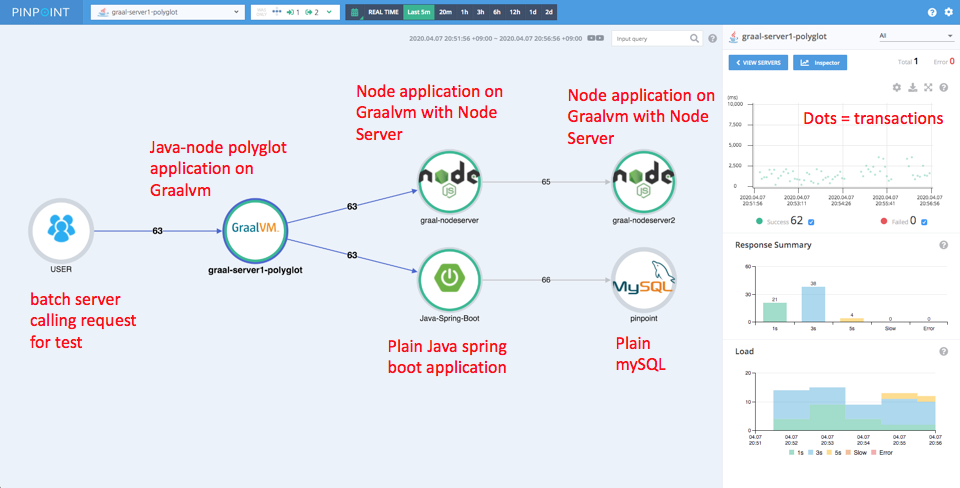
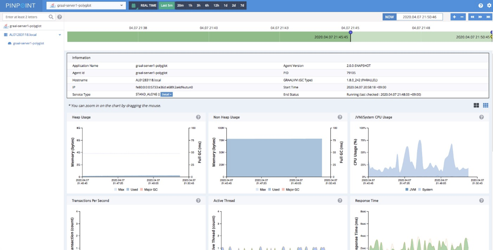

Pinpoint (developed by [Naver](https://www.navercorp.com/en), South Korea’s largest web search engine company) is an APM (Application Performance Management) solution used by many organizations around the globe and actively used internally by Naver, where **Pinpoint monitors over 10 billion transactions per day**. This allows tracing transactions and data flows between multiple software components and identifies problematic areas along with potential bottlenecks.

## Integration

The Pinpoint team developed a GraalVM agent using the [Truffle API](https://docs.oracle.com/en/graalvm/enterprise/21/docs/graalvm-as-a-platform/language-implementation-framework/). GraalVM provides a faster runtime for applications and access to Truffle APIs to get access to the platform for enhancing interoperability.

The integration between GraalVM and Pinpoint (visualized below) shows the auto-instrumentation of a polyglot application written in Java and Node.js with a MySQL database backend.

To start using PinPoint and GraalVM for your applications, clone the following project from GitHub: 

```` 
$ git clone https://github.com/RoySRose/pingraalPrerequisite GraalVM preinstalled.
````

### Create your first node

1. Create the instrument jar


    ````
    $ mvn clean install -DskipTests=true2. 
    ````

2. Run server.js

    ````
    $ node server.js3. 
    ````

3. Run first node.js file:

    ````
    $ ./simpletool node helloworld.js
    ````


After running these commands, you should be able to access the PinPoint dashboard.

## Results

The results are displayed in three steps:

1. The integration allows you to collect and visualize performance metrics of your application, such as heap/non-heap memory usage, CPU usage, active threads, response time, and others.

    

2. From the Callstack view you can dig deep into distributed call stacks of a particular transaction from multiple servers in one view:

    

3. The inspector collects the following information:
    - Heap/Non-Heap Usage
    - GraalVM/System CPU usage
    - Transactions per second
    - Active Threads
    - Response Time
    - Open File Descriptors
    - Direct/Mapped Buffer
    - Data source

    

## Summary

This collaboration was done thanks to the efforts of the GraalVM Labs Engineering team (led by Thomas Wuerthinger) and also Roy Kim from Naver Labs and his Pinpoint team. The integration between GraalVM and Pinpoint helps us to see and understand the need for Polyglot Application Observability.
