> Signals transmitted  
> Message received  
> Reaction making impact  
> Invisibly
> 
> --- Neil Peart, (1982) 

## Prologue

During the hot summer of 2018 (now it seems like aeons ago), the Oracle Innovation Team in Rome created a Smart City model - named Proxima City made of Lego Bricks, Arduinos connected to sensors and a bunch of Raspberry Pi to demonstrate the capabilities of Oracle Cloud Infrastructure.

We based the use cases design upon the things we dreamed about every day: dispose the garbage in a proper, responsible manner, get the latest and greatest news about what was functioning (and not functioning) in the city, book a parking slot in the best location available for our working day route, 'login' to the city infrastructure as a student, as a professional or as a casual tourist admiring the stunning architectures and monuments of the past (we happen, here in Italy, to stumble upon ancient artifacts we can't immediately recognize).


The dialog with the smart city was implemented through a number of channels: Chatbots, Mobile apps and classical web-oriented retrieval of useful information to make our life (a little bit) easier when living and breathing in a hyperdense urban chaos like the Eternal City. Eventually, it was a success: conferences, speeches, fairs (even some mentions and prizes) and a focus on OCI capabilities.

Having an open design, the physical model was replicated dozens of times worldwide (including Redwood Shores!), and each instance had subtle but substantial differences to the original structure, showing how an idea can be expanded and improved by interconnecting worldwide teams and adapt the model to the needs of a particular city/country.

### From Smart to Safe

Then, Covid-19 begun to hit our lives. The Smart City concept morphed into something different: as a citizen I'd be less interested in knowing that the subway or my bus ride has a 4.2 minutes delay compared to the original schedule, and possibly be mindful in determining if I *can* take advantage of different urban services in a *safe* fashion, extending the safety protocols to closed environments (offices, university rooms, workplaces). And, matter of fact, this is the idea we'll be facing here, trying to build a lab as a tool to design safety-related use cases.

*Mutatis Mutandis*, we'll modify the original patterns and configurations exposed with **Proxima City** to allow a Smart City Lab become a Safe City Lab, hence the name ProximaSafe. We'll explore a number of technologies involved in different areas - with Oracle Cloud Infrastructure at the core - to build a tiny lab that can be exploited to implement any new idea in something substantial. 

## Data

- __Edge data__, produced by microcontrollers-sensors and gateways, the atomic units of information representing state and values in a single, memorable point in time
- __Data in motion__, or fast data - seen as streams of certified information directed to points of first analysis and aggregation, useful to detect anomalies or state change before reaching any destination appointed to data-wrangling activities
- __Data at rest__, seen as data residing in a structured or semi-structured repository ready for full-blown analytics and phenomena discovery

Let's get rid of the generic and overrated "Data is the new oil" catchphrase for a moment, we just need to mention the types of data - and their velocity - that a model can efficiently process in each of the stages involved in building a development lab:

In this context, we're going to elaborate and deepen the setup of distinct environments to reach our goal: conceive and design practical use cases related to safety procedures and protocols by continuously producing information from the edge, continuously analyze the streams of information sourced by the edge to detect anomalies and - then - store data in a repository suitable for Business Intelligence and data operations.

The logical representation of the data flow could be depicted (L to R) as the following:

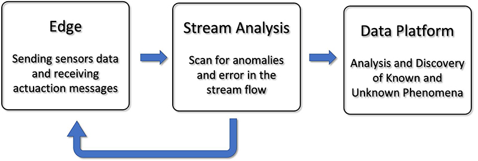

Yes, that looks a lot like the three-staged diagram we used to build Proxima City. What's new then? We'll introduce a feedback route at the Stream Analysis level, where the errors or anomalies detection capabilities can be leveraged to send return messages to the edge and eventually activate some actuators - in a lab, that could result in the activation of a 'red flag' in a corridor, or messages displayed in a smart badge and a wearable device. What can we do with OCI and what's the relationship with microdevices present on the edge (i.e. in our lab)? The overall schema can be seen in this diagram:

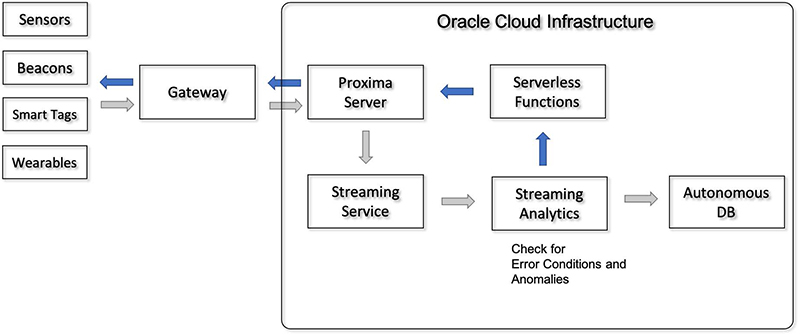

where, on the left, the edge data from sensors are sent to a local Raspberry Pi running an MQTT server such as Mosquitto (our Gateway), who happily converses with its Mosquitto Cloud twin (Proxima Server). Then, sensors data are sent to the Streaming section and analyzed. The dark arrows path is the road back to the edge where errors are reported to execute local actions (issue warnings, trigger actuators, show alarms and other types of signalling to subscriber devices such as smart badges, alarm panels, etc.).

"Why Mosquitto? Why MQTT?" I hear you say. Well, it's open source, it's easy, it's fun. Maybe not enough for industrial-strength implementations, but surely beloved by techies, geeks, tweakers and tinkerers (you know who you are), with a pinch of 'designed to be debugged' flavor, so certainly suitable for the construction of a testbed oriented to developers.


## Environments

We need environments reflecting the considerations described above: perhaps the simplest way is to build three different enviroments, with different scopes and different orientations: 

- The **Edge** enviroment containing sensors and gateway. All the sensors and actuators are connected to a RPi (MQTT Edge Gateway) bridged to an OCI instance (ProximaSafe server) which includes the cloud MQTT counterpart.
- The **Data in Motion** enviroment where the events sent by the Edge are received by the cloud MQTT running in the SAFEserver OCI Compute instance and relayed in OCI Streaming. An instance of Golden Gate Stream Analytics connected to the OCI Streaming topic is analyzing the messages and, via published pipeline analysis, filters the messages and performs anomalies detection in the Edge. Both alarms and filtered messages are conveyed to the subsequent subsystem.
- A **Data at Rest** environment responsible for BI and Reporting activities and - more generally - to enable medium and long term analytics-related tasks.

So, we can think about the subsystems layout as the following:


The Edge side of the lab is going to be (mostly) built with some M5stack components, based on the ESP32 architecture, programmed in 'Arduino mode' (old fashioned but effective C/C++) instead of microPython. Being a vintage old boy baby boomer, it was quite easy to start with the antiques No problemo, there'll be other parts built with Python, so bear with me. The Raspberry Pi is in charge to host a Mosquitto server, so everything is miniaturized and portable, ready to be seamlessy lift-and-shifted from site A to site B (during lockdown, a mere two-steps walk spanning the opposite corners of my room).


We'll explore and detail this configuration later in the next chapters. 

## Scope and Chapters

The entire setup will be divided in three chapters (there is a strong possibility that this story will become too long to be contained in a single article), each one with a specific focus:

- **Chapter 1** (well, you're reading it right now): setting up, connect and test the Oracle Cloud Infrastructure services needed to listen to events from the Edge, and successfully handle the stream of data to detect an anomaly.
- **Chapter 2:** bridge the Edge environment to OCI cloud services, so that communication is bidirectional.
- **Chapter 3:** unleash creativity and tinker with Edge components to build up a number of basic use cases.

It's definitely time to focus on the OCI services, so let's do it.

## Map of the Activities

Here's a minimalistic map of the activies for this first episode. 

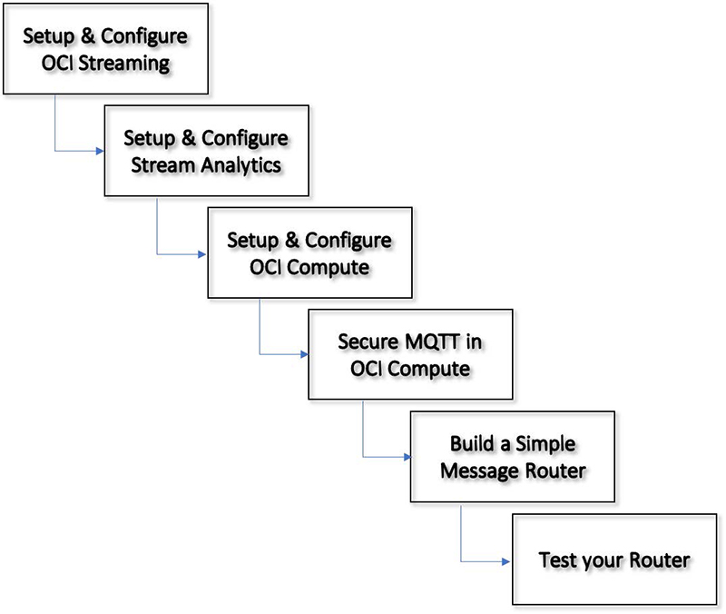

## Building the Stream Analysis Subsystem in OCI

We're going to build the streaming middle-section of our microlab with two elements:

1. The [OCI Streaming Service](https://docs.oracle.com/en-us/iaas/Content/Streaming/Concepts/streamingoverview.htm?source=:ex:of:::::RC_WWMK210721P00049:Medium) allows the creation of a stream within Oracle Cloud Infrastructure, the managed service that guarantees and provides a flexible option to handle the messages injected from our miniaturized edge.
2. An OCI Marketplace instance of [Golden Gate Stream Analytics](https://docs.oracle.com/en/middleware/fusion-middleware/osa/19.1/understanding/overview-oracle-streaming-analytics.html#GUID-E1AC004F-697F-4A94-8D96-9438263FE3F2?source=:ex:of:::::RC_WWMK210721P00049:Medium), which will be our best friend in intercepting streamed messages and applying patterns (and some logic) to identify anomalies.

These two components can be interconnected easily within OCI and (yes) outside OCI boundaries, so we'll start setting up the Streaming component.

### Provision and configure the OCI Streaming Component

On the Main OCI page, scroll the left menu (hamburger menu) until the Solutions and Platform group, click on Streaming and you'll be presented with the Streams summary page, where you can start the creation/configuration of your Stream by pushing that suspicious blue button:


Configuration is easy: select a name, your OCI compartment, the reference Stream Pool (if you haven't created one, OCI will create it for you and allows you to configure it):

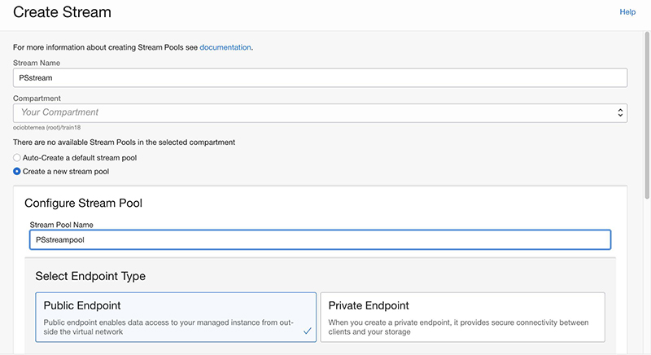


The creation process is a breeze. Let's test it by producing a test message - the button is located in the Home » Streaming » Stream Details page and consuming it in the Recent Message pane:


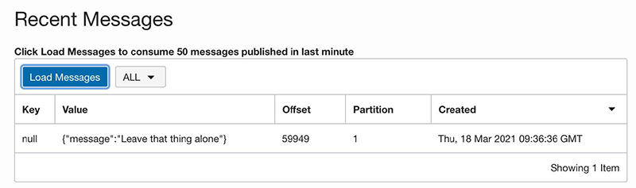

Now that the stream is actually working, let's jump to the subsequent step - the creation of the Stream Analytics component.

### Provision and configure the Golden Gate Stream Analytics Component

Stream Analytics will be the stream processing center of gravity for all messages sent from sensors and/or development boards. In fact, we could consider it as the event driven engine of our portable lab. Being placed in the Cloud, we can avoid the burden of management and operations and be laser-focused on the development of analysis pipelines.

The Stream Analytics underlying clustered architecture is based on Spark Streaming and its configuration and programming relies on a Designer UI that will allow us to produce the continuous query pipelines needed to detect if something's wrong on the edge side. This package contains some little gems already configured and ready to use:

- Oracle Stream Analytics
- Oracle GoldenGate for Big Data
- Apache Kafka
- Apache Spark
- Apache Ignite
- Oracle Java
- Oracle MySQL Enterprise Edition

The **OCI Marketplace** is the go-to site that encompasses guides, tutorials and a short video that shows a step-by-step guide to deploy an active instance of Golden Gate Stream Analytics within OCI in few minutes! Summarizing the steps included in the [video](https://developer.oracle.com/proximasafe/chapter-1/?ytid=GAE18Eir4C0&source=:ex:of:::::RC_WWMK210721P00049:Medium), we are going to:

- Get the Application (push on the **Get App** green button)    
- Select the OCI destination region (have your OCI credentials and compartment ready!)
- Sign in to OCI specifying your cloud tenant and your credentials

You'll be led to a page in which you can specify the version - pick up the STANDARD one and you'll be entitled to use it freely for 30 days, and specify the destination OCI [compartment](https://docs.oracle.com/en-us/iaas/Content/Identity/Tasks/managingcompartments.htm?source=:ex:of:::::RC_WWMK210721P00049:Medium). The Greyed-out button Launch Stack will become active, and by clicking it you are officially - and transparently - using the [OCI Resource Manager](https://docs.oracle.com/en-us/iaas/Content/ResourceManager/Concepts/resourcemanager.htm?source=:ex:of:::::RC_WWMK210721P00049:Medium), the OCI cloud service that wraps [Terraform](https://www.terraform.io/?source=:ex:of:::::RC_WWMK210721P00049:Medium) and makes your life easier to automate creation / deletion of OCI resources.

#### Network considerations

During the configuration you'll be asked to detail the desired network configuration: normally it's a good practice to create your own network infrastructure in advance to have a designed granular access to the resources. For this purpose, though, we'll keep it simple as we won't provide Resource Manager with the information to create a VCN and let it create a Virtual Cloud Network (public) to keep things rolling seamlessly. The network created will be used also by the OCI Compute instance taking care of getting messages from the Edge and routing them to OCI artifacts.

#### Instance details

We need to choose an Availability Domain, a Compute shape (4, 8, or 16 CPU - 4 would be enough for our project), let OCI assign a Public IP to access the Designer and Admin Console from our comfortable couch, and insert the SSH public key (we'll need to SSH to the instance to retrieve the administration password). Review all parameters in the appropriate summary page and hit Create - this will trigger a job creation within Resource Manager which will provision the complete package (about 3/4 minutes).

Once the instance has been created, let's open a Secure Shell to the instance via the assigned Public IP seen in the Compute Instance page:**

```bash
$ ssh -i <Your Private Key>pc@<Public IP>
Last login: never (ever)
-bash: warning: setlocale: LC_CTYPE: cannot change locale (UTF-8): No such
file or directory
$ ls
README.txt
```

and fetch the **osaadmin** password to enter the console 

```bash
$ cat README.txt | grep -n 'osaadmin'
16:Your osaadmin password to login to OSA UI is <YourPassword>
```

which can be used to access our istance. The link `https://<Public IP>/osa/login.html` should greet us with the welcome page, accessible with user osaadmin and the password grabbed as previously indicated. 


### Source Connection Configuration

Okey-dokey, let's connect Stream Analytics with the (OCI Streaming) stream we created previously. We just go the Catalog tab from the Home Page and select from the Create New Item combo the Connection item: 


And fill this form with the name of the Connection, a fancy description, a tag (I suggest to use tags thoroughly, that'll save you some time) selecting the Connection type as Kafka. Then, quickly move to the connection details where we need to provide some info - that you can grab from the Stream Pool Details in the OCI Streaming console (Home » Streaming » Stream Pools » Stream Pools Details - and on the bottom-left pane named Resources select the Kafka Connection Settings link).

You've got to produce an Authorization Token - easy to do, go here for a hint, as you can see: 

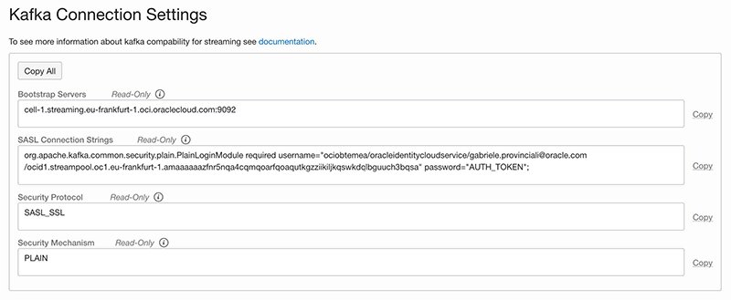

We'll note (and copy) all the parameters needed to fill the **Connection Details** page form, selecting our Authentication Token as the password for your username and test the connection:

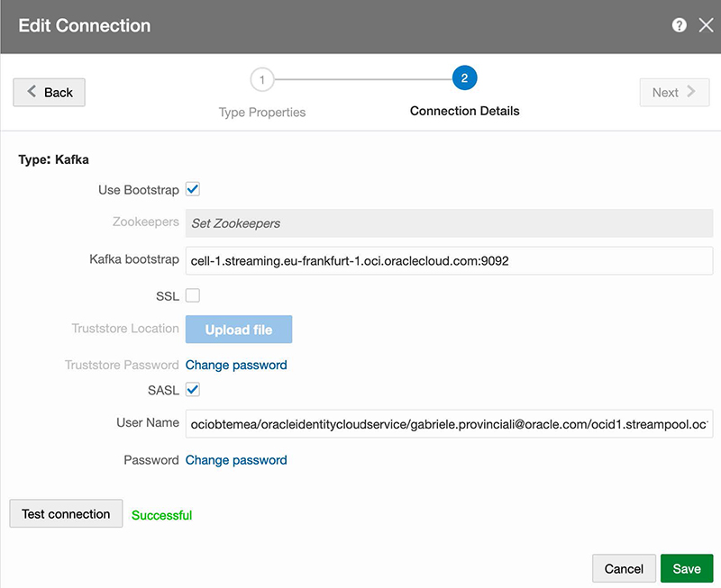

and hey presto!, we've just joined the core components of this stream analysis lab.

Within Golden Gate Stream Analytics, in addition to the Connection we just created, we need to set up an object (strangely) called Stream. Hitting the now famous Green Button Create New Item in the Catalog tab, we can select the Stream item 

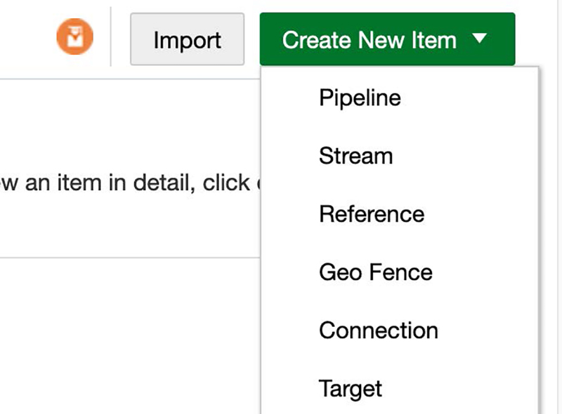

and proceed, in sequence, to fill the following forms, specifying:

- the type of Stream (Kafka)


- the connection, the Stream previously configured (PStream)


- whether Golden Gate Stream Analytics should be lenient about missing columns name


And, finally, the shape of the messages. Note that there's a variety of ways to specify or determine the shape, ranging from Infer Shape to Manual configuration. I'll explain, later in this article, the data format used for this setup

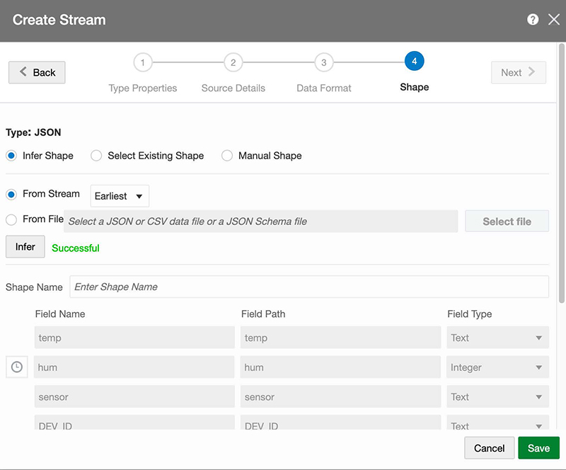

As much as I'd like to explain the simplicity and the intuitiveness in creating an analysis pipeline in Golden Gate Stream Analytics, it isn't time yet. We still need to setup more components, but the time will come. Now, let's setup an OCI compute instance to host the Cloud-side MQTT server and develop a piece of software (in Python, at last!) that will wisely route the messages from MQTT to a Stream.

#### Create the OCI Compute Instance

The creation of an OCI Compute Instance is intuitive and straightforward, but in case you're like me (poor ability to keep notions in an organic cache) you'll find a crib here.

What you would do is to select an appropriate shape: minimal I'd say - at this stage, as we don't expect critical traffic volumes. Furthermore, we're headed to miniaturization of a personal lab! Here are some suggestions:

- Select the Autonomous Linux Developer Image, it'll save you time and keystrokes, as most of the needed packages are included.
- Reuse the Network Infrastructure already set up by Golden Gate Stream Analytics (VCN & subnets): although it's not ideal, it'll be useful for this simple configuration.
- Create it as a Stack and execute the Stack with Resource Manager. OCI Resource Manager (Terraform) is your friend, with a nice bonus for me (i.e. remembering what I've done later).

Don't forget to take some security aspects into consideration:

- Configure the Oracle Linux instance firewall accordingly (the MQTT port must be alive, kicking and talking to something/somebody else)
- Setup a Security List and the relating security rule to control the exposure of the MQTT port to the edge.


Then, let's proceed to prepare the environment for subsequent steps like:

- Install the OCI Command Line Interface with `oci setup config`. That will be handy to access OCI resources from the Matrix command line terminal.
- Setup **venv** with `python3.6 -m py36env`. Yes, we'll use some Python here.
- Insert source py36env/bin/activate in a test script and wherever you feel appropriate
- Install the [Extra Packages for Enterprise Linux (EPEL)](https://fedoraproject.org/wiki/EPEL?source=:ex:of:::::RC_WWMK210721P00049:Medium)): `sudo yum install -y oracle-epel-release-el7`

#### Install, configure & test the MQTT Broker**

As said, we'll use Mosquitto as the MQTT broker in OCI with sudo yum install mosquitto, and add some configuration, like

1. Create a password file (not really effective for the overall security posture, but I'd add credentials anyway) `: mosquitto_passwd -c <YourUsername> <YourPassword>.`
2. Move the file to the right directory: `sudo mv passwordfile /etc/mosquitto`.
3. Edit the default Mosquitto configuration found in /etc/mosquitto/mosquitto.conf in order to identify and change the default port. 
    
    If the service is likely to be exposed to the wild internet, leaving the default settings to 1883 would be a no-no, maybe, and add username & password previously set in the appropriate sections.
4. Restart Mosquitto: `sudo systemcl restart mosquitto`.
    
    Test mosquitto with mosquitto clients, such as `mosquitto_sub` and `mosquitto_pub`.
     
    In a Matrix Terminal session, subscribe to all topics with `mosquitto_sub -h 127.0.0.1 -p -t '#' -u <YourUsername> - <YourPassword>`.
5. In another Matrix Terminal session, publish a message with:
`mosquitto_pub -h 127.0.0.1 -p <port>-t 'Test' -u <YourUsername> -P <YourPassword> -m '{"Name":"Jack Torrance"}'`.
6. If all is well, you should see the message on the subscriber's terminal session: in such a case, grab a coffee or a nice cup of tea, as we're going secure our MQTT Server first, and then installling the OCI SDK and examples for Python.

#### Secure the MQTT Server running on OCI Compute

There's a number of guides and tutorials, on the Web, about configuring and using the MQTT TLS security, either via [Let's Encrypt](https://letsencrypt.org/?source=:ex:of:::::RC_WWMK210721P00049:Medium) or just creating your own CA, Server Keys and certificates. What I did here is follow the shortest path (creating my own stuff), but feel free to follow your creativity and developer flair. 

**Note: when entering the country, organization and other info donʼt use the same exact information for the CA and the Server Certificate as you might encounter problems.**

1. Generate a CA key
    1. openssl genrsa -des3 -out ca.key 4096 and choose a password, in my case password1,
    2. openssl req -new -x509 -days 2112 -key ca.key -out ca.crt
2. Generate a server key
    - openssl genrsa -des3 -out server.key 4096 and choose another password, in my case password2
3. Generate a Certificate Signing Request
    - openssl req -new -key server.key -out server.csr
4. Sign the Certificate Signing Request
    - openssl x509 -req -days 365 -in server.csr -CA ca.crt -CAkey ca.key -set_serial 01 -out server.crt
5. Verify that every bit is ok
    
    ```sh
    $ openssl rsa -noout -text -in server.key
    $ openssl req -noout -text -in server.csr
    $ openssl rsa -noout -text -in ca.key
    $ openssl rsa -noout -text -in ca.key
    ```

6. Make a version of the server key that doesn't need the password
    
    ```
    openssl rsa -in server.key -out server.key.insecure
    mv server.key server.key.secure
    mv server.key.insecure server.key
    ```

7. Edit the file /usr/lib/python3.6/site-packages/certifi/cacert.pem adding the ca.crt file content (PEM public Key)

Be sure to put (and mantain!) the appropriate files in a certs directory under /etc/mosquitto and have this directory saved where you want to perform some tests, like: 

```sh
$ mosquitto_pub -t 'edge/device/machines' -h <IP
Address of OCI compute> -u <username> -P <password> -p <your port> --
insecure --cafile certs/ca.crt --cert certs/server.crt --key
certs/server.key -m '{"Developers Developers Developers Developers!"}'
```

We won't configure bridging (the dialog between Edge Mosquitto and Cloud Mosquitto) for now, that will be done in the second part of our prolix boomer babbling.

#### Get the OCI SDK for Python and Install Libraries

Well, it's time to perform some moves on the chessboard. Clone the git repository from GitHub:

```sh
git clone https://github.com/oracle/oci-python-sdk.git
```

This repository contains a wealth of source code and examples, and is regularly updated to reflect the evolution of OCI APIs. Then,

1. Install the Python SDK:  `pip install oci`
2. Install the Paho Library: `pip install paho-mqtt`

and we're ready to write and execute a little python module that will grab sensors messages from the Cloud-side Mosquitto and route the messages to OCI streaming, which in turn will be the source connection for Golden Gate Stream Analytics. To do that, we'll grab the example named stream_example.py and taylor it to our needs. The module is available here (NOTE: insert the GitHub link, open in a new window/tab).

Here are some snippets.

Import the `paho` library enabling the subscription to MQTT topics managed by the Cloud-side Mosquitto.

```python
# imports
import paho.mqtt.client as mqtt
import time
import oci
import sys
import ssl
from base64 import b64encode, b64decode`
```

Make sure that all the necessary arguments are set before executing this python module:

```python
# Check Args
if len(sys.argv) < 6:
 print('Usage : ' + sys.argv[0] + " " +
"oci_config oci_compartment_name oci_stream_name mqtt_hostname mqtt_port " + 
"[mqtt_username] [mqtt_password] [cert_dir] ")
 exit (0)
oci_config_file = sys.argv[1]
oci_compartment_name = sys.argv[2]
oci_stream_name = sys.argv[3]
mqtt_hostname = sys.argv[4]
mqtt_port = int (sys.argv[5])
mqtt_username = (sys.argv[6])
mqtt_password = (sys.argv[7])
cert_dir = (sys.argv[8])
if len(sys.argv) > 6:
 mqtt_username = sys.argv[6]
if len(sys.argv) > 7:
 mqtt_password = sys.argv[7]
if len(sys.argv) > 8:
 cert_dir = sys.argv[8]`
```

and subscribe to relevant topics:

```python
mqttc.connect(mqtt_hostname, mqtt_port)
mqttc.subscribe("edge/device/#", 0)
mqttc.subscribe("cloud/device/#", 0)
```

We'll leave it as it is for now, keeping in mind that with an additional (small) effort it could be easily transformed in a container image and possibly a microservice within OKE (the mighty Kubernetes Engine within Oracle Cloud Infrastructure).

#### Testing your router with mock sensor's data

Before being ready to accept data from the edge, let's describe a simplistic data format in JSON which we'll use to program the M5 microcontrollers later: we'll use to test the end-to-end flow issuing a command from our own Matrix terminal (I still love the green-on-black, VT100-like, steampunk-oriented shell) seeing if it's been accepted by the stream analysis module. We'll inspire to what the Innovation Team has already made in Proxima City, plus the geo-coordinates:

```json
{
 "DEV_ID":"Colosseum",
 "sensor":"Environmental",
 "PROGR":1,
 "TSTAMP":12345678,
 "temp":20,
 "hum":45,
 "Lat":41.89024902749216, 
 "Lon":12.49195874712777,
"STATUS":"Safety sensor inside Colosseum, in Rome."
}
```

Let's execute the mqtt2oci Python code on the Compute instance that runs mosquitto:

```sh
source /home/opc/scripts/py36env/bin/activate
export OCI_COMPARTMENT=<My Compartment Name>
export OCI_STREAM_NAME=PSstream
export MQTT_HOSTNAME=<My HostName
export MQTT_PORT=<The port exposed>
export MQTT_USERNAME=<Username>
export MQTT_PASSWORD=<Password>
export CERTIFICATES="/home/opc/mqtt/certs"
python -u mqtt2streaming.py ~/.oci/config $OCI_COMPARTMENT
$OCI_STREAM_NAME $MQTT_HOSTNAME $MQTT_PORT $MQTT_USERNAME $MQTT_PASSWORD
$CERTIFICATES
```

and open a couple of Matrix shells (yes!) to send and trace the message:

1. **Listen** to messages on any topic
    
    ```
    mosquitto_sub -d -t '#' -h <your host> -u <username> -P <password> -p
<port> --insecure --cafile certs/ca.crt --cert certs/server.crt --key
certs/server.key
    ```

2. **Fire** the message

    ```
    mosquitto_pub -t 'edge/device/machines' -h <your host> -u <username> -P
<password> -p <port> --insecure --cafile certs/ca.crt --cert
certs/server.crt --key certs/server.key -m
'{"DEV_ID":"Colosseum","sensor":"Environmental","PROGR":1,"TSTAMP":1234567
8,"temp":20,"hum":45,"Lon":12.491958,"Lat":41.890249,"STATUS":"Safety
sensor inside Colosseum, Rome."}'
    ```

If all is good, the results on the **Listen** shell should be:

```sh
log buffer Received PUBLISH (d0, q0, r0, m0), 'edge/device/machines', ... 
(175 bytes)
message edge/device/machines 0
{"DEV_ID":"Colosseum","sensor":"Environmental","PROGR":1,"TSTAMP":12345678
,"temp":20,"hum":45,"Lon":12.491958,"Lat":41.890249,"STATUS":"Safety
sensor inside Colosseum, Rome."}
Publishing message to the stream ocid1.stream.oc1.eu-frankfurt
1.amaaaaaazfnr5nqatjglweu6qgzgrtnippcge3tjrunpzrgvkqc7en375ipq 
Published message to partition 0 , offset 31420`
```

indicating that the message has been correctly routed to OCI Streaming, which can be verified on the OCI Streaming web console by retrieving messages in the last 60 seconds:

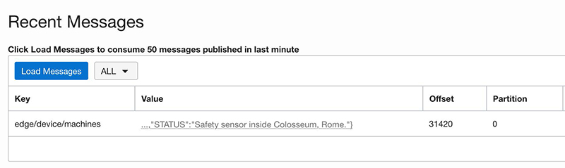

and, ultimately, check the correct reception on the Stream Analytics designer console by positioning your cursor and clicking on the first node:

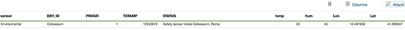

## Next Episode: from Edge to Serverless

We have just touched a number of things here, but the best is yet to come! In the next episode we're going to explore the following topics:

- **Selecting** the functionalities to be assigned to the edge components
- **Installing, Configuring and Bridging** the local MQTT Server in the Raspberry Pi
- **Develop and Deploy** a serverless function to send alarms to the edge available as an API

See you on the next chapter. Zip and Zest!
