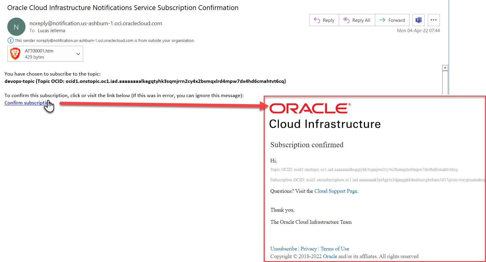
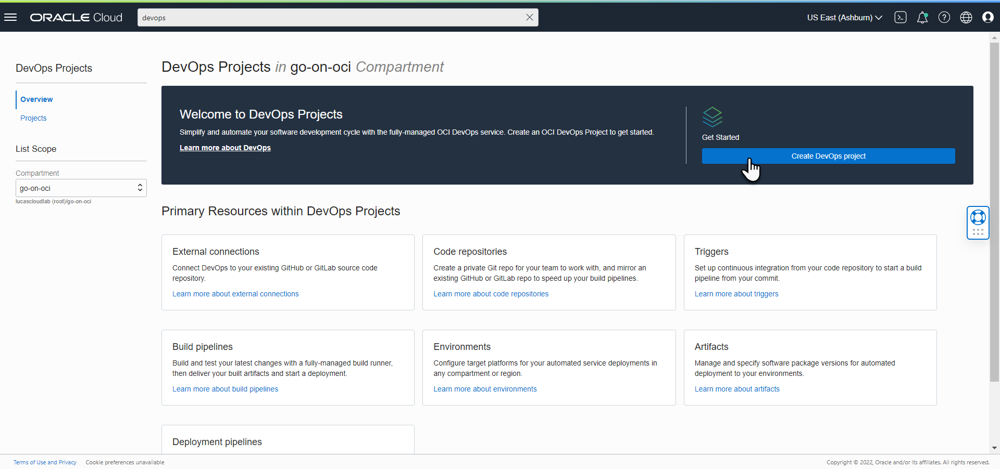
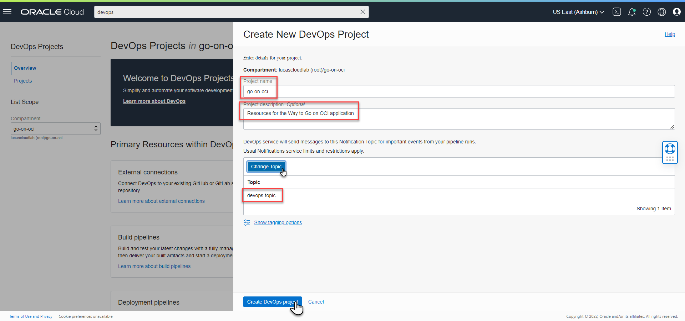
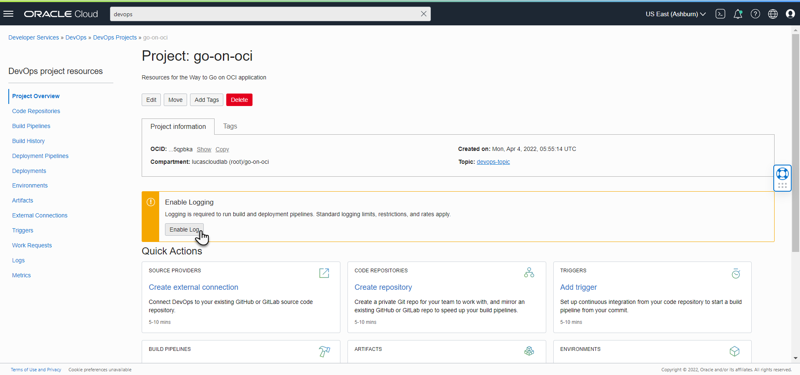
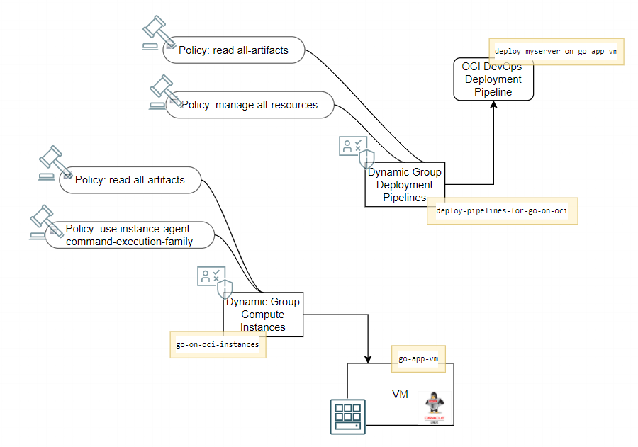
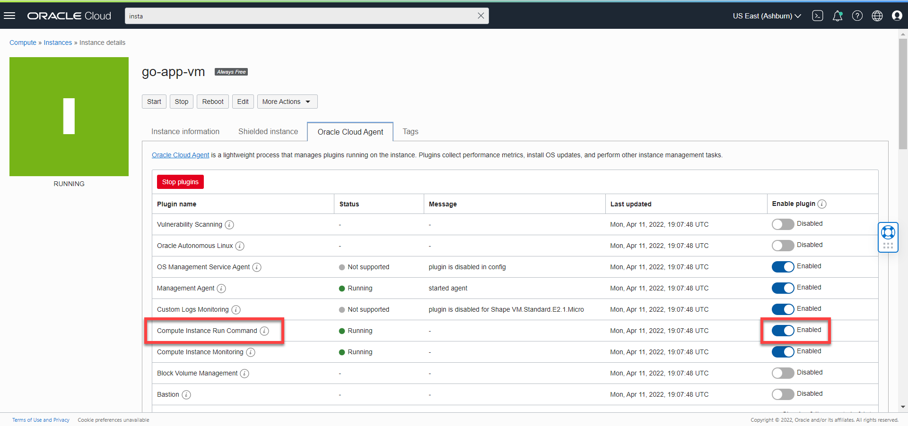
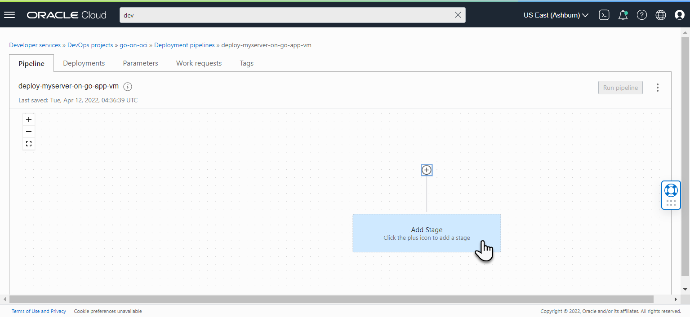
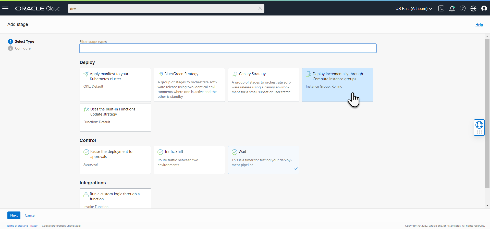
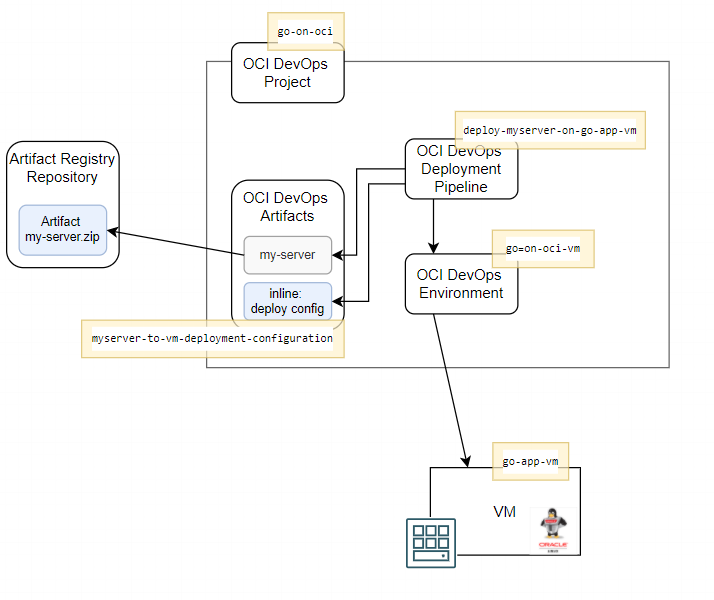



This is the second installment in a five part series about Go and Oracle Cloud Infrastructure. This series discusses how Go applications can be created and run on Oracle Cloud Infrastructure - in Compute Instances (VMs), containerized on Kubernetes or as serverless Functions. The articles show how to automate the build and deployment of these Go applications using OCI DevOps. An important topic is how to use OCI services from Go applications - both those running on OCI as well as Go code running elsewhere. Some of the OCI services discussed are Object Storage, Streaming, Key Vault and Autonomous Database. 

In order to follow along with these articles, readers should have at least basic knowledge of how to create Go applications. It is assumed that readers have access to their own Go development environment. Some of the examples and screenshots will specifically mention VS Code as development tool. However, other editors and IDEs can be used as well. The Go code presented in these articles demonstrates a number of mechanisms in their simplest form for maximum clarity and with the least dependencies. Readers should not expect meaningful functionality or production ready code. 

The articles describe how to get Going on OCI and to try out the examples, readers will need to have access to an OCI tenancy with permissions to create the OCI resources discussed in these articles. Most of the resources used are available in the *Aways Free Tier* (Compute Instance, VCN, Autonomous Database, Object Storage, Logging, Resource Manager) or have a free allotment tier for limited monthly usage (Functions, API Gateway, Streaming, Vault, DevOps). 


## Introduction

The first part describes provisioning of a Compute Instance based on the Oracle Linux Cloud Developer image, opening it up for inbound and outbound network activity, creating and running a Go application that serves HTTP requests and connecting logging produced by the application to OCI Logging. This part takes the software engineering, build and deployment of the application and the Compute Instance to the next level. Automation is the name of the game and the OCI DevOps service is introduced for storing the Go source code, building the application executable and storing it as deployable artifact, deploying that artifact to a Compute Instance that itself is provisioned through Infrastructure as Code, exposing an HTTP endpoint for that application through an OCI API Gateway and finally checking its health status after deployment. All using automated pipelines. 

The detailed steps in this article:
* set up the OCI DevOps project with the artifact registry and source code repository
* load the application resources for the Go application and Terraform infrastructure as code resources for the OCI resources into the source code repository
* OPTIONAL create OCI DevOps Build Pipeline for formatting, validating, linting and testing the Terraform sources resulting in a clean, consolidated, ready-to-deploy artifact in the artifact registry 
* create OCI DevOps Build Pipeline for producing a deployable artifact from Go source code; include Go fumpting/linting and testing in the pipeline. Deliver the artifact to the OCI Artifact Repository. Trigger the pipeline manually, to see it in action; watch lint and test. Verify the artifact that is produced.

* OPTIONAL create OCI DevOps Build Pipeline for running the Terraform plans that provision and configure a new Compute Instance – a VM based on a Vanilla Oracle Linux image – nothing pre-installed (except the OCI agent). These plans also provision the required network configuration for the VM . Note: DevOps Deploy Pipeline deploys an artifact into a function, container or VM - it does not deploy the VM itself. A DevOps Build Pipeline can be created to run commands through OCI CLI or to apply a Terraform plan with OCI provider to provision OCI resources such as a Compute Instance   

* create an OCI DevOps Deployment Pipeline that takes the built Go app artifact - a binary executable - and deploys it to the VM (and makes it run). Add a trigger of the Deployment Pipeline in the Build Pipeline.
Manually trigger the build pipeline. The Go application is deployed to the new VM. 

* From the pipeline, invoke the HTTP endpoint exposed by the Go application from the VM created in article one; note: the new VM does not have a public IP (and can only be invoked within the OCI VCN).

* Optional: Create API Gateway with a new API Deployment with a route for the HTTP endpoint exposed by the Go app that was just deployed to the new VM. Check out HTTP calls to the now public API – see them handled.

* Optional Make some changes to the Go App. Commit and Merge. The build pipeline is triggered. And fails – because of linting and/or testing failures. Correct code. Commit and Merge again. This time build pipeline succeeds, changed application is deployed to VM. Make some more HTTP calls and experience the new behavior.

## Create DevOps Project with Code Repository and Artifact Registry

The Oracle Cloud Infrastructure (OCI) DevOps service is an end-to-end, continuous integration and continuous delivery (CI/CD) platform for developers. It provides code repositories, build servers that run automated CI/CD pipelines, an artifact registry for storing the deployable built artifacts and deployment pipelines that rollout new software to OCI environments. The starting point in OCI DevOps is a project - a logical grouping of DevOps resources needed to implement a CI/CD workflow. DevOps resources can be artifacts, build pipelines, deployment pipelines, external connections (to GitHub or GitLab code repositories), triggers (definitions of events that should trigger a build pipeline or a deployment pipeline ), and environments (into which deployment is performed -  a Function application, a group of Compute instances, or a Container Engine for Kubernetes (OKE) cluster).

Using OCI DevOps is largely free. However, you do have to pay for the build server — but only the pay-per-use compute costs and the network traffic to and from outside OCI boundaries. Running the Deployment Pipelines is not charged to you. Of course the runtimes to which the applications are deployed, need to be paid for and the storage required for the Artifact Registry as well as the Container Registry is charged to your cloud account as well. 

### Create DevOps Project
Before we can create a DevOps project, we first need to create a Topic in the Notifications service. Messages representing events in OCI services or alarms that get triggered or messages explicitly produced by custom application components are asynchronously published on a Topic and subsequently delivered to subscribers to the Topic. Project Notifications are published to a Topic to keep you apprised of important events and the latest project status. They also alert you if you need to take any necessary action such as approving a workflow. You must therefore create a Topic and add a subscription to the topic. 

Open the OCI console. Type *notific* in search field; then navigate to *Notifications*. Click on the button *Create Topic*. Enter the name of the topic - for example *devops-topic* and optionally provide a description of the topic. Click on *Create* to have the topic resource provisioned.

The newly created Topic is shown in the console. Click on the name to navigate to the details page. Click on *Create Subscription* - to create a subscription to have emails sent to your email address for DevOps project events that require your attention. Note: in addition to email, subscriptions can also be created for Slack, PagerDuty, web hook, SMS and OCI Functions.

Click on *Create* to create the subscription. 

The new subscription is shown with status *Pending*. The subscription only becomes active when the email address is confirmed. Check your mailbox. You should find a mail from OCI that invites you to confirm your subscription. When you click the link in the mail (or copy the url for the link to a browser window) you are taken to a web page that informs you that the subscription was confirmed. At this point, messages published to the topic will be relayed as email to the address you have subscribed with.

   

Let's now create a DevOps project. Ensure that the context compartment is the right one - in my case *go-on-oci*, created in part 1 of this series. Type *devops* in search field; then navigate to *Overview*. An overview is shown of all DevOps projects - probably none at this point.

Click on the button Create DevOps Project.

Type the name of the project, for example *go-on-oci*, and optionally enter a description - "Resources for the Way to Go on OCI application".

Click on *Select Topic* and select the Topic you have just created. Then click on *Create DevOps Project*.



The DevOps project is created. Its overview page is shown. 


One last step to complete the project definition: enable logging. Click on the button *Enable Log*. This takes you to a tab labeled *Logs*. Toggle the switch to *Enable Log*. 

This brings up a pane where the Log Group and the name of the Log are defined. In article 1 of this series, we created a Log Group *go-on-oci-logs* which can serve us now. If you want to use a different Log Group or do not have that group available (anymore), click on the link *Create New Group*. Provide a name for the Log. Then click on *Enable Log*.


The new log is shown with status *Creating*. After a minute or so, the status will be be updated to *Active*. Now the DevOps project is fully primed, ready for some action. 

Note: in order to allow other users to access the DevOps Project, you need to set up the appropriate policies. Read [details about how go get started with the DevOps service in the OCI Documentation](https://docs.oracle.com/en-us/iaas/Content/devops/using/getting_started.htm#getting_started_with_devops) 


### Create Code Repository

OCI DevOps offers git style code repositories — similar to GitHub, GitLab or Azure DevOps. You pay for storage only — no additional charges for the git repository overhead. You get a git repo that you access in a secure way — from your command line or local git GUI tool just like you are used to. Or through a simple, straightforward browser UI that for example allows searching for sources, commits and inspecting pull requests. Although this UI is clearly not meant to be your next git power tool, it can still be quite convenient for some quick browsing.

On the DevOps project overview page, click on the card *Create repository*. Enter the name for the repository - for example *go-on-oci-repo* and optionally a description. Then click on the button *Create repository*. 

After a few seconds, the details for the new code repository appear. The repository is empty at this point. And it cannot yet be cloned to your local environment. You first need to create a authentication token that can be used for connecting your local git tooling to this OCI Code Repository.

Before you create that token (or reuse an existing token), click on the button *HTTPS*. A command is now shown for cloning the new git code repository. The command looks like:

```
git clone https://devops.scmservice.us-ashburn-1.oci.oraclecloud.com/namespaces/idtwlqf2hanz/projects/go-on-oci/repositories/go-on-oci-repo
```

To create an Authenticatin Token, follow these steps: 
    1. In the top-right corner of the Console, open the Profile menu and click User Settings.
    1. Under Resources, click Auth Tokens.
    1. Click Generate Token. Enter a description that indicates what this token is for. 
    1. Click Generate Token.

The new token string is displayed. Copy the token immediately to a secure location from which you can retrieve it later, because you will not see the token again in the Console.

You can now clone the code repository to create a local copy on your computer, add or remove files, commit changes, and work on different branches by using git operations. To clone the repository by using HTTPS, copy the displayed URL to a local terminal window in an environment with *git* setup.

Upon running the command, the clone operation starts. You are prompted for the username. Depending on whether you use direct signin for logging in to OCI, then the username you need to enter is `tenancy/username` - for example `unicorn-lab/archimedes@rockstars.nl`. If you connect to OCI through an identity provider - a federated login - then the username required here consists of `tenancy/identityprovider/username`. For example: `lucascloudlab/oracleidentitycloudservice/lucas@rainbowmail.nl`.  

When prompted for the password, paste the authentication token that you created earlier - and saved for this purpose.

The repository will now be cloned from OCI DevOps to your local machine and your access through git is configured locally. To stop git from prompting you for credentials with every operation against the remote repository, you can run

```
git config --global credential.helper store
```

Thenm perform a `git pull`, login one more time and from now on, git has the login details and will no prompt you again. 

As an aside: a OCI Code Repository can also be set up as a mirror for another git repository on GitHub or GitLab. This means that changes to this existing git repo are replicated to the Code Repository on OCI and can trigger pipeline in OCI DevOps. The other benefit of doing that is speeding up the build process: when the build needs to fetch the sources from the repo, it will be able to do so much faster from a nearby OCI Code Repository than from a farther removed GitHub or GitLab repository.

### Create Artifact Registry

An artifact registry is used to store the deliverables from build pipelines and any other artifact that we need to perform successful deployments. More in general, an Artifact Registry is a repository service for storing, sharing, and managing software development packages. Artifacts are grouped into repositories, which are collections of related artifacts. Artifacts can be uploaded and downloaded, versioned and hashed for identification and mutation check.

To create a new Artifact Registry, type *registr* in the Console search bar. Click on the link *Artifact Registry*. 

Click *Create repository*. In the Create repository dialog box, specify details for the new repository, or at least specify its name. For example: *go-on-oci-artifacts-repo*. 

Click on *Create* to create the new artifact repository.


## Deployment

A little bit later on, we will talk about the Build Pipeline that takes sources from the code repository and uses them to produce correct and deployable artifacts and subsequently triggers a deployment pipeline. We will first focus on the deployment process. We will

In OCI DevOps projects, three elements are needed to perform a successful deployment:
    1. A target environment must have been defined; this can be a Kubernetes cluster (an OKE instance), a Function or a Compute Instance (or group of instances, VMs or bare metal machines). The Deployment Pipeline needs specific IAM policies to be allowed to act upon target environment.
    2. One or more artifacts - files that are part of the application that is to be deployed, including scripts needed to run for preparing the deployment or runtime context. Artifacts are used from a repository, either an OCI Container Image Registry or an OCI Artifact Registry repository.
    3. The deplopyment pipeline that defines the steps to perform and the 

For deployment to a compute instance, we also need a deployment configuration file - a yaml file that defines the commands to copy the artifacts to their specific locations on the compute instance's file system and the statements to execute for configuring the environment and running the application.


### Environments & Policies

In the current case, the deployment will take place on the same Compute Instance we used before. We configure the deployment pipeline later on for environments defined in the DevOps Project. An *enviroment* in the DevOps project represents a real environment - OCI Function, OCI Kubernetes Cluster or (group of) OCI Compute instances such as in our case. Deploy stages in an pipeline of type *Deploy - Instance Group* are associated with an *environment* of type *Instance Group*.   

Navigate to the *Environments* tab in the DevOps Project. Click on the button *Create Environment*. Click on the tile *Instance Group*. Provide a name - for example *go-on-oci-vm* - and optionally a description. Click on *Next*.

On the second page of this *Create environment* wizard, click on *Add instance*. In the *Instance selection pane* that appears, locate the compute instancem, select it and click on *Add instance*. Finally, click on the button *Create Environment* to complete the wizard.

#### IAM Dynamic Groups and Permission Policies

The Deployment Pipeline needs permissions - to act upon the compute instance into which it has to deploy. These permissions are defined through policies, that grant the permissions to a dynamic group. The Deployment Pipeline is made member of that dynamic group - the recipient of the policies' permissions. 

To create the dynamic group, type *dyn* in the search bar. Click on the link *Dynamic Groups* in the search results pane.  

On the overview page for dynamic groups, Click on the button *Create Dynamic Group*.

Enter the name for the Dynamic Group for the Deployment Pipeline(s) - for example *deploy-pipelines-for-go-on-oci* - and optionally type a description. Define the following rule that selects all deployment pipelines that are part of the compartment (in this case we have not even created a single deployment pipeline, but we soon will):

``` 
All {resource.type = 'devopsdeploypipeline', resource.compartment.id = '<compartment_id>'}
``` 
Of course, replace `<compartment_id>` with the identifier of the compartment you are working in. Then press *Create*.

It is convenient to define the dynamic group in this broad fashion - simply including all resources in the compartment of type deployment pipeline. In a realistic environment, it is recommended to define dynamic groups and policies as fine grained as possible - as to not grant more permissions than is needed and than you may realize.

Next, to create a policy in the console: type *poli* in the search bar and click on *Policies | Identity* in the *Services* area in the search results popup. This takes you to the *Policies* overview page for the current compartment.

The first policy defines the permission for the deployment pipelines to access resources in the compartment. Create a new policy, type a name, a description and the following statement:

```
Allow dynamic-group deploy-pipelines-for-go-on-oci to manage all-resources in compartment <compartment_name>
```

The definition as shown here is again quite broad. You further restrict the access to resources by specifying the type of resource or other restrictive conditions.

A second policy defines the permission for the deployment pipelines to retrieve artifacts from artifact registry repositories in the current compartment. Again, you need to provide a name and a description. Then define the policy statement as follows:

```
Allow dynamic-group deploy-pipelines-for-go-on-oci to read all-artifacts in compartment <compartment_name>
```


We need another policy to make it possible to access the artifacts from the artifact registry repository. This policy defines the permission for the dynamic group of compute instances - as defined in the previous installment of this article as *go-on-oci-instances* - to retrieve generic artifacts from artifact registry repositories in the current compartment. This may come as a bit of a surprise: should not only the deployment pipeline have the permission to read the artifacts? As it happens: deployment takes place on the compute instance and artifact retrieval is done from that instance. Therefore the policy has to allow the instance to read the generic artifact.

Again, you need to provide a name and a description. Then define the policy statement as follows:

```
Allow dynamic-group go-on-oci-instances to read all-artifacts in compartment <compartment_name>
```

The deployment pipeline is executed on the compute instances through the cloud agent running on the instance. This next policy enables use of the instance agent execution facility on the compute instances in the dynamic group. Type a name - *go-on-oci-instances-can-run-command* - and a mandatory description. Then define the policy (replacing the placeholder with the actual name of the compartment):

```
Allow dynamic-group go-on-oci-instances to use instance-agent-command-execution-family in compartment  <compartment_name>
```

This diagram visualizes the dynamic groups and policies that are now in place.

   

#### Oracle Cloud Agent and Run Command Plugin

The Compute Instance *Run Command plugin* must be enabled on the VM, and the plugin must be running for the Deployment Pipeline to be able to have commands executed on the instance. You can check and enable this on the Oracle Cloud Agent tab in the Compute Instance details page in the console. For the *Compute Instance Run Command plugin*, make sure the *Enabled Plugin* switch is in the *Enabled* setting. It takes up to 10 minutes for the change to take effect. 




### Artifacts
   
Before too long, we will be using a DevOps Build Pipeline to generate the deployable artifacts that the Deployment Pipeline can then take and install in the target runtime environment. However, for now we wil settle for a hand crafted artifact - created from the source code discussed in the previous installment of this series. 

Using any SSH client - and perhaps most conveniently the *SSH FS* extension in VS Code - open an SSH connection to the OCI Compute Instance that was set up in the previous article. You may have called it *go-app-vm*.

You created a directory *myserver* as part of the steps in this article. Navigate into this directory, that should contain the file `my-server.go`. 

Now build the Go application into an executable: 

```
go build -o my-server
```

This produces a local executable file called my-server, of close to 7 MB. That my seem large. But consider: this file is the entire application. It can run by itself, without any special requirements on a preinstalled runtime environment or virtual machnie. 

Run the file with the following command

```
./my-server
```

The web server will be up and running. With this next command, you can verify that the executable is running as intended.

```
curl localhost:8080/greet
```

Let us now create a an artifact we can use for automated deployment later on. In the current directory - that contains the executable `my-server` and the subdirectory `website`.

These commands create the zip file `my-server.zip`, that will be the artifact used in the deployment pipeline we are about to create:

```
zip -r my-server.zip website
zip -rv my-server.zip my-server
```

To show contents of new zip file, execute:

```
zip -sf  my-server.zip
```

In order to deploy the application now contained in zip file in the deployment pipeline, we need to make sure this artifact is loaded into the artifact registry. 

Move the zipfile into the `website` directory under `myserver`. 

Make sure the application `my-server` is running, so we can use our own application to download the zip-file from the compute instance. Download the zip-file to your local environment through a curl command on the command line or through the browser:

```
http://<public ip of the compute instance>:8080/site/my-server.zip
```

Stop the *my-server* application process.

In the OCI console, navigate to the artifact registry repository that was created earlier. Click on *Upload Artifact*. Type path - `my-server.zip` - and version - `1.0`. Select the my-server.zip file as the file to upload. Click on *Upload*. This will create the artifact in the registry. 

In order to also make this artifact available for deloyment in the current DevOps Project, it needs to be associated with the DevOps Project. Navigate from the DevOps Project's homepage in the console to the *Artifacts* tab. This is where artifacts - container images from the OCI Container Image Registry or generic artifacts from an Artifact Registry Repository - are identified as relevant for the DevOps Project.

Click on the button *Add Artifact*. Specify a name - for example *my-server* - and select *Generic Artifact* as the type. Next, click on the *Select* button to select the Artifact Registry repository from which you want to select an artifact. Obviously, select the repository that was created earlier. Click on the second *Select* button to locate the specific artifact in this repository. Select the `my-server.zip` artifact that you uploaded earlier. Set the toggle *Replace parameters used in this artifact* to *No*: no placeholders need to be substituted with deployment time values in this zip file. Then click on *Add* to complete the association of the artifact with the project.


### Deployment Configuration File

The deployment itself consists of a number of steps, such as retrieving the artifacts from the registry, unzipping the archive's contents to the right destination, setting the required file access privileges, creating an autostart service to make the application run whenever the VM is rebooted. These steps are defined in two ways: 
* through the *deployment configuration file* (in yaml format) describes the high level steps, such as artifact transfer to the target environment and command execution on that environment as well optionally human approval, explicit pauses and execution of an OCI function for fine tuning or validation; this configuration file can be defined as a special type of artifact and associated with the deployment pipeline or it can be defined as an inline artifact, as we will do at first
*  in *shell scripts* that are executed on the target environments to perform the fine grained installation and configuration steps; these scripts are defined as (part of) artifacts transfered to the target environment 

In this first deployment pipeline we will only use a very simple deployment configuration file, defined as inline artifact. 

Click once more on the button *Add Artifact*. In the *Add artifact* dialog, type a name: *myserver-to-vm-deployment-configuration*. Select *Instance group deployment configuration* as the type. Select *Inline* for artifact source.

```
version: 1.0
component: deployment
env:
  variables:
    version: ${appVersion}
files:
  # This section is to define how the files in the artifact shall 
  # be put on the compute instance
  # the artifacts are copied to directory myserver in /tmp; if that directory does not exist, it will be created
  # artifacts that are archives (such as zip) are extracted as well into the target directory; a file in the root of the archive ends up in /tmp/myserver
  - source: /
    destination: /tmp/myserver
steps:
  # This section is to define the scripts that each step shall run on the instance after file copy.
  - stepType: Command
    name: Kill my-server (if it is currently running)
    command: killall my-server || echo "Process was not running."
    timeoutInSeconds: 30
  - stepType: Command
    name: Remove directory yourserver - for a fresh and clean install
    command: rm -Rf /tmp/yourserver
    timeoutInSeconds: 60
  - stepType: Command
    name: Copy directory myserver with all unzipped artifacts to newly created directory yourserver
    command: cp -R /tmp/myserver /tmp/yourserver
    timeoutInSeconds: 30
  - stepType: Command
    name: Copy Log File for this deployment as static file under website
    command: cp /tmp/myserver/stdout /tmp/yourserver/website/deployment-log.txt
    timeoutInSeconds: 30
  - stepType: Command
    name: Start My Server to serve HTTP Requests (as backgroundprocess)
    command: cd /tmp/yourserver && ./my-server &
    timeoutInSeconds: 60
  - stepType: Command
    name: Remove deployment artifacts
    command: rm -Rf /tmp/myserver
    timeoutInSeconds: 60
```    

Now it is time to create the deployment pipeline itself - and link the two artifacts to the environment.  

### Deployment Pipeline 

On the DevOps Project's overview page, click on the button *Create pipeline*. The *Create pipeline* form is presented. Type a name - *deploy-myserver-on-go-app-vm* - and optionally a description. Then click on the button *Create pipeline*. The deployment pipeline is now created - though it is quite empty: not an environment into which it should deploy, no artifacts that are to be deployed and no configuration file to define the steps to execute. 



In the pipeline editor that appears, click on the *Add Stage* tile (or on the plus icon). The next page shows a list of stage types. Click on the tile labeled *Deploy incrementally through Compute instance groups*; although a mouthful it simply means (for our purpose): deploy stuff onto a single VM.  



Press button *Next*. 

Type the stage name, for example *deploy-myserver-to-vm*. Select the environment that was defined earlier for the target VM: *go-on-oci-vm*. 

Under *Deployment configuration*, click on *Add Artifact*. A list of all artifacts in the DevOps project of type *Instance group deployment configuration* is presented. Select the only entry - that was created earlier. Press button *Save changes* to associate this deployment configuration with the deployment stage.

Note that the button *Add Artifact* is no longer enabled: only a single deplpyment configuration can be defined in a stage. 

To specify the artifact(s) that are to be taken from an artifact store and put into the target environment, click on the second button labeled *Select Artifact*. Select the *my-server* artifact that was added to the DevOps project, representing the similarly named artifact *my-server.zip:1.0* in the Artifact Registry repository *go-on-oci-artifacts-repo*. Click on *Save Changes*.

Toggle radio group *Rollout policy* - not useful in our case with only a single compute instance as deployment target - to *Rollout by count* and type *1* in the field *Instance rollout by count*. Then click on button *Add*.

The pipeline stage is created in the pipeline. And the pipeline can now be executed - to retrieve the zip file with the my-server application from the artifact repository, download zipfile and extract its contents in the target VM and run the application as background process. When the deployment pipeline is done running, the application should be serving HTTP requests.

Click on button *Run pipeline*.  A page appears to provide an overview of the manual run of the deployment pipeline. It allows you to set a name - to indicate the specific significance of this particular deployment. Parameter values can now be provided for use in this run of the deployment pipeline. Our pipeline does not currently have any such parameters defined so we can not set any values. In the future, we might well use parameters, for example to define the prefix for log output or the port on which *my-server* should listen for HTTP requests - set as an environment variable or startup parameter in the deployment configuration.   

The next figure shows the configuration of the Deployment Pipeline in conjunction with the other OCI resources it depends on. The configuration
  

Send an HTTP request - with curl or from a browser - to port 8080 at the public IP of the VM: 

```
http://<public ip of the compute instance>:8080/greet?name=Success
```

When you receive a response to this request - as you should - it proves that the deployment has succeeded. Starting from zip file containing the binary executable of our Go application, without our hands touching the VM, we managed to apply some fine automation and bring the application alive. The deployment pipeline, targeted at the proper environment, leveraging the right artifact and steered by the proper deployment configuration managed to pull it off. Note however that the application is not autohealing and will not automatically start when the VM is rebooted. We can configure the application as a Linux service that should automatically be started - and we will do so when we put together the build pipeline for a somewhat more sophisticated application. At that point we will also make use of dynamically defined port for the application to listen on instead of the hard coded port 8080 that is currently used.

Using the next URL path

```
http://<public ip of the compute instance>:8080/site/deployment-log.txt
```

you are able to inspect the first few log entries from the deployment pipeline itself. This file is copied to the static website directory of my-server in the first step in the deployment configuration. The files indicates the directory on the compute instance where the detailed logs are written: *Deployment Log for deploymentId ocid1.... is created at /var/lib/ocarun/commands/wd/..../stdout*. Note: root access is required to read this file.

The deployment pipeline can do several additional things. Take parameter values we specify for each deployment and replace placeholders in the deployment pipeline and the deployment configuration with these values. Ask a user's approval to proceed. Run additional stages - sequentially or in parallel.  Do a blue/green or canary release to a group of compute instances. 

You would be forgiven for thinking that this has been quite a lot of work for what is really a simple installation. If you would do this installation only once, then creating an SSH connection as we did in part one of this series and just performing the installation steps manually would be much more efficient than creating this pipeline to perform the installation. When however you want to install the application on multiple compute instances that you not have SSH access to or you want to install the application multiple times, whenever a new version of the application becomes available and you want colleagues without Linux skills or access privileges to be able to perform the installation, having this deployment pipeline slowly begins to make sense. Once you know the steps in the pipeline are correct, the deployment can be run in a fully automatic manner without the risk of human errors, abuse of access privileges, lack of audit trail, lenghty wait times because of unavailability of staff. Suddenly the concept of deployment pipelines is more and more enticing. Assuming much more involved deployment processes with additional installation steps, larger numbers of artifacts, more complex, perhaps parameter driven environment configuration - the value of automated deployment pipelines will be obvious.


## Build Pipeline

In the previous section the artifact to be deployed was created manually and uploaded into the artifacts repository by hand. In the name of automation we want to use build pipelines for creating such artifacts. Starting from the source code of the Go application, the build pipeline will enlist a build server, copy the relevant sources to that server, perform the linting, code analysis, compilation, testing and packaging steps and save the resulting deployable artifacts to the artifacts repository. The build pipeline can subsequently trigger the deployment pipeline to take those artifacts and deploy them to a specified environment. The build pipeline itself can be triggered manually or by an event such as a commit or a merge-to-master of a pull request in the code repository. 


Introducing DevOps Deployment:https://medium.com/oracledevs/oci-devops-free-automated-cloud-native-application-deployment-to-oracle-cloud-1461b3a8c08d


## Resources

Source code repository for the sources discussed in this article series:  <provide GitHub Repo URL> 

[OCI Documentation - Create DevOps project ](https://docs.oracle.com/en-us/iaas/Content/devops/using/create_project.htm#create_a_project
)

[OCI Documentation - Running a Command on an Instance](https://docs.public.oneportal.content.oci.oraclecloud.com/en-us/iaas/Content/Compute/Tasks/runningcommands.htm)

[OCI Documentation - IAM Policies on Artifact Registry](https://docs.oracle.com/en-us/iaas/Content/artifacts/iam-policies.htm)


DEPLOY CANARY example

https://github.com/RahulMR42/oci-devops-deploy-instances-with-canary-model


schedule application as autostart 
https://www.howtogeek.com/687970/how-to-run-a-linux-program-at-startup-with-systemd/

https://medium.com/oracledevs/automatically-starting-your-web-server-2b7b793dfcb4


# Appendix

## Build Pipeline for Infrastructure as Code

Build server does not contain Terraform; it has the CLI that can engage Resource Manager that can create a job from Terraform sources and can run that job.

Ensure that the context compartment is the right one - in my case *go-on-oci*, created in part 1 of this series. Type *devops* in search field; then navigate to *Overview*. An overview is shown of all DevOps projects

Create Stack (from Compartment)

List images

oci compute image list -c ocid1.compartment.oc1..aaaaaaaaqb4vxvxuho5h7eewd3fl6dmlh4xg5qaqmtlcmzjtpxszfc7nzbyq \
--operating-system "Oracle Linux" --query "data[*]".{'name:"display-name",id:id'} 

for example: 


  {
    "id": "ocid1.image.oc1.iad.aaaaaaaa5slk43vqyk27x27x7ca5ulkvdgqimglns35e7l7vntwawlodeexq",
    "name": "Oracle-Linux-8.5-aarch64-2022.03.17-1"
  }

Generate Key Pair: 
https://docs.oracle.com/en-us/iaas/Content/Compute/Tasks/managingkeypairs.htm?Highlight=key%20pair#two

ssh-keygen -t rsa -N "" -b 2048 -C "on-the-go-key" -f ./on-the-go-key

The public key is now in ./on-the-go-key.pub


oci compute instance list -c ocid1.compartment.oc1..aaaaaaaaqb4vxvxuho5h7eewd3fl6dmlh4xg5qaqmtlcmzjtpxszfc7nzbyq 
oci compute shape list -c ocid1.compartment.oc1..aaaaaaaaqb4vxvxuho5h7eewd3fl6dmlh4xg5qaqmtlcmzjtpxszfc7nzbyq 