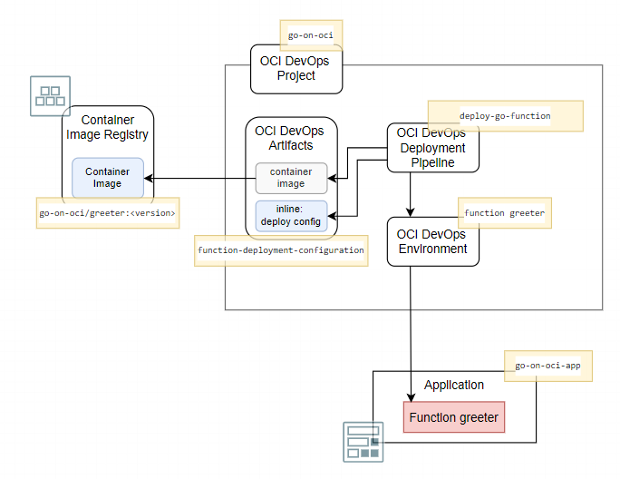



This is the third installment in a five part series about Go and Oracle Cloud Infrastructure. This series discusses how Go applications can be created and run on Oracle Cloud Infrastructure - in Compute Instances (VMs), containerized on Kubernetes or as serverless Functions. The articles show how to automate the build and deployment of these Go applications using OCI DevOps. An important topic is how to use OCI services from Go applications - both those running on OCI as well as Go code running elsewhere. Some of the OCI services discussed are Object Storage, Streaming, Key Vault and Autonomous Database. 

In order to follow along with these articles, readers should have at least basic knowledge of how to create Go applications. It is assumed that readers have access to their own Go development environment. Some of the examples and screenshots will specifically mention VS Code as development tool. However, other editors and IDEs can be used as well. The Go code presented in these articles demonstrates a number of mechanisms in their simplest form for maximum clarity and with the least dependencies. Readers should not expect meaningful functionality or production ready code. 

The articles describe how to get Going on OCI and to try out the examples, readers will need to have access to an OCI tenancy with permissions to create the OCI resources discussed in these articles. Most of the resources used are available in the *Aways Free Tier* (Compute Instance, VCN, Autonomous Database, Object Storage, Logging, Resource Manager) or have a free allotment tier for limited monthly usage (Functions, API Gateway, Streaming, Vault, DevOps). 


## Introduction

The first part of these series describes provisioning of a Compute Instance based on the Oracle Linux Cloud Developer image, opening it up for inbound and outbound network activity, creating and running a Go application that serves HTTP requests and connecting logging produced by the application to OCI Logging. Part two deals with software engineering, automation of build and deployment of the application with the OCI DevOps service. This service is used for storing the Go source code, building the application executable and storing it as deployable artifact, deploying that artifact to a Compute Instance. The article also shows how to expose an HTTP endpoint for the application through an OCI API Gateway.

This third part shows how to create serverless functions in Go and deploy them on OCI. The Go SDK for OCI is introduced - first for local, stand alone Go applications and subsequently for use from functions - leveraging resource principal authentication. This SDK is used to interact with the OCI Object Storage service for creating buckets and writing and reading files.  

Initially the function is built and deployed manually. A route is added to the deployment in API Gateway for invoking the function from a client external to OCI. Then an OCI DevOps Deployment Pipeline is created for deploying the function from an image in the Container Image Registry. Finally, a build pipeline is set up to take sources in the code repository, build and publish a container image and then trigger the deployment pipeline for end to end build and deploy. 

## OCI Functions in Go

Serverless function in OCI are based on the technology of the open source Project Fn. The business logic of the function is written in your favorite language - in this case Go - and embedded in the Fn framework that handles the life cycle of the function and the interactions with the function. The Fn framework can be run anywhere - on your local machine, in a VM on any cloud or on premises. Oracle Cloud Infrastructure offers a fully managed PaaS service OCI Functions for serverless functions based on that same technology. 

A Function is built into a container image. This image is pushed to a container image registry. To publish the function, this image is transferred to an Fn Server. Whenever the function is invoked, a container is started from the image and the request is processed. Containers are kept running for some time after handling an invocation, in a hot state ready to handle additional requests. When the number of concurrent requests increases, additional containers for the same function will be started by the Fn Server to ensure all requests can be handled. 

The attraction of functions for developers and application operators is the fact that no energy needs to be poured into designing, creating and managing the platform that runs the business logic. All focus can be on writing that logic.

We will now look at creating the function in Go, building it into a container image, deploying and running it locally. Then we will take this function to the OCI Functions service and make it run cloud side.

### The Fn Development Environment

To develop functions, you will need an environment that supports Project Fn. Fn is a lightweight Docker-based serverless functions platform you can run on your laptop, server, or cloud. You can install Fn easily on Linux or MacOS by following the instructions in [Fn Project Tutorials - Install Fn](https://fnproject.io/tutorials/install/). 

You can choose to work on the `go-app-vm` compute instance that we have created in the first and used also in the second installment of this series. This Oracle Linux environment does not come with Fn set up, but installing it is easy enough. 

Alternatively, you can work in OCI Cloud Shell. This browser accessible environment is set up with Fn. For working with Fn in OCI Cloud Shell, see [OCI Documentation Functions: Get Started using Cloud Shell](https://docs.oracle.com/en-us/iaas/developer-tutorials/tutorials/functions/func-setup-cs/01-summary.htm)


### Develop Fn Function

In the development environment with Fn CLI installed, navigate to a directory where you want to create the function's subdirectory. On the command line, enter this command and execute it:

```
fn init --runtime go --trigger http greeter
```

A subdirectory called *greeter* is created. Navigate into it and check its contents:

```
cd greeter
ls -l 
```

The file `func.yaml` contains the meta data about the function - to be interpreted by the Fn framework when building and later on running the function. File `go.mod` contains the dependency the function has on `fdk-go` package and the actual function itself is in `func.go`. The structure of the function and its interaction with the Fn runtime can be seen. Function `main` registers the function `myHandler` with the Fn runtime. This instructs and enables the runtime to invoke this function for any HTTP request received. The function receives the body of the request in an *io.Reader* parameter. It also receives in *out* the *io.Writer* to which the response body can be written. The `context.Context` parameter *ctx* contains meta data for the original request - such as HTTP headers, the full URL and request method - and for the function itself - such as all configuration variables defined for it. 

Currently, the `myHandler` function decodes the request body, expecting it to contain a JSON payload with a field called *name*. It creates a *Person* with their name set to the value read from this field or - in its absence - defaulted to *World*. It then creates the expected response: a JSON object with a single field called *message* that contains a string composed from *Hello* and the *name* value.  

Although it does not do anything truly spectacular, the function is sound and complete and we can locally deploy and invoke it. For this we need a local context and the local Fn server up and running. Check the contexts using:

```
fn list contexts
```

This shows a list of at least one context - possibly more than one. To work with the local Fn server, make sure that the *default* context is the active one. Use 

```
fn use context default 
```

if needed to set the current context to *default*

Now create an *application* as the host for the function:

```
fn create app go-oci-app
fn list apps
```

If the first of these statements fails with *connection refused* then probably the server is not yet running. Use the next command for starting the server; then try again to create the application.

```
fn start
```

With the application successfully created, the function can now be deployed into it. The next command takes care of this deployment - that is preceded by the container image build process. 

```
fn --verbose deploy --app go-oci-app --local
```

Specifying *--local* does the deployment to the local server but does not push the function image to a Docker registry – which would be necessary if we were deploying to a remote Fn server.

The *--verbose* flag is not one you will use all the time because it unleashes an impressive amount of log messages to be produced. It gives you pretty good insight in what is going on. Several container images are pulled. Then a two stage container build process is executed for creating a container image for the *greeter* function. Predefined Fn project images are used for the build stage (*fnproject/go:1.15-dev* at the time of writing) and as the foundation for the runtime image (*fnproject/go:1.15*).  

The final output will look like this:

```
Updating function greeter using image greeter:0.0.2...
Successfully created function: greeter with greeter:0.0.2
Successfully created trigger: greeter
Trigger Endpoint: http://localhost:8080/t/go-oci-app/greeter
```

The function image is called *greeter:0.0.2*. With the

```
docker images | grep greeter
```

you will find this image in the local container registry.

The function can be invoked through the Fn CLI, using its name and application, like this:

```
fn invoke go-oci-app greeter
```

The function hopes for a JSON payload that contains a *name* field, so let us provide it with exactly that:

```
echo -n '{"name":"Clark Kent"}' | fn invoke go-oci-app greeter --content-type application/json
```

The output from the function deployment also gave us the *Trigger Endpoint* for the function. This is an HTTP endpoint to which we can send an HTTP request and have it trigger the function. We have not (visible) interaction with Fn - although the endpoint we invoke is really the Fn Server endpoint; the URL path tells Fn the application and specific function to trigger. 

```
curl -X "POST" -H "Content-Type: application/json" -d '{"name":"Mickey Mouse"}' http://localhost:8080/t/go-oci-app/greeter
```

### Create OCI Function

Let's now create this Function on OCI instead of just in our development environment. The steps are very similar to the ones we used for creating the function locally - we only need to use a different context. Not the *local* context but one for OCI. 

#### Create Application

Let's first create the application - through the OCI Console. Type *app* in the search box and click on *Applications | Functions* in the Services Area. 

Click on button *Create Application*. Type the name for the application: *go-on-oci-app*. Select the VCN that was created in part one of the article series and its one public subnet. Then click on *Create* to create the application. 

  

#### Prepare Local Environment for OCI Interaction and Function Image Push

Once the application is created, the General Information for the application is presented. The page also contains instructions for creating your first function - either in the OCI Cloud Shell or in a local set up (which could of course also be the *go-app-vm* compute instance).

  

If you are using the OCI Cloud Shell, the steps for creating this context are slightly different (and simpler) than when you work in a regular development environment. Feel free to follow the OCI Shell setup. In this article, we will take the other path - for any local development environment.

There is a number of steps to take in a local environment(in which Fn CLI was previously installed):

    1. Set up an API Signing Key and store the private key in a *.pem*  file in the local *HOME/.oci* directory and upload the public key to the OCI Console - see instructions in [OCI Documentation - Required Keys](https://docs.oracle.com/en-us/iaas/Content/API/Concepts/apisigningkey.htm)
    2. Create file `config` in the `.oci`directory in the local environment; copy the *Configuration File Preview* snippet to the config file. Update the *key_file* entry in the file: make it refer to the private key's *pem* file.   [OCI Documentation - SDK and CLI Configuration File](https://docs.oracle.com/en-us/iaas/Content/API/Concepts/sdkconfig.htm)
    3. In order to push container images to the OCI Container Image Registry, you need an authentication token. In part one of this article series, you created a token - to use for logging in to the DevOps Code Repository from the *git* client. You can reuse that token for logging in the Docker client to the container image registry, or you can can create a new authention token. In the latter case, see [OCI Documentation - Getting an Authentication Token](https://docs.oracle.com/en-us/iaas/Content/Registry/Tasks/registrygettingauthtoken.htm#Getting_an_Auth_Token)   
    4. You will need the OCI CLI. Instructions to install this tool can be found in the OCI Documentation: [Working with the OCI Command Line Interface - Quickstart ](https://docs.oracle.com/en-us/iaas/Content/API/SDKDocs/cliinstall.htm). The OCI CLI will use the HOME/.oci/config file and the referenced private key for making secure connections to the OCI APIs.

After these steps, you can try out the success of steps 1, 2 and 4 with this command that should return a list of the compartments in your tenancy:

```
oci iam compartment list
```

#### Optional: Create Container Image Registry Repository

If the user account used for deploying the function has the necessary IAM permissions, then deployment will create the repository for the function images in the Container Image Registry. In case those privileges are not available or you want to prepare the repository, you can do so as follows.

Type *regi* in the search bar. Click on link *Container Registry | Containers & Artifacts*. 

Click *Create repository*. Type the name of the repository: *go-on-oci/greeter*. This is composed from the repository prefix and the name of the function for which the repository will contain the images. Set the Access to *Public*. 

  

Click on button *Create repository*. After a few seconds, a new and empty container image repository is created. Ready to receive the function (container) images that we will push using the Fn CLI. 

#### Create Context for OCI in Fn CLI

Moving back to the command line of the local environment, we need to create an Fn context for the current compartment on OCI and subsequently select it for use in Fn operations. Execute these commands (that you can copy from the *Getting Started* tab on the *go-on-oci-app* page):

```
fn create context go-on-oci --provider oracle
fn use context go-on-oci
```

  

Copy the commands under step 4 - to update the context with the compartment OCID and the Oracle Functions API URL. In my case:

```
fn update context oracle.compartment-id ocid1.compartment.oc1..aaaaaaaaqb4vxvxuho5h7eewd3fl6dmlh4xg5qaqmtlcmzjtpxszfc7nzbyq
fn update context api-url https://functions.us-ashburn-1.oraclecloud.com
```

The command will be similar but different for you. 

Provide the unique repository name prefix - use *go-on-oci* - and specify the compartment that contains the image registry repository to which the function image must be published:

```
fn update context registry iad.ocir.io/idtwlqf2hanz/go-on-oci
fn update context oracle.image-compartment-id <compartment-ocid>
```

Log into the Registry using the Auth Token as your password:

```
docker login iad.ocir.io
```

In my case, the region I work in is Ashburn, identified by the region key *iad.ocir.io*. I am prompted for the username. This is a string that includes the namespace prefix - included in the name of the Container Image Registry and each repository. Subsequently the password is asked for. Here you provide an authentication token set up for the user - and used before when in the previous article the login was performed in the code repository.  

The next command shows a listing of the applications in the current Fn context. 

```
fn list apps
```

The list contains one application, called *go-on-oci-app*.

The function *greeter* that was created and locally deployed and invoked earlier, can now also be deployed to the OCI Application to become a cloud native serverless function. The command we use for deployment is the same we used before. Its effect is quite dramatically different, because of the changed context. Instead of a local context there is now a context based on an OCI Provider and linked to an OCI Tenancy and Compartment. The container image is pushed to the OCI Container Image Registry and the Function is created in the OCI Function service. 

```
fn -v deploy --app go-on-oci-app
```

The output is similar to what was generated before. The build process is exactly the same as before. When the function container image is ready, things start to deviate. The image is pushed to the OCI Container Image Registry. And the function is deployed to the cloud. The salient lines in the output:

``` 
=> exporting to image                                                                        0.0s
 => => exporting layers                                                                       0.0s
 => => writing image sha256:008dc3b990f1e69d67a7dd8649fbd63649d72f0bf1a161b2c2e073064f16c918  0.0s
 => => naming to iad.ocir.io/idtwlqf2hanz/go-on-oci/greeter:0.0.3                             0.0s

Parts:  [iad.ocir.io idtwlqf2hanz go-on-oci greeter:0.0.3]
Using Container engine docker to push
Pushing iad.ocir.io/idtwlqf2hanz/go-on-oci/greeter:0.0.3 to docker registry...The push refers to repository [iad.ocir.io/idtwlqf2hanz/go-on-oci/greeter]
...
e57f007acf74: Pushed 
0.0.3: digest: sha256:bb4f2abde44d97517520571a21c407e349ddfc6572583a8ba53717436fd0b7f5 size: 1155
Updating function greeter using image iad.ocir.io/idtwlqf2hanz/go-on-oci/greeter:0.0.3...
Successfully created function: greeter with iad.ocir.io/idtwlqf2hanz/go-on-oci/greeter:0.0.3

Fn: HTTP Triggers are not supported on Oracle Functions
```

At this point, the function is in the cloud. And it can be invoked, still using Fn CLI:

```
fn invoke go-on-oci-app greeter
```

The first call will take quite some time, because the function starts out cold and the underlying container image needs to be instantiated into a running container. Every subsequent invocation of the function will be much faster. Unless you wait for ten minutes and the function goes *cold* and the container is stopped.

The next figure describes the situation we have arrived at:

  

You can check in the OCI Console for the evidence of what just happened. Type *greeter* in te search box in the console. Under *Resources* there will be an entry *greeter | Functions*. Click on the link to go to the page showing details for the function. You will find references to the function image, the memory setting and the endpoint for invoking the function. Under metrics you should find evidence of the call to the function made using the Fn CLI. 

In the search results for *greeter* is also the Container Repository *go-on-oci/greeter*. When you navigate to the repository, you will find details for the image(s) published to it.

### Create API Gateway Route for Function

OCI Functions can not just be invoked. Even though they have an HTTP endpoint that seems to suggest you can just call them from your browser or curl on the command line - that is not actually quite so simple. HTTP calls to functions need to be signed and this signing process is not simple and straightforward. 

A better way to allow consumers to invoke functions is through an API Gateway. We used an API Gateway in the previous installment to open up a public route to the *myserver* application running on a (potentially) private compute instance. Now we will do the same for the *greeter* function - with an additional route in the API Gateway *the-api-gateway* and the deployment *myserver-api* created in the previous article.

  

#### Setup IAM Access for the API Gateway

The API Gateway needs to be allowed to invoke the function - through a policy (that provides permission for the API Gateway to invoke functions). 

Create the policy for API Gateway to invoke functions. To go create a policy in the console: type *poli* in the search bar and click on *Policies | Identity* in the *Services* area in the search results popup. This takes you to the *Policies* overview page for the current compartment.

The policy defines the permission for the API Gateways to access resources in the compartment. Create a new policy, type a name - *invoke-function-for-api-gateway* - , a description and the following statement:

```
ALLOW any-user to use functions-family in compartment <compartment-name> where ALL {request.principal.type= 'ApiGateway', request.resource.compartment.id = '<compartment-id'}

```

Replace <compartment-name> with the name of the compartment, which is probably *go-on-oci*. Replace `<compartment_id>` with the identifier of the compartment you are working in. 


#### Define the Route for the Function in the Deployment on the API Gateway
With the permissions taken care of, we can now define the route on the API Gateway. Type *gat* into the search bar in the console. Click on the link *Gateways | API Management*. Click on the link for *the-api-gateway*. Click on the link *Deployments*. In the list with deployments - that contains a single deployment - click on the link *myserver-api*. 

Click on button *Edit* to open the deployment specification. Click on the link for the second step: *Routes*. Scroll down and click on the button *+ Another Route*.

Type */greeting* as the path for this new route. Select *GET* as the method and *Oracle Functions* as the Type (of backend). Select application *go-on-oci-app* and then set *Function Name* to *greeter*. 

  

Press button *Next*. Then press button *Save Changes* to apply the changes and make the new route real.


#### Invoke the Function through the API Gateway

With the new route set up and the deployment refreshed on the API Gateway, we can now make a simple, straightforward HTTP request to the public endpoint of the API Gateway and so indirectly trigger the function *greeter* and receive its response.

Using this URL in any browser, you should be able to get the function's response:

``` 
https://<URL for API Gateway>/my-api/greeting
```

The response is a little underwhelming - but that is what you get with such a simplistic function. 

Using curl you can send in a JSON payload to the function and receive a slightly more interesting response.

```
curl -X "GET" -H "Content-Type: application/json" -d '{"name":"Mickey Mouse"}' https://<URL for API Gateway>/my-api/greeting
```

The response reads *{"message":"Hello Mickey Mouse"}*.

So now we have established the end to end flow from API Gateway to the serverless function. And we have a way to manually deploy the function based on the sources in our local development environment. To leverage our work, you can make some changes to the source code in func.go and then deploy the function once more - a single command with the Fn CLI - and invoke the *greeting* route on the API Gateway to see that our change is *live*.

For example: change the line that sets the value for `Msg` to 

```
		Msg: fmt.Sprintf("Warmest greetings from your function dear %s", p.Name),
```

Save the change *func.go* source. Then execute these commands to first deploy the updated function and subsequently invoke it.

```
fn -v deploy --app go-on-oci-app
curl -X "GET" -H "Content-Type: application/json" -d '{"name":"Mickey Mouse"}' https://<URL for API Gateway>/my-api/greeting
```

This should result in the improved response. The build and deploy process condensed to a single manual command - in a prepared environment. Next we will look at an automated deployment process for functions using OCI DevOps, followed by the preceding automated build process based on source in a code repository. Then we will move onto functions that do a little bit more than return simple greetings.

## Automated Deployment of Functions

In the previous installment in this article series we have seen the use of OCI DevOps Deployment Pipelines for deploying an application to a compute instance. Now we will use a pipeline for automated deployment of a function. The overall approach and ingredients are similar. We need an artifact, a (target) environment and the deployment pipeline with a Function Deployment stage, as well as IAM permissions for the pipeline to read the artifact and deploy the function.

  

These ingredients in more detail:
    1. an Artifact – the reference to in this case a specific Container Image in the OCI Container Image Registry, using the fully qualified path to the repository and the specific image and version
    2. an Environment – the reference to the Function I want to (re)deploy. The Environment in case of Function deployment is not the compartment or an application in an compartment (as one might surmise) but currently the function itself that therefore already needs to exist before it can be deployed through an OCI DevOps Deployment Pipeline. (note that the Function does not have to be useful – it can be based on the Scratch container image)
    3. a Deployment Pipeline with a Deployment Pipeline Stage of type Function Deployment that connects the artifact and the environment.
    4. A dynamic group that contains the deployment pipeline, and IAM policies that allow the dynamic group to read artifacts (such as function container images) and to deploy functions (broadly speaking: manage OCI resources) 

### Create DevOps Artifact for the Function Container Image

Navigate in the OCI Console to the home page for the DevOps Project *go-on-oci*. Open the *Artifacts* tab. Click on button *Add artifact*.  Note: what we define here is a link or a proxy from the DevOps Project to an actual artifact, not an artifact itself.

Enter *greeter-function* as the name of the DevOps artifact. The type should be set to *Container image repository*. The fully qualified path to the image consists of the region key, the repository namespace and prefix, the function name and the function version tag. In this case, use a placeholder for the version tag. The path is now defined as follows:

```
<region key>/<namespace>/<repository prefix>/greeter:${imageVersion
```

Set the drop down field *Replace parameters used in this artifact* to *Yes, substitute placeholders*.

  

Click on button *Add* to complete and save the definition of the artifact.

### Define DevOps Environment for the Function

Open the *Environments* tab in the DevOps project. It contains the *go-on-oci-vm* environment that was created for the deployment of *myserver* to the compute instance (in the previous article). Click on button *Create environment*. 

In the first step *Basic information* click on the tile *Functions - Create an environment for a Function*. Enter *greeter-function-in-app-go-on-oci-app* as the name of the environment. Press *Next* to go to the second step with *Environment details*. Confirm the Region, Compartment, Application and Function - you probably do not have to change any setting. If you do, ensure that function *greeter* in application *go-on-oci-app* is selected.

Click on button *Create environment* to save the definition.

  

### Create the Deploy Pipeline for Deploying the Function

On the DevOps Project's overview page, click on the button *Create pipeline*. The *Create pipeline* form is presented. Type a name - *deploy-greeter-function-to-go-on-oci-app* - and optionally a description. Then click on the button *Create pipeline*. The deployment pipeline is now created - though it is quite empty: not an environment into which it should deploy, no artifacts that are to be deployed and no configuration file to define the steps to execute. 

In the pipeline editor that appears, click on the *Add Stage* tile (or on the plus icon). The next page shows a list of stage types. Click on the tile labeled *Uses the built-in Functions update strategy*. 

Press button *Next*. 

Type the stage name, for example *update-function-greeter*. Select the environment that was defined earlier for the function: *greeter-function-in-app-go-on-oci-app*. 

Under the heading *Artifact*, click on *Select Artifact*. A list of all artifacts in the DevOps project of type *Docker Image* is presented. Select the only entry - that was created earlier for the Function Container Image. 

Note that the button *Select Artifact* is no longer enabled: only a single container image can be associated with this stage. 

  

Click on  button *Add*. The pipeline stage is created in the pipeline. And the pipeline is now ready to be executed - its definition is complete. Or is it? The artifact this pipeline makes use of is not unequivocally defined: the version label in the path for the container image contains the placeholder `${imageVersion}`. To ensure the proper version is used for deployment, this placeholder needs to be replaced with the right value. And that is arranged by defining a parameter in the pipeline that is called `imageVersion` and is set to an existing version label.

Click on tab *Parameters* for the pipeline. Define a new parameter. It is called `imageVersion`. Its default value can be anything but it might as well correspond to an existing version label for the greeter function container image. Save the parameter definition.

Now it would seem that the pipeline is ready to be executed. We still have to make sure though that it is allowed to do its job. Before you try anything rash, read the next section.

### Dynamic Group and Policies

In the previous article, a dynamic group was defined for all deployment pipelines in the compartment. The new pipeline is automatically member of that group. We also defined a policy that granted permissions to the dynamic group to read all artifacts - which includes (Function) Container Images in the compartment's Container Image Registry repositories. Another policy that was also already created grants the dynamic group the very broad permission to manage all resources in the compartment. We can benefit from that broad scope of the policy, that also covers creation and update of functions.

### Run the Deployment Pipeline

Run the Deployment Pipeline by pressing the button *Run pipeline*. 

Once the deployment is complete - you will see the green markers that proclaim success. However, there is no other obvious indication of this success because the end result is exactly the situation we had achieved with manual deployment of the function from the Fn CLI command line.

  

To make things a little bit more interesting, we will make a change to the function's code. Then build the container image for the function (locally) and push the new function image to the container image registry. Then we will start the deployment pipeline once again. This time, when successful, it will render a new situation that we can experience by invoking the *my-api/greeting* route on the API Gateway. 

#### Change Function Implementation

Make a small but visible change to `func.go` in your local environment: ensure that the response from the new version of the function looks noticably different from the current version. Save the change.  
fn update context to local 

#### Build a new Function Container Image (locally)

These commands will first modify the version label used to tag the function with an increase in the third digit. Next, the function container image is built using the changed sources. The third command list the local container images, filtering on images with *greeter* in their name.

```
fn bm
fn build 
docker images | grep greeter
```

You should be able to find the newly built image - with its fully qualified name that includes the OCI region key, the namespace, the repository prefix, and the function name *greeter* with finally the version label appended.  

#### Tag Container Image with New Version Label and Push to Registry

Let's define a new identifier for the image, using this command that sets the version label to *0.1.0*:

```
docker tag <fully qualified image name>:<newly assigned bumped version label>  <fully qualified image name>:0.1.0
```

Then push the new function container image to the OCI Container Image Registry repository, using:

```
docker push <fully qualified image name>:0.1.0
```

Note: at this point we have not redeployed the function based on this new version of the container image. All we did is build the image and push it to the registry on OCI. Invoking the OCI Function will not show any difference.

#### Run the Deployment Pipeline (for the new Function Image) 

Run the deployment pipeline one more time. Set the value of parameter `imageVersion` to *0.1.0*. 

When the pipeline is successfully completed, the new version of the function with all the exciting changes you applied to it is live.

#### Invoke the Newly Deployed Function

You can see the new function version in action by invoking it on the command line using Fn CLI:

```
fn invoke go-on-oci-app greeter
```

(because the Fn CLI's context is still *go-on-oci* from the Oracle provider and configured for the *go-on-oci* compartment that contains the *greeter* function, this call will be directed to the OCI Function )

Alternatively you can curl to the route on the API Gateway (that invokes the function): 
```
curl -X "GET" -H "Content-Type: application/json" -d '{"name":"Mickey Mouse"}' https://<API Gateway endpoint>/my-api/greeting
```


## Automated Build of Functions

https://medium.com/oracledevs/oci-devops-build-pipeline-for-functions-7e4a2e5d6eb2 

## Go SDK for OCI - Interaction with OCI Object Storage from Go applications


## Conclusion

One focus area in this article was serverless functions, written in Go and running on Oracle Cloud Infrastructure. The automated build and deployment of these functions was discussed too. 

The second main topic was the Go SDK for OCI for interacting with OCI services from Go applications. The article showed how in Go code, the Object Storage service can be accessed to store and retrieve files.

In the next article, interacting with the Oracle Database is the main topic. Creating a connection from a Go application to a local Oracle Database as well as to an Autonomous Database running on OCI and performing SQL operations with these databases from the comfort of your Go application. Further topics include working with an Oracle Wallet for proper management of database credentials, including the wallet in the deployment process and combining interactions with the OCI Object Storage and the Autonomous Database services in a single application.   

## Resources

Source code repository for the sources discussed in this article series:  <provide GitHub Repo URL> 

[OCI Documentation - Functions](https://docs.oracle.com/en-us/iaas/Content/Functions/Concepts/functionsoverview.htm)

[Fn Project Tutorials - Introduction to Fn with Go](https://fnproject.io/tutorials/Introduction/)

[Fn Project Tutorials - Configure Context](https://github.com/fnproject/tutorials/blob/master/install/README.md#configure-your-context)

[Go FDK Documentation](https://github.com/fnproject/fdk-go)