

This is the third installment in a five part series about Go and Oracle Cloud Infrastructure. This series discusses how Go applications can be created and run on Oracle Cloud Infrastructure (OCI) in Compute Instances (VMs), containerized on Kubernetes, or as serverless Functions. The articles show how to automate the build and deployment of these Go applications using OCI DevOps. An important topic is how to use OCI services from Go applications, both those running on OCI as well as Go code running elsewhere. Some of the OCI services discussed are Object Storage, Streaming, Key Vault and Autonomous Database. 

In order to follow along with these articles, readers should have at least basic knowledge of how to create Go applications. It is assumed that readers have access to their own Go development environment. Some of the examples and screenshots will specifically mention VS Code as development tool. However, other editors and IDEs can be used as well. The Go code presented in these articles demonstrates a number of mechanisms in their simplest form for maximum clarity and with the least dependencies. Readers should not expect meaningful functionality or production ready code. 

The articles describe how to get Going on OCI. To try out the examples, readers will need to have access to an OCI tenancy with permissions to create the OCI resources discussed in these articles. Most of the resources used are available in the *Aways Free Tier* (Compute Instance, VCN, Autonomous Database, Object Storage, Logging, Resource Manager), or have a free allotment tier for limited monthly usage (Functions, API Gateway, Streaming, Vault, DevOps). 


## Introduction

The first part of this series describes provisioning of a Compute Instance based on the Oracle Linux Cloud Developer image, opening it up for inbound and outbound network activity, creating and running a Go application that serves HTTP requests, and connecting logging produced by the application to OCI Logging. Part two deals with software engineering, automation of build, and deployment of the application with the OCI DevOps service. This service is used for storing the Go source code, building the application executable, storing it as deployable artifact, and deploying that artifact to a Compute Instance. The second article also shows how to expose an HTTP endpoint for the application through an OCI API Gateway.

This third part shows how to create serverless functions in Go and deploy them on OCI. The Go SDK for OCI is introduced -- first for local, stand alone Go applications and subsequently for use from functions -- leveraging resource principal authentication. This SDK is used to interact with the OCI Object Storage service for creating buckets and writing and reading files.  

Initially the function is built and deployed manually. A route is added to the deployment in API Gateway for invoking the function from a client external to OCI. Then an OCI DevOps Deployment Pipeline is created for deploying the function from an image in the Container Image Registry. Finally, a build pipeline is set up to take sources in the code repository, build and publish a container image, and then trigger the deployment pipeline for end-to-end build and deploy. 

## OCI Functions in Go

Serverless function in OCI are based on the technology of the open source Project Fn. The business logic of the function is written in your favorite language -- in this case Go -- and embedded in the Fn framework that handles the life cycle of the function and the interactions with the function. The Fn framework can be run anywhere: on your local machine, in a VM on any cloud, or on premises. Oracle Cloud Infrastructure offers a fully managed PaaS service OCI Functions for serverless functions based on that same technology. 

A Function is built into a container image. This image is pushed to a container image registry. To publish the function, this image is transferred to an Fn Server. Whenever the function is invoked, a container is started from the image and the request is processed. Containers are kept running for some time after handling an invocation, in a hot state ready to handle additional requests. When the number of concurrent requests increases, additional containers for the same function will be started by the Fn Server to ensure all requests can be handled. 

The attraction of functions for developers and application operators is the fact that no energy needs to be poured into designing, creating and managing the platform that runs the business logic. All focus can be on writing that logic.

We will now look at creating the function in Go, building it into a container image, deploying and running it locally. Then we will take this function to the OCI Functions service and make it run cloud side.

### The Fn Development Environment

To develop functions, you will need an environment that supports Project Fn. Fn is a lightweight Docker-based serverless functions platform you can run on your laptop, server, or cloud. You can install Fn easily on Linux or MacOS by following the instructions in [Fn Project Tutorials -- Install Fn](https://fnproject.io/tutorials/install/). 

You can choose to work on the `go-app-vm` compute instance that we have created in the first and used also in the second installment of this series. This Oracle Linux environment does not come with Fn set up, but installing it is fairly simple. 

Alternatively, you can work in OCI Cloud Shell. This browser-accessible environment is set up with Fn. For working with Fn in OCI Cloud Shell, see [OCI Documentation Functions: Get Started using Cloud Shell](https://docs.oracle.com/en-us/iaas/developer-tutorials/tutorials/functions/func-setup-cs/01-summary.htm).


### Develop an Fn Function

In the development environment with Fn CLI installed, navigate to a directory where you want to create the function's subdirectory. On the command line, enter this command and execute it:

```
fn init --runtime go --trigger http greeter
```

A subdirectory called *greeter* is created. Navigate into it and check its contents:

```
cd greeter
ls -l 
```

The file `func.yaml` contains the meta data about the function, to be interpreted by the Fn framework when building, and later on when running the function. File `go.mod` contains the dependency the function has on the `fdk-go` package. The actual function itself is in `func.go`. The structure of the function and its interaction with the Fn runtime can be seen here: function `main` registers the function `myHandler` with the Fn runtime, which instructs and enables the runtime to invoke this function for any HTTP request received. The function receives the body of the request in an `io.Reader` parameter. It also receives the output of `io.Writer`, to which the response body can be written. The `context.Context` parameter `ctx` contains meta data for the original request, including HTTP headers, the full URL, the request method, and the function itself, including all configuration variables defined for it.

Currently, the `myHandler` function decodes the request body, expecting it to contain a JSON payload with a field called *name*. It creates a *Person* with their name set to the value of this field or, in its absence, defaults to *World*. It then creates the expected response: a JSON object with a single field called *message*, which contains a string composed from *Hello* and the *name* value.  

Although it does not do anything truly spectacular, the function is sound and complete and we can locally deploy and invoke it. For this we need a local context and the local Fn server up and running. Check the contexts using:

```console
fn list contexts
```

This shows a list of at least one context -- possibly more than one. To work with the local Fn server, make sure that the *default* context is the active one. If needed to set the current context to *default*, use:

```console
fn use context default 
```

Now create an *application* as the host for the function:

```console
fn create app go-oci-app
fn list apps
```

If the first of these statements fails with *connection refused*, then the server is probably not yet running. Use the next command for starting the server, then try again to create the application.

```console
fn start
```

With the application successfully created, the function can now be deployed into it. The next command takes care of this deployment; it's preceded by the container image build process. 

```console
fn --verbose deploy --app go-oci-app --local
```

Specifying `--local` does the deployment to the local server but does not push the function image to a Docker registry, which would be necessary if we were deploying to a remote Fn server.

Because it unleashes an impressive amount of log messages to be produced, the `--verbose` flag is not one you will use all the time. However, it gives you pretty good insight into what's going on. Several container images are pulled, then a two-stage container build process is executed for creating a container image for the *greeter* function. Predefined Fn project images are used for the build stage (*fnproject/go:1.15-dev* at the time of writing) and as the foundation for the runtime image (*fnproject/go:1.15*).

The final output will look like this:

```
Updating function greeter using image greeter:0.0.2...
Successfully created function: greeter with greeter:0.0.2
Successfully created trigger: greeter
Trigger Endpoint: http://localhost:8080/t/go-oci-app/greeter
```

The function image is called *greeter:0.0.2*. You will find this image in the local container registry with:

```console
docker images | grep greeter
```

The function can be invoked through the Fn CLI, using its name and application, like this:

```console
fn invoke go-oci-app greeter
```

The function expects a JSON payload that contains a *name* field, so let us provide it with exactly that:

```console
echo -n '{"name":"Clark Kent"}' | fn invoke go-oci-app greeter --content-type application/json
```

The output from the function deployment also gave us the *Trigger Endpoint* for the function. This is an HTTP endpoint to which we can send an HTTP request and have it trigger the function. We have no (visible) interaction with Fn, although the endpoint we invoke is really the Fn Server endpoint. The URL path tells Fn the application and specific function to trigger. 

```console
curl -X "POST" -H "Content-Type: application/json" -d '{"name":"Mickey Mouse"}' http://localhost:8080/t/go-oci-app/greeter
```

### Create OCI Function

Now, let's create this Function on OCI instead of just in our development environment. The steps are very similar to the ones we used for creating the function locally; we only need to use a different context. Not the *local* context but one for OCI. 

#### Create Application

Let's first create the application through the OCI Console. Type *app* in the search box and click on *Applications \| Functions* in the Services Area. 

Click on button *Create Application*. Type the name for the application: *go-on-oci-app*. Select the VCN that was created in part one of the article series and its one public subnet. Then click on *Create* to create the application. 

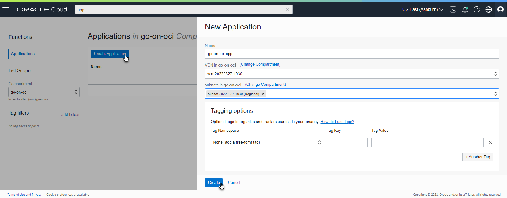  

#### Prepare Local Environment for OCI Interaction and Function Image Push

Once the application is created, the General Information for the application is presented. The page also contains instructions for creating your first function, either in the OCI Cloud Shell, or in a local setup (which could, of course, also be the *go-app-vm* compute instance).

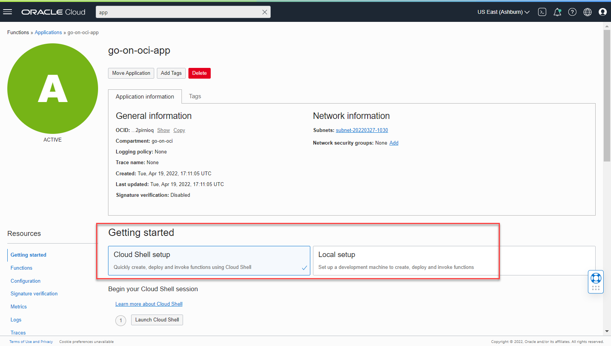  

If you are using the OCI Cloud Shell, the steps for creating this context are slightly different (and simpler) than when you work in a regular development environment. Feel free to follow the OCI Shell setup. In this article, we will take the other path, used for any local development environment.

There are a number of steps to take in a local environment (in which Fn CLI was previously installed):

1. Set up an API Signing Key and store the private key in a *.pem* file in the local *HOME/.oci* directory and upload the public key to the OCI Console -- see instructions in [OCI Documentation -- Required Keys](https://docs.oracle.com/en-us/iaas/Content/API/Concepts/apisigningkey.htm).
2. Create file `config` in the `.oci` directory in the local environment; copy the *Configuration File Preview* snippet to the config file. Update the *key_file* entry in the file: make it refer to the private key's *pem* file.   [OCI Documentation -- SDK and CLI Configuration File](https://docs.oracle.com/en-us/iaas/Content/API/Concepts/sdkconfig.htm).
3. In order to push container images to the OCI Container Image Registry, you need an authentication token. In part one of this article series, you created a token to use for logging in to the DevOps Code Repository from the *git* client. You can reuse that token for logging the Docker client into the container image registry, or you can can create a new authention token. In the latter case, see [OCI Documentation -- Getting an Authentication Token](https://docs.oracle.com/en-us/iaas/Content/Registry/Tasks/registrygettingauthtoken.htm#Getting_an_Auth_Token).
4. You will need the OCI CLI. Instructions to install this tool can be found in the OCI Documentation: [Working with the OCI Command Line Interface -- Quickstart ](https://docs.oracle.com/en-us/iaas/Content/API/SDKDocs/cliinstall.htm). The OCI CLI will use the HOME/.oci/config file and the referenced private key for making secure connections to the OCI APIs.

After these steps, you can try out the success of steps 1, 2, and 4 with this command, which should return a list of the compartments in your tenancy:

```console
oci iam compartment list
```

#### Optional: Create Container Image Registry Repository

If the user account used for deploying the function has the necessary IAM permissions, then deployment will create the repository for the function images in the Container Image Registry. In case those privileges are not available or you want to prepare the repository, you can do so as follows.

1. Type *regi* in the search bar. Click on link *Container Registry \| Containers & Artifacts*. 
2. Click *Create repository*. Type the name of the repository: *go-on-oci/greeter*. This is comprised of the repository prefix and the name of the function, in which the repository will contain the images. Set the Access to *Public*. 

    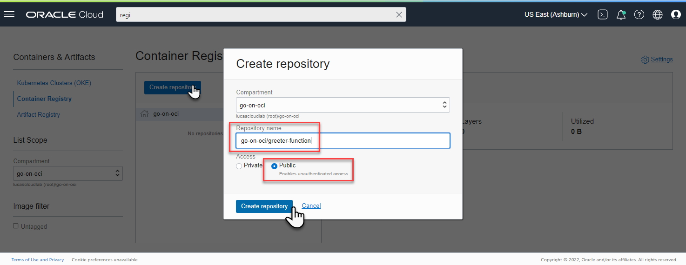  
3. Click on button *Create repository*. After a few seconds, a new and empty container image repository is created, ready to receive the function (container) images that we will push using the Fn CLI.

#### Create a Context for OCI in Fn CLI

Moving back to the command line of the local environment, we need to create a Fn context for the current compartment on OCI, and subsequently select it for use in Fn operations. Execute these commands (which you can copy from the *Getting Started* tab on the *go-on-oci-app* page):

```console
fn create context go-on-oci --provider oracle
fn use context go-on-oci
```

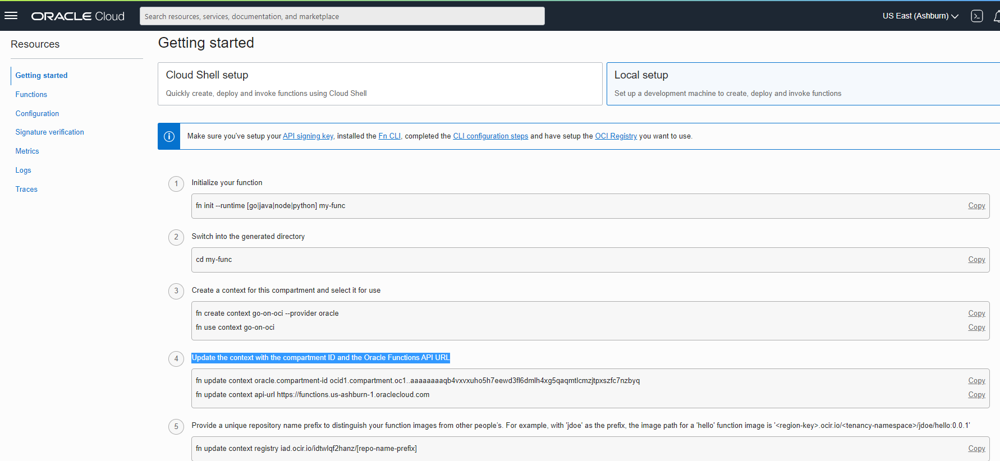  

Copy the commands under step 4 to update the context with the compartment OCID and the Oracle Functions API URL. In my case:

```console
fn update context oracle.compartment-id ocid1.compartment.oc1..aaaaaaaaqb4vxvxuho5h7eewd3fl6dmlh4xg5qaqmtlcmzjtpxszfc7nzbyq
fn update context api-url https://functions.us-ashburn-1.oraclecloud.com
```

The command will be similar but different for you. 

Provide the unique repository name prefix. Use *go-on-oci* and specify the compartment that contains the image registry repository to which the function image must be published:

```console
fn update context registry iad.ocir.io/idtwlqf2hanz/go-on-oci
fn update context oracle.image-compartment-id <compartment-ocid>
```

Log into the Registry using the Auth Token as your password:

```console
docker login iad.ocir.io
```

In my case, the region I work in is Ashburn, identified by the region key *iad.ocir.io*. I am prompted for the username. This is a string that includes the namespace prefix included in the name of the Container Image Registry and each repository. Subsequently the password is requested. Here, you provide an authentication token set up for the user, which we used before in the previous article when the login was performed in the code repository.

The next command shows a listing of the applications in the current Fn context:

```console
fn list apps
```

The list contains one application, called *go-on-oci-app*.

The function `greeter` that was created, locally deployed, and invoked earlier can now also be deployed to the OCI Application to become a cloud-native, serverless function. The command we use for deployment is the same as we used before. Its effect is dramatically different due to the changed context. Instead of a local context, there is now a context based on an OCI Provider and linked to an OCI Tenancy and Compartment. The container image is pushed to the OCI Container Image Registry, and the Function is created in the OCI Function service. 

```console
fn -v deploy --app go-on-oci-app
```

The output is similar to what was generated before, but the build process is exactly the same. Once the function container image is ready, things start to deviate. The image is pushed to the OCI Container Image Registry, and the function is deployed to the cloud. The related lines in the output:

```
=> exporting to image                                                                        0.0s
 => => exporting layers                                                                       0.0s
 => => writing image sha256:008dc3b990f1e69d67a7dd8649fbd63649d72f0bf1a161b2c2e073064f16c918  0.0s
 => => naming to iad.ocir.io/idtwlqf2hanz/go-on-oci/greeter:0.0.3                             0.0s

Parts:  [iad.ocir.io idtwlqf2hanz go-on-oci greeter:0.0.3]
Using Container engine docker to push
Pushing iad.ocir.io/idtwlqf2hanz/go-on-oci/greeter:0.0.3 to docker registry...The push refers to repository [iad.ocir.io/idtwlqf2hanz/go-on-oci/greeter]
...
e57f007acf74: Pushed 
0.0.3: digest: sha256:bb4f2abde44d97517520571a21c407e349ddfc6572583a8ba53717436fd0b7f5 size: 1155
Updating function greeter using image iad.ocir.io/idtwlqf2hanz/go-on-oci/greeter:0.0.3...
Successfully created function: greeter with iad.ocir.io/idtwlqf2hanz/go-on-oci/greeter:0.0.3

Fn: HTTP Triggers are not supported on Oracle Functions
```

At this point, the function is in the cloud, and it can be invoked (still using the Fn CLI):

```console
fn invoke go-on-oci-app greeter
```

The first call will take quite some time because the function starts out cold and the underlying container image needs to be instantiated into a running container. Every subsequent invocation of the function will be much faster. Note that if you wait for ten minutes and the function goes *cold*, the container is stopped.

This image describes the situation we have arrived at:

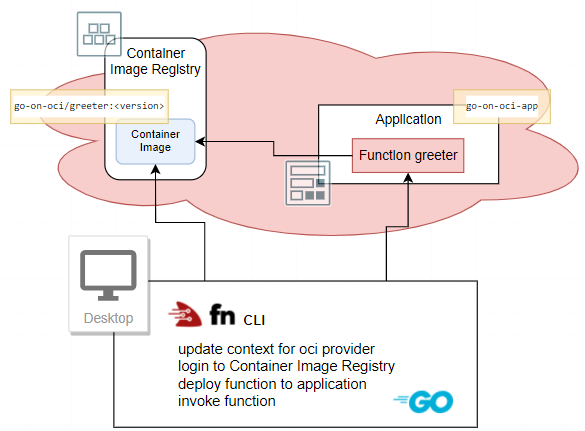  

You can check in the OCI Console for the evidence of what just happened. Type *greeter* in the search box in the console. Under *Resources* there will be an entry *greeter \| Functions*. Click on the link to go to the page showing details for the function. You will find references to the function image, the memory setting and the endpoint for invoking the function. Under metrics you should find evidence of the call to the function made using the Fn CLI. 

In the search results for *greeter*, you'll also find the Container Repository *go-on-oci/greeter*. When you navigate to the repository, you'll find details for the image(s) published to it.

### Create API Gateway Route for Function

OCI Functions can not just be invoked. Even though they have an HTTP endpoint that seems to suggest you can just call them from your browser or curl on the command line, it's not actually quite that simple. HTTP calls to functions need to be signed, and this signing process is not simple and straightforward. 

A better way to allow consumers to invoke functions is through an API Gateway. We used an API Gateway in the previous article to open up a public route to the *myserver* application running on a (potentially) private compute instance. Now we will do the same for the *greeter* function using an additional route in the API Gateway *the-api-gateway* and the deployment *myserver-api* created in the previous article.

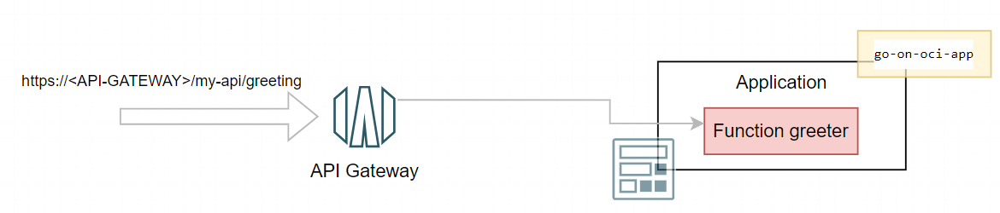

#### Setup IAM Access for the API Gateway

The API Gateway needs to be allowed to invoke the function, using a policy that provides permission for the API Gateway to invoke functions. 

Create the policy for API Gateway to invoke functions. To go create a policy in the console: type *poli* in the search bar and click on *Policies \| Identity* in the *Services* area of the search results popup. This takes you to the *Policies* overview page for the current compartment.

The policy defines the permission for the API Gateways to access resources in the compartment. Create a new policy, type a name (*invoke-function-for-api-gateway*), a description, and the following statement:

```
ALLOW any-user to use functions-family in compartment <compartment-name> where ALL {request.principal.type= 'ApiGateway', request.resource.compartment.id = '<compartment-id'}
```

Replace `<compartment-name>` with the name of the compartment, which is probably *go-on-oci*. Replace `<compartment_id>` with the identifier of the compartment you are working in. 


#### Define the Route for the Function in the Deployment on the API Gateway

With the permissions taken care of, we can now define the route on the API Gateway. Type *gat* into the search bar in the console. Click on *Gateways \| API Management*. Click on the link for *the-api-gateway*. Click on *Deployments*. In the list of deployments (which contains a single deployment), click on the link *myserver-api*. 

Click on button *Edit* to open the deployment specification. Click on the link for the second step: *Routes*. Scroll down and click on the button *+ Another Route*.

Type */greeting* as the path for this new route. Select *GET* as the method and *Oracle Functions* as the Type (of backend). Select application *go-on-oci-app* and then set *Function Name* to *greeter*. 

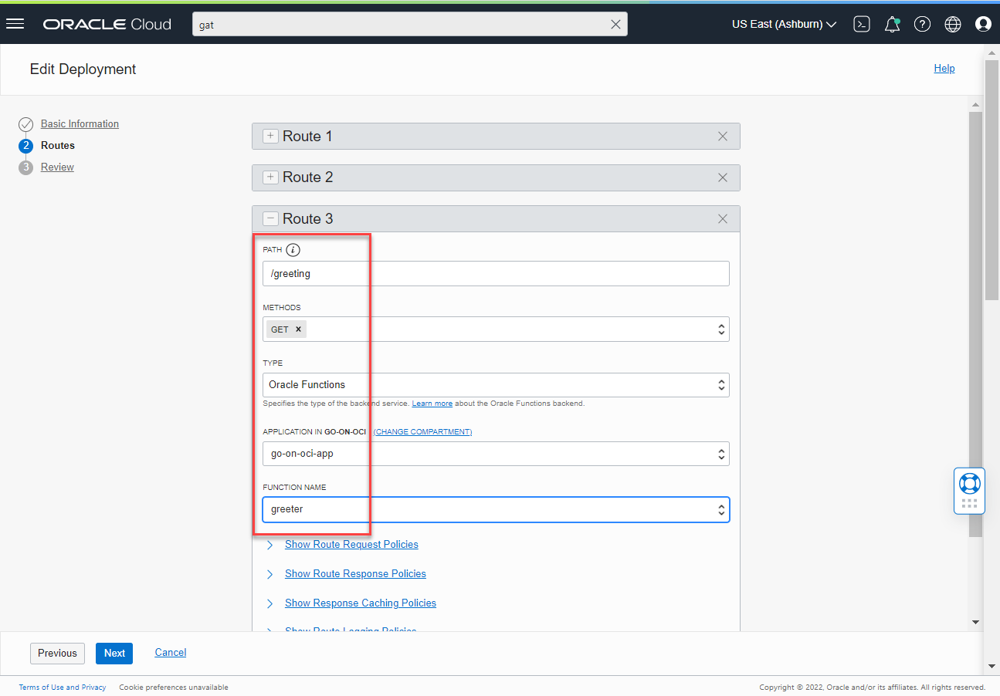  

Press *Next*. Then press *Save Changes* to apply the changes and make the new route real.

#### Invoke the Function through the API Gateway

With the new route set up and the deployment refreshed on the API Gateway, we can now make a simple, straightforward HTTP request to the public endpoint of the API Gateway, indirectly triggering the function *greeter* and receiving its response.

Using this URL in any browser, you should be able to get the function's response:

```
https://<URL for API Gateway>/my-api/greeting
```

The response is a little underwhelming, but that's expected with such a simplistic function. 

Using `curl`, you can send a JSON payload to the function and receive a slightly more interesting response.

```console
curl -X "GET" -H "Content-Type: application/json" -d '{"name":"Mickey Mouse"}' https://<URL for API Gateway>/my-api/greeting
```

The response reads `{"message":"Hello Mickey Mouse"}`.

So now we have established the end to end flow from the API Gateway to the serverless function. And we have a way to manually deploy the function based on the sources in our local development environment. To leverage our work, you can make some changes to the source code in `func.go` and then deploy the function once more -- a single command with the Fn CLI -- and invoke the *greeting* route on the API Gateway to see that our change is *live*.

For example: change the line that sets the value for `Msg` to 

```
		Msg: fmt.Sprintf("Warmest greetings from your function dear %s", p.Name),
```

Save the updated `func.go` source. Then execute these commands to deploy the updated function and subsequently invoke it:

```console
fn -v deploy --app go-on-oci-app
curl -X "GET" -H "Content-Type: application/json" -d '{"name":"Mickey Mouse"}' https://<URL for API Gateway>/my-api/greeting
```

This should result in the improved response. The build and deploy process are condensed to a single manual command in a prepared environment. Next we will look at an automated deployment process for functions using OCI DevOps, followed by the preceding automated build process based on source in a code repository. Then we will move onto functions that do a little bit more than return simple greetings.

## Automated Deployment of Functions

In the previous installment in this series, we saw the use of OCI DevOps Deployment Pipelines for deploying an application to a compute instance. Now we'll use a pipeline for automated deployment of a function. The overall approach and ingredients are similar. We need an artifact, a (target) environment, and the deployment pipeline with a Function Deployment stage, as well as IAM permissions for the pipeline to read the artifact and deploy the function.

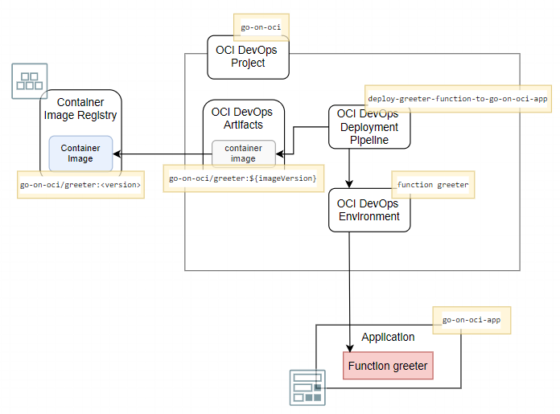  

These ingredients in more detail:

1. An **Artifact**: the reference to, in this case, a specific Container Image in the OCI Container Image Registry, using the fully qualified path to the repository and the specific image and version.
2. An **Environment**: the reference to the Function I want to (re)deploy. The Environment in the case of Function deployment is not the compartment or an application in a compartment (as one might surmise), but the function itself which therefore already needs to exist before it can be deployed through an OCI DevOps Deployment Pipeline. (Note that the Function does not have to be useful -- it can be based on the Scratch container image.)
3. A **Deployment Pipeline** with a Deployment Pipeline Stage of type _Function Deployment_ that connects the Artifact and the Environment.
4. A dynamic group that contains the deployment pipeline, and IAM policies that allow the dynamic group to read artifacts (such as function container images) and to deploy functions (broadly speaking, manage OCI resources). 

### Create DevOps Artifact for the Function Container Image

In the OCI Console, navigate to the home page for the DevOps Project *go-on-oci*. Open the *Artifacts* tab. Click on button *Add artifact*.  Note that what we define here is a link or a proxy from the DevOps Project to an actual artifact, not the artifact itself.

Enter *greeter-function* as the name of the DevOps artifact. The type should be set to *Container image repository*. The fully qualified path to the image consists of the region key, the repository namespace and prefix, the function name and the function version tag. In this case, use a placeholder for the version tag. The path is now defined as follows:

```
<region key>/<namespace>/<repository prefix>/greeter:${imageVersion
```

Set the drop down field *Replace parameters used in this artifact* to *Yes, substitute placeholders*.

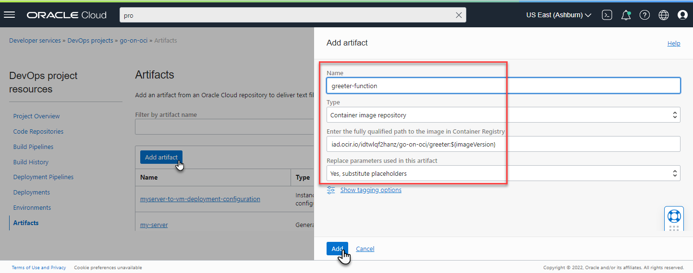  

Click on button *Add* to complete and save the definition of the artifact.

### Define the DevOps Environment for the Function

Open the *Environments* tab in the DevOps project. It contains the *go-on-oci-vm* environment that was created for the deployment of *myserver* to the Compute instance (in the previous article). Click on button *Create environment*. 

In the first step, *Basic information*, click on the tile *Functions - Create an environment for a Function*. Enter *greeter-function-in-app-go-on-oci-app* as the name of the environment. Press *Next* to go to the second step with *Environment details*. Confirm the Region, Compartment, Application and Function -- you probably do not have to change any of these settings. If you do, ensure that function *greeter* in application *go-on-oci-app* is selected.

Click on *Create environment* to save the definition.

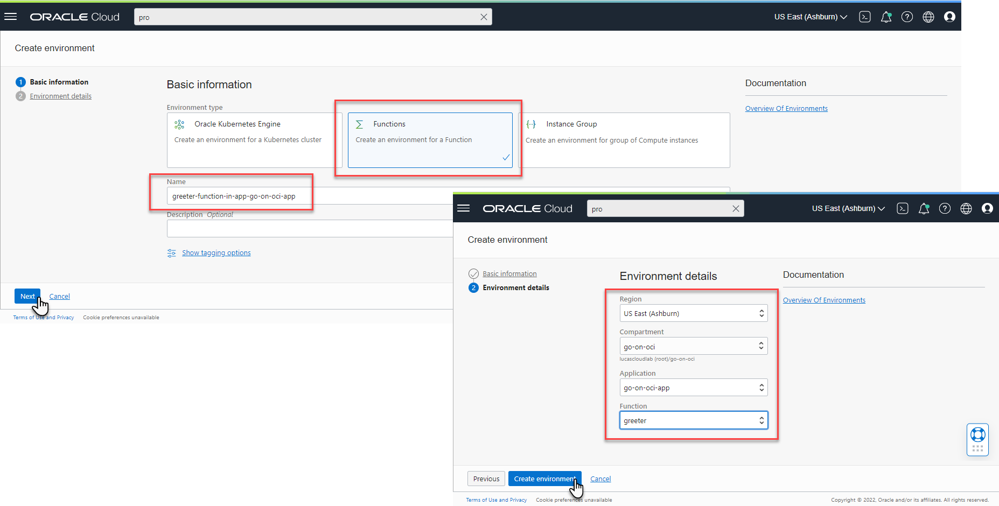  

### Create the Deploy Pipeline for Deploying the Function

On the DevOps Project's overview page, click on *Create pipeline*. The *Create pipeline* form is presented. Type a name (*deploy-greeter-function-to-go-on-oci-app*) and optionally a description. Then click on *Create pipeline*. The deployment pipeline is created, though it's quite empty: not an environment into which it should deploy, no artifacts that are to be deployed, and no configuration file to define the steps to execute. 

In the pipeline editor that appears, click on the *Add Stage* tile (or on the plus icon). The next page shows a list of stage types. Click on the tile labeled *Uses the built-in Functions update strategy*. 

Press button *Next*. 

Type the stage name, e.g. *update-function-greeter*. Select the environment that was defined earlier for the function: *greeter-function-in-app-go-on-oci-app*. 

Under the heading *Artifact*, click on *Select Artifact*. A list of all artifacts in the DevOps project of type *Docker Image* is presented. Select the only entry, the one that was created earlier for the Function Container Image. 

Note that the button *Select Artifact* is no longer enabled: only a single container image can be associated with this stage.

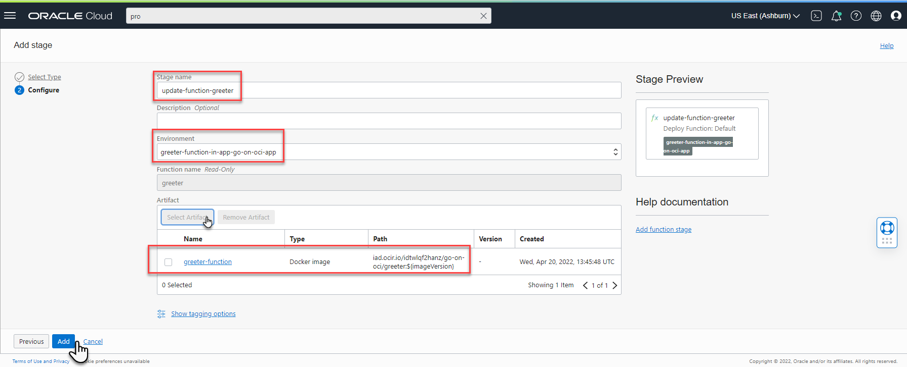  

Click on *Add*. The pipeline stage is created in the pipeline. And the pipeline is now ready to be executed -- its definition is complete. Or is it? The artifact this pipeline makes use of is not unequivocally defined: the version label in the path for the container image contains the placeholder `${imageVersion}`. To ensure the proper version is used for deployment, this placeholder needs to be replaced with the right value. And that is arranged by defining a parameter in the pipeline that is called `imageVersion` and is set to an existing version label.

Click on the *Parameters* tab for the pipeline. Define a new parameter called `imageVersion`. Its default value can be anything, but it might as well correspond to an existing version label for the greeter function container image. Save the parameter definition.

It would seem that the pipeline is ready to be executed, but we still have to make sure that it's allowed to do its job. Before you try anything rash, read the next section.

### Dynamic Group and Policies

In the previous article, a dynamic group was defined for all deployment pipelines in the compartment. The new pipeline is automatically a member of that group. We also defined a policy that granted permissions to the dynamic group to read all artifacts, which includes (Function) Container Images in the compartment's Container Image Registry repositories. Another policy that was also already created grants the dynamic group the very broad permission to manage all resources in the compartment. We can benefit from the broad scope of that policy, as it also covers creation and update of functions.

### Run the Deployment Pipeline

Run the Deployment Pipeline by pressing *Run pipeline*. 

Once the deployment is complete, you will see the green markers that proclaim success. However, there is no other obvious indication of this success because the end result is exactly the situation we had achieved with manual deployment of the function from the Fn CLI command line.

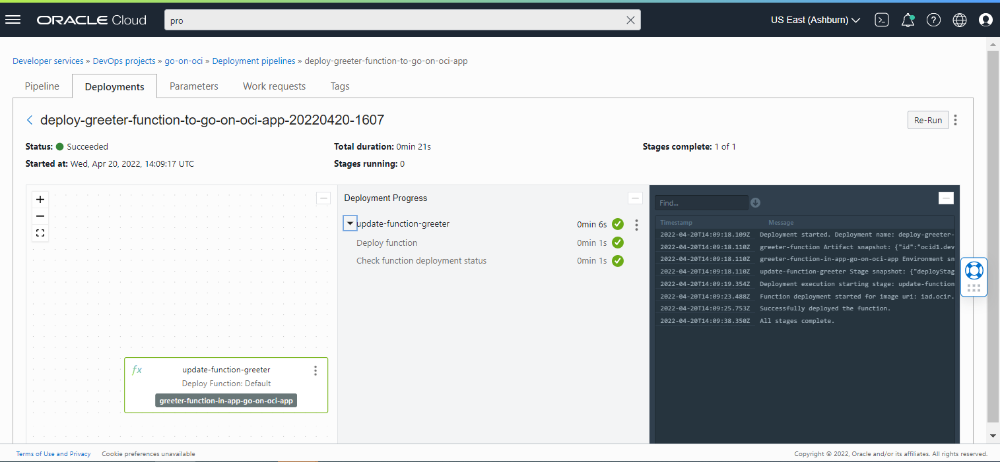  

To make things a little bit more interesting, we will make a change to the function's code. Then, build the container image for the function (locally) and push the new function image to the container image registry. Then we'll start the deployment pipeline once again; this time, when successful, it will render a new situation which we can experience by invoking the *my-api/greeting* route on the API Gateway.

#### Change Function Implementation

Make a small but visible change to `func.go` in your local environment: ensure that the response from the new version of the function looks noticeably different from the current version. Save the change.  

In the next sections, we will build a new version of the function container image from the changed source and eventually make it run on OCI Functions. 

#### Build a new Function Container Image (locally)

These next commands will first modify the version label used to tag the function with an increase in the third digit (`bm` is short for `bump`). Next, the function container image is built using the changed sources. The third command lists the local container images, filtering on images with *greeter* in their name. Now please execute the commands.

```console
fn bm
fn build 
docker images | grep greeter
```

You should be able to find the newly built image with its fully qualified name, including the OCI region key, the namespace, the repository prefix, and the function name *greeter*, with the version label appended.  

#### Tag Container Image with a New Version Label and Push to Registry

Let's define a new identifier for the image, using this command that sets the version label to *0.1.0*:

```console
docker tag <fully qualified image name>:<newly assigned bumped version label>  <fully qualified image name>:0.1.0
```

Then push the new function container image to the OCI Container Image Registry repository, using:

```console
docker push <fully qualified image name>:0.1.0
```

Note that at this point we have not redeployed the function based on this new version of the container image. All we did is build the image and push it to the registry on OCI. Invoking the OCI Function will not show any difference.

#### Run the Deployment Pipeline (for the new Function Image)

Run the deployment pipeline one more time. Set the value of parameter `imageVersion` to *0.1.0*. 

When the pipeline is successfully completed, the new version of the function with all the exciting changes you applied to it is live.

#### Invoke the Newly Deployed Function

You can see the new function version in action by invoking it on the command line using Fn CLI:

```console
fn invoke go-on-oci-app greeter
```

(Because the Fn CLI's context is still *go-on-oci* from the Oracle provider and configured for the *go-on-oci* compartment that contains the *greeter* function, this call will be directed to the OCI Function, which at this point is based on new version of the container image.)

Alternatively you can `curl` to the route on the API Gateway that invokes the function:

```console
curl -X "GET" -H "Content-Type: application/json" -d '{"name":"Mickey Mouse"}' https://<API Gateway endpoint>/my-api/greeting
```

## Automated Build of Functions

Until now, we've built the function container image by hand in the local development environment using the Fn CLI. However, just as we did in the previous article for the Go application that was produced as an executable by a Build Pipeline, we will now turn the building of the function into an automated process. An OCI DevOps Build Pipeline is created to take sources from the Code Repository, run a managed build stage that produces a local container image, and then publish this image as an artifact to the Container Image Registry repository. As a last step, the Build Pipeline triggers the Deployment Pipeline to publish the latest definition of the function to the runtime OCI Functions environment.

When all the elements are in place, the total interconnected set of OCI components looks as visualized in the next figure.

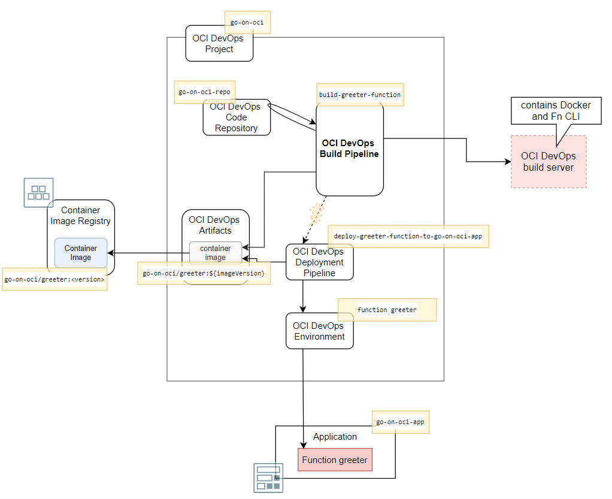  

The artifact and the deployment pipeline shown in this figure are already defined in the DevOps project, as are the Application, Function, and Container Image Registry repository for the images for the function.  We will use the Code Repository set up in the previous article. All we need to create is the Build Pipeline *build-greeter-function* with its three stages.

#### Create the Build Pipeline

On the overview page for DevOps Project *go-on-oci*, click on button *Create build pipeline*. A page is presented for specifying the name -- e.g. *build-greeter-function* -- and a description. Press *Create* to have the build pipeline added to the DevOps Project.

Click on the link *build-greeter-function* in the list to navigate to the details page.

#### First Stage -- Managed Build

The first stage in any build pipeline is a *Managed Build* stage. This stage provides instructions for the pipeline to get hold of a build server, copy specified sources from code repositories to the server, and run through a number of actions on that server. At the time of this writing, we can use a single image for the build server. It is an Oracle Linux image (8 GB memory, 1 OCPU) that has a number of pre installed tools and language run times. For building the function container image, it is relevant that the build server is equipped with both Docker and Fn CLI.

Click on either the plus icon or the *Add Stage* card. The two-step *Add a stage* wizard appears. On step one in the wizard, make sure that the *Managed Build* card is selected for the type of stage. Press *Next*.

The second page is shown. Define a name for the build stage: *build-go-source-to-function-container-image*. Optionally add a description.  

At present, we cannot select a different build image, so we settle for the one available, which is fine for our purposes.

Set the *Build spec file path* to `/functions/greeter/go-function-build-spec.yaml`. This file contains the instructions for building the Go sources in the *greeter* function (or any other Go function) and finally building the function container image.  

Click on the *Select* button under *Primary code repository*. We can now specify from which code repository the build will get its sources. Select *OCI Code Repository* as the *Source Connection Type*. Then select the *go-on-oci-repo* repository. We will work with sources on the main branch, so do not change that default. Type *go-on-oci-sources* as the value for *Build source name*. A managed build stage can use sources from multiple repositories. In the build specification, we can refer to each of these sources' root locations using the label defined as *Build source name*. Click on *Save*. 

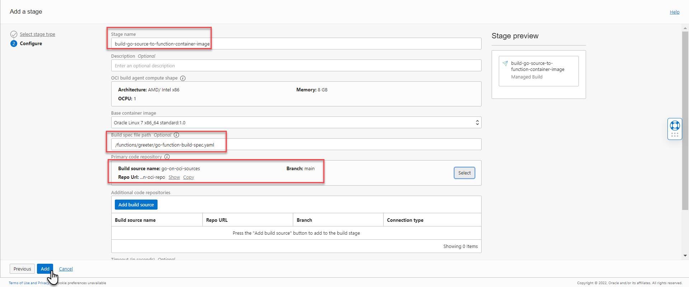  

Press button *Add*. This completes the definition of the managed build stage. This is all that's needed to take sources and process them into artifacts. The detailed instructions executed by this managed build stage and on the build server are defined in the `go-function-build-spec.yaml` file. It is this file that contains the instructions for the actual detailed steps executed on the build server.

```yaml
version: 0.1
component: build
timeoutInSeconds: 6000
runAs: root
shell: bash
env:
  # these are local variables to the build config
  variables:
     SOURCE_DIRECTORY: "go-on-oci-sources/functions/greeter"
     FUNCTION_NAME: "greeter"

  # # the value of a vaultVariable is the secret-id (in OCI ID format) stored in the OCI Vault service
  # you can then access the value of that secret in your build_spec.yaml commands
  vaultVariables:

  # exportedVariables are made available to use in sucessor stages in this Build Pipeline
  # For this Build to run, the Build Pipeline needs to have a BUILDRUN_HASH parameter set
  exportedVariables:
    - BUILDRUN_HASH


steps:
  - type: Command
    name: "Export variables"
    timeoutInSeconds: 40
    command: |
      export BUILDRUN_HASH=`echo ${OCI_BUILD_RUN_ID} | rev | cut -c 1-7`
      echo "BUILDRUN_HASH: " $BUILDRUN_HASH
      echo "fully qual sources" ${OCI_WORKSPACE_DIR}/${SOURCE_DIRECTORY}
      echo "container image version from build pipeline parameter" ${imageVersion}      
      go version

  - type: Command
    timeoutInSeconds: 600
    name: "Install golangci-lint"
    command: |
      curl -sSfL https://raw.githubusercontent.com/golangci/golangci-lint/master/install.sh | sh -s -- -b $(go env GOPATH)/bin v1.37.1

  - type: Command
    timeoutInSeconds: 600
    name: "Verify golangci-lint version"
    command: |
      /root/go/bin/golangci-lint version

  - type: Command
    timeoutInSeconds: 600
    name: "Run go mod tidy for Go Application"
    command: |
      cd ${OCI_WORKSPACE_DIR}/${SOURCE_DIRECTORY}
      go mod tidy

  - type: Command
    timeoutInSeconds: 600
    name: "Run go vet for Go Application"
    command: |
      cd ${OCI_WORKSPACE_DIR}/${SOURCE_DIRECTORY}
      go vet .

  - type: Command
    timeoutInSeconds: 600
    name: "Run gofmt for Go Application"
    command: |
      gofmt -w ${OCI_WORKSPACE_DIR}/${SOURCE_DIRECTORY}

  - type: Command
    timeoutInSeconds: 600
    name: "Run Lint for Go Application"
    command: |
      cd ${OCI_WORKSPACE_DIR}/${SOURCE_DIRECTORY}
      /root/go/bin/golangci-lint run .

  - type: Command
    timeoutInSeconds: 600
    name: "Run Unit Tests for Go Application (with verbose output)"
    command: |
      cd ${OCI_WORKSPACE_DIR}/${SOURCE_DIRECTORY}
      go test -v 
  
  - type: Command
    timeoutInSeconds: 600
    name: "Build Go Function into Function Container Image"
    command: |
      cd ${OCI_WORKSPACE_DIR}/${SOURCE_DIRECTORY}
      pwd
      fn build --verbose
      image=$(docker images | grep $FUNCTION_NAME  | awk -F ' ' '{print $3}') ; docker tag $image go-function-container-image    


outputArtifacts:
  - name: go-function-container-image
    type: DOCKER_IMAGE
    # this location tag doesn't effect the tag used to deliver the container image
    # to the Container Registry
    location: go-function-container-image:latest
```

The build specification consists of three parts: 

1. Set up who to run the script as, which shell to use, and which variables to use
2. **Build steps**: Shell commands to execute on the build server
3. **Output Artifacts** indicate which files at the end of all build steps are meaningful and to be made available to other steps in the pipeline (for example to publish as artifact)

The build steps can be summarized as: 

1. Print environment variables and currently installed Go version (on the vanilla build server)
2. Install `golangci-lint`
3. Verify success and version of `golangci-lint` installation
4. Run `go mod tidy` to organize the go.mod file with dependencies
5. Run `go vet` to run a first inspection on the Go Sources
6. Run `go fmt` to format the sources according to generic formatting rules
7. Run `golangci-lint` to lint (check) the sources against various linting rules
8. Run unit tests
9. Build function sources into a _Function Container Image_ using the Fn CLI (store in local image registry)
10. Tag the _Function Container Image_ with the name *go-function-container-image*. This is the name used in the next stage to find the image to publish

These steps are largely equivalent to the managed build defined in the previous article for the Go application that was finally turned into a binary executable deployed on a VM. Steps 9 and 10 are different -- these turn the Go application into a _Function Container Image_ that is the final product of the build.

#### Second Stage -- Publish Artifact

In the overview page for the build pipeline, click on the plus icon at the bottom of the current managed build stage. In the context menu that pops up, click on *Add stage*. The stage wizard appears.

Click on *Deliver artifacts*. Then click *Next*.

Enter the name for this stage: *publish-greeter-function-container-image*. We need to select the artifact in the DevOps project that we want to publish. This artifact is the container image *go-on-oci/greeter:${imageVersion}*. Click on *Select artifact(s)* and select the container image.

In the area *Associate artifacts with build result*, we have to indicate for each of the artifacts selected which of the outcomes of a managed build stage is the source for publishing the artifact. The build specification defines an output labeled *go-function-container-image*. This output refers to the container image that is produced on the build server by the function build process. Enter the label *go-function-container-image* in the field *Build config/result artifact name*. The press the *Add* button to create the *Deliver Artifacts* stage.

#### Third Stage -- Trigger Deployment Pipeline

In the overview page for the build pipeline, click on the plus icon at the bottom of the *Deliver artifacts* stage. In the context menu that pops up, click on *Add stage*. The stage wizard appears.

Click on *Trigger deployment*. Then click on *Next*. 

Type a name for the stage: *trigger-deployment-of-greeter-function-to-go-on-oci-app*, and optionally a description. Click on the button *Select deployment pipeline*. Select the pipeline *deploy-greeter-function-to-go-on-oci-app*. Details of the pipeline are shown, including parameters (*imageVersion*) and the artifact used by the deployment.

Click on *Add* to complete the stage definition and add it to the build pipeline.

This completes the build pipeline: it grabs sources, processes them into a deployable artifact, publishes the artifact to the image repository and triggers the deployment pipeline to take it from there.

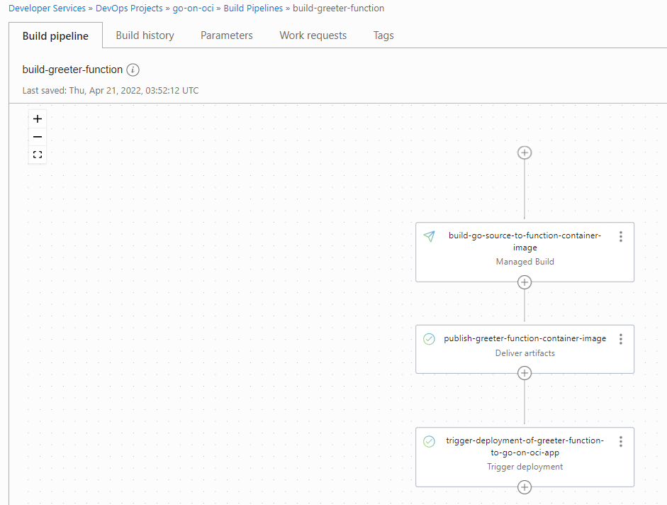  

### Run Build Pipeline and Trigger Deployment Pipeline

Click on *Start manual run*. Define a value for parameter *imageVersion*, e.g. *0.2.0*. Click on the button to launch the build pipeline.

It will now take a few minutes to complete the build pipeline and trigger the subsequent deployment of the newly built function image. 

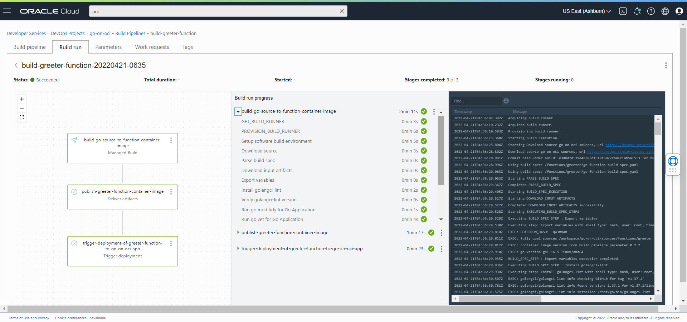  

When all is done and success is reported, you can invoke the route on the API Gateway that leads to the *greeter* function to check if the response is indeed the new one expected.

```console
curl -X "GET" -H "Content-Type: application/json" -d '{"name":"Mickey Mouse"}' https://<API Gateway endpoint>/my-api/greeting

{"message":"Extremely hot greetings from your automatically built and deployed function dear  Mickey Mouse"}
```

This is a moment for a little celebration. We have achieved an automated end-to-end process that takes Go application sources from the Code Repository and delivers -- after linting, vetting, testing and building -- a live running new version of a serverless OCI Function. To produce further updates to the function, all we need to do is commit the change and trigger the build pipeline. And as a next step, we can even trigger the build pipeline automatically when a (specific) commit happens in the Code Repository. 

In the second part of this article, we will discuss using OCI services from Go applications in general, and from Go functions in particular. The use of the Go SDK for OCI is introduced and interactions with the OCI Object Storage Service is demonstrated.

## Go SDK for OCI -- Interaction with OCI Object Storage from Go applications

Oracle Cloud Infrastructure is the platform that can build and run applications developed in Go. Either in compute instances or as serverless functions, and also containerized on a managed Kubernetes cluster (as we will discuss in part five of this series). It is good to realize that OCI is much more for Go development teams than a runtime platform. OCI offers many services that can be leveraged from applications. Services for storing files, relational or "NoSQL" data, for handling publication and consumption of messages. Services for transferring and analyzing data. And services that support operations on applications, such as monitoring.

Interacting with OCI services can be done through the REST APIs available for every aspect of all services. Calling REST services with JSON payloads over HTTP is easy enough from a Go application. There is one complicating factor: these API calls need to be signed. The Oracle Cloud Infrastructure signature uses the "Signature" Authentication scheme (with an Authorization header), and the signing process is not exactly trivial. For details on this signing process, see [OCI Documentation -- OCI REST API Request Signatures ](https://docs.oracle.com/en-us/iaas/Content/API/Concepts/signingrequests.htm#Request_Signatures).

Fortunately for development of Go applications that call out to OCI services, we can make use of the Go SDK for OCI. This open source development kit facilitates signing the OCI API requests. Using the SDK, the calls to OCI services are made as local calls using strongly-typed predefined structs instead of dealing with JSON request and response bodies. The Go SDK for OCI uses the same `config` file that we used earlier for the Fn CLI and the OCI CLI. The default location for this file is `$HOME/.oci`. This file directs the Go SDK to a specific tenancy and region for a user account using the private key half of the pair set up for the user. Go applications that use the Go SDK for OCI can simply build on this configuration without having to deal with any of the details. 

The documentation for the Go SDK for OCI can be found in the [OCI Documentation -- SDK for Go](https://docs.oracle.com/en-us/iaas/Content/API/SDKDocs/gosdk.htm).

In this section, we will develop a simple Go application that uses the OCI Object Storage Service for creating and reading files. At first, this is a standalone application that can be compiled and run everywhere (as long as the OCI config file us available). Then we discuss running the Go application inside OCI -- on a VM or as Function. This special focus is relevant because when the Go SDK is used inside OCI, it can leverage the identity and privileges of the component running the application. That means that code running on OCI does not need to bring their own OCI config file, and thus is even simpler.

### Any Go Application talking to OCI Object Storage Service

First, let us create a very simple Go application that can connect to OCI through the SDK. Next, we'll use this foundation to add the interaction with the Object Storage Service. 

#### The Simplest Go Client of OCI

The simplest Go application that talks to OCI using the Go SDK for OCI is created as follows:

1. Create a directory for the application
2. Create `go.mod` file with dependencies on Go SDK for OCI package
3. Run `go mod tidy` to create `go.sum` file and download required packages
4. Create file `oci-client.go` with the code for talking to OCI 

The assumption is that the OCI configuration file that was discussed earlier in this article is located in the default location with the default name: `$HOME/.oci/config`. If the file is in a different location, you can make use of the function `ConfigurationProviderFromFile` in the package *github.com/oracle/oci-go-sdk/v65/common*, which accepts the custom location of the config file. 

The `go.mod` file contains this contents:

```go
module oci-client

go 1.16

require github.com/oracle/oci-go-sdk/v65 v65.2.0
```

The `github.com/oracle/oci-go-sdk/v65` bit references the most recent (at the time of writing) version of the Go SDK. The sources are downloaded based on this reference. In the Go application, this means that we can leverage the packages in the SDK to access various services in the OCI portfolio.

File `oci-client.go` contains this code that uses the *common* and *identity* packages:

```go
package main

import (
	"context"
	"fmt"

	"github.com/oracle/oci-go-sdk/v65/common"
	"github.com/oracle/oci-go-sdk/v65/identity"
)

func main() {    
	c, _ := identity.NewIdentityClientWithConfigurationProvider(common.DefaultConfigProvider())
	tenancyID, _ := common.DefaultConfigProvider().TenancyOCID()
	request := identity.GetCompartmentRequest{
		CompartmentId: &tenancyID,
	}
	response, _ := c.GetCompartment(context.Background(), request)
	fmt.Printf("Name of Root Compartment: %v", *response.Compartment.Name)
}

```

The first line in the function acquires the client that can subsequently be used for most interactions with OCI, such as the `GetCompartment` call that returns the details for the root compartment. 

The application can be executed using `go run oci-client.go` and will produce very simple output:

```
Name of Root Compartment: <name of your OCI tenancy>
```

Even though the result is not especially remarkable, the fact that there is output is proof that the Go SDK for OCI is working and is ready to be leveraged for more lofty activities.

Note that the code completely ignores the errors that can occur. If you run into errors, replace the underscores with a variable to capture and handle that error. 

#### Go Application Creating and Retrieving Objects in and from OCI Object Storage Service

The OCI Object Storage Service offers cheap and persistent storage for different types of data. Objects, large and small, can programmatically be stored on this service to be retained for short or long periods of time, and to be accessed programmatically or through direct URLs. Object Storage provides versioning, different retention rules, encryption of any stored data, object lifecycle management, automated time-based removal, and different storage tiers. 

Objects on Object Storage Service are organized in *buckets*. A bucket is a logical container of objects that lives in a specific compartment. Some operations can be performed on all objects in a bucket.

The Go SDK for OCI offers functions and types that make it easy and straightforward to work with the Object Storage Service from Go applications. Operations to manipulate buckets and create, delete, and retrieve objects are readily available.    

For details on the Object Storage package in the Go SDK for OCI, check out this reference: [Documentation for Object Storage Package in Go SDK for OCI](https://pkg.go.dev/github.com/oracle/oci-go-sdk/v65@v65.2.0/objectstorage).

The source repository for this article contains the folder `applications/store-n-retrieve`, which has a simple Go application that connects to your OCI tenancy and creates a bucket, followed by the creation of an object and retrieval of that same object. The application uses the same `DefaultConfigProvider` that was used the previous section to sign requests to OCI APIs using the `$HOME/.oci/config` file.

The dependency of this application on the Go SDK for OCI is defined in `go.mod`.

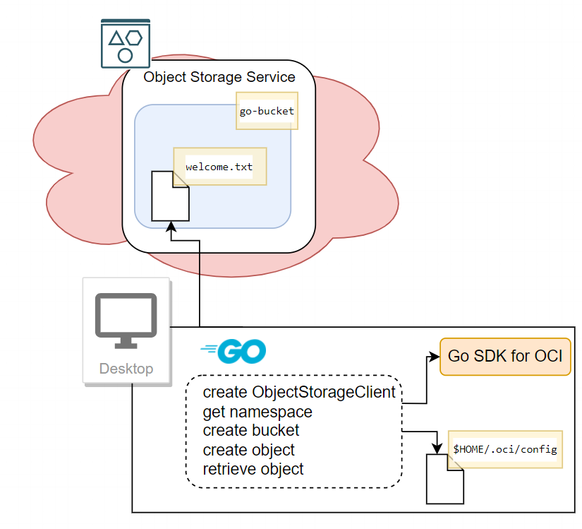  

The first part of the code creates an `ObjectStorageClient` instance. Many functions are defined on the underlying interface -- all supporting some form of interaction with the Object Storage Service. The `ObjectStorageClient` is created using `common.DefaultConfigProvider()` (just as before), using the default OCI configuration file with a reference to a file containing the private key. 

Function `getNamespace` is called to get the *namespace* for the current tenancy. Then `ensureBucketExists` is called with the name of bucket to create the bucket if it does not already exist. 

```go
package main

import (
	"bytes"
	"context"
	"fmt"
	"io"
	"io/ioutil"

	"github.com/oracle/oci-go-sdk/v65/common"
	"github.com/oracle/oci-go-sdk/v65/objectstorage"
)

const (
	bucketName      = "go-bucket" // feel free to use a different name for the bucket
	compartmentOCID = "<compartment-OCID" // replace with the OCID of the go-on-oci compartment in your tenancy
	objectName      = "welcome.txt" // feel free to use a different name for the object
)

func main() {
	objectStorageClient, cerr := objectstorage.NewObjectStorageClientWithConfigurationProvider(common.DefaultConfigProvider())
	if cerr != nil {
		fmt.Printf("failed to create ObjectStorageClient : %s", cerr)
	}
	ctx := context.Background()
	namespace, cerr := getNamespace(ctx, objectStorageClient)
	if cerr != nil {
		fmt.Printf("failed to get namespace : %s", cerr)
	} else {
		fmt.Printf("Namespace : %s", namespace)
	}

	err := ensureBucketExists(ctx, objectStorageClient, namespace, bucketName, compartmentOCID)
	if err != nil {
		fmt.Printf("failed to read or create bucket : %s", err)
	}
  .........................
```

The functions invoked in this snippet to retrieve the namespace and check the existence of the bucket (and create it if it does not exist) are quite straightforward. They are defined as follows:

```go
func getNamespace(ctx context.Context, client objectstorage.ObjectStorageClient) (string, error) {
	request := objectstorage.GetNamespaceRequest{}
	response, err := client.GetNamespace(ctx, request)
	if err != nil {
		return *response.Value, fmt.Errorf("failed to retrieve tenancy namespace : %w", err)
	}
	return *response.Value, nil
}

func ensureBucketExists(ctx context.Context, client objectstorage.ObjectStorageClient, namespace string, name string, compartmentOCID string) error {
	req := objectstorage.GetBucketRequest{
		NamespaceName: &namespace,
		BucketName:    &name,
	}
	// verify if bucket exists.
	response, err := client.GetBucket(ctx, req)
	if err != nil {
		if response.RawResponse.StatusCode == 404 {
			err = createBucket(ctx, client, namespace, name, compartmentOCID)
			return err
		}
		return err
	}
	fmt.Printf("bucket %s already exists", bucketName)
	return nil
}

// bucketname needs to be unique within compartment. there is no concept of "child" buckets. using "/" separator characters in the name, the suggestion of nested bucket can be created
func createBucket(ctx context.Context, client objectstorage.ObjectStorageClient, namespace string, name string, compartmentOCID string) error {
	request := objectstorage.CreateBucketRequest{
		NamespaceName: &namespace,
	}
	request.CompartmentId = &compartmentOCID
	request.Name = &name
	request.Metadata = make(map[string]string)
	request.PublicAccessType = objectstorage.CreateBucketDetailsPublicAccessTypeNopublicaccess
	_, err := client.CreateBucket(ctx, request)
	if err != nil {
		return fmt.Errorf("failed to create bucket on OCI : %w", err)
	} else {
		fmt.Printf("created bucket : %s", bucketName)
	}
	return nil
}
```

The second part of this application creates an object in the bucket and subsequently retrieves that object. When the application is done executing, it will have a persistent effect: the bucket has been created (if it did not already exist) and an object was created or updated (if the application has been run before). You can check in the details page for bucket *go-bucket* in the OCI console to see both the bucket and the object that was created.  

```go
..................

	contentToWrite := []byte("We would like to welcome you in our humble dwellings. /n We consider it a great honor. Bla, bla.")
	objectLength := int64(len(contentToWrite))
	err = putObject(ctx, objectStorageClient, namespace, bucketName, objectName, objectLength, ioutil.NopCloser(bytes.NewReader(contentToWrite)))
	if err != nil {
		fmt.Printf("failed to write object to OCI Object storage : %s", err)
	}

	var contentRead []byte
	contentRead, err = getObject(ctx, objectStorageClient, namespace, bucketName, objectName)
	if err != nil {
		fmt.Printf("failed to get object %s from OCI Object storage : %s", objectName, err)
	}
	fmt.Printf("Object read from OCI Object Storage contains this content: %s", contentRead)
}

func putObject(ctx context.Context, client objectstorage.ObjectStorageClient, namespace string, bucketName string, objectname string, contentLen int64, content io.ReadCloser) error {
	request := objectstorage.PutObjectRequest{
		NamespaceName: &namespace,
		BucketName:    &bucketName,
		ObjectName:    &objectname,
		ContentLength: &contentLen,
		PutObjectBody: content,
	}
	_, err := client.PutObject(ctx, request)
	fmt.Printf("Put object %s in bucket %s", objectname, bucketName)
	if err != nil {
		return fmt.Errorf("failed to put object on OCI : %w", err)
	}
	return nil
}

func getObject(ctx context.Context, client objectstorage.ObjectStorageClient, namespace string, bucketName string, objectname string) (content []byte, err error) {
	request := objectstorage.GetObjectRequest{
		NamespaceName: &namespace,
		BucketName:    &bucketName,
		ObjectName:    &objectname,
	}
	response, err := client.GetObject(ctx, request)
	if err != nil {
		return nil, fmt.Errorf("failed to retrieve object : %w", err)
	}
	buf := new(bytes.Buffer)
	_, err = buf.ReadFrom(response.Content)
	if err != nil {
		return nil, fmt.Errorf("failed to read content from object on OCI : %w", err)
	}
	return buf.Bytes(), nil
}
```

Running this application -- `go run object-organizer.go` -- results in this output:

```
Namespace : idtwlqf2hanz
created bucket : go-bucket
Put object welcome.txt in bucket go-bucket
Object read from OCI Object Storage contains this content: We would like to welcome you in our humble dwellings. /n We consider it a great honor. Bla, bla.
``` 


### Go based OCI Functions talking to OCI Object Storage Service

The previous section discussed any Go application interacting with OCI services through the SDK. So what more is there to say about OCI Functions in Go? Please read on, because it turns out we can make life simpler when the Go code you develop and from which you want to work with the Go SDK will be deployed as an OCI function or run on a compute instance in OCI. In these cases, we can leverage *Resource Principal Authentication* (for Functions) and *Instance Principal Authentication* (for code running on a Compute Instance), which means that we do not have to include the OCI Configuration file, and our code that talks to the SDK can be a bit simpler. 

Read more about Resource Principal Authentication in the [OCI Documentation on Resource Principal Authentication for Functions](https://docs.oracle.com/en-us/iaas/Content/Functions/Tasks/functionsaccessingociresources.htm). 

In this section, we discuss an OCI Function called *object-broker*. You will find the sources in the source repository for this article, in path `functions/object-broker`. As before, the function is defined using a `func.yaml` file with metadata, and a `func.go` file with the link between the function and the Fn framework. File `go.mod` defines the dependencies for the function. The logic for interacting with OCI Object Storage Service is in the file `object-organizer.go`. That defines a public func `CreateObject` that is called from `func.go`. 

`CreateObject` creates an object with the specified name in the specified bucket. The first lines in the function `CreateObject` in `object-organizer.go` have undergone some modification in order to work with this *resource principal authentication*. The `auth.ResourcePrincipalConfigurationProvider()` used now does not require that an OCI configuration file and private key be included in the application. It assumes that the code runs inside OCI and more specifically inside a resource (which can be a Function or for example a DevOps Build Server) that is known as a resource principal because it is included in a dynamic group and inherits permissions from that group membership. Before too long, you will get to the instructions for taking the measures required for this.

```go
func CreateObject(objectName string, bucketName string, compartmentOCID string) (string, err) {
	configurationProvider, err := auth.ResourcePrincipalConfigurationProvider()
	if err != nil {
		fmt.Printf("failed to get oci configurationprovider based on resource principal authentication : %s", err)
	}
	objectStorageClient, cerr := objectstorage.NewObjectStorageClientWithConfigurationProvider(configurationProvider)
```

Let's turn our attention next to `func.go`. Func(tion) `myHandler` handles the function trigger. It invokes `CreateObject`, but not before it has determined the name of the object the request should produce and the bucket name for the bucket that is to contain the object. These names have a default value, but the function tries to find HTTP request query parameter values that provide specific values. Note this only works for an HTTP trigger to the function, and not for a call made using `fn invoke`.

```go
func myHandler(ctx context.Context, in io.Reader, out io.Writer) {
	objectName := "defaultObjectName.txt"
	bucketName := "the-bucket"
	fnctx := fdk.GetContext(ctx)             // fnctx contains relevant elements about the Function itself
	fnhttpctx, ok := fnctx.(fdk.HTTPContext) // fnhttpctx contains relevant elements about the HTTP Request that triggered it
	if ok {                                  // an HTTPContent was found which means that this was an HTTP request (not an fn invoke) that triggered the function
		u, err := url.Parse(fnhttpctx.RequestURL())
  ......
```  

You may want to inspect details about the Fn Context in [Documentation for Project Fn Go FDK](https://pkg.go.dev/github.com/fnproject/fdk-go), specifically in the `example`.

The function needs to know in which OCI compartment the bucket should reside. Such runtime settings are typically defined on either the function of the application through a *configuration*. The values of configurations can be read in the function from a map in the context, as is shown in this line: 

```go
	if compartmentOCID, ok := fnctx.Config()["compartmentOCID"]; ok { 
```

#### Build and Deploy the Function using Fn CLI

Assuming you are in a terminal in the local development environment where the Fn CLI is installed and the current directory is `functions/object-broker`, you can perform a local build of the function with verbose output:

```console
fn -v build
```

When the build looks good, the next step to take is deployment of the function. If the Fn context is set to use the *go-on-oci* context (check with `fn list contexts`) then this will deploy the function to the `go-on-oci-app` application on OCI:

```console
fn -v deploy --app go-on-oci-app
```

The function can only do a meaningful job if the configuration has been defined for the compartment OCID value. You can do this through the console or using this next statement with the Fn CLI:

```console
fn cf f go-on-oci-app object-broker compartmentOCID <compartment-ocid>
```

Now the function is deployed and has its configuration. You may expect that a call to the function with this command will be successful:

```console
fn invoke go-on-oci-app object-broker
```

However, there is one final aspect to handle: the function uses OCI Object Storage Service APIs to manipulate buckets and objects, but it needs to have been explicitly granted permissions to do that! We use a dynamic group and two policies to achieve this.

#### Permissions for Functions to manipulate Objects and Buckets

Just as we used dynamic groups to create a grantee representing the deployment pipelines and the build pipelines, we need to also create a dynamic group that contains the functions to which we want to grant permissions. To create the dynamic group, type *dyn* in the search bar. Click on the link *Dynamic Groups* in the search results pane.

On the overview page for dynamic groups and click on *Create Dynamic Group*.

Enter the name for the Dynamic Group for the Deployment Pipeline(s), e.g. *functions-in-go-on-oci*, and optionally type a description. Define the following rule that selects all functions that are part of the compartment:

```
All {resource.type = 'fnfunc', resource.compartment.id = '<compartment_id>'}
``` 

Of course, replace `<compartment_id>` with the identifier of the compartment you are working in. Then press *Create*.

To create a policy in the console: type *poli* in the search bar and click on *Policies \| Identity* in the *Services* area in the search results popup. This takes you to the *Policies* overview page for the current compartment.

The first policy statement defines the permission for the function to manage objects in the compartment. The second statement adds the permission for managing buckets. Define a name, a description, and the following statements:

```
allow dynamic-group functions-in-go-on-oci to manage objects in compartment go-on-oci
allow dynamic-group functions-in-go-on-oci to manage buckets in compartment go-on-oci
```

The next figure depicts the permissions that now apply to the function when the policy containing these statements is saved:

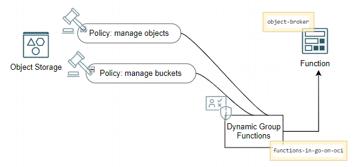  

Now the function can be invoked and should be able to do its thing using the default names for bucket and object.

```console
fn invoke go-on-oci-app object-broker
```

Verify that the bucket is created and and contains the freshly created object using the console from the [OCI URL to the buckets page](https://cloud.oracle.com/object-storage/buckets).

#### Add Route in API Gateway to Trigger Function

To be able to invoke the `object-broker` function over HTTP from anywhere, we will again make use of the API Gateway. Type *gat* into the search bar in the console. Click on *Gateways \| API Management*. Click on the link for *the-api-gateway*. Click on *Deployments*. In the list with deployments -- which contains a single deployment -- click on the link *myserver-api*. 

Click on *Edit* to open the deployment specification. Click on the link for the second step: *Routes*. Scroll down and click on *+ Another Route*.

Type */object-broker* as the path for this new route. Select *GET* as the method and *Oracle Functions* as the Type (of backend). Select application *go-on-oci-app*, and then set *Function Name* to *object-broker*. Press *Next*, then press *Save Changes* to apply the changes and make the new route real.

The end-to-end picture that is now configured from HTTP consumer through API Gateway to Function and finally bucket and object looks like this:

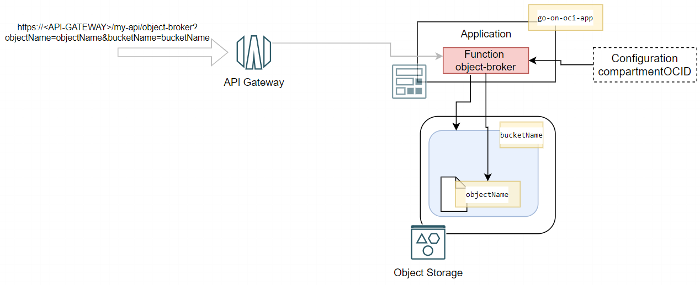  

Invoke the function from the browser or using `curl` on the command line using:

```console
curl -X "GET" "http://<API Gateway endpoint>/my-api/object-broker?objectName=new-exciting-object.txt&bucketName=the-ultimate-collection"
```

#### Automated Build and Deployment

This function `object-broker` was deployed manually on the command line using the Fn CLI. That worked fine of course. However, if you were now to start development on this function, going through multiple development cycles, you would probably want to introduce automation in the build-and-deploy process.

Just as we have done before, you can easily set up the required elements in OCI DevOps to achieve automated pipelines for the deployment (of the function container image in the container image registry) and the build (starting from the code repository and resulting in a freshly-baked container image for the function). The main element that is specific to the function is the build specification file for the managed build stage in the build pipeline. This file is provided as `go-function-build-spec.yaml` in the same directory as `func.go` and `func.yaml`. 

After creating a DevOps artifact for the Function Container Image, an environment for the Function, and the two pipelines for build and deployment, the automated DevOps process set up would look like this:

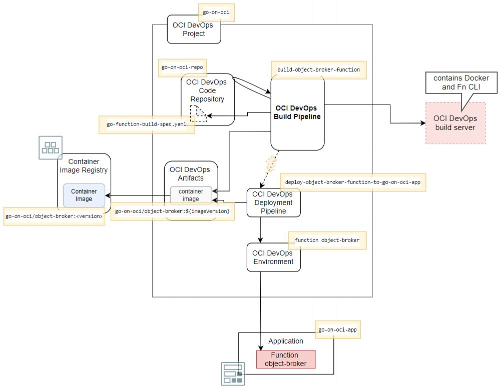  

## Conclusion

One focus area in this article was serverless functions, written in Go and running on Oracle Cloud Infrastructure. The automated build and deployment of these functions was discussed, as was the use of API Gateway to provide access to the function to external HTTP consumers. 

The second main topic was the Go SDK for OCI for interacting with OCI services from Go applications. The article showed how to use Go code to access the Object Storage service to store and retrieve files. 

The two topics were combined in function *object-broker*. This OCI Function leverages *resource principal authentication* and permissions granted through a dynamic group. Through a runtime configuration, the function learns about current environment specific settings.

In the next article, interacting with the Oracle Database will be the main topic. Creating a connection from a Go application to a local Oracle Database, as well as to an Autonomous Database running on OCI, and performing SQL operations with these databases from the comfort of your Go application. Further topics include working with an Oracle Wallet for proper management of database credentials, including the wallet in the deployment process, and combining interactions with the OCI Object Storage and the Autonomous Database services in a single application.

## Resources

[Source code repository for the sources discussed in this article series](https://github.com/lucasjellema/go-on-oci-article-sources) 

[OCI Documentation -- Functions](https://docs.oracle.com/en-us/iaas/Content/Functions/Concepts/functionsoverview.htm)

[Fn Project Tutorials -- Introduction to Fn with Go](https://fnproject.io/tutorials/Introduction/)

[Fn Project Tutorials -- Configure Context](https://github.com/fnproject/tutorials/blob/master/install/README.md#configure-your-context)

[Go FDK Documentation](https://github.com/fnproject/fdk-go)
