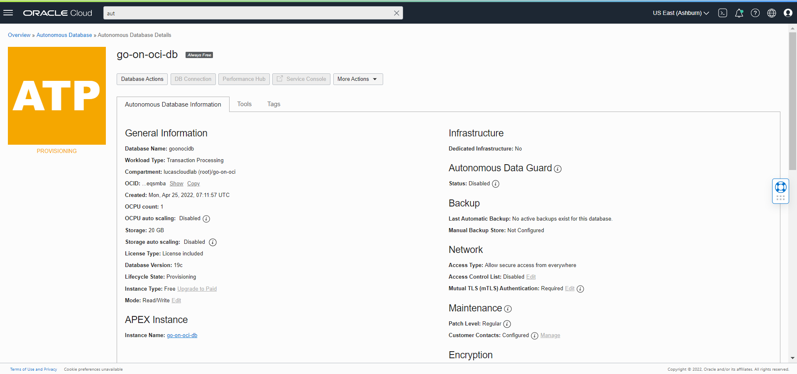
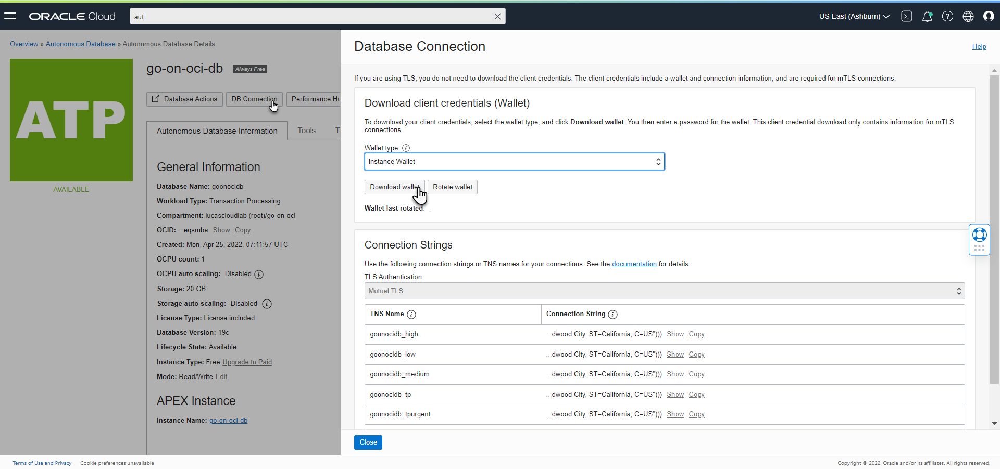
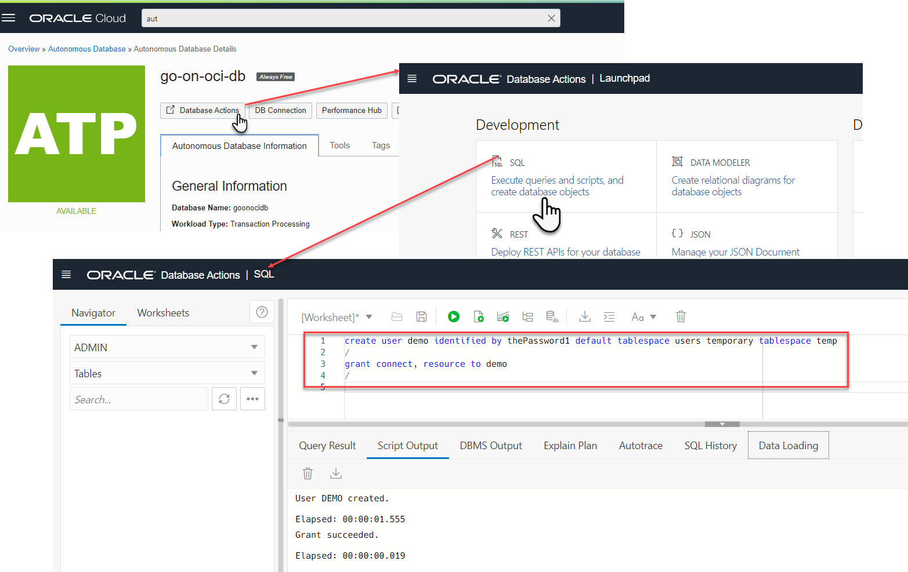
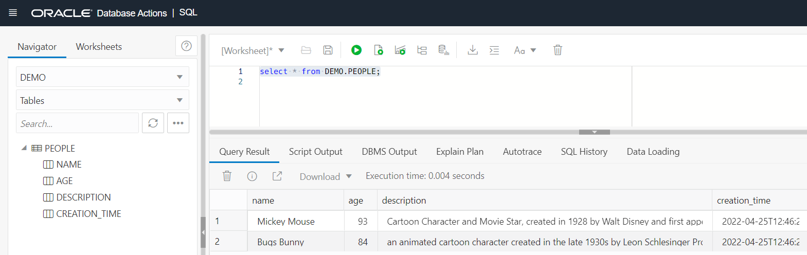
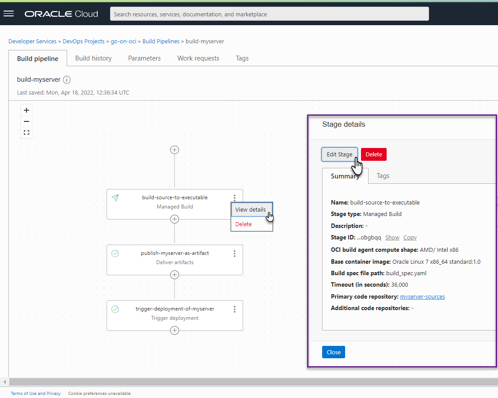
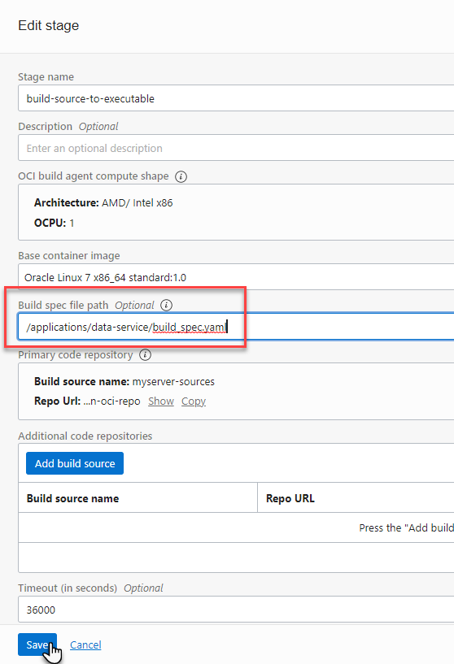
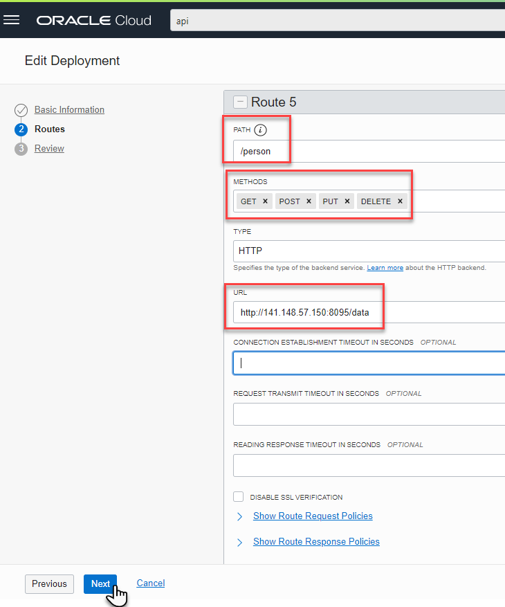
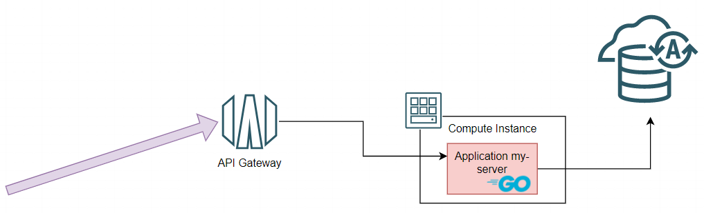
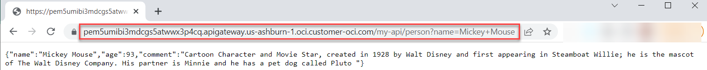



This is the fourth part of a five part series about Go and Oracle Cloud Infrastructure. This series discusses how Go applications can be created and run on Oracle Cloud Infrastructure - in Compute Instances (VMs), containerized on Kubernetes or as serverless Functions. The articles show how to automate the build and deployment of these Go applications using OCI DevOps. An important topic is how to use OCI services from Go applications - both those running on OCI as well as Go code running elsewhere. Some of the OCI services discussed are Object Storage, Streaming, Key Vault and Autonomous Database. 

In order to follow along with these articles, readers should have at least basic knowledge of how to create Go applications. It is assumed that readers have access to their own Go development environment. Some of the examples and screenshots will specifically mention VS Code as development tool. However, other editors and IDEs can be used as well. The Go code presented in these articles demonstrates a number of mechanisms in their simplest form for maximum clarity and with the least dependencies. Readers should not expect meaningful functionality or production ready code. 

The articles describe how to get Going on OCI and to try out the examples, readers will need to have access to an OCI tenancy with permissions to create the OCI resources discussed in these articles. Most of the resources used are available in the *Aways Free Tier* (Compute Instance, VCN, Autonomous Database, Object Storage, Logging, Resource Manager) or have a free allotment tier for limited monthly usage (Functions, API Gateway, Streaming, Vault, DevOps). 


## Introduction

The first part of these series describes provisioning of a Compute Instance based on the Oracle Linux Cloud Developer image, opening it up for inbound and outbound network activity, creating and running a Go application that serves HTTP requests and connecting logging produced by the application to OCI Logging. Part two deals with software engineering, automation of build and deployment of the application with the OCI DevOps service. This service is used for storing the Go source code, building the application executable and storing it as deployable artifact, deploying that artifact to a Compute Instance. The article also shows how to expose an HTTP endpoint for the application through an OCI API Gateway. Part three shows how to create serverless functions in Go and deploy them on OCI. The Go SDK for OCI is introduced - first for local, stand alone Go applications and subsequently for use from functions - leveraging resource principal authentication. This SDK is used to interact with the OCI Object Storage service for creating buckets and writing and reading files.  

Part four that you are reading right now discusses the interaction from your Go application with an Oracle Database. This can be a local or on premises database or a database running on some cloud vendor's IaaS instances or an Oracle Cloud Infrastructure Autonomous Database. Using the standard Go database/sql package with a driver for Oracle Database and feeding the required configuration details to the driver, it turns out that leveraging any Oracle Database from Go is quite straightforward. The Go application myserver discussed in part two is extended - to interact with both an Autonomous Database instance on OCI and the OCI Object Storage service. The application uses the Go SDK for OCI to read files (and subsequently remove them) from a bucket on Object Storage and create database records in the Autonomous Database based on their contents.   


## Local Go Application talking to Local Database

The Go language has support for SQL interactions with relational databases built into it. The standard package *database/sql*  includes types and functions for connecting to databases, executing transactions, canceling an operation in progress, and more. Funnily enough, this same package can be used for working in the same way with some NoSQL databases such as MongoDB and Couchbase. 

A Go application that interacts with a database through this package does not need to have technical implementation details for a specific database product. These details are typically implemented in a driver for that database. The application imports the required driver - for the database to connect to - and tells the standard package *database/sql* which driver to use and what the connection details are for the database. Most of the interaction with the database is the same - regardless the specific database technology; records are created, updated and deleted through SQL DML statements and records are retrieved through SQL queries. The overall way of working is the same across databases; however the exact SQL dialect can vary between databases. This is probably the only real obstacle for easily moving Go applications between different database products.

The code discussed in this section is located in directory `/applications/go-orcl-db` in [the code repository that accompanies this article series](https://github.com/lucasjellema/go-on-oci-article-sources).

### Go Application does SQL - DDL, DML and Query  

The simplest thing to do with an Oracle Database from a Go application may be to query a single row. The code required for this looks something like this:

```go
package main

import (
	"database/sql"
	"fmt"
)

func sqlOperations(db *sql.DB) {
	var queryResultColumnOne string
	row := db.QueryRow("SELECT to_char(systimestamp,'HH24:MI:SS') FROM dual")
	err := row.Scan(&queryResultColumnOne)
	if err != nil {
		panic(fmt.Errorf("error scanning query result from database into target variable: %w", err))
	}
	fmt.Println("The time in the database ", queryResultColumnOne)
}
```

The import statement makes the *database/sql* package available. Using the handle to *sql.DB*, a SQL query can easily be executed (*QueryRow*) and the result can be scanned into local variables. Quite simple and straightforward and database brand independent - except for the specific SQL statement that in this case uses the Oracle specific *systimestamp*.

For now we do not dwell on where the *db* parameter comes from. In a little while we talk about database drivers and that is where all will be revealed.

A slightly more interesting function that creates a table, inserts a record, queries the record, creates to more records then queries all rows and finally drops the table is shown here. You will find this code in file `oracle-database-client-app.go` in the code repository.

```go
package main

import (
	"database/sql"
	"fmt"
)

const createTableStatement = "CREATE TABLE TEMP_TABLE ( NAME VARCHAR2(100), CREATION_TIME TIMESTAMP DEFAULT SYSTIMESTAMP, VALUE  NUMBER(5))"
const dropTableStatement = "DROP TABLE TEMP_TABLE PURGE"
const insertStatement = "INSERT INTO TEMP_TABLE ( NAME , VALUE) VALUES (:name, :value)"
const queryStatement = "SELECT name, creation_time, value FROM TEMP_TABLE

func sqlOperations(db *sql.DB) {
	_, err := db.Exec(createTableStatement)
	handleError("create table", err)
	defer db.Exec(dropTableStatement) // make sure the table is removed when all is said and done
	stmt, err := db.Prepare(insertStatement)
	handleError("prepare insert statement", err)
	sqlresult, err := stmt.Exec("John", 42)
	handleError("execute insert statement", err)
	rowCount, _ := sqlresult.RowsAffected()
	fmt.Println("Inserted number of rows = ", rowCount)

	var queryResultName string
	var queryResultTimestamp time.Time
	var queryResultValue int32
	row := db.QueryRow(queryStatement)
	err = row.Scan(&queryResultName, &queryResultTimestamp, &queryResultValue)
	handleError("query single row", err)
	if err != nil {
		panic(fmt.Errorf("error scanning db: %w", err))
	}
	fmt.Println(fmt.Sprintf("The name: %s, time: %s, value:%d ", queryResultName, queryResultTimestamp, queryResultValue))
	_, err = stmt.Exec("Jane", 69)
	handleError("execute insert statement", err)
	_, err = stmt.Exec("Malcolm", 13)
	handleError("execute insert statement", err)

	// fetching multiple rows
	theRows, err := db.Query(queryStatement)
	handleError("Query for multiple rows", err)
	defer theRows.Close()
	var (
		name  string
		value int32
		ts    time.Time
	)
	for theRows.Next() {
		err := theRows.Scan(&name, &ts, &value)
		handleError("next row in multiple rows", err)
		fmt.Println(fmt.Sprintf("The name: %s and value:%d created at time: %s ", name, value, ts))
	}
	err = theRows.Err()
	handleError("next row in multiple rows", err)
}

func handleError(msg string, err error) {
	if err != nil {
		fmt.Println(msg, err)
		os.Exit(1)
	}
}
```

This code is quite functional in nature. Apart from the SQL statements, there are no database specific implementation details. Half of the code seems to be error handling. It should be not too hard to understand how this code manipulates the database. Excep for the fact that there is no database yet to work with and (therefore) also no driver to make the connection and handle the communication. Let's remedy this by first running a local database and then adding a driver the database to the Go application.

### Run local Oracle Database

There are many different ways to get a local Oracle Database up and running. The easiest way I have found uses a Docker container image that allows me to run a local database with one very simple and straightforward statement

```console
docker run -d -p 1521:1521 -e ORACLE_PASSWORD=TheSuperSecret1509! gvenzl/oracle-xe
```

This statement runs an Oracle Database XE 21c instance (at least, that is what it does at the time of writing, when 21c is the latest available container image) and sets the passwords for SYS and SYSTEM to the indicated value. The database is available on port 1521 on *localhost*.

Gerald Venzl of Oracle maintains a series of (Docker) Container Images that run a slim version of Oracle Database, the XE edition, that is free to use (up to 20GB of data and using a maximum of 2 CPU threads & 2 GB RAM). He describes these images and how to use them in an article titled [Introducing gvenzl/oracle-xe: Oracle Database XE Docker images](https://geraldonit.com/2021/08/15/oracle-xe-docker-images/). 

Find the container identifier with `docker ps | grep gvenzl`. With this statement, you can open a Bash Shell in the container:

```console
docker exec -it <container identifier> /bin/bash
```

And with this command, you can connect to the database and run SQL statements.

```console
sqlplus system/TheSuperSecret1509! as sysdba
```

Create a user (schema) to work with in the following sections, for example an innocent *demo* user:

```sql
create user demo identified by demo default tablespace users temporary tablespace temp 
/
grant connect, resource to demo 
/
```

You have verified that the local Oracle Database is up and running. It is time to connect to this database from the Go application.

Note: You may be interested in installing the [Oracle VS Code extension](https://www.oracle.com/database/technologies/appdev/dotnet/odtvscodequickstart.html) that allows making connections to Oracle Databases - local and remote - browse their contents and interact with them similar to SQL Developer and other desktop tools. 


### Add a Driver for Oracle Database 

There is no official Go driver for Oracle Database. Not a driver published or endorsed by Oracle. The [unofficial list of Go database drivers](https://github.com/golang/go/wiki/SQLDrivers) has four entries for Oracle Database. Three require installation of the Oracle Client libraries - and one does not. Let's first work with that last one called *go-ora* - a pure driver that by itself handles all communication with the database. Details about *go-ora* are available from [the go-ora homepage on GitHub](https://github.com/sijms/go-ora). We will subsequently also look at *godror* - a driver that requires the libraries to be installed and the one that seems most prominent among the Oracle Database drivers for Go.

The *go-ora* driver can be added to the Go application with 

```console
go get github.com/sijms/go-ora/v2
```

This downloads the package and adds a *require* entry to the *go.mod* file. For me that looks like this:

```
module oracle-database-client

go 1.16

require (
	github.com/sijms/go-ora/v2 v2.4.16 // indirect
)
```

In a new file called `pure-oracle-database-client.go` (although Go does not really care about the name) in the same directory as file `oracle-database-client-app.go` the following code handles the interaction with the local Oracle Database through *go-ora*. The driver package is imported and the call to `sql.Open` that references *oracle* implicitly selects *go-ora* as the driver of choice. 

Parameter *dbParams* consists of a map of configuration settings, including the username and password, database host and port and service name to use for making a connection. The connection string is composed using these elements and used in the call to *sql.Open*. The subsequent call to *db.Ping* is the first attempt to really establish communications with the database. When this call is successful, we are ready for some real database actions.   

```go
package main

import (
	"database/sql"
	"fmt"
	"net/url"
	_ "github.com/sijms/go-ora/v2"
)

func GetSqlDBWithPureDriver(dbParams map[string]string) *sql.DB {
	connectionString := "oracle://" + dbParams["username"] + ":" + dbParams["password"] + "@" + dbParams["server"] + ":" + dbParams["port"] + "/" + dbParams["service"]
	db, err := sql.Open("oracle", connectionString)
	if err != nil {
		panic(fmt.Errorf("error in sql.Open: %w", err))
	}
	err = db.Ping()
	if err != nil {
		panic(fmt.Errorf("error pinging db: %w", err))
	}
	return db
}
```

### Connecting and Running

The database is running, we have a function that works with a pure Oracle Database driver, let's return to  `oracle-database-client-app.go` and tie it together. Add function *main* in this file. It calls *GetSqlDBWithPureDriver* to create a *sql.DB* instance using the database connection details defined in map *localDB*. Modify these values to align with your database configuration. The function call sets the *db* variable with a **sql.DB*. This can be used for further SQL operations. When all database interactions are complete, to release the resources the connection should be closed. To make sure this is done, the *defer* in function *main* immediately following the call to *GetSqlDBWithPureDriver* is added with the call to *db.Close()*. The call to function *sqlOperations* that passes *db* brings us to the function we discussed two sections ago, where the database is really interacted with. 

```go
var localDB = map[string]string{
	"service":  "XE",
	"username": "demo",
	"server":   "localhost",
	"port":     "1521",
	"password": "demo",
}

func main() {
	db := GetSqlDBWithPureDriver(localDB)
	defer func() {
		err := db.Close()
		if err != nil {
			fmt.Println("Can't close connection: ", err)
		}
	}()
	sqlOperations(db)
}
```
Run the application from the command line using ` go run *.go`. The output will look like:

```console

go run *.go
Inserted number of rows =  1
The name: John, time: 2022-04-25 05:31:02.489289 +0000 UTC, value:42 
The name: John and value:42 created at time: 2022-04-25 05:31:02.489289 +0000 UTC 
The name: Jane and value:69 created at time: 2022-04-25 05:31:02.506039 +0000 UTC 
The name: Malcolm and value:13 created at time: 2022-04-25 05:31:02.509098 +0000 UTC 
```

### Working with the GoDrOr driver 
A quite prominent alternative to *go-ora* is the Go package *godror* (formerly called goracle, but renamed because of trademark issues — Oracle Corporation does not want anyone to use *oracle* in their names). This package also provides an Oracle Database driver that database/sql can use when a sql.Open is performed for either “oracle” or “godror”. This package — unlike go-ora — requires an Oracle Instant Client library to be installed on the system running the Go application.

#### Installation of Oracle Instant Client Library

The *GoDrOr* driver uses ODPI-C. Oracle Database Programming Interface for C (ODPI-C) is an open source library of C code - maintained by Oracle Corporation - that simplifies the use of common Oracle Call Interface (OCI) features for Oracle Database drivers and user applications. When using *GoDrOr* we do not need to install ODPI-C or be even aware of its existence. However, the environment in which our Go application that includes the driver is running on needs to contain Oracle Client libraries.

The simplest Oracle Client is the free Oracle Instant Client, see [Oracle Website Overview Page for ](https://www.oracle.com/database/technologies/instant-client.html). Only the "Basic" or "Basic Light" package is required. Oracle Client libraries are also available in any Oracle Database installation or full Oracle Client installation. Detailed installation instructions for Linux can be found in the [Oracle Database Documentation for Release 21c - Database Client Installation Guide for Linux - Installing Oracle Instant Client](https://docs.oracle.com/en/database/oracle/oracle-database/21/lacli/installing-instant-client.html). 

ODPI-C dynamically loads available Oracle Client libraries at runtime. The Oracle Client libraries are looked for in the same directory that the ODPI-C library (or application binary) is located in. If they are not found, then they are searched for in the standard operating system search path, for example PATH on Windows or LD_LIBRARY_PATH on Linux. Finally, on platforms other than Windows, $ORACLE_HOME/lib is also searched. For details on ensuring the ODPI-C can find the Oracle Client libraries, please check out [ODIP-C GitHub Home - ODPI-C Installation](https://oracle.github.io/odpi/doc/installation.html).

#### Modifying the Go application to work with GoDrOr

The changes we have to make to the application in order to switch from using *go-ora* to *godror* are minimal.

First, the *godror* driver is added to the Go application with 

```console
github.com/godror/godror
```

This downloads the package and adds a *require* entry to the *go.mod* file. 

Next, create a new file called `godror-based-oracle-database-client.go` in the same application directory - which is very similar to `pure-oracle-database-client.go` that contains details for connecting through the *go-ora* driver.

The contents of this new file:

```go
package main

import (
	"database/sql"
	"fmt"

	_ "github.com/godror/godror"
)

func GetSqlDBWithGoDrOrDriver(dbParams map[string]string) *sql.DB {
	var db *sql.DB
	var err error
	connectionString := "oracle://" + dbParams["username"] + ":" + dbParams["password"] + "@" + dbParams["server"] + ":" + dbParams["port"] + "/" + dbParams["service"]
	db, err = sql.Open("oracle", connectionString)
	err = db.Ping()
	if err != nil {
		panic(fmt.Errorf("error pinging db: %w", err))
	}
	return db
}
```

The import for the *godror* package is different compared to the import of *go-ora*. The rest of the code is exactly the same as before. Note: when we use the Oracle Wallet and change to encrypted communications to the Autonomous Database, there will be more differences between the code used with the two drivers.

Finally, to make the application stop using *go-ora* and start using *godror*, all that is needed is to comment out or remove one line and add another in function *main*, calling `GetSqlDBWithGoDrOrDriver`:

```go
func main() {
	//db := GetSqlDBWithPureDriver(localDB)
	db := GetSqlDBWithGoDrOrDriver(localDB)
```

Run the application again with `go run *.go` and you will find the same output as before. The fact that now the Oracle Instant Client is involved is not noticeable. The behavior is apparently unchanged, even though there could be non functional differences, for example in performance of certain operations. 

### Database Transaction Management

What is not immediately obvious from our previous discussion is that we never actually committed data to the database. All SQL actions took place in a single database session. The two DDL operations that created and dropped the table implicitly committed the transaction but none of the insert statements were committed. Some databases have an *autocommit* setting - some even as their default - that turns every DML operation into a transaction that is automatically committed. Not so with the Oracle Database. In order to commit the changes made to database records, these changes are explicitly committed - or rolled back in case their lasting effects are not desirable after all. 

In our Go application we can work with database transactions explicitly - by beginning a transaction (sql.Tx) on a database, executing DML statements on that transaction and finally either committing or rolling back the transaction. For example:

```go
  ctx := context.Background()
  tx, err := db.BeginTx(ctx, nil)
  err = tx.ExecContext(ctx, DMLStatement, ... bind parameter values)
  err = tx.ExecContext(ctx, AnotherDMLStatement, ... bind parameter values)
  err = tx.Commit() // or tx.Rollback()
```


## Go Application talking to OCI Autonomous Database 

Making a Go application talk to a local (or any traditionally connected) Oracle Database was not so hard. Databases that are configured for encrypted communications from clients that use the Oracle Wallet - such as Oracle Autonomous Database instances on OCI - are not that much harder to interact with. We need to extend our code to work with the Oracle Wallet file and of course we need to run an Autonomous Database instance and acquire the associated Oracle Wallet.

### Run free Autonomous Database on OCI

To run an Autonomous Database Instance is almost simpler than running a local database. An ATP instance can be created in several ways (including through OCI CLI and Terraform), but most straightforward for a first time is probably through the OCI browser console. Tim Hall provides a good description in his article [Oracle Cloud : Autonomous Transaction Processing (ATP) - Create Service](https://oracle-base.com/articles/vm/oracle-cloud-autonomous-transaction-processing-atp-create-service) — and there are many more to be found. So please go ahead and create your always free ATP instance.

Quick hint: type *aut* in console's search box, navigate to *Autonomous Database | Features*, click on button *Create Autonomous Database*. In the creation form provide a display name (why not *go-on-oci-db*) and database name, select *Transaction Processing* as the workload type, toggle the *Always Free* toggle to active, provide a password for ADMIN (and remember it well), accept Network Access Type *Secure access from everywhere* and make sure checkbox *Require mutual TLS (mTLS) authentication* is checked. 

After pressing the button to go and create the database, the provisioning status is presented:
  

It takes less than a minute for the database to be available. 

#### Download Database Wallet with Connect Details

We need the database wallet that contains the SSL certificates needed for the mTLS interaction. Download the wallet for the ATP instance. First click the *DB Connection* button in the ATP page in the OCI Console, then click on *Download wallet*.

  

Provide a password for the wallet - that will be needed for reading the wallet later on. Hang on to this password as well. Save the zip file - we will soon use it.

  

#### Create Demo user account in Autonomous Database

You may want to create a *demo* user account in the autonomous database. You can do with these steps:

On the ATP details page, click on button *Database Actions*. Connect as user *admin* and use the password that you used when configuring ATP. In the *Database Actions Launchpad*, click on the tile *SQL*. The SQL Worksheet is opened.

  

Paste the statements below into the worksheet and the icon for running the script (or use the F5 button on your keyboard). These statements create a user (schema) to work with in the following sections, just as we did in the local database:

```sql
create user demo identified by thePassword1 default tablespace users temporary tablespace temp 
/
grant connect, resource to demo 
/
ALTER USER DEMO QUOTA UNLIMITED ON DATA
/
```

### Modify Go application with ATP and Oracle Wallet connection details

When the Oracle Database that I want to interact with needs to be connected to with the use of an Oracle Wallet then I need to pass the file system location of the Oracle Wallet to the driver. More precisely: I need to specify the directory path to the directory that contains the file `cwallet.sso` that is part of the wallet. The wallet typically is provided initially in a zip-archive. This archive should be extracted (or at least this file should) and the path to the directory that contains the file is what will be called the walletLocation. At this point, extract `cwallet.sso` from the wallet zip file and move this file to a location that is accessible from the Go application - it might even be in the same directory as the Go application itself. This may not be best practice for production grade applications (!) but for the purposes of this article it will suffice.

The connection details for the autonomous database that need to be provided consist of the same set of elements used earlier for the local database. The database service name can be found in the `tnsnames.ora` file in the wallet zip file or on the ATP DB Connection page in the OCI Console as *service_name*. The value for the *server* property is available as the *host* in these locations.

When the properties are gathered, the following map definition can be added in file `oracle-database-client-app.go` - right under *localDB*:

```go

var autonomousDB = map[string]string{
	"service":        "k8j2fvxbaujdcfy_goonocidb_medium.adb.oraclecloud.com",
	"username":       "demo",
	"server":         "adb.us-ashburn-1.oraclecloud.com",
	"port":           "1522",
	"password":       "thePassword1",
	"walletLocation": ".", // when the *.sso file has been moved into the application directory; otherwise provide the absolute directory path
}
```

#### Go interaction with Autonomous Database using Driver go-ora

The *go-ora* driver configuration needs to be extended a little to include the wallet location in the connection string and configure the secure communication protocol.  

```go
func GetSqlDBWithPureDriver(dbParams map[string]string) *sql.DB {
	connectionString := "oracle://" + dbParams["username"] + ":" + dbParams["password"] + "@" + dbParams["server"] + ":" + dbParams["port"] + "/" + dbParams["service"]
	if val, ok := dbParams["walletLocation"]; ok && val != "" {
		connectionString += "?TRACE FILE=trace.log&SSL=enable&SSL Verify=false&WALLET=" + url.QueryEscape(dbParams["walletLocation"])
	}
	db, err := sql.Open("oracle", connectionString)
    ...
```

To run the application against the Autonomous Database and do its TEMP_TABLE acrobatics in the cloud, we need to change the *main* function every so slightly:

```go
func main() {
	db := GetSqlDBWithPureDriver(autonomousDB)
	//db := GetSqlDBWithGoDrOrDriver(localDB)
    ...
```

That is: replace the *localDB* reference in the call to *GetSqlDBWithPureDriver* with *autonomousDB*. 

Now run the application once more *go run *.go*. The results will be exactly the same as before against the local database. Only they will probably take a bit longer to be produced - as now latency is introduced in each of the database interactions.  


#### Go interaction with Autonomous Database using Driver godror

The *godror* driver uses a slightly different set up for working with an Oracle Wallet compared to *go-ora*. The function *GetSqlDBWithGoDrOrDriver* in file `godror-based-oracle-database-client.go` is extended to handle this case.

```go
func GetSqlDBWithGoDrOrDriver(dbParams map[string]string) *sql.DB {
	var db *sql.DB
	var err error
	if val, ok := dbParams["walletLocation"]; ok && val != "" {
		db, err = sql.Open("godror", fmt.Sprintf(`user="%s" password="%s"
		connectString="tcps://%s:%s/%s?wallet_location=%s"
		   `, dbParams["username"], dbParams["password"], dbParams["server"], dbParams["port"], dbParams["service"], dbParams["walletLocation"]))
	}
	if val, ok := dbParams["walletLocation"]; !ok || val == "" {
		connectionString := "oracle://" + dbParams["username"] + ":" + dbParams["password"] + "@" + dbParams["server"] + ":" + dbParams["port"] + "/" + dbParams["service"]
		db, err = sql.Open("oracle", connectionString)
	}
	err = db.Ping()
    ...
```

To run the application with the *godror* driver against the Autonomous Database and do its TEMP_TABLE acrobatics in the cloud, we need to change the *main* function every so slightly:

```go
func main() {
	//db := GetSqlDBWithPureDriver(autonomousDB)
	db := GetSqlDBWithGoDrOrDriver(autonomousDB)
    ...
```

Now run the application once more *go run *.go*. The results will again be exactly the same as before - as with the *go-ora* driver. It seems however in my environment that actions through *go-ora* are substantially faster than the same actions through *godror*.   


## Deploy Go Application talking to Autonomous Database to OCI

The Code Repository contains an application called *data-service*, in directory `/applications/data-service`. This application is an extension of the *myserver* application that we worked with in episodes one and two of this article series. The application still handles HTTP requests - as it did before - and this time also implements a simple data API. Using PUT, POST and DELETE requests, the application can be used to create, update and remove person records from a table called *PEOPLE* in an Oracle Database. Using GET requests, the current details for any person can be retrieved.

We will first take a brief look at the interesting elements in the application, and then run it locally. The next step is making this application run on OCI - in a compute instance. You will find that there is nothing very special about an application that has Autonomous Database interaction when it comes to deployment on OCI. Or at least: not until the next installment in this series where we will use OCI Key Vault to securely hold the Oracle Wallet details that thanks to the instance principal based authorization the application can retrieve at runtime. For now however, the wallet is included in the source code repository and processed in the build and deployment pipelines. That is not a good practice - and will be rectified in the next article. 

### Inspect data-service and configure for your ATP instance

File `data-server.go` is new in the application. It contains all logic for interacting with the database and handling any HTTP request to the application that comes in on path `data` - the `DATA_PATH `. The registration in function *main* of the `DataHandler` function integrates the data handling capabilities.

```go
	http.HandleFunc(DATA_PATH, DataHandler)
```

Function `main` is also extended with these initialization steps:

```go
func main() {
	db := GetSqlDBWithGoDrOrDriver(autonomousDB)
	defer func() {
		err := db.Close()
		if err != nil {
			fmt.Println("Can't close connection: ", err)
		}
	}()
	InitializeDataServer(db)
	...
```
At the start of the *my-server* application, a database connection is created and data server is set up. he application uses the *godror* driver. Note that we make use of the fact that the compute instance that is the deployment target was created - back in part one of the series - on the Oracle Linux Cloud Developer image and has the Oracle Instant Client preinstalled.  

All the application needs for you to add in order to run:

    1. Copy your `cwallet.sso` file to the root directory of the application
    2. Define your Autonomous Database connection details in `data-server.go` 

You can then locally run the application, using

```console
go run *.go
```

The application starts and reports for duty. 

In a separate terminal window, you use *curl* statements to interact with the Person API. These HTTP requests will cause two records to be created - for Mickey Mouse and Bugs Bunny. Mickey's record is updated once. Both records are retrieved once. Then both are deleted. The final GET request returns no data. 

Feel free to add curl requests or not execute all. You can check - for example in the SQL Worksheet - if the Person API has created the database records that are expected.

  

```console
curl -X "PUT" -H "Content-Type: application/json" -d '{"name":"Mickey Mouse", "age":93, "comment": "Cartoon Character"}' localhost:8080/data 

curl -X "PUT" -H "Content-Type: application/json" -d '{"name":"Bugs Bunny", "age":84, "comment": "an animated cartoon character created in the late 1930s by Leon Schlesinger Productions (later Warner Bros. Cartoons) and voiced originally by Mel Blanc."}' localhost:8080/data 

curl -X "POST" -H "Content-Type: application/json" -d '{"name":"Mickey Mouse", "age":93, "comment": "Cartoon Character and Movie Star, created in 1928 by Walt Disney and first appearing in Steamboat Willie; he is the mascot of The Walt Disney Company. His partner is Minnie and he has a pet dog called Pluto "}' localhost:8080/data 

curl -X "GET"  localhost:8080/data?name=Mickey+Mouse 

curl -X "GET"  localhost:8080/data?name=Bugs+Bunny 

curl -X "DELETE" -H "Content-Type: application/json" -d '{"name":"Bugs Bunny"}' localhost:8080/data 

curl -X "DELETE" -H "Content-Type: application/json" -d '{"name":"Mickey Mouse"}' localhost:8080/data 

curl -X "GET"  localhost:8080/data?name=Mickey+Mouse 

```

### Commit, Push and Build leading to Deploy and Run

This variant of the *myserver* application is ready to use and the code is already in the OCI DevOps Code Repository - as all code from the article source repository on GitHub was committed to the OCI Code Repository in the second article in this series. However, you have added file `cwallet.sso` (the Oracle Wallet for your Autonomous Database instance) and you have updated file `data-server.go` to provide database connection details. Before the build pipeline can be used on OCI to build and subsequently deploy the application, you first need to add the new file, *commit* both the changed and this added file and *push* the changes to the OCI DevOps Code Repository.

After these git add, commit and push actions, the Code Repository *go-on-oci-repo* should contain your `cwallet.sso` and the `data-service.go` that you modified. 

You can now reuse the build pipeline *build-myserver* that was setup in article two when we first discussed OCI DevOps Build Pipelines. However, the current pipeline expects the build specification file in the default location - and that will not do for the amended *myserver* application. 

Open the details page of the Build Pipeline *build-myserver* in the OCI Console. Open the details for the managed build stage. Click on *Edit*.

  

Change the value in the field *Build spec file path* to `/applications/data-service/build_spec.yaml` - the build specification that is modified to build the extended version of *myserver*. Click on *Save*. 

  

Start a build run. Set a new version for the parameter *MYSERVER_VERSION* if you want to.

The pipeline will produce a new artifact - a zip file with the executable built from the Go sources in directory `/applications/data-service` and containing the wallet file and `website` subdirectory. The pipeline will trigger the deployment pipeline that will bring the artifact to the compute instance, copy the application to the `/tmp/yourserver` directory and run the application. It starts listening for HTTP requests on the port specified by the deployment pipeline parameter *HTTP_SERVER_PORT* (or on 8080 if the parameter is not set). 

You can access the Person API on the public IP address for the VM - if that is still exposed:

```console
curl -X "GET"  <public IP for Compute Instance>:8095/data?name=Mickey+Mouse
```

You can create a route on API Gateway to provide proper public access to the Person API. Make sure that you add all methods that the API handles to the route definition.

  

When the deployment is updated, the Person API is available properly at:

```
https://<public endpoind of API Gateway>/my-api/person?name=Mickey+Mouse
```

  

Curl and other HTTP tools like Postman can be used to interact with the API, using all methods to create, update, retrieve and delete person records.

  

## Go Application on OCI interacting with Autonomous Database and Object Storage service

Extend the Go application we used in article #2 – add functionality to read files from OCI Object Storage and to create database records based on the contents of the file. Extend the deployment pipeline to also deploy the Oracle Wallet to the VM. Set up Instance Principal Authorization for the VM to have appropriate permissions for OCI services.

Run the build and deployment pipelines. 
Put a file to process on OCI Object Storage. Trigger Go App. File is read and renamed/moved. File contents is processed into records in the database table. Inspect table contents (either from local Go app or through web based SQL Developer or perhaps SQLcl in CloudShell)


## Conclusion

This article demonstrated how from Go applications, one can interact with an Oracle Database - either a traditional one or the autonomous kind. We have seen how a connection from a Go application to a local Oracle Database as well as to an Autonomous Database is made - using a driver and possibly supporting libraries - and how DDL and DML SQL operations can be performed with these databases from the comfort of the Go application. Using an Oracle Wallet for proper management of (autonomous) database credentials was discussed. An application running on an OCI Compute Instance, interacting through the Go SDK for OCI with the Object Storage Service and manipulating the Autonomous Database - automatically deployed through OCI DevOps provided the finale of the article.

The fifth and last article in this series series adds two more OCI services for Go applications to interact with: OCI Streaming - a high volume streaming message broker that allows for decoupled interactions between different microservices and other components - and the OCI Key Vault for managing secrets - such as Oracle Wallet with database credentials. This article also introduces a third type of application platform - next to VM and serverless function - in the shape of the managed OCI Kubernetes Enginer (OKE), and it shows how DevOps Deployment Pipelines can deploy our Go applications to OKE in an automated way.

## Resources

[Source code repository for the sources discussed in this article series](https://github.com/lucasjellema/go-on-oci-article-sources) 

[Go Dev - Tutorial: Accessing a relational database](https://go.dev/doc/tutorial/database-access)
[General introduction to working with the database/sql package](http://go-database-sql.org/overview.html)
[Connecting a Go application to Oracle Database](https://medium.com/oracledevs/connecting-go-application-to-oracle-database-on-prem-and-autonomous-with-and-without-oracle-c5535bbec135)
[Using an SQL database in Golang](https://blog.logrocket.com/using-sql-database-golang/)
[Oracle Cloud : Autonomous Transaction Processing (ATP) - Create Service](https://oracle-base.com/articles/vm/oracle-cloud-autonomous-transaction-processing-atp-create-service)

[Go Dev Docs - Accessing relational databases](https://go.dev/doc/database/)

[List of drivers for Go database/sql - to use a specific database product from Go](https://github.com/golang/go/wiki/SQLDrivers)

[Go Oracle Database Driver go-ora - a pure client that does not need additional libraries](https://github.com/sijms/go-ora)

[Go Oracle Database Driver godror - uses Oracle Client libraries ](https://github.com/godror/godror)

[Download Oracle Client libraries (free Basic or Basic Light package) - needed with godror at run time](https://www.oracle.com/database/technologies/instant-client/downloads.html)

[Installation instructions for GoDrOr package](https://godror.github.io/godror/doc/installation.html) 
[Some instructions on installing Oracle Instant Client](https://oracle.github.io/odpi/doc/installation.html)
[Download page for Oracle Instant Client](https://oracle.github.io/odpi/doc/installation.html).

[Oracle Database Documentation for Release 21c - Database Client Installation Guide for Linux - Installing Oracle Instant Client](https://docs.oracle.com/en/database/oracle/oracle-database/21/lacli/installing-instant-client.html)

[How to Connect a Go program to Oracle Autonomous Database on the blog My Experiments with Java by Pallab Rath](http://www.myexperimentswithjava.com/2021/07/how-to-connect-go-program-to-oracle.html)