

This is the fifth and therefore last part of a five part series about Go and Oracle Cloud Infrastructure. This series discusses how Go applications can be created and run on Oracle Cloud Infrastructure - in Compute Instances (VMs), containerized on Kubernetes or as serverless Functions. The articles show how to automate the build and deployment of these Go applications using OCI DevOps. An important topic is how to use OCI services from Go applications - both those running on OCI as well as Go code running elsewhere. Some of the OCI services discussed are Object Storage, Streaming, Key Vault and Autonomous Database. 

In order to follow along with these articles, readers should have at least basic knowledge of how to create Go applications. It is assumed that readers have access to their own Go development environment. Some of the examples and screenshots will specifically mention VS Code as development tool. However, other editors and IDEs can be used as well. The Go code presented in these articles demonstrates a number of mechanisms in their simplest form for maximum clarity and with the least dependencies. Readers should not expect meaningful functionality or production ready code. 

The articles describe how to get Going on OCI and to try out the examples, readers will need to have access to an OCI tenancy with permissions to create the OCI resources discussed in these articles. Most of the resources used are available in the *Aways Free Tier* (Compute Instance, VCN, Autonomous Database, Object Storage, Logging, Resource Manager) or have a free allotment tier for limited monthly usage (Functions, API Gateway, Streaming, Vault, DevOps). 


## Introduction

The first part of these series describes provisioning of a Compute Instance based on the Oracle Linux Cloud Developer image, opening it up for inbound and outbound network activity, creating and running a Go application that serves HTTP requests and connecting logging produced by the application to OCI Logging. 

Part two deals with software engineering, automation of build and deployment of the application with the OCI DevOps service. This service is used for storing the Go source code, building the application executable and storing it as deployable artifact, deploying that artifact to a Compute Instance. The article also shows how to expose an HTTP endpoint for the application through an OCI API Gateway. 

Part three shows how to create serverless functions in Go and deploy them on OCI. The Go SDK for OCI is introduced - first for local, stand alone Go applications and subsequently for use from functions - leveraging resource principal authentication. This SDK is used to interact with the OCI Object Storage service for creating buckets and writing and reading files. 

The fourth article discusses the interaction from your Go application with an Oracle Database. This can be a local or on premises database or a database running on some cloud vendor's IaaS instances or an Oracle Cloud Infrastructure Autonomous Database.    

This fifth and last article in this series adds two more OCI services for Go applications to interact with: OCI Streaming - a high volume streaming message broker that allows for decoupled interactions between different microservices and other components - and the OCI Key Vault for managing secrets - such as Oracle Wallet with database credentials. This article also introduces a third type of application platform - next to VM and serverless function - in the shape of the managed OCI Kubernetes Enginer (OKE), and it shows how DevOps Deployment Pipelines can deploy our Go applications to OKE in an automated way.   

## Publishing Messages from Go application to OCI Streaming

In this scenario we will work with the OCI [Event] Streaming Service - a managed Pub/Sub message broker service, similar to Apache Kafka. Events are published to Streams (aka Topics) and can be consumed from those Streams, by one or multiple consumers. Consumption can be done from several starting point (at or from a specific offset, from a specific time, as much as is available, only new events) . Note that consumers have to actively come to the Streaming service and collect messages. There is no push mechanism that will trigger listeners whenever new messages have been published to the Stream. There is no concept of subscription: consumers just create a 'cursor' (somewhat similar to a session or a [long running] query) and start pulling messages in the context of that cursor.

Streaming can be used for messaging, ingesting high-volume data such as application logs, operational telemetry, web click-stream data, or other use cases in which data is produced and processed continually and sequentially in a publish-subscribe messaging model. Messages are retained for up to 7 days. There are limits on how much data a Stream can handle per second, but these limits are fairly high (1MB per partition per second, 1MB maximum message size, five consume calls per second).

We will first create a Stream (aka Topic), try it out in the OCI console and then create a local Go application that can publish messages to the Stream (using the Go SDK for OCI once again).

### Create Stream 

Creating a Stream in the Console is dead easy. Producing a Test Message too and Consuming the Test Messages as well. Getting going this way takes all of three minutes, if not less.

Type *str* in the OCI Console search box. Then click on *Streaming | Messaging*. 

Click on button *Create Stream*.

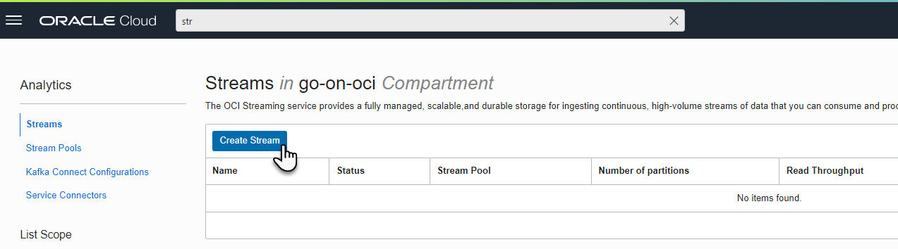  

Provide some details on the stream – its name (*go-on-oci-stream*), the number of partitions (leave at one), the retention time (24 hours should be fine for our purposes). Leave the radio button selected for *Auto-Create a Default Stream Pool*.

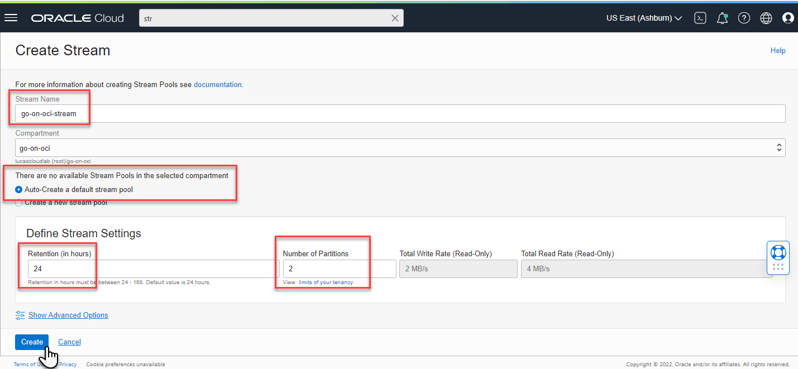  

Then press button *Create Stream*. Now the Stream will be created, which takes a few seconds to complete.

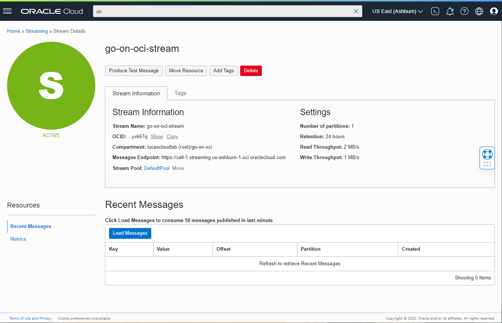  

### Try out the new Stream

When the Stream has been created and is active, click on button *Produce Test Message*. Type a message and press *Produce*. 

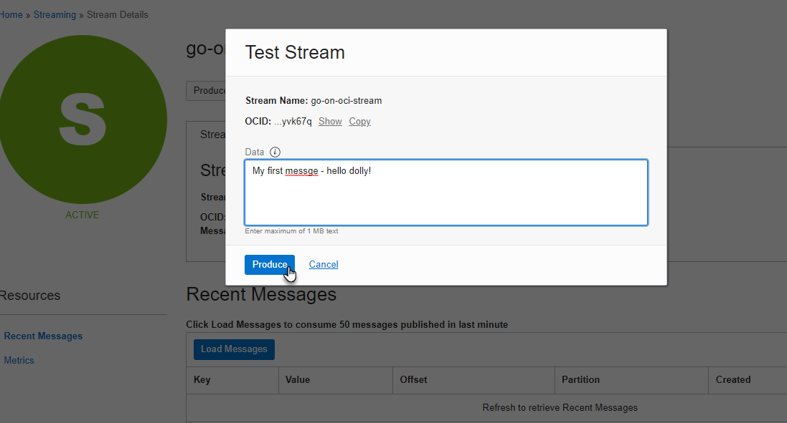 

The console will indicate that the message was produced successfully. Press the *Cancel* link to close the popup window. 

Click on the button *Load Messages*. All recently (last 60 seconds) published messages on the stream are displayed. The test message that was published moments ago should show up.

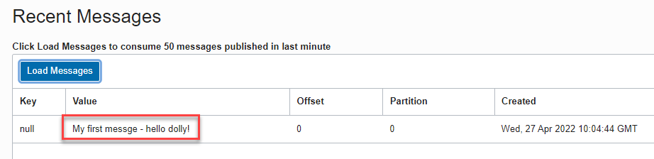  


### Go Message Producer

The file `producer.go` in the directory `applications/message-producer` in the source code repository for this article series is a Go client for a Stream on OCI. This file assumes a local `$HOME/.oci/config` file that provides the details to connect to OCI - as a user with permissions on the stream. A `StreamClient` is initialized and function PutMessages is invoked with a request targeted at the `streamOCID` for the new stream that contains two messages.

The code is quite straightforward:


```go
package main

import (
	"github.com/oracle/oci-go-sdk/v65/common"
	"github.com/oracle/oci-go-sdk/v65/streaming"
)

const (
	streamMessagesEndpoint = "<the messages endpoint for the stream>"
	streamOCID             = "<the OCID of the stream>"
)

func main() {
	streamClient, _ := streaming.NewStreamClientWithConfigurationProvider(common.DefaultConfigProvider(), streamMessagesEndpoint)
	putMsgReq := streaming.PutMessagesRequest{StreamId: common.String(streamOCID),
			PutMessagesDetails: streaming.PutMessagesDetails{
				// two messages are put on the Stream in the single request 
				Messages: []streaming.PutMessagesDetailsEntry{
					{Key: []byte("key dummy-0" ), Value: []byte("my happy message-")},
					{Key: []byte("key dummy-1-"), Value: []byte("hello dolly and others-")}}},
		}
	streamClient.PutMessages(context.Background(), putMsgReq)
}
```

Before you can run `producer.go`, you have to set the appropriate values for `streamOCID` and `streamMessagesEndpoint`. Then run `go mod tidy` on the command line in the directory that contains `producer.go`.

Execute `go run producer.go`. Use the OCI Streaming console to inspect the arrival of messages. Click on the button `Load Messages`. You will see the messages produced by the Go application. Feel free to change the content or number of messages produced, run the producer again and check again for the messages in the console.

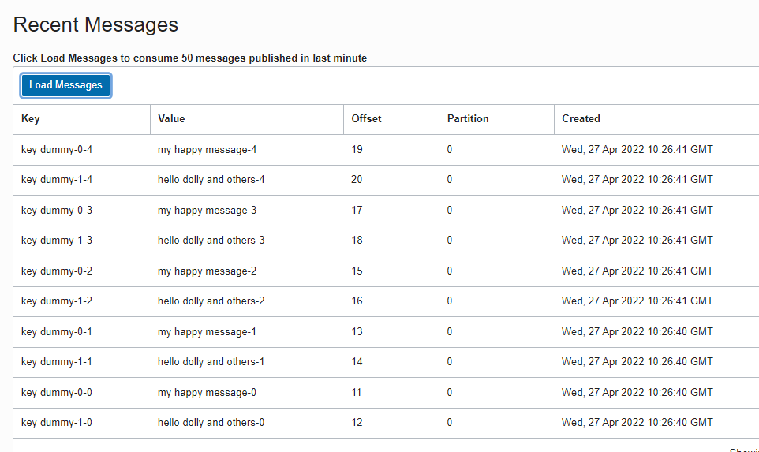  


### Consume Messages from a Stream in a Go application

A stream is not much use if we can only produce messages to it: messages need to be consumed before they expire. If they do not, they have been pointless. 

The next application - to be found in the source code repository in directory `applications\message-consumer` - does exactly this. From Go code, using the Go SDK for OCI, it creates a client for OCI Streaming. Then it makes a *cursor request*. A cursor is pointer to a location in a stream and represents a specific consumer. The application uses the cursor to make requests for messages. If more messages are available on the stream beyond the current cursor's offset, then the next batch of messages is delivered (and the offset is moved). When all messages have been retrieved through the cursor, the request will result in a response without messages. The client can continue polling (with) the cursor for new messages on the stream.  

```go
package main

import (
	"context"
	"fmt"

	"github.com/oracle/oci-go-sdk/v65/common"
	"github.com/oracle/oci-go-sdk/v65/streaming"
)

const (
	streamMessagesEndpoint = "https://cell-1.streaming.us-ashburn-1.oci.oraclecloud.com"
	streamOCID             = "ocid1.stream.oc1.iad.amaaaaaa6sde7caa56brreqvzptc37wytom7pjk7vx3qaflagk2t3syvk67q"
)

func main() {
	streamClient, _ := streaming.NewStreamClientWithConfigurationProvider(common.DefaultConfigProvider(), streamMessagesEndpoint)
	partition := "0" 
	createCursorRequest := streaming.CreateCursorRequest{
		StreamId: common.String(streamOCID),
		CreateCursorDetails: streaming.CreateCursorDetails{Type: streaming.CreateCursorDetailsTypeTrimHorizon,
			Partition: &partition, // mandatory: which partition to read from; note: with a GroupCursor, OCI Streaming assigns partitions to consumers (represented by cursors)
		}}
	createCursorResponse, _ := streamClient.CreateCursor(context.Background(), createCursorRequest)
  // using the cursor, go retrieve messages 
	consumeMessagesLoop(streamClient, streamOCID, *createCursorResponse.Value)
}

func consumeMessagesLoop(streamClient streaming.StreamClient, streamOcid string, cursorValue string) {
	getMessagesFromCursorRequest := streaming.GetMessagesRequest{Limit: common.Int(5), // optional: how many messages to collect in one request
		StreamId: common.String(streamOcid),
		Cursor:   common.String(cursorValue)}
	for i := 0; i < 15; i++ {
    // fetch a next batch of maximum Limit (==5) messages
		getMessagesFromCursorRequest.Cursor = common.String(cursorValue)
		// (Try to) fetch new messages from the cursor (starting from just after the offset of the previous call)
		getMessagesFromCursorResponse, _ := streamClient.GetMessages(context.Background(), getMessagesFromCursorRequest)
		for _, message := range getMessagesFromCursorResponse.Items {
			fmt.Println("Key : " + string(message.Key) + ", value : " + string(message.Value) + ", Partition " + *message.Partition)
		}
		cursorValue = *getMessagesFromCursorResponse.OpcNextCursor
	}
}
```

Run this application on the command line - after `go mod tidy` - using `go run consumer.go`. The output - depending on what messages have been produced to the topic (and are still retained) - will look similar to:

```console
starting iteration  0
Key : , value : My first messge - hello dolly!, Partition 0
Key : key dummy-0-0, value : value dummy-0, Partition 0
Key : key dummy-1-0, value : value dummy-0, Partition 0
Key : key dummy-0-1, value : value dummy-1, Partition 0
Key : key dummy-1-1, value : value dummy-1, Partition 0
starting iteration  1
Key : key dummy-0-2, value : value dummy-2, Partition 0
Key : key dummy-1-2, value : value dummy-2, Partition 0
```

Multiple values for *Type* can be defined that define where the cursor should start fetching message from the Stream:

- `AFTER_OFFSET:` The partition position immediately following the offset you specify. (Offsets are assigned when you successfully append a message to a partition in a stream.)
- `AT_OFFSET:` The exact partition position indicated by the offset you specify.
- `AT_TIME:` A specific point in time.
- `LATEST:` The most recent message in the partition that was added after the cursor was created.
- `TRIM_HORIZON:` The oldest message in the partition that is within the retention period window.

When `AFTER_OFFSET` or `AT_OFFSET` are defined, the value for offset must be provided to. When `AT_TIME` is set as type, then a value for time is mandatory.

For example - where message retrieval should start after offset 5:

```go
	partition := "0"
	offset := common.Int64(5)
	createCursorRequest := streaming.CreateCursorRequest{
		StreamId: common.String(streamOCID),
		CreateCursorDetails: streaming.CreateCursorDetails{Type: streaming.CreateCursorDetailsTypeAfterOffset,
			Offset:    &offset,
			Partition: &partition,
		}}
```

Instead of explicitly defining individual, isolated consumers (aka cursor) that link up with a specific partition, we can use the concept of consumer groups and leave it to the Streaming Service to associate partitions with specific consumers (aka cursors because each consumer is represented by an active cursor). In that case, the body of function `main` becomes:

```go
func main() {
	streamClient, _ := streaming.NewStreamClientWithConfigurationProvider(common.DefaultConfigProvider(), streamMessagesEndpoint)
	// Type can be CreateGroupCursorDetailsTypeTrimHorizon, CreateGroupCursorDetailsTypeAtTime, CreateGroupCursorDetailsTypeLatest
	createGroupCursorRequest := streaming.CreateGroupCursorRequest{
		StreamId: common.String(streamOCID),
		CreateGroupCursorDetails: streaming.CreateGroupCursorDetails{Type: streaming.CreateGroupCursorDetailsTypeTrimHorizon,
			CommitOnGet:  common.Bool(true), // when false, a consumer must manually commit their cursors (to move the offset).
			GroupName:    common.String("consumer-group-1"),
			InstanceName: common.String("go-instance-1"), // A unique identifier for the instance joining the consumer group. If an instanceName is not provided, a UUID will be generated
			TimeoutInMs:  common.Int(1000),
		}}
	createGroupCursorResponse, _ := streamClient.CreateGroupCursor(context.Background(), createGroupCursorRequest)
	consumeMessagesLoop(streamClient, streamOCID, *createGroupCursorResponse.Value)
}
```

As long as there is only a single instance in the group, all messages on all partitions are handed to this consumer's cursor. When multiple instances are added to the group, they will each get one or more partitions assigned to them (if enough partitions are available for the stream) and receive messages from those partitions. Multiple consumers can work in parallel on processing the messages on the stream without any message being processed more than once. 

## Create an OCI Vault and Store Secrets

Applications often use configuration settings to run. These settings determine part of the behavior of the application or instruct the application about endpoints, file system locations and credentials for making connections. The configuration settings can be enviroment dependent: the same application in a test environment uses different values than in the production environment. Some of the configuration settings are sensitive - such as passwords or private keys.

The Go applications discussed so far in this series did not work very explicitly with such configuration settings. Some applications contain hard coded references to compartment, bucket and stream or are committed to the code repostory with a database wallet and hard coded database connection details. This is really not a proper way of working.

From this point on, we will improve our way of working, using OCI Vault. The Vault service on OCI lets you create vaults in your tenancy as containers for encryption keys and secrets. Vaults are logical entities where the Vault service creates and durably stores keys and secrets. The type of vault you choose  determines features and functionality such as degrees of storage isolation, access to management and encryption, and scalability. The type of vault you have also affects pricing.

If needed, a virtual private vault provides you with a dedicated partition in a hardware security module (HSM), offering a level of storage isolation for encryption keys that’s effectively equivalent to a virtual independent HSM. Keys are stored on highly available and durable hardware security modules (HSM) that meet Federal Information Processing Standards (FIPS) 140-2 Security Level 3 security certification. The Vault service uses the Advanced Encryption Standard (AES) as its encryption algorithm and its keys are AES symmetric keys. Note that the virtual private vault has a substantial price tag (several $ per hour) whereas the default vault can be used for free.

Keys are logical entities that represent one or more key versions that contain the cryptographic material used to encrypt and decrypt data, protecting the data where it is stored. When processed as part of an encryption algorithm, a key specifies how to transform plaintext into ciphertext during encryption and how to transform ciphertext into plaintext during decryption. Plain text in this sense can be base64 representation of binary content and can also be a JSON document that contain many configuration settings in a single key.

Vaults are first and foremost associated with secrets that contain sensitive information. And of course that is what they are good at. However, even information that may not be very sensitive can be stored in a key to be used by the application during deployment or at runtime to help define the environment specific settings and behavior. A reference to the Vault Secret is all that the application needs to retrieve the *secret* that provides the required settings. No more hard coding that is ugly, against any best practices and that makes it impossible to use a single code base for all environments. Secrets can be managed independently of an application. However, when the value of secret changes and you want the application to start using the new values, you have to make sure the application reinitializes using the changed values.

We will create a *Vault* and create a simple secret that we read from a Go application. Next we will create a secret that contains an Oracle Wallet and a second secret with a JSON document with additional database connection details. Using this secret, we create an application that can work with an(y) Oracle Database and only learns at runtime when it accesses the secret how to connect to the database. Change the secret, restart the application and a different database is connected to.


### Create an OCI Vault. 

Type *vau* in the search box in the OCI Console. Then click on the link *Vault | Identity & Security*. The overview page with all vaults in the current compartment is shown - probably without any entries.

Click on button *Create Vault*. In the *Create Vault* form enter the name for the new vault: *go-on-oci-vault*. The new vault does not have to be a *Virtual Private Vault*, so leave the checkbox unchecked. Press the *Create Vault* button to have the vault creating.
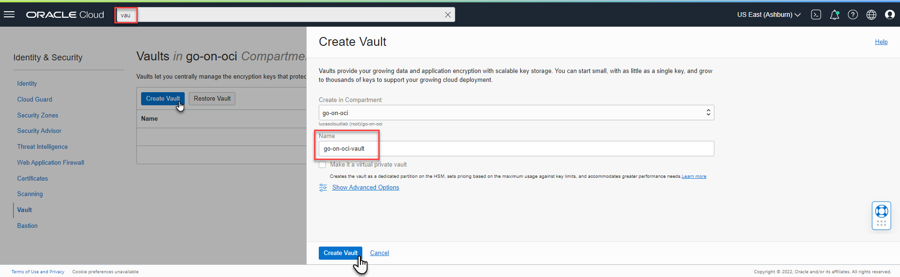  
You are returned to the list of vaults - this time with the new vault, in the status *creating*. It can take up to one minute or so for the vault to be initialized.

When the new vault's status is *Active*, click on the name of the vault to navigate to the details page. We need to create a *master encryption key* for the vault before we can start creating secrets in it. Enter the name for the master key - for example *go-on-oci-vault-master-key*. Accept all default values and click on *Create Key*. It will take a little time for this new master key to be produced.

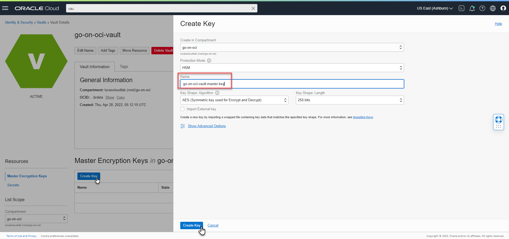  

### Create a Secret

We now have a vault and a master key to encrypt any secrets we will store in the vault. We are ready to start defining secrets in the vault. Let's start with a very simple one. 

Click on the link for tab *Secrets*. Then click on button *Create Secret*. A page is presented where a new secret can be created.

Type the name for the secret - for example *greeting-of-the-day*. Select the master key we have just set up for the vault. Leave the selection list *Secret Type Template* at *Plain Text*. Then type the value of the secret greeting, for example *Have a wonderful day*. Or anything else, it does not really matter right now. Click on *Create Secret* to save the new secret to the store. This is the start of what internally is called a *secret bundle*. A secret bundle consists of the secret contents, properties of the secret and secret version (such as version number or rotation state), and user-provided contextual metadata for the secret. When you rotate secret, you provide new secret contents to the Vault service to generate a new secret version. The complete version history of all values that will be assigned to the secret, throughout time are retained.

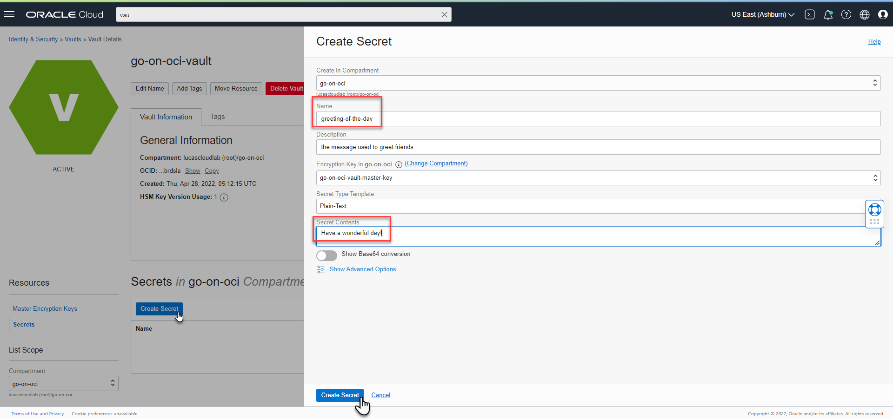  

### Read Secret from Go application
The secret that you just defined is now urgently required in our Go application. Let's explore how from our application we can get hold of the values of secrets. File `secret-reader.go` in directory `applications/secret-reader` in the source code repository contains the probably most straightforward example of how to retrieve a secret from an OCI Vault from Go. It uses the Go SDK for OCI and the only piece of information it needs - in addition to the `$HOME/.oci/config` file is the OCID for the secret to be retrieved. Note: the assumption is that whichever user's credentials are configured in the config file has read permissions on the secret.

```go
package main

import (
	"context"
	b64 "encoding/base64"
	"fmt"

	"github.com/oracle/oci-go-sdk/v65/common"
	"github.com/oracle/oci-go-sdk/v65/secrets"
)

const (
	secretOCID = "<OCID of the Secret to be Read from a Vault"
)

func main() {
	secretsClient, _ := secrets.NewSecretsClientWithConfigurationProvider(common.DefaultConfigProvider())
	secretReq := secrets.GetSecretBundleRequest{SecretId: common.String(secretOCID)}
	secretResponse, _ := secretsClient.GetSecretBundle(context.Background(), secretReq)
	contentDetails := secretResponse.SecretBundleContent.(secrets.Base64SecretBundleContentDetails)
	decodedSecretContents, _ := b64.StdEncoding.DecodeString(*contentDetails.Content)
	fmt.Println("Secret Contents:", string(decodedSecretContents))
}
```

Run the application - after you have changed the value of *secretOCID* - using `go run secret-reader.go`. This should result in the content of the secret that you have just created being printed on the command line.

To see the effect of managing configuration settings separate from the application source code, update the secret in the OCI Console and run the application again. You should now see the changed content - because without further instructions the application will always retrieve the latest version of the secret. Not only does the code not contain the highly sensitive value of the secret - it also remains unchanged when the value of the secret is updated. In this case, we had to restart the application to get the updated value. How to refresh the updated values of configuration settings in live applications is an interesting topic - for another moment. Let's first create secrets that actually contain sensitive information. 

### Store Oracle Database connection details and Wallet in Vault

Information that we stored hard coded in our source code and stored completely exposed in our source code repository in the previous article were the database connection details and the Oracle Wallet. In a real environment that would be inexcusable. A proper way to handle such data would be using the vault. The application knows it has to connect to a database - but it does not know where it is and using which credentials it can be connected with. That information can be retrieved from the vault - using the secret identifiers and only if the application is running as a user or on a host that has permissions for reading the content of these secrets.

Storing the database connection details - the `autonomousDB` *struct* in the file *data-service.go* in application *data-service* discussed in the previous article - a secret is not very difficult at all. Create a string formatted as JSON from the data in the struct:

```
{ "service":        "k8j2fvxbaujdcfy_goonocidb_medium.adb.oraclecloud.com",
  "username":       "demo",
  "server":         "adb.us-ashburn-1.oraclecloud.com",
  "port":           "1522",
  "password":       "thePassword1"
}
```

Go to the vault page for *go-on-oc-vault* in the OCI console. In the *Secrets* tab, click on *Create Secret*. Enter the name for the secret: *autonomousDB-demo-credentials*. Select the master encryption key. Paste the JSON content with database connection details as the *Secret Contents* - with type template still on *Plain-Text*. The click on button *Create Secret*. 

  

In the Go application, define a type to hold the database credentials:

```go
type DatabaseConnectDetails struct {
	Service        string `json:service`
	Username       string `json:username`
	Server         string `json:server`
	Port           string `json:port`
	Password       string `json:password`
	WalletLocation string `json:walletLocation`
}
```

and write code to decode the content from the secret into a variable based on this type 

```go
    secretReq := secrets.GetSecretBundleRequest{SecretId: common.String(secretOCID)}
	secretResponse, _ := secretsClient.GetSecretBundle(context.Background(), secretReq)
	contentDetails := secretResponse.SecretBundleContent.(secrets.Base64SecretBundleContentDetails)
    decodedSecretContents, _ := b64.StdEncoding.DecodeString(*contentDetails.Content)
	var dbCredentials DatabaseConnectDetails
    json.Unmarshal(decodedSecretContents, &dbCredentials)
	fmt.Println("database connect details for user: " + dbCredentials.Username)
```

Next we need to also store the wallet file *cwallet.sso* in a secret. This file contains binary content. In order to store this content as a secret we turn it into a string representation by encoding as base64. On the Linux command line this can easily be done, for example with the command:

```console
base64 -i cwallet.sso > cwallet-sso-base64.txt
```

File `cwallet-sso-base64.txt` contains the content we want to use for the secret. Just as before from the vault page for *go-on-oc-vault* in the OCI console, go to the  *Secrets* tab and click on *Create Secret*. Enter the name for the secret: *autonomousDB-cwallet-sso*. Select the master encryption key. Paste the base64 content with database wallet details as the *Secret Contents* - with type template set to on *Base64*. The click on button *Create Secret*.  

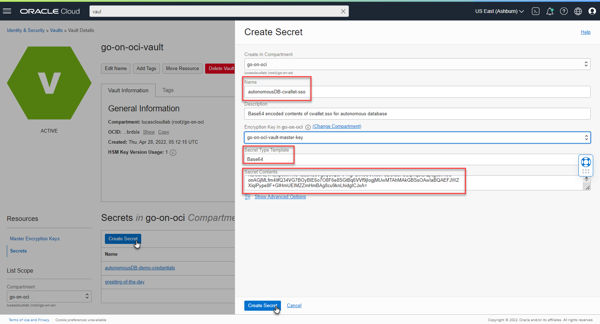  


The contents of this secret can be retrieved from the Go code in the same way as before. However, this time the application needs to write a local `cwallet.sso` file with the contents from the secret:

```go
	decodedSecretContents, _ := b64.StdEncoding.DecodeString(*contentDetails.Content)
	_ = os.WriteFile("./cwallet.sso", decodedSecretContents, 0644)
```

This allows the application - using only the OCID values for the two secrets with database connection details and the database wallet file - to initiate communications with the database it needs to use in its current environment. Nothing hard coded, nothing exposed.
### Go application connecting with Oracle Database based on Secrets from Vault

Directory `applications/safe-database-client` in the source code repository for the article contains the code for a simple Oracle Database client application. It is very similar to what we discussed in article four regarding the application `applications/go-orcl-db`. The main difference: this application does not contain a wallet file or any database connection details. However, it does require two references to OCI Secrets - one OCID refers to the secret with the JSON string with connection details and the other OCID is for a secret that contains the base64 encoded representation of the `cwallet.sso` file.  

The code in file `oracle-database-client-app.go` has two variables that you need to provide values for in order to run this application:

```go
const (
	autonomousDatabaseConnectDetailsSecretOCID = "ocid1.vaultsecret.oc1.iad.amaaaaaa6sde7caabn37hbdsu7dczk6wpxvr7euq7j5fmti2zkjcpwzlmowq"
	autonomousDatabaseCwalletSsoSecretOCID     = "ocid1.vaultsecret.oc1.iad.amaaaaaa6sde7caazzhfhfsy2v6tqpr3velezxm4r7ld5alifmggjv3le2cq"
)
```

Using these  values, two secrets are retrieved from the vault. One is used to write the file `cwallet.sso` in the local directory, the other is used to construct an instance of type `DatabaseConnectDetails` that contains login details for the database: username, password, host, port, service. The connection is created - as was the case in the previous article - in the file `godror-based-oracle-database-client.go`. 

You can run the application on the command line with `go run *.go`. It will connect to the Autonomous Database and perform some small SQL feats. The relevance of this example is that the application does not require any information at all about the database it is going to interact with.

Note: in order to run an application on OCI that needs to read secrets from an OCI Vault, you need to make sure that through Resource Principal or Instance Principal authentication the following policy applies to the host that runs the code:

```
allow dynamic-group my-secret-group to read secret-family in compartment go-on=oci where target.secret.name = 'my-secret'
```

## From Streaming Messages to new Database Records

It is not too hard to pull the previous steps we took together and create a single application that contains no configuration - except for some OCID values for secrets in the OCI vault - and still can subscribe to a Stream in OCI, poll and consume messages and create database records in an Autonomous Database on OCI for every message received from the Stream. With the preparations we have made in the previous sections, this is easily accomplished.

The application we are discussing now is visualized in the next figure:

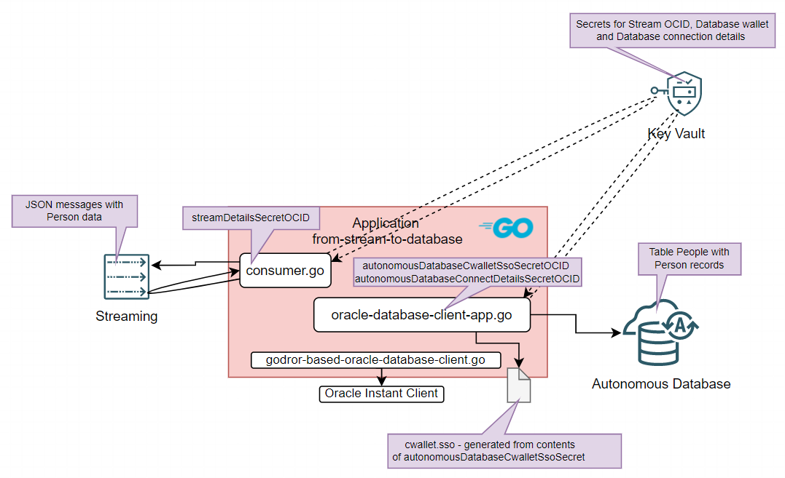  

The code for this application is in directory `applications/from-stream-to-database`. The files are familiar: `consumer.go` retrieves the secret with details for subscribing to the stream and `oracle-database-client-app.go` does the same thing for the database connection details. This last file also exposes function `PersistPerson` that can be invoked with an instance of type `Person` that is subsequently turned into a new database record. Make same changes in `oracle-database-client-app` as in the previous section - with the OCID values for the secrets for database connection details and the database wallet.

You need to create a secret in the OCI vault, with Stream details in this JSON string (make sure to set the values that apply to your environment):

```
{
 "streamMessagesEndpoint" : "https://cell-1.streaming.us-ashburn-1.oci.oraclecloud.com" ,
 "streamOCID"             : "ocid1.stream.oc1.iad.amaaaaaa6sde7caa56brreqvzptc37wytom7pjk7vx3qaflagk2t3syvk67q"
}
```

Use the OCID for this new secret to set the value for `const streamDetailsSecretOCID` in file `consumer.go` in `applications/from-stream-to-database/consumer.go` . The `main` function in this file subscribes to the stream and starts a series of iterations in which it polls the stream for new messages. Whenever a message is consumed, it is supposed to hold details for a person in a valid JSON message that is decoded into a Person instance and passed to `PersistPerson`.

You can publish messages to the stream in the OCI Console. Go to the page for the stream in the console. Click on button *Produce Test Message*. Type or paste a valid JSON message with Person details that looks as the next message. 

```
{
	"name" : "John Doe",
	"age" : 34,
	"comment" : "Nice chap, good looking; not too bright"
}
```

Then press button *Produce* to publish the message on the topic and make it available for processing by the consumer.

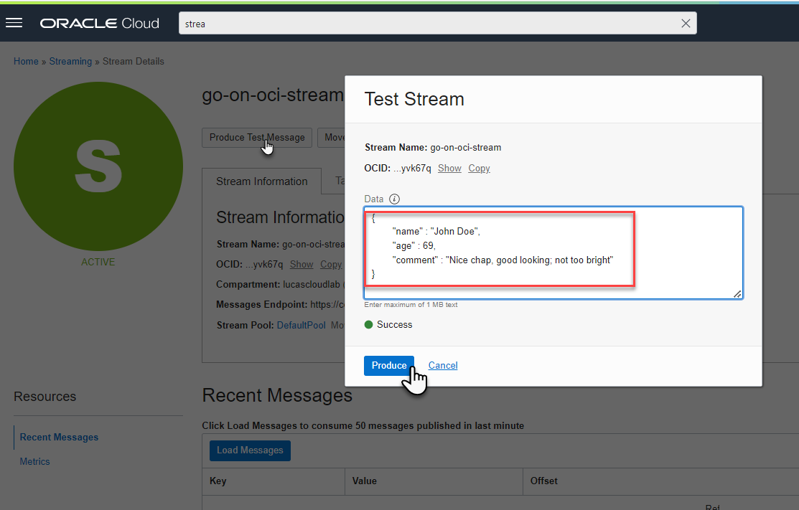  

Feel free to publish the message multiple times. It will not result in multiple database records (the name is used as identifier) but you will see some effect in the logging of the application. Of course if you make changes in the name - however small - between the messages, you will get many more records created in the database. 

Note: the code is not very robust. It will likely choke on messages with a different format, just so you know.

## Deploy Message Publisher on OKE

...
Producer reads Stream details from Vault


Create Compute Instance + policies to read vault and to publish on stream
Create OKE instance with that instance in the pool 
Create build pipeline for producing container image for Go application (similar to for Go Fn Function)
Create deploy pipeline for deployment of image to OKE instance
COnfigure Cron job - or expose as HTTP service?


Run local consumer & db inserter. 

## Conclusion

This article demonstrated how a Go application through the Go SDK for OCI can easily publish messages to OCI Streaming topics as well as consume such messages. The Go application that publishes or consumes can run on OCI or outside of it. Management of credentials and other secrets is ideally done using OCI Key Vault. This article introduced Key Vault and showed how it can be used from Go applications. Finally, a third type of application runtime platform was introduced that exists next to VM and serverless function: the managed OCI Kubernetes Engine (OKE). OCI DevOps Deployment Pipelines can deploy our Go applications to OKE in an automated way, once a Build Pipeline has created a container image for the application.  

The five articles that make up the series "Way to Go on OCI" have provided Go developers (*Gophers*) with a overview of how OCI provides a valuable platform both for engineering and running Go based applications as well as for leveraging relevant platform services from Go applications. The series demonstrates automated build and deployment of Go applications as stand alone executables on Compute Instances, as serverless functions and as containers on a Kubernetes cluster. Throughout the articles, introductions are given of these OCI services used from Go applications: Object Storage, Functions, API Gateway, Autonomous Database, Streaming and Key Vault. Additional, platform services used for engineering and operations were discussed, including DevOps Build and Deployment Pipelines, Code Repositories, Artifact Registry, Container Image Registry, IAM and Logging.

## Resources

[Source code repository for the sources discussed in this article series](https://github.com/lucasjellema/go-on-oci-article-sources) 

[Oracle Cloud Infrastructure Blog - Automating a pod identity solution with Oracle Container Engine for Kubernetes (OKE) - by Ed Shnekendorf](https://blogs.oracle.com/cloud-infrastructure/post/automating-a-pod-identity-solution-with-oracle-container-engine-for-kubernetes-oke) - this article describes the use of instance principals for the nodes (OCI Compute Instances) in the OKE cluster to provide permissions for the Pods running on the node to access OCI services]

[Oracle Functions - Connecting To An ATP Database With A Wallet Stored As Secrets - article by Todd Sharp on retrieving Oracle Wallet from OCI Vault from Functions](https://blogs.oracle.com/developers/post/oracle-functions-connecting-to-an-atp-database-with-a-wallet-stored-as-secrets)

[Protect Your Sensitive Data With Secrets In The Oracle Cloud - article by Todd Sharp on use of OCI Vault](https://blogs.oracle.com/developers/post/protect-your-sensitive-data-with-secrets-in-the-oracle-cloud)

[OCI Streaming — create producer/consumer use case using ATP, OIC and Kafka connect](https://medium.com/oracledevs/oci-streaming-create-producer-consumer-use-case-using-atp-oic-and-kafka-connect-e5be254edea3)

[Oracle Cloud Streaming Service – Scalable, Reliable, Kafka-like Event service on OCI](https://technology.amis.nl/oracle-cloud/oracle-cloud-streaming-service-scalable-reliable-kafka-like-event-service-on-oci/)

[SDK for Go Streaming Quickstart](https://docs.oracle.com/en-us/iaas/Content/Streaming/Tasks/streaming-quickstart-oci-sdk-for-go.htm#go-sdk-streaming-quickstart)